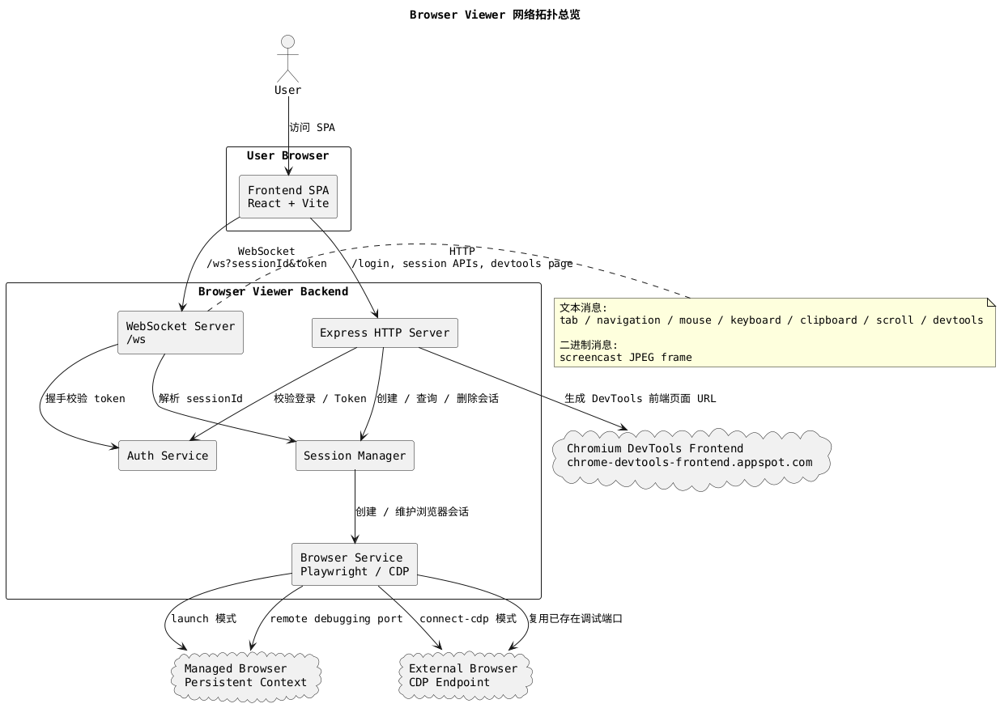
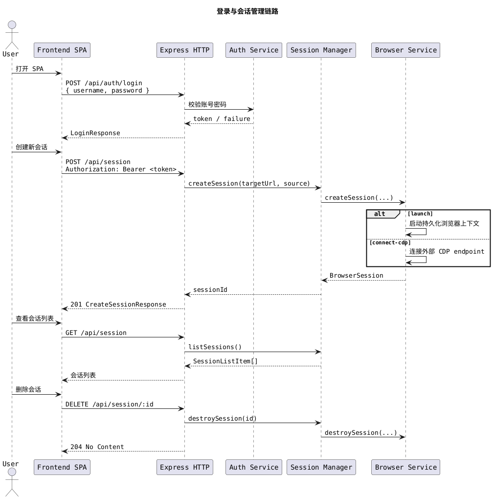
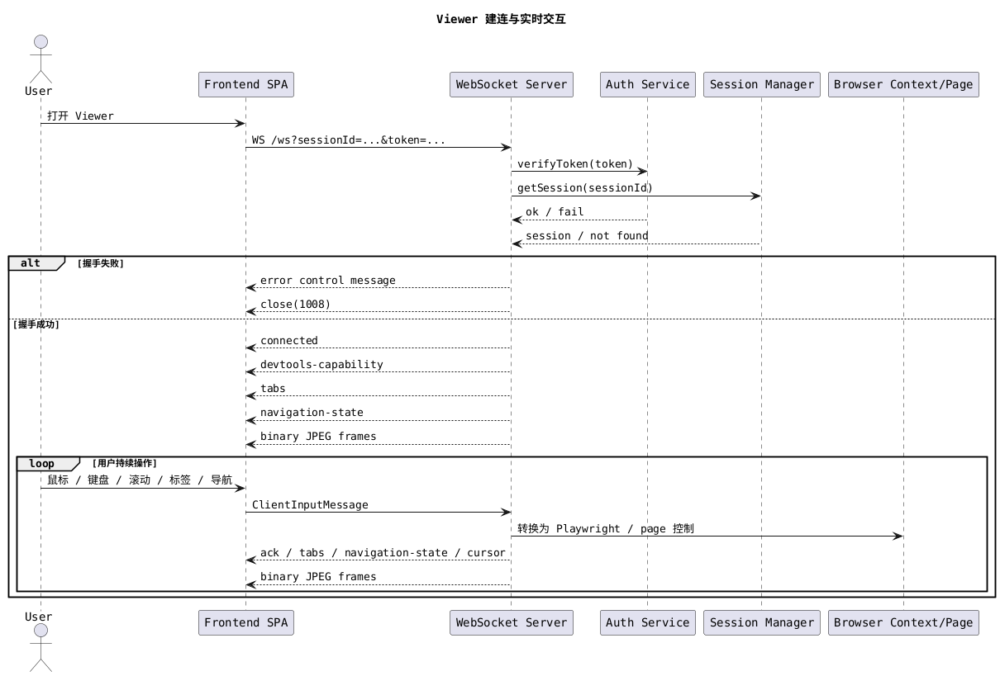
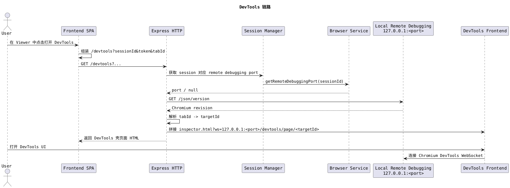
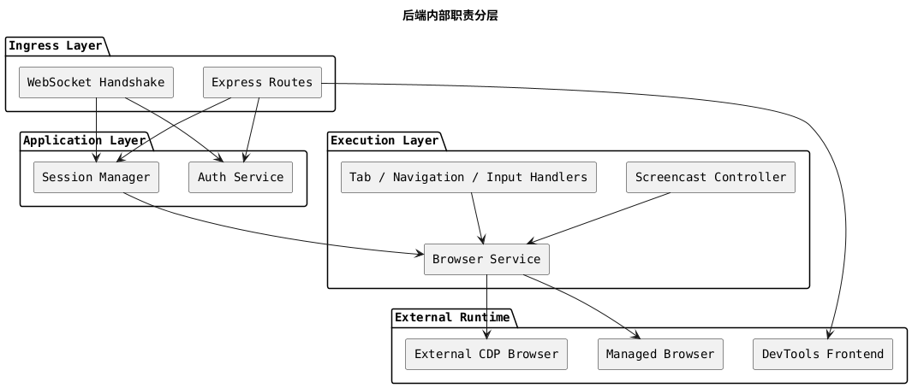

# 网络路由与通信拓扑总览

本文从架构沟通视角梳理 `browser-viewer` 的网络路由与通信关系，重点说明系统边界、链路方向、鉴权入口，以及用户完成一次远程浏览操作时会经过哪些网络通道。

## 1. 结论先看

这个项目不是单一的 HTTP 应用，而是由以下 4 层网络关系组成：

1. 用户浏览器访问前端 SPA。
2. 前端通过 HTTP 调用后端 REST 接口完成登录和会话管理。
3. 前端通过 `/ws` 建立实时控制通道，发送输入事件并接收画面与状态。
4. 后端再通过 Playwright / CDP 控制真实浏览器，必要时拼接 DevTools 链路。

前端页面路由在架构层面被视为一个整体 SPA，不单独展开页面内部导航。

## 2. 总体拓扑

### 解读

- 前端对后端并行使用两类通道：HTTP 负责管理动作，WebSocket 负责实时交互。
- 后端既是 API 服务，也是浏览器控制代理。
- 浏览器会话存在两种来源：
  - `launch`：由后端自己拉起受管浏览器。
  - `connect-cdp`：连接到外部已有浏览器的 CDP 端点。
- DevTools 不是直接嵌在前端 SPA 内的功能模块，而是由后端动态生成一个可访问的 DevTools 页面入口。

## 3. 对外网络入口

从外部调用视角看，系统主要暴露以下网络入口：

| 类型      | 路径               | 是否鉴权                  | 用途                                           |
| --------- | ------------------ | ------------------------- | ---------------------------------------------- |
| HTTP      | `/health`          | 否                        | 健康检查                                       |
| HTTP      | `/test/*`          | 否                        | 本地测试页面与弹窗场景                         |
| HTTP      | `/api/auth/login`  | 否                        | 用户登录并换取 JWT                             |
| HTTP      | `/api/session`     | 是                        | 列表查询、创建会话                             |
| HTTP      | `/api/session/:id` | 是                        | 查询或删除单个会话                             |
| HTTP      | `/devtools`        | 通过 query token 间接鉴权 | 生成 DevTools 壳页面                           |
| WebSocket | `/ws`              | 是，query token           | Viewer 实时控制与画面回传                      |
| HTTP      | `*`                | 否                        | 非 `/api`、`/ws`、`/devtools` 路径会回退到 SPA |

### 边界说明

- `/api/*` 使用 Bearer Token 鉴权。
- `/ws` 在握手阶段通过 query string 中的 `token` 和 `sessionId` 校验。
- `/devtools` 也通过 query string 传递 `token`、`sessionId`、`tabId`。
- 当后端存在前端构建产物时，会启用 SPA fallback，但会显式绕过 `/api`、`/ws`、`/devtools`。

## 4. 核心时序一：登录与会话管理

### 解读

- 登录和会话管理都走 HTTP。
- 会话创建完成后，前端拿到的是 `sessionId`，真正的实时控制并未在此时开始。
- `Session Manager` 负责把外部请求转换为可管理的浏览器会话生命周期。

## 5. 核心时序二：Viewer 实时控制通道

### 解读

- `/ws` 是 Viewer 的核心链路，负责“控制面 + 状态面 + 画面面”三类通信。
- WebSocket 文本消息主要承载控制指令与状态回执。
- WebSocket 二进制消息承载 screencast JPEG 帧，用于把远程页面画面渲染到前端 canvas。
- 前端在 Viewer 场景下并不持续轮询 HTTP，而是主要依赖 `/ws` 维持交互。

## 6. 核心时序三：DevTools 打开链路

### 解读

- `/devtools` 的职责不是直接代理全部 DevTools 流量，而是生成一个可访问的入口页。
- 真正的 DevTools 前端资源来自 `chrome-devtools-frontend.appspot.com`。
- 后端需要先根据浏览器调试端口查询 Chromium revision，再拼出兼容版本的 DevTools URL。
- 当 session 来源是 `connect-cdp` 时，如果 endpoint 中能解析出调试端口，也可以复用同类链路。

## 7. 内部路由分层

从后端内部职责看，网络链路可以再抽象为以下分层：

### 解读

- `Ingress Layer` 只负责接住网络入口，不直接承担复杂浏览器控制逻辑。
- `Session Manager` 是网络入口与浏览器执行层之间的主要协调者。
- WebSocket 下的 tab、navigation、input、screencast 等能力都属于执行层，它们对前端表现为一个统一的 `/ws` 通道。

## 8. 关键架构边界

### 鉴权边界

- 登录前只有 `/api/auth/login`、`/health`、`/test/*` 和 SPA 静态资源可以直接访问。
- 登录后创建的 JWT 既用于 Bearer Token，也被拼进 Viewer / DevTools 的 query string。
- 这意味着 Viewer 与 DevTools 更像“带会话上下文的临时工作入口”，而不是匿名可分享链接。

### 会话边界

- `sessionId` 是后续所有控制动作的主索引。
- 会话对象既是业务会话，也是浏览器上下文的宿主。
- `launch` 模式强调受管浏览器生命周期，`connect-cdp` 模式强调附着到已有浏览器。

### 协议边界

- HTTP 负责一次性动作：登录、创建、查询、删除。
- WebSocket 负责持续互动：输入事件、标签切换、导航状态、剪贴板、光标、屏幕帧。
- DevTools 走独立链路，不复用前端已有 `/ws` Viewer 通道。

## 9. 对阅读代码的定位建议

如果需要从文档回到代码，可优先看以下入口：

- 前端总入口：`frontend/src/App.tsx`
- Viewer WebSocket URL 组装：`frontend/src/features/viewer/url.ts`
- 登录与会话 HTTP 调用：`frontend/src/services/auth.ts`、`frontend/src/services/session.ts`
- 后端 HTTP 入口：`backend/src/index.ts`
- 认证路由：`backend/src/routes/auth.ts`
- 会话路由：`backend/src/routes/session.ts`
- WebSocket 服务：`backend/src/ws/server.ts`
- WebSocket 握手校验：`backend/src/ws/handshake.ts`
- 共享协议定义：`packages/shared/src/protocol.ts`

## 10. 一句话总结

`browser-viewer` 的网络结构可以概括为：前端 SPA 通过 HTTP 管理会话，通过 `/ws` 实时操控远端页面，而后端作为统一入口，再把这些操作转译到 Playwright / CDP 控制的真实浏览器，并在需要时额外生成一条独立的 DevTools 调试链路。
