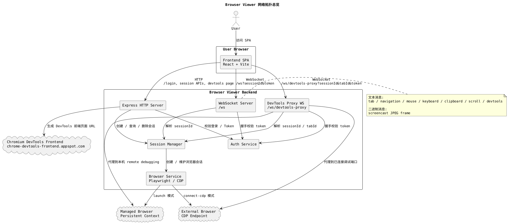
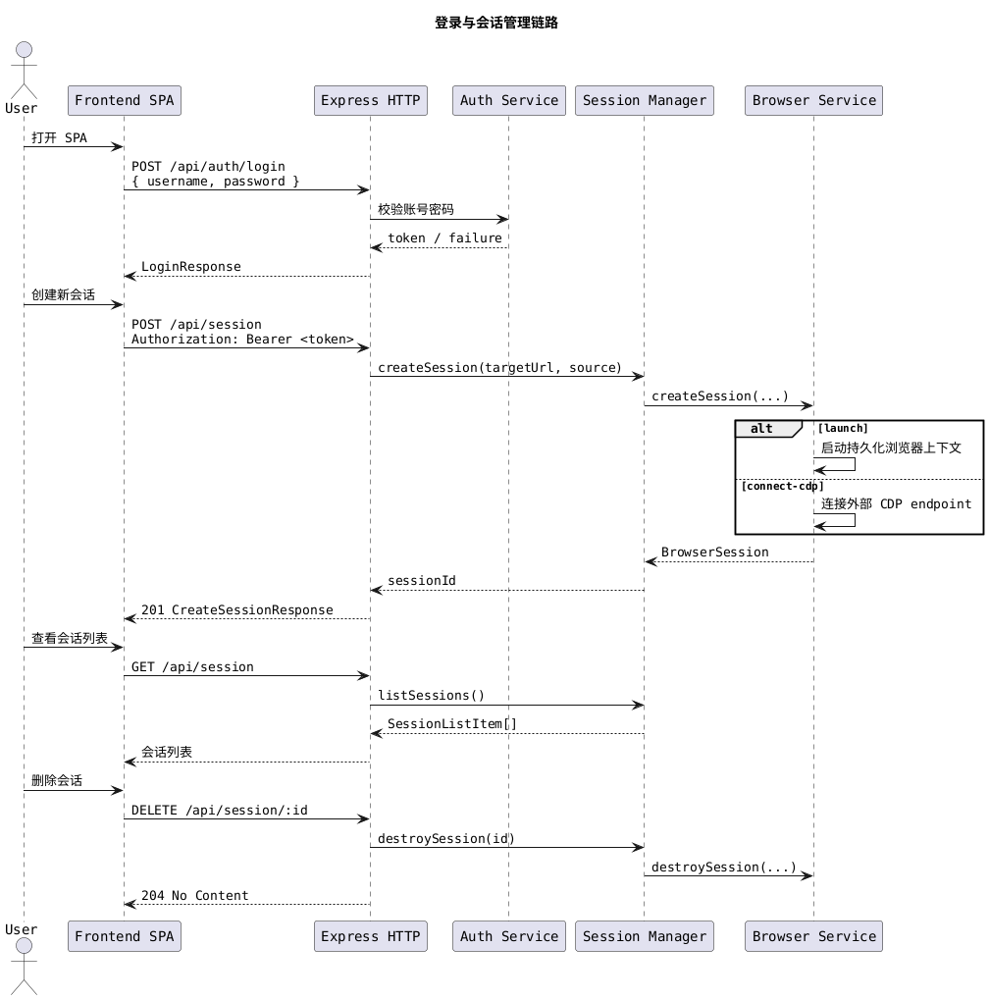
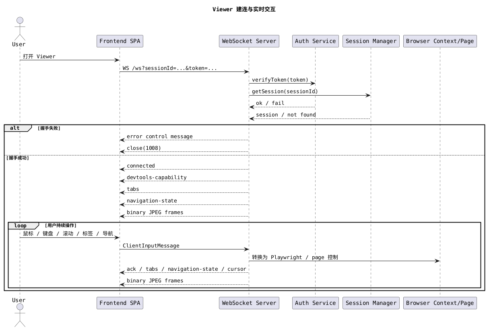
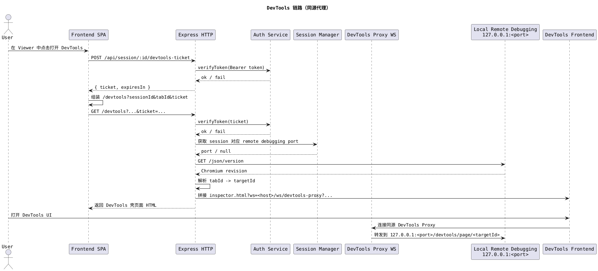
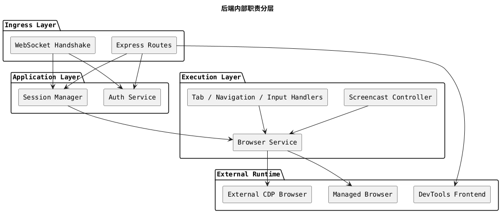
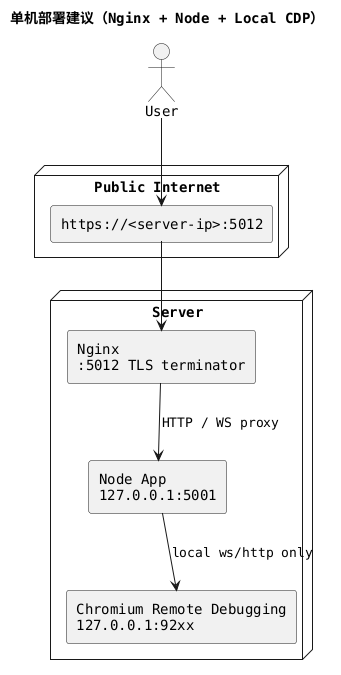

# 网络拓扑与路由说明

本文从架构沟通视角梳理 `browser-viewer` 的网络路由与通信关系，重点说明系统边界、链路方向、鉴权入口，以及用户完成一次远程浏览操作时会经过哪些网络通道。

## 1. 结论先看

这个项目不是单一的 HTTP 应用，而是由以下 4 层网络关系组成：

1. 用户浏览器访问前端 SPA。
2. 前端通过 HTTP 调用后端 REST 接口完成登录和会话管理。
3. 前端通过 `/ws` 建立实时控制通道，发送输入事件并接收画面与状态。
4. 后端再通过 Playwright / CDP 控制真实浏览器，并通过同源 DevTools 代理把调试链路收口到服务端内部。

前端页面路由在架构层面被视为一个整体 SPA，不单独展开页面内部导航。

## 2. 总体拓扑



### 解读

- 前端对后端并行使用两类通道：HTTP 负责管理动作，WebSocket 负责实时交互。
- 后端既是 API 服务，也是浏览器控制代理。
- 浏览器会话存在两种来源：
  - `launch`：由后端自己拉起受管浏览器。
  - `connect-cdp`：连接到外部已有浏览器的 CDP 端点。
- DevTools 不是浏览器直连 Chromium 调试端口，而是由后端动态生成入口页，再通过同源 `wss` 代理转接到服务端本机调试端口。

## 3. 对外网络入口

从外部调用视角看，系统主要暴露以下网络入口：

| 类型      | 路径                               | 是否鉴权                       | 用途                                             |
| --------- | ---------------------------------- | ------------------------------ | ------------------------------------------------ |
| HTTP      | `/health`                          | 否                             | 健康检查                                         |
| HTTP      | `/test/*`                          | 否                             | 本地测试页面与弹窗场景                           |
| HTTP      | `/api/auth/login`                  | 否                             | 用户登录并换取 JWT                               |
| HTTP      | `/api/session`                     | 是                             | 列表查询、创建会话                               |
| HTTP      | `/api/session/:id`                 | 是                             | 查询或删除单个会话                               |
| HTTP      | `/devtools`                        | 是，Bearer Token 或短时 ticket | 生成 DevTools 壳页面                             |
| WebSocket | `/ws`                              | 是，query token                | Viewer 实时控制与画面回传                        |
| WebSocket | `/ws/devtools-proxy`               | 是，query token                | DevTools frontend 到服务端本机调试端口的代理链路 |
| HTTP      | `/api/session/:id/devtools-ticket` | 是                             | 签发短时 DevTools ticket                         |
| HTTP      | `*`                                | 否                             | 非 `/api`、`/ws`、`/devtools` 路径会回退到 SPA   |

### 边界说明

- `/api/*` 使用 Bearer Token 鉴权。
- `/ws` 在握手阶段通过 query string 中的 `token` 和 `sessionId` 校验。
- `/devtools` 既可接受 Bearer Token，也可接受由 `/api/session/:id/devtools-ticket` 签发的短时 `ticket`。
- DevTools frontend 的 `inspector.html?ws=` 参数使用 `host/path` 形式，由 DevTools 前端自行补齐 `ws://` 或 `wss://`，避免生成错误的 `ws://wss//...`。
- 当后端存在前端构建产物时，会启用 SPA fallback，但会显式绕过 `/api`、`/ws`、`/devtools`。

## 4. 核心时序一：登录与会话管理



### 解读

- 登录和会话管理都走 HTTP。
- 会话创建完成后，前端拿到的是 `sessionId`，真正的实时控制并未在此时开始。
- `Session Manager` 负责把外部请求转换为可管理的浏览器会话生命周期。

## 5. 核心时序二：Viewer 实时控制通道



### 解读

- `/ws` 是 Viewer 的核心链路，负责“控制面 + 状态面 + 画面面”三类通信。
- WebSocket 文本消息主要承载控制指令与状态回执。
- WebSocket 二进制消息承载 screencast JPEG 帧，用于把远程页面画面渲染到前端 canvas。
- 前端在 Viewer 场景下并不持续轮询 HTTP，而是主要依赖 `/ws` 维持交互。

## 6. 核心时序三：DevTools 打开链路



### 解读

- `/devtools` 的职责不是直接代理全部 DevTools 流量，而是生成一个可访问的入口页，并为 DevTools frontend 注入同源代理目标。
- 真正的 DevTools 前端资源来自 `chrome-devtools-frontend.appspot.com`。
- 后端需要先根据浏览器调试端口查询 Chromium revision，再拼出兼容版本的 DevTools URL。
- 前端不会把长期登录 JWT 放进 `/devtools` URL，而是先换取一个短时 `ticket`，再以普通 iframe 地址打开 DevTools。
- 真实 Chromium 调试端口只在服务端本机访问，浏览器端永远不直接访问 `127.0.0.1:<port>`。
- 当 session 来源是 `connect-cdp` 时，如果 endpoint 中能解析出调试端口，也可以复用同类链路。

## 7. 内部路由分层

从后端内部职责看，网络链路可以再抽象为以下分层：



### 解读

- `Ingress Layer` 只负责接住网络入口，不直接承担复杂浏览器控制逻辑。
- `Session Manager` 是网络入口与浏览器执行层之间的主要协调者。
- WebSocket 下的 tab、navigation、input、screencast 等能力都属于执行层，它们对前端表现为一个统一的 `/ws` 通道。

## 8. 关键架构边界

### 鉴权边界

- 登录前只有 `/api/auth/login`、`/health`、`/test/*` 和 SPA 静态资源可以直接访问。
- 登录后创建的 JWT 用于 Bearer Token，也用于 Viewer `/ws` 握手 query string。
- DevTools 使用单独签发的短时 `ticket`，避免把长期登录 JWT 暴露在 `/devtools` URL 中。
- Viewer 与 DevTools 更像“带会话上下文的临时工作入口”，而不是匿名可分享链接。

### 会话边界

- `sessionId` 是后续所有控制动作的主索引。
- 会话对象既是业务会话，也是浏览器上下文的宿主。
- `launch` 模式强调受管浏览器生命周期，`connect-cdp` 模式强调附着到已有浏览器。

### 协议边界

- HTTP 负责一次性动作：登录、创建、查询、删除。
- WebSocket 负责持续互动：输入事件、标签切换、导航状态、剪贴板、光标、屏幕帧。
- DevTools 不再尝试让浏览器直接连接 remote debugging port，而是走独立的 `/ws/devtools-proxy` 同源代理链路。

## 9. 单机 HTTPS/WSS 部署建议

在单机部署到云服务器时，推荐让公网入口统一收口到 Nginx，再反向代理到本机 Node 单体。



### 部署原则

- 浏览器只访问 `https://<server-ip>:5012` 和 `wss://<server-ip>:5012/*`。
- Nginx 负责 TLS 终止和 WebSocket upgrade。
- Node 单体继续监听本机端口，例如 `127.0.0.1:5001`。
- Chromium remote debugging 端口只监听 `127.0.0.1`，不暴露到公网。

### 推荐端口布局

| 组件                      | 监听地址         | 用途                        |
| ------------------------- | ---------------- | --------------------------- |
| Nginx                     | `0.0.0.0:5012`   | 唯一公网 HTTPS / WSS 入口   |
| Node App                  | `127.0.0.1:5001` | 后端 HTTP 与 WebSocket 服务 |
| Chromium remote debugging | `127.0.0.1:92xx` | 仅服务端内部调试通道        |

### Nginx 配置模板

以下配置适用于“只有公网 IP、没有域名、外部统一访问 `5012`”的部署方式：

```nginx
map $http_upgrade $connection_upgrade {
    default upgrade;
    ''      close;
}

server {
    listen 5012 ssl http2;
    server_name _;

    ssl_certificate     /etc/nginx/ssl/browser-viewer.crt;
    ssl_certificate_key /etc/nginx/ssl/browser-viewer.key;

    client_max_body_size 20m;

    location /ws/devtools-proxy {
        proxy_pass http://127.0.0.1:5001;
        proxy_http_version 1.1;
        proxy_set_header Upgrade $http_upgrade;
        proxy_set_header Connection $connection_upgrade;
        proxy_set_header Host $host:$server_port;
        proxy_set_header X-Forwarded-Host $host:$server_port;
        proxy_set_header X-Forwarded-Proto https;
        proxy_set_header X-Forwarded-For $proxy_add_x_forwarded_for;
        proxy_read_timeout 3600s;
    }

    location /ws {
        proxy_pass http://127.0.0.1:5001;
        proxy_http_version 1.1;
        proxy_set_header Upgrade $http_upgrade;
        proxy_set_header Connection $connection_upgrade;
        proxy_set_header Host $host:$server_port;
        proxy_set_header X-Forwarded-Host $host:$server_port;
        proxy_set_header X-Forwarded-Proto https;
        proxy_set_header X-Forwarded-For $proxy_add_x_forwarded_for;
        proxy_read_timeout 3600s;
    }

    location / {
        proxy_pass http://127.0.0.1:5001;
        proxy_set_header Host $host:$server_port;
        proxy_set_header X-Forwarded-Host $host:$server_port;
        proxy_set_header X-Forwarded-Proto https;
        proxy_set_header X-Forwarded-For $proxy_add_x_forwarded_for;
    }
}
```

仓库内已提供可提交模板：

- Nginx 模板：[nginx.conf.example](/Users/bytedance/Desktop/vscode/browser-hub/browser-viewer/deploy/nginx/nginx.conf.example)
- 自签证书 SAN 模板：[openssl-san.cnf.example](/Users/bytedance/Desktop/vscode/browser-hub/browser-viewer/deploy/nginx/openssl-san.cnf.example)

`.runtime/nginx` 仅作为本地运行时目录使用，不建议提交到仓库。

### Node 运行建议

- Node 不直接暴露到公网。
- 推荐让后端监听 `127.0.0.1:5001`，并由 Nginx 统一转发。
- 如果当前启动方式没有显式指定 host，可在运行时传入 `--host 127.0.0.1 --port 5001`。

例如：

```bash
pnpm --filter ./backend start -- --host 127.0.0.1 --port 5001
```

### 证书建议

- 如果当前目标是先跑通链路，可先使用自签证书验证 HTTPS / WSS 全链路。
- 如果后续需要公网可信证书，可再单独处理 IP 证书申请与续期。
- 对这套架构来说，证书只影响公网入口 Nginx，不影响 Node 或 Chromium 本机通道。

### 联调检查清单

部署完成后，建议按以下顺序验证：

1. 浏览器能打开 `https://<server-ip>:5012/login`。
2. 登录后主页能正常列出或创建 session。
3. Viewer 页能建立 `wss://<server-ip>:5012/ws?...`。
4. 点击 Inspect 后，`/devtools` 返回的 HTML 中，`inspector.html?ws=` 指向的是 `<server-ip>:5012/ws/devtools-proxy?...` 这种 `host/path` 形式，而不是 `127.0.0.1:<port>/devtools/page/...`。
5. Nginx access log 中能看到 `/ws` 和 `/ws/devtools-proxy` 的 upgrade 请求。
6. 服务器本机上 Chromium remote debugging 端口仍然只监听 `127.0.0.1`。
7. 浏览器控制台中不应再出现 `Mixed Content` 或 `127.0.0.1` 连接失败。

### 当前方案与旧方案的关键差异

| 维度                        | 旧方案                        | 当前推荐方案                                                              |
| --------------------------- | ----------------------------- | ------------------------------------------------------------------------- |
| 浏览器可见 DevTools WS 目标 | `127.0.0.1:<port>`            | `<server-ip>:5012/ws/devtools-proxy?...`，由 DevTools frontend 自行补协议 |
| Chromium 调试端口暴露面     | 容易被误用为公网可达          | 仅服务端本机可达                                                          |
| HTTPS 页面中的 WebSocket    | 容易落到 `ws://` 混合内容问题 | 浏览器侧统一 `wss://`                                                     |
| DevTools 流量转发           | 浏览器直接找 Chromium         | 服务端代理 Chromium                                                       |
| 公网入口数量                | 逻辑上分散                    | 统一收口到 Nginx `:5012`                                                  |

## 10. 本地配置与启动

### 前置条件

1. 安装依赖：`pnpm install`
2. 准备后端环境变量：`cp backend/.env.example backend/.env`
3. 至少配置以下变量：
   - `AUTH_USERNAME`
   - `AUTH_PASSWORD`
   - `AUTH_JWT_SECRET`
4. 安装 `nginx`

### 后端启动

后端推荐只监听本机回环地址：

```bash
pnpm --filter ./backend start -- --host 127.0.0.1 --port 5001
```

### Nginx 启动

仓库内提供的是模板文件，实际运行时建议复制到 `.runtime/nginx/` 之类的本地目录：

- 模板配置：[nginx.conf.example](/Users/bytedance/Desktop/vscode/browser-hub/browser-viewer/deploy/nginx/nginx.conf.example)
- SAN 模板：[openssl-san.cnf.example](/Users/bytedance/Desktop/vscode/browser-hub/browser-viewer/deploy/nginx/openssl-san.cnf.example)

当前本地实际运行时目录如下：

- 运行时配置：[nginx.conf](/Users/bytedance/Desktop/vscode/browser-hub/browser-viewer/.runtime/nginx/conf/nginx.conf)
- 自签证书：[browser-viewer.crt](/Users/bytedance/Desktop/vscode/browser-hub/browser-viewer/.runtime/nginx/certs/browser-viewer.crt)
- 私钥：[browser-viewer.key](/Users/bytedance/Desktop/vscode/browser-hub/browser-viewer/.runtime/nginx/certs/browser-viewer.key)

启动命令：

```bash
/opt/homebrew/opt/nginx/bin/nginx \
  -p /Users/bytedance/Desktop/vscode/browser-hub/browser-viewer/.runtime/nginx \
  -c /Users/bytedance/Desktop/vscode/browser-hub/browser-viewer/.runtime/nginx/conf/nginx.conf \
  -g 'daemon off;'
```

### 访问入口

- 主入口：`https://127.0.0.1:5012`
- 健康检查：`https://127.0.0.1:5012/health`

由于当前使用的是自签证书，浏览器首次访问时会出现证书告警，这属于预期行为。

### 启动后检查

可以先检查这两条：

```bash
curl -i http://127.0.0.1:5001/health
curl -k -i https://127.0.0.1:5012/health
```

两条都返回 `200`，说明本机后端和 Nginx HTTPS 入口都已经正常。

### Inspect 链路检查

登录后点击 Viewer 中的 `Inspect`，当前正确链路应该是：

1. 前端调用 `POST /api/session/:id/devtools-ticket`
2. 前端用返回的短时 `ticket` 打开 `/devtools?sessionId&tabId&ticket`
3. `/devtools` 返回包含 `inspector.html?ws=<host>/ws/devtools-proxy?...` 的 HTML
4. DevTools frontend 再连接 `wss://127.0.0.1:5012/ws/devtools-proxy?...`

如果控制台里再次出现 `ws://wss//...`，说明运行中的后端还不是最新版本，或者浏览器仍在使用旧页面缓存。

## 11. 服务器部署建议

如果部署到一台只有公网 IP 的服务器，建议直接沿用这套模型：

1. Node 只监听 `127.0.0.1:5001`
2. Nginx 对外监听 `5012 ssl`
3. 浏览器统一访问 `https://<server-ip>:5012`
4. `/ws` 和 `/ws/devtools-proxy` 都通过 Nginx 做 upgrade
5. Chromium remote debugging 只监听 `127.0.0.1`

部署时建议按下面的方式落地：

1. 从 [nginx.conf.example](/Users/bytedance/Desktop/vscode/browser-hub/browser-viewer/deploy/nginx/nginx.conf.example) 复制出正式 `nginx.conf`
2. 从 [openssl-san.cnf.example](/Users/bytedance/Desktop/vscode/browser-hub/browser-viewer/deploy/nginx/openssl-san.cnf.example) 生成测试证书，或替换成正式证书
3. 按实际机器路径更新 `ssl_certificate` 和 `ssl_certificate_key`
4. 启动 backend：`pnpm --filter ./backend start -- --host 127.0.0.1 --port 5001`
5. 启动 nginx，并确认 `/ws` 与 `/ws/devtools-proxy` 都能 upgrade

部署时需要替换的主要只有两项：

1. `nginx.conf` 中的证书路径
2. `ssl_certificate` / `ssl_certificate_key` 对应的真实服务器证书

如果使用系统级 Nginx，可以把仓库内 [.runtime/nginx/conf/nginx.conf](/Users/bytedance/Desktop/vscode/browser-hub/browser-viewer/.runtime/nginx/conf/nginx.conf) 的 `server` 段迁移到正式配置目录，并保留这些关键 header：

- `Upgrade`
- `Connection`
- `Host`
- `X-Forwarded-Host`
- `X-Forwarded-Proto`
- `X-Forwarded-For`

## 12. 对阅读代码的定位建议

如果需要从文档回到代码，可优先看以下入口：

- 前端总入口：`frontend/src/App.tsx`
- Viewer WebSocket URL 组装：`frontend/src/features/viewer/url.ts`
- 登录与会话 HTTP 调用：`frontend/src/services/auth.ts`、`frontend/src/services/session.ts`
- 后端 HTTP 入口：`backend/src/index.ts`
- 认证路由：`backend/src/routes/auth.ts`
- DevTools 路由：`backend/src/routes/devtools.ts`
- 会话路由：`backend/src/routes/session.ts`
- WebSocket 服务：`backend/src/ws/server.ts`
- DevTools WebSocket 代理：`backend/src/ws/devtools-proxy.ts`
- WebSocket 握手校验：`backend/src/ws/handshake.ts`
- 共享协议定义：`packages/shared/src/protocol.ts`

## 13. 一句话总结

`browser-viewer` 的网络结构可以概括为：前端 SPA 通过 HTTP 管理会话，通过 `/ws` 实时操控远端页面，而后端作为统一入口，再把这些操作转译到 Playwright / CDP 控制的真实浏览器；当需要打开 DevTools 时，浏览器只连接同源 `wss` 代理，真正的 Chromium 调试端口始终留在服务端本机内部。
