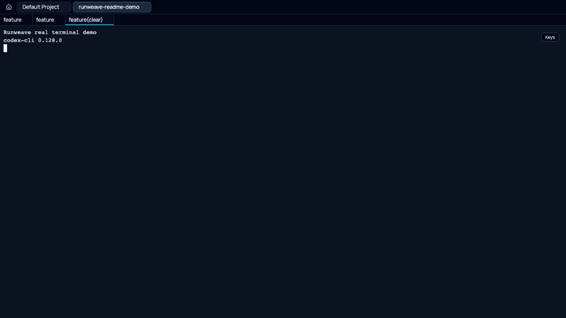

# Runweave

[中文](README.zh-CN.md)

Runweave is a local-first terminal workspace for AI CLI workflows. It helps you
run, observe, hand off, and continue long-lived command-line tasks such as
`codex`, `claude`, shell commands, and project scripts from desktop, browser,
CLI, and phone.



Runweave is useful when your real work is happening inside terminals: an AI CLI
is editing code, a dev server is running, a command is waiting for input, or a
teammate/agent needs a stable way to continue from the current terminal context.

> Note: some package names, storage keys, and internal identifiers still use
> `browser-viewer`. Treat those as technical identifiers until a separate
> code-level rename is completed.

## What Runweave Does

### Terminal Workspace

- Create projects and terminal sessions.
- Run arbitrary CLI commands, including `codex`, `claude`, `opencode`, shell
  commands, and project scripts.
- Watch live terminal output, switch between terminals, and send follow-up input
  to an existing session.
- Keep terminal work separate from browser viewer sessions, so agent work can be
  managed as its own workflow.

### Long-Running Task Continuity

Runweave is designed for long-running terminal tasks. When the local environment
supports recoverable terminal sessions, you can keep observing or reconnect to
work that is still running. If that recovery path is not available, Runweave
still works as a normal managed terminal workspace.

Runweave does not claim that tasks survive machine or container destruction, and
it does not semantically prove that an AI task is complete.

### Desktop and Web

- Use the web app during local development or self-hosted deployment.
- Use the Electron desktop app for a local desktop workflow.
- In Electron, manage connections to different Runweave backends from one
  client.

### Runweave CLI

`rw` is the command-line entry point for humans and external agents. It can log
in, ensure a project exists, create terminals, list sessions, read snapshots,
build handoff context, and send input to an existing terminal.

Source checkout usage:

```bash
pnpm cli:build
node packages/runweave-cli/dist/index.js auth login \
  --base-url http://127.0.0.1:5001 \
  --username admin
```

After the CLI is linked or installed as `rw`:

```bash
rw auth status --json
rw project ensure --name my-project --path "$PWD" --json
rw terminal create --project-id "$PROJECT_ID" --cwd "$PWD" --json
rw terminal send "$TERMINAL_ID" --text "codex" --enter --confirm short --json
rw terminal snapshot "$TERMINAL_ID" --tail 120 --plain
rw terminal handoff "$TERMINAL_ID" --tail 120 --json
```

`send --confirm short` confirms that input was delivered or briefly observed; it
does not mean the AI task has finished.

### Mobile App

Runweave mobile workflows are handled by the dedicated App client:

- Review projects, terminal sessions, status, and recent activity.
- Open a terminal directly from the App when phone-side input is needed.
- Keep mobile UI and API contracts separate from the Web desktop frontend.

The old Web mobile page has been removed. App home data is served by the
App-only `/api/app/home/overview` endpoint.

### iOS App Commands

Use different commands for local simulator debugging and device builds:

```bash
# Local simulator debugging with live reload.
# Starts the local backend and App Vite dev server.
pnpm app:dev:ios

# Local backend with static iOS build/sync/open.
# Does not support live reload.
pnpm app:ios:local

# Device build with a fixed backend from app/.env.local.
# Does not start a backend and does not support live reload.
pnpm app:ios:device
```

For device builds, copy `app/.env.example` to `app/.env.local` and set
`VITE_RUNWEAVE_API_BASE` to the backend URL. `app/.env.local` is ignored by git
so machine-specific domains or LAN addresses are not committed.

## Quick Start

```bash
pnpm install
cp backend/.env.example backend/.env
pnpm dev
```

Useful development variants:

```bash
# Start backend, frontend, and Electron
pnpm dev:electron
```

## Local Deployment

For a production-style local run:

```bash
cp backend/.env.example backend/.env
pnpm build
pnpm start
```

`pnpm start` starts the backend service and binds it to `127.0.0.1:5001` by
default. It is intended to run behind a reverse proxy for production-style
deployments. See [docs/deployment/overview.md](docs/deployment/overview.md) for
deployment details.

Important environment variables:

- `AUTH_USERNAME`: login username. The example file uses `admin`.
- `AUTH_PASSWORD`: login password. Replace the example value before sharing a
  service.
- `AUTH_JWT_SECRET`: signing secret for auth tokens.
- `FRONTEND_ORIGIN`: allowed frontend origins for CORS.
- `BROWSER_PROFILE_DIR`: persistent backend data directory.
- `TERMINAL_SESSION_STORE_FILE`: persisted terminal session store path.

Electron mac packaging:

```bash
pnpm dist:electron:mac
```

## Documentation

| Topic                             | Link                                                                                       |
| --------------------------------- | ------------------------------------------------------------------------------------------ |
| CLI                               | [docs/cli/terminal-cli.md](docs/cli/terminal-cli.md)                                       |
| App mobile boundary               | [docs/architecture/app-mobile.md](docs/architecture/app-mobile.md)                         |
| Terminal state model              | [docs/architecture/terminal-state.md](docs/architecture/terminal-state.md)                 |
| Deployment                        | [docs/deployment/overview.md](docs/deployment/overview.md)                                 |
| Terminal recovery                 | [docs/architecture/terminal-tmux-recovery.md](docs/architecture/terminal-tmux-recovery.md) |
| Architecture and network topology | [docs/architecture/network-topology.md](docs/architecture/network-topology.md)             |
| Testing commands                  | [docs/testing/command-matrix.md](docs/testing/command-matrix.md)                           |

## Verification

```bash
pnpm typecheck
pnpm lint
pnpm test:e2e
pnpm test
```

Frontend formal automation is E2E-first. Do not add frontend unit tests under
`frontend/src` for README-only work.

## License

MIT
