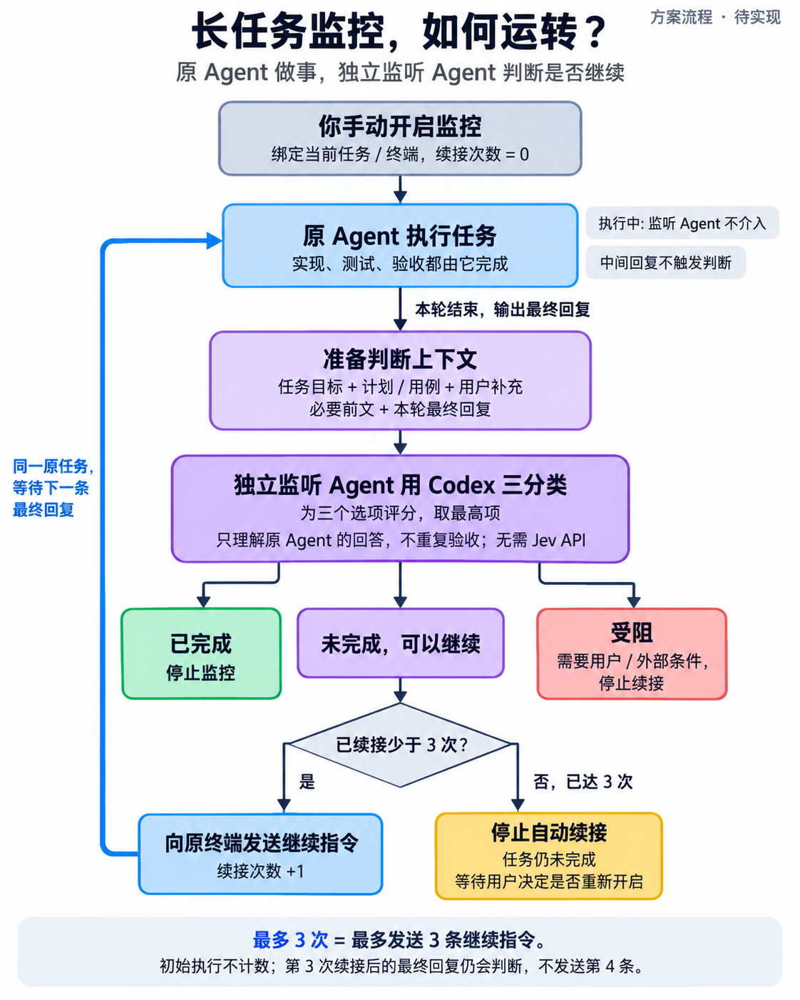

# 长任务监控流程图

2026-10-06 的历史方案图，用于保存当时的流程说明。产品现已实现；当前行为、版本与边界以 [长任务监控架构](../../architecture/terminal-task-supervision.md) 和源码为准。

主干：手动开启 → 原 Agent 执行 → 最终回复 → 组装上下文 → 独立监听 Agent 使用 Codex 三分类。

- 已完成：停止监控。
- 受阻：需要用户或外部条件，停止续接。
- 可继续：少于 3 次时向原终端发送继续指令，次数加一，再等待下一条最终回复；已达 3 次则停止自动续接，保留任务未完成状态。

执行中与中间回复不触发分类。实现、测试和验收均由原执行 Agent 完成。最多 3 次是最多发送 3 条继续指令；初始执行不计数，第 3 次后的最终回复仍会判断。暂停、服务错误、重启恢复等细节见当前架构文档，未在历史主流程图中展开。

图片由图像生成工具生成，已检查主干、三个分支、返回原执行节点的回线和次数边界；不构成运行时验收证据。
