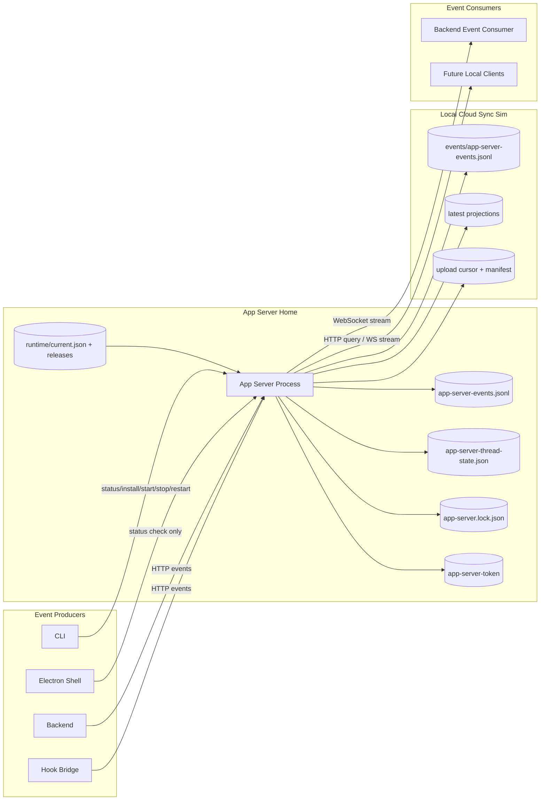
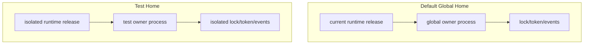
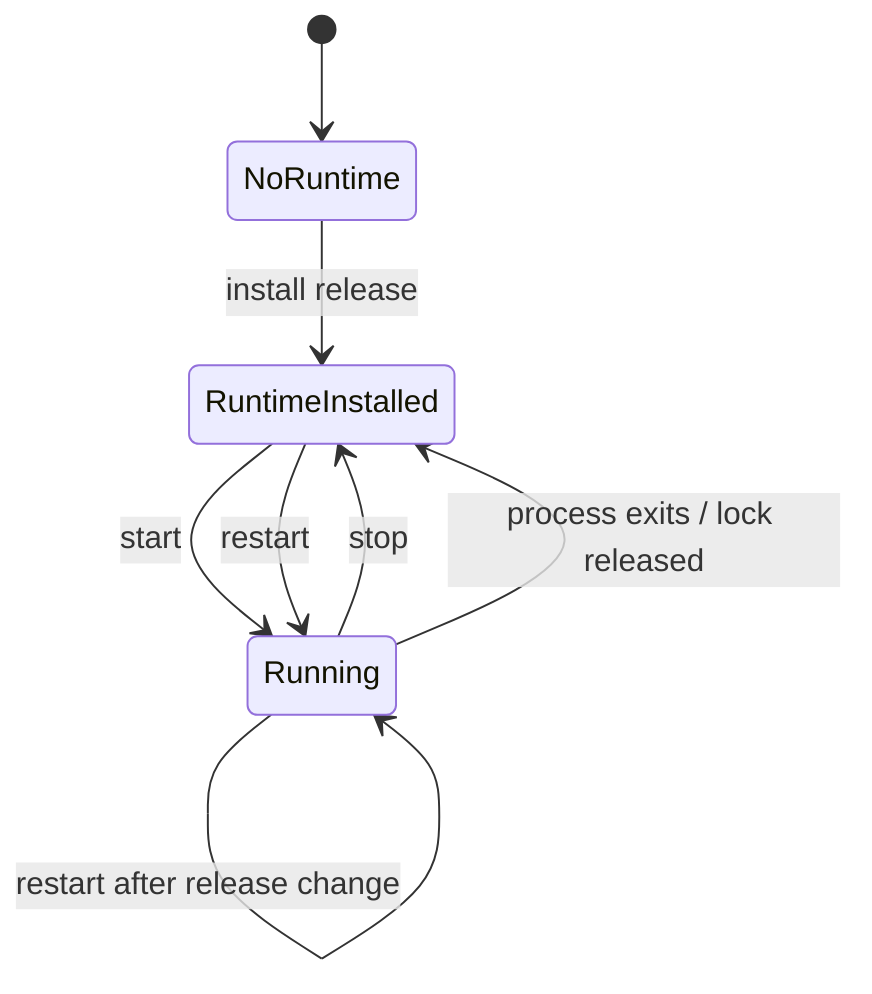
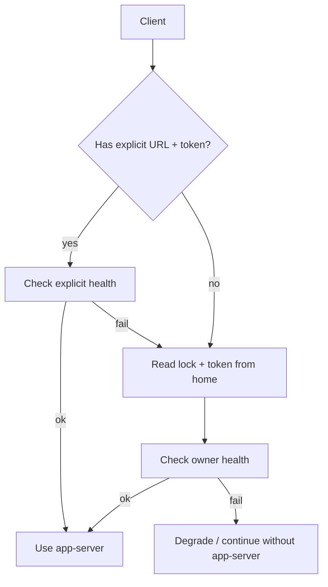
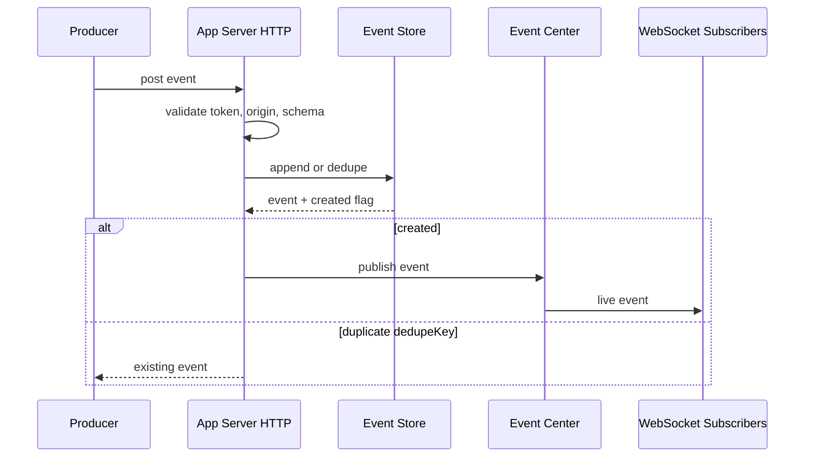
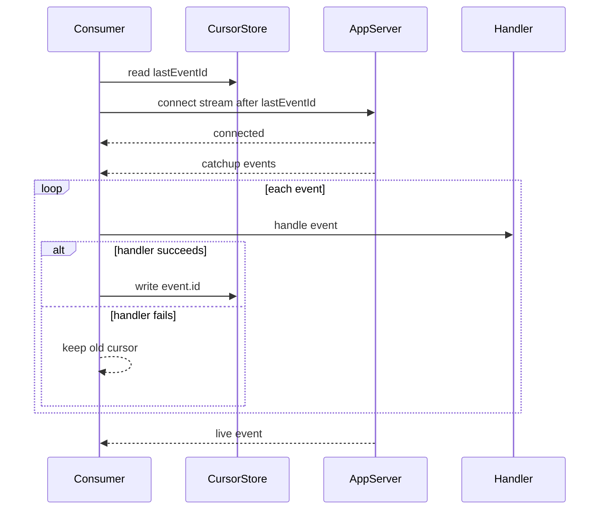
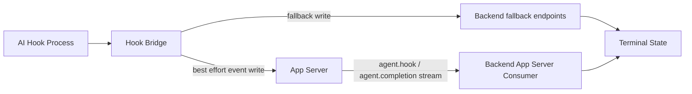
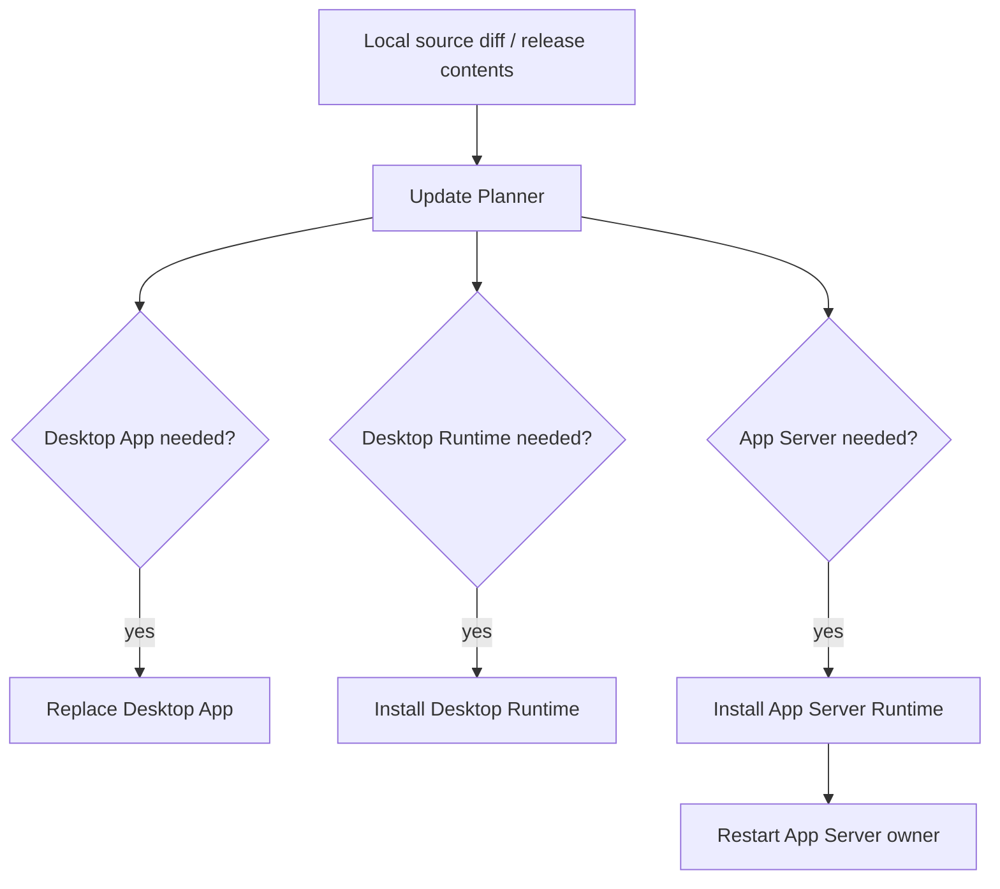

# App Server Architecture

本文是给 agent 阅读的 app-server 架构入口。目标是先理解系统边界、生命周期和数据流，
再决定应该读哪些源码文件。接口细节、命令和测试入口不在本文展开，见
`docs/architecture/app-server-event-center.md`。

## 一句话定位

App Server 是 Runweave 在本机上的全局事件中心、轻量状态中心和本地云同步模拟入口。它
独立于 Desktop backend、Electron shell、CLI 和 hook 进程运行，负责把来自不同进程的本地
事件持久化并实时分发，同时从 agent 事件投影出轻量 Thread 当前视图。

当前 app-server 不保存完整 thread 对话正文，不管理 terminal，不启动 backend，不拥有浏览器
profile，也不替代 backend 现有的 terminal websocket。本地同步模拟目录只用于后续云同步的
文件级演练，不是正式云端服务。

## 设计目标

- **全局唯一**：默认环境下，一个用户机器只应有一个正式 app-server owner。
- **运行位置稳定**：代码可以来自任意 repo、branch 或 packaged runtime，但运行入口必须
  先安装到 app-server home 下的 runtime release。
- **生命周期解耦**：Electron、backend、hook、CLI 都可以发现 app-server；只有 CLI 和
  本地更新器可以启动或重启它。Electron 只检查服务是否可用。
- **故障降级**：app-server 不可用时，backend 和 hook 的既有主流程继续工作。
- **测试隔离**：测试 app-server 使用独立 home，与正式全局 singleton 不共享 lock、token、
  event log 或 runtime。
- **事件 at-least-once**：app-server 只负责持久化和投递；consumer 自己保存 cursor，并在
  handler 成功后推进。
- **状态可重建**：Thread 状态由 event log 投影而来，状态 JSON 损坏或丢失时
  可以从 `app-server-events.jsonl` 重建。
- **同步不阻断**：本地云同步模拟写失败只记录 degraded 状态，不阻断 `/events` 写入、projection
  或 WebSocket 分发。

## 系统上下文



## 核心组件

| 组件                      | 代码入口                                                  | 职责                                                                           | 非职责                          |
| ------------------------- | --------------------------------------------------------- | ------------------------------------------------------------------------------ | ------------------------------- |
| app-server process        | `app-server/src/index.ts`                                 | 启动 HTTP/WS server、加载 token、初始化事件与状态存储、写 singleton lock       | 不启动 backend，不管理 terminal |
| singleton/runtime helpers | `packages/shared/src/app-server-node.ts`                  | 解析 home/runtime、发现 owner、校验 health、安装 runtime release、兼容旧 lock  | 不包含 HTTP 业务逻辑            |
| event schema              | `packages/shared/src/app-server-events.ts`                | 定义事件 envelope、状态 ref、source、scope、stream message 类型                | 不决定 handler 语义             |
| HTTP API                  | `app-server/src/http-server.ts`                           | 鉴权、Origin 校验、事件写入、事件查询、状态查询、sync status                   | 不保存 consumer cursor          |
| WebSocket API             | `app-server/src/websocket-server.ts`                      | catchup + live 事件投递                                                        | 不做 ack，不保证 exactly-once   |
| event store               | `app-server/src/event-store.ts`                           | append-only JSONL 持久化、7 天保留窗口、dedupe、按 id 查询                     | 不做跨机器同步                  |
| state store/projector     | `app-server/src/state-store.ts`、`state-projector.ts`     | 从 `agent.hook` / `agent.completion` 投影 ThreadRef，使用 `agent` 字段区分类型 | 不保存完整 thread 内容          |
| local sync sim            | `app-server/src/cloud-sync-sim.ts`                        | 镜像事件、latest projection、cursor、manifest                                  | 不上传真实云端                  |
| CLI lifecycle             | `packages/runweave-cli/src/commands/app-server.ts`        | 安装、启动、停止、重启、状态查询                                               | 不编译源码，不决定更新策略      |
| Electron bridge           | `electron/src/app-server-cli.ts`                          | 检查 app-server 是否可用；不可用时提示用户                                     | 不安装、启动或重启 app-server   |
| backend consumer          | `backend/src/app-server/*`                                | 发现 app-server、订阅事件、按 ownership 过滤并处理                             | 不启动 app-server               |
| hook bridge               | `plugins/toolkit/hooks/*` 和 `electron/resources/hooks/*` | 将 AI hook 事件双写到 app-server 和 backend fallback                           | 不启动 app-server               |
| local updater             | `scripts/runweave-update*.mjs`                            | 判断 Desktop App、Desktop Runtime、App Server 三类更新动作                     | 不绕过 CLI 直接杀进程           |

## Home、Runtime 与 Singleton

app-server home 是状态和可运行代码的唯一聚合点：

```text
app-server home
  app-server.lock.json
  app-server-token
  app-server-events.jsonl
  app-server-thread-state.json
  app-server.log
  runtime/
    current.json
    releases/<releaseId>/
      manifest.json
      app-server/index.cjs
```

同一个 home 中只能有一个 owner。不同 home 可以并存，用于正式环境和测试环境隔离。

事件数据使用 append-only JSONL 保存到 `app-server-events.jsonl`。它不是无限增长的诊断
日志，而是 app-server 当前保留窗口内的事件存储；默认只保留最近 7 天事件。启动时会清理
超过保留窗口的旧事件并重写 JSONL 文件，运行中也会周期性清理。event id 仍按历史最大 id
继续递增，避免 consumer 已保存的 cursor 因旧事件被清理后错过新事件。

状态文件保存的是从事件投影出来的 latest view，而不是新的事实源。启动时 app-server 会从
event log 重建 ThreadRef，然后写回 latest state JSON。ThreadRef 的 `threadId` 是唯一键，
`agent` 字段用于区分 Codex、Trae 等 agent 类型。

默认本地同步模拟目录：

```text
~/.runweave/app-server-cloud-sync-sim/
  events/app-server-events.jsonl
  projections/threads.jsonl
  projections/latest-threads.json
  cursors/upload-cursor.json
  manifests/sync-manifest.json
```

验证和自动化必须通过 `RUNWEAVE_APP_SERVER_CLOUD_SYNC_DIR` 覆盖该目录，避免污染用户默认
目录。



正式运行默认使用全局 home。测试运行必须显式切换 home，否则会污染正式 singleton。
agent 排查“现在跑的是哪份代码”时，应先看 lock 中的 `pid`、`releaseId`、`entry` 和
`runtimeRoot`，再看 runtime `current.json`。

## 生命周期模型

app-server 的生命周期分两层：**安装 runtime release** 和 **启动 owner process**。
安装只改变 `runtime/current.json` 指针；启动只运行当前指针指向的 entry。



重要约束：

- 安装不隐式启动。
- 启动不隐式编译或安装。
- 重启只针对同一个 home 内的 owner。
- 旧 lock schema 必须能被识别，至少要保留 stop/restart 能力，避免升级时留下旧 owner。
- Electron 只检查 app-server 是否已启动；如果不可用，只提示用户，不安装、启动或重启
  app-server。

## 发现与鉴权

client 发现 app-server 有两条路径：



鉴权模型很小：

- `/healthz` 和 `/readyz` 不要求 bearer token。
- 事件写入、查询和 WebSocket stream 都要求 bearer token。
- 非 loopback Origin 会被拒绝。
- token 只用于本机 app-server client 鉴权，不应写入日志或 PR body。

## 事件模型

事件 envelope 是所有 producer 和 consumer 的稳定合约：

```text
id + version + kind + source + scope + dedupeKey + correlationId + payload + createdAt
```

语义：

- `id` 是本机 event log 内的递增字符串。
- `kind` 决定 handler 类型，例如 `agent.hook`、`agent.completion`、`backend.started`。
- `source` 描述生产者进程身份。
- `scope` 用于 ownership 过滤，尤其是 `terminalSessionId`、`projectId`。
- `dedupeKey` 用于生产者重试时避免重复追加。
- `payload` 是事件业务内容，具体 shape 由 kind 约束。



app-server 只提供 append-only 持久化和实时 fan-out，不维护 subscriber 状态。consumer
必须按自己的业务边界保存 cursor。

## 轻量状态模型

状态 projection 只处理两类原始事件：

- `agent.hook`
- `agent.completion`

投影规则：

- `agent.hook` + `SessionStart` -> `starting`
- `agent.hook` + `UserPromptSubmit` -> `running`
- `agent.hook` + `Stop` -> `idle`
- `agent.completion` + `completionReason=hook_stop` 且 raw hook event 是 Stop/SubagentStop -> `idle`
- `agent.completion` + `completionReason=ai_process_exit` -> `completed`
- `notify`、`manual` 和无法解释事件不覆盖已有明确状态

projection 会生成普通 app-server event：

- `thread.state.changed`

这些事件写入同一 event log，并通过 `/events/stream` 推送，但 projector 会忽略它们，避免递归。

查询接口：

- `GET /threads`
- `GET /threads/:threadId`
- `GET /sync/status`

这些接口与 `/events` 一样需要 bearer token；`/healthz` 和 `/readyz` 仍不需要 token。

## Consumer Cursor 与 At-Least-Once



这个模型故意选择 at-least-once：

- handler 成功后再推进 cursor。
- handler 失败、进程退出或 cursor 写入失败时，事件会在下次连接后重放。
- handler 必须幂等。
- consumer 应先做 ownership 过滤，再执行业务副作用。

## Backend 与 Hook 的关系

backend 和 hook 是 app-server 当前最重要的 client，但它们的职责不同。



边界：

- hook bridge 是短生命周期进程，只发现 app-server，不启动 app-server。
- backend 启动时可发现 app-server，发现失败不阻塞 backend。
- backend 只处理属于当前 backend 的 terminal/project 事件。
- backend direct fallback 和 app-server consumer 应共享业务处理逻辑，避免状态规则漂移。

## 更新与发布模型

Desktop 更新现在拆成三个独立组件动作：



设计意图：

- Desktop App、Desktop Runtime、App Server 是三个组件，不应互相伪装。
- App Server 更新意味着安装新 app-server runtime，并重启 app-server owner。
- “不重启桌面端”不能和 App Server 更新混用，因为 App Server 更新必须重启服务进程。
- Electron 启动时只检查 app-server；如果服务未启动，会提示用户，不执行安装、启动或重启。

## 失败与降级原则

| 场景                                      | 期望行为                                                      |
| ----------------------------------------- | ------------------------------------------------------------- |
| app-server 未安装                         | CLI start 失败并报告 runtime 缺失；backend/hook 继续 degraded |
| lock 指向健康 owner                       | 新启动请求复用 owner，不覆盖 token                            |
| lock 指向旧 schema owner                  | 仍能识别 pid/port，restart 能停止旧 owner                     |
| lock stale                                | 清理 stale lock 后启动当前 runtime                            |
| token 错误或写入失败                      | client 失败，不影响 backend fallback                          |
| handler 失败                              | consumer 不推进 cursor，下次重放                              |
| 本地同步目录不可写                        | `/events` 仍成功，projection 仍更新，`/sync/status` 暴露错误  |
| Electron 安装新 release 但旧 owner 仍运行 | Electron 通过 CLI restart 切换 owner                          |
| 测试 home 和正式 home 并存                | 互不共享状态，互不停止对方 owner                              |

## Agent 修改指南

改动前先判断你在改哪一层：

- **事件合约**：先改 `packages/shared/src/app-server-events.ts`，再同步 HTTP validation、
  producer payload、consumer handler。
- **状态 projection**：优先改 `app-server/src/state-projector.ts` 和 `state-store.ts`；event log
  仍是事实源，projection 必须可重建。
- **本地同步模拟**：改 `app-server/src/cloud-sync-sim.ts`；失败不能 throw 到 HTTP 主流程，不能把
  token、Authorization、cookie、secret 写入 manifest 或 latest projection。
- **发现/生命周期**：优先改 `packages/shared/src/app-server-node.ts` 和 CLI，不要让
  Electron、backend、hook 各自复制 lock/token 逻辑。
- **运行时安装**：改 updater 或 runtime manifest 时，要同时考虑 Desktop Runtime 和
  App Server runtime 的 release 指针。
- **backend 状态副作用**：优先复用 backend 现有 terminal-state processor，不要让 direct
  fallback 和 app-server consumer 产生两套业务规则。
- **hook 行为**：保持 best-effort；app-server 写失败不能阻断 fallback。
- **测试隔离**：任何会启动或重启 app-server 的验证都必须使用隔离 home，除非目标就是更新
  正式全局 singleton。

常见误区：

- 不要从 Electron 或 backend 直接 import app-server 源码启动服务。
- 不要把 App Server 当成 Desktop backend 子进程。
- 不要把本地同步模拟目录当作正式云服务或唯一事实源。
- 不要把完整 Codex/Trae thread 正文写入 ThreadRef。
- 不要把 event stream 当作 exactly-once 队列。
- 不要让 hook bridge 自动启动 app-server。
- 不要在更新流程里绕过 CLI 直接杀 app-server 进程。
- 不要用同一个 home 同时跑正式和测试 owner。

## 阅读路径

新 agent 推荐按这个顺序阅读：

1. 本文：理解架构边界和流程。
2. `docs/architecture/app-server-event-center.md`：查看接口、状态文件和验证入口。
3. `packages/shared/src/app-server-node.ts`：理解 home/runtime/discovery/lock 的真实实现。
4. `app-server/src/index.ts`、`event-store.ts`、`http-server.ts`、`websocket-server.ts`：
   理解服务端事件中心。
5. `app-server/src/state-store.ts`、`state-projector.ts`、`cloud-sync-sim.ts`：
   理解状态投影和本地同步模拟。
6. `packages/runweave-cli/src/commands/app-server.ts`、`electron/src/app-server-cli.ts`：
   理解启动、重启和 packaged runtime 接入。
7. `backend/src/app-server/*` 与 hook bridge：理解 producer/consumer 和 fallback。
