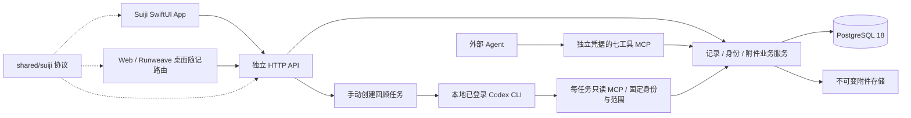

# 随记架构与交付状态

随记采用独立单人服务，Swift App 与 Web/Runweave 桌面直接访问相同 HTTP API。
随记账号与 Runweave 节点身份分离，记录保存不依赖 Terminal、Backend、App Server 或模型。
本地 AI 使用已登录 Codex CLI；云部署、恢复与云端模型适配仍待后续执行。

| 归属                   | 入口与约束                                                                                                                                                 |
| ---------------------- | ---------------------------------------------------------------------------------------------------------------------------------------------------------- |
| HTTP / 数据 / AI / MCP | [suiji-server](../../packages/suiji-server/README.md)，事务、版本、独立认证、模型进程生命周期                                                              |
| 原生 UI / 草稿         | [suiji-ios](../../packages/suiji-ios/README.md)，Swift Package + 薄宿主，Keychain 与原子草稿                                                               |
| Web UI / 草稿          | [页面](../../frontend/src/features/suiji/connection.tsx)、[客户端](../../frontend/src/services/suiji.ts)，独立路由、sessionStorage、IndexedDB 与 Web Locks |
| 共享协议               | [shared/suiji](../../packages/shared/src/suiji/index.ts)，纯 TS 合同与限额，无运行时驱动                                                                   |
| 部署与恢复             | [deploy/suiji](../../deploy/suiji/README.md)，独立产物、追加迁移、停写备份、空目标恢复                                                                     |

## 一致性边界

- 正文与当前附件通过一个 PATCH 提交。记录、关系、完整修订及幂等结果共用同一 pg client 事务。
- 幂等键按 owner 唯一，摘要包含操作、目标和完整输入。成功重放返回原结果；失败事务整体回滚。
- 待办仅 open → done 或 archived；终态可编辑正文，再次想做新建独立记录。
- 文件先落盘同步与原子改名，再登记元数据。首次绑定后不能被其他记录复用；历史引用保留。
- 草稿按端点及 server/owner 身份隔离。本机落盘与远端保存分别反馈；未知结果冻结并手动重试。
- 业务写操作没有联网、前台或登录自动重发；只读请求最多一次认证恢复重试。
- 回顾没有写工具，引用必须匹配本次读取版本和逐字原文。用户手动保存回答才创建新记录，已有草稿不被预填覆盖。
- 当前 AI 以模型扩展关键词检索，不含 embedding/pgvector、附件全文索引、外链采集或跨会话聊天存储。

## 当前验证范围

以下为 2026-09-07 的本地开发证据，不代表生产或原生体验验收。

| 范围             | 结果与合同                                                                                                                                             |
| ---------------- | ------------------------------------------------------------------------------------------------------------------------------------------------------ |
| 服务数据         | [20 条](../testing/suiji/service-records.testplan.yaml)通过，真实 PostgreSQL 18.6、HTTP、文件与受控故障                                                |
| 外部 MCP         | [13 条](../testing/suiji/mcp-agent.testplan.yaml)通过，含真实 Codex CLI 读改写与独立 HTTP 读回                                                         |
| Web / 桌面录入   | [12 条](../testing/suiji/web-capture.testplan.yaml)通过，实际 Beta 独立窗口和同一构建的 HTTP 页面，含附件、断线、草稿、冲突、身份、多标签页及窗口重开  |
| 本地 AI          | [12 条](../testing/suiji/ai-review.testplan.yaml)通过，真实 Codex 发问、追问、范围与只读验证；非法引用、慢进程等使用明确的故障注入                     |
| Swift 构建 / DTO | Debug、Release Simulator 构建通过；Debug 已签名安装并启动于 iPhone 17；真实 HTTP 的 63 条记录及已完成 AI 回答通过生产 Codable 字段回编码核对           |
| 原生体验         | [17 条](../testing/suiji/ios-capture.testplan.yaml)未执行；已切换用户指定的真机 runner，安装成功，但两次均在启用自动化模式时超时，尚无随记界面操作证据 |
| 独立部署         | [前 3 条](../testing/suiji/deployment-recovery.testplan.yaml)通过；异机备份及后续恢复未执行，云部署与恢复按用户要求延期                                |
| 静态门禁         | 服务与前端 typecheck/lint、服务 build、shared typecheck、架构边界通过；不能替代上述 UI 验收                                                            |

类型切换按钮和完成后自动关窗目前仅通过静态检查，尚未进行新一轮 Web UI 验收。

脱敏执行结果、CLI 工具事件与构建日志放根 `.runweave/suiji/`，本地流程在 `local-flow/`，真机准备在 `physical/`；
不将运行凭据、数据库、正文、附件或一次性截图加入 Git。
具体运行方式以包入口为准；仍待执行的原生、索引与云端范围见[分阶段计划](../plans/2026-09-07-suiji.md)。
