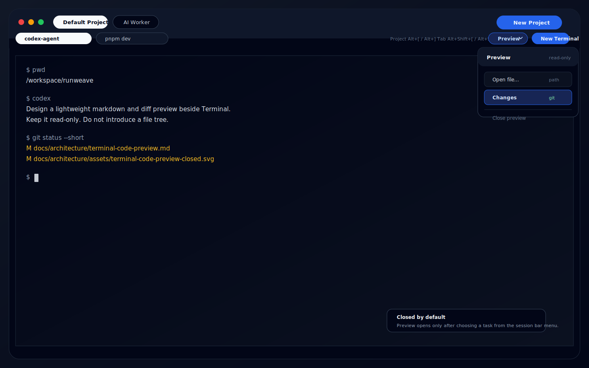
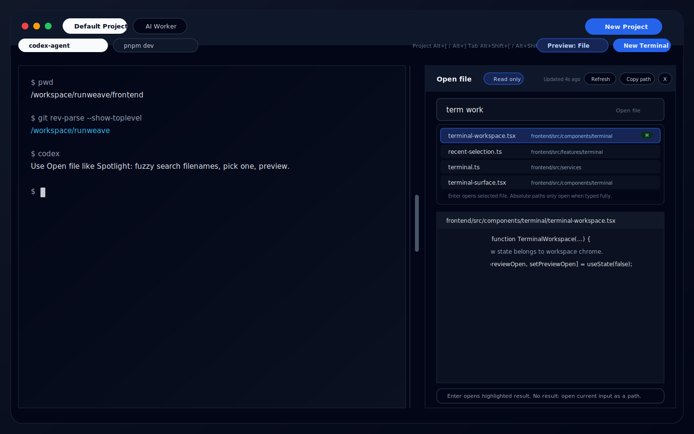
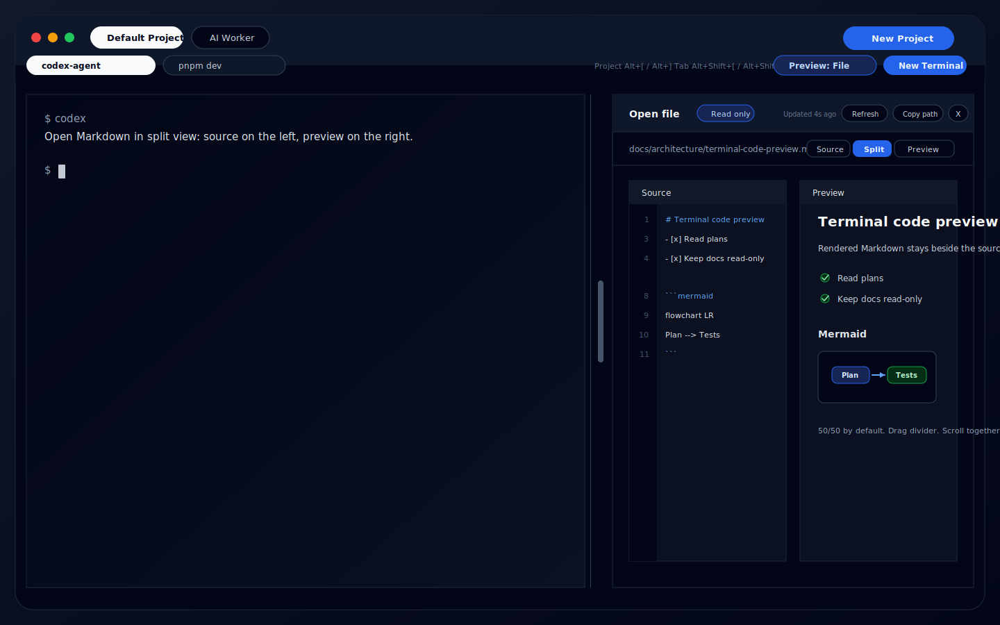
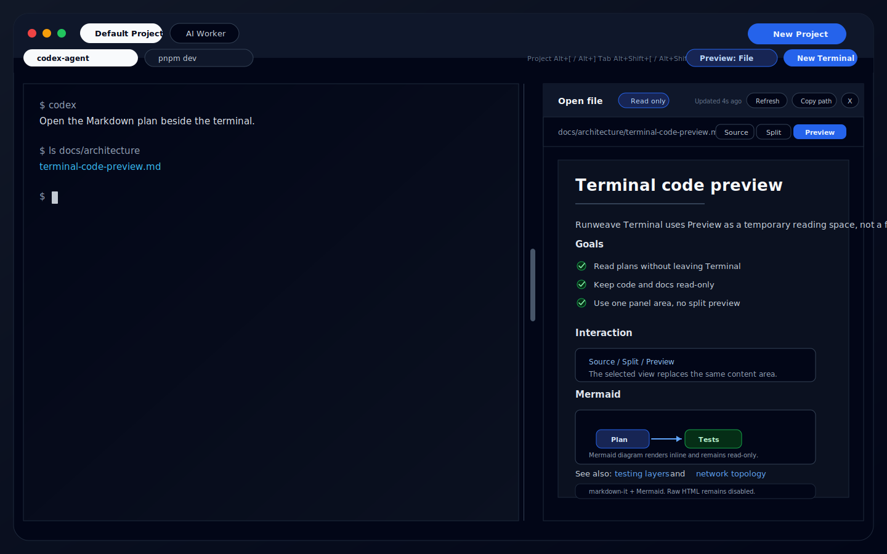
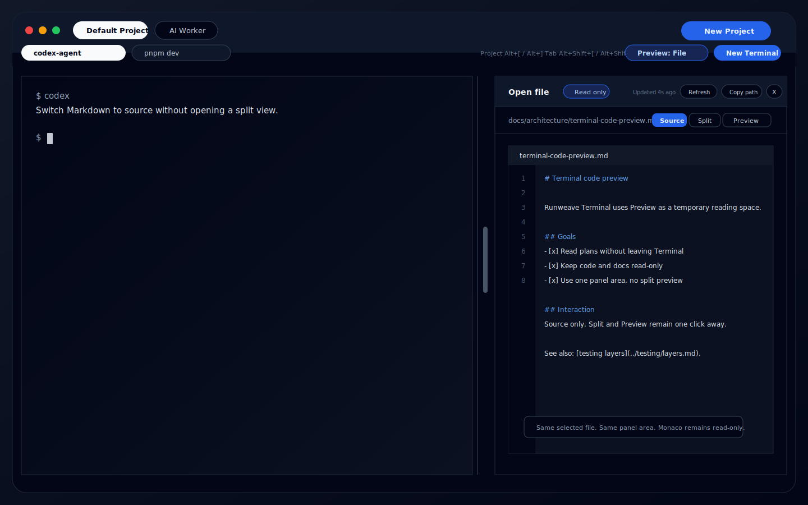
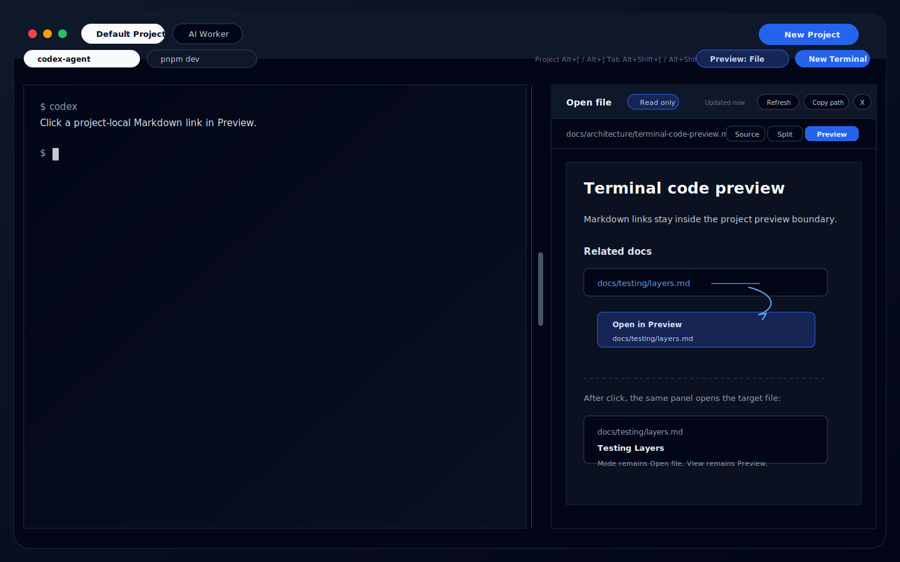
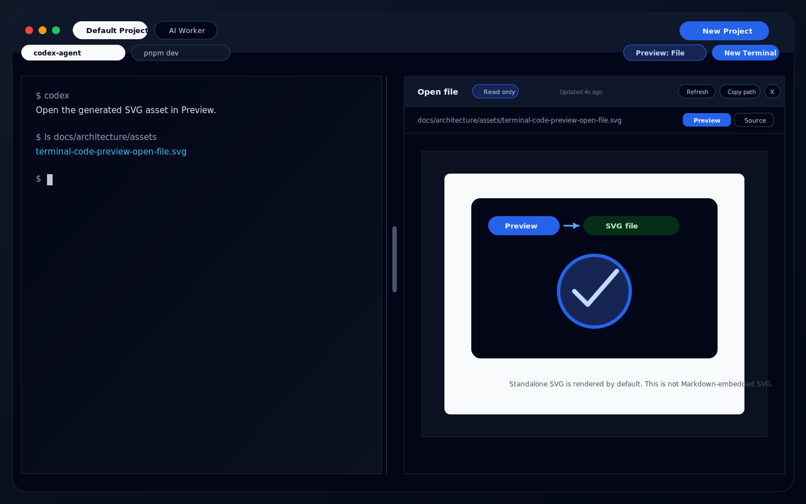
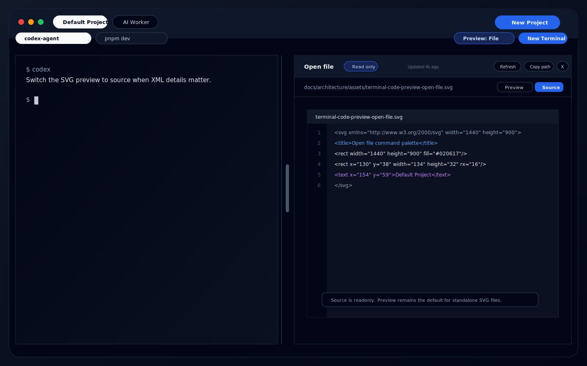
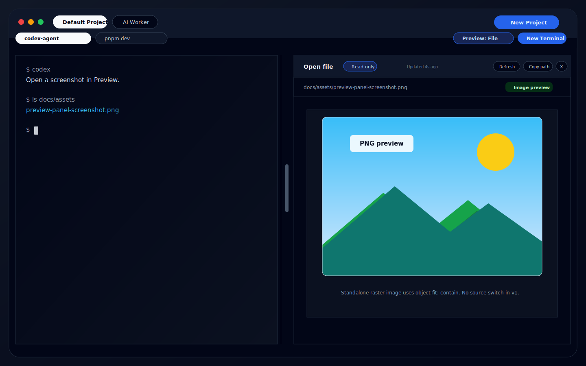
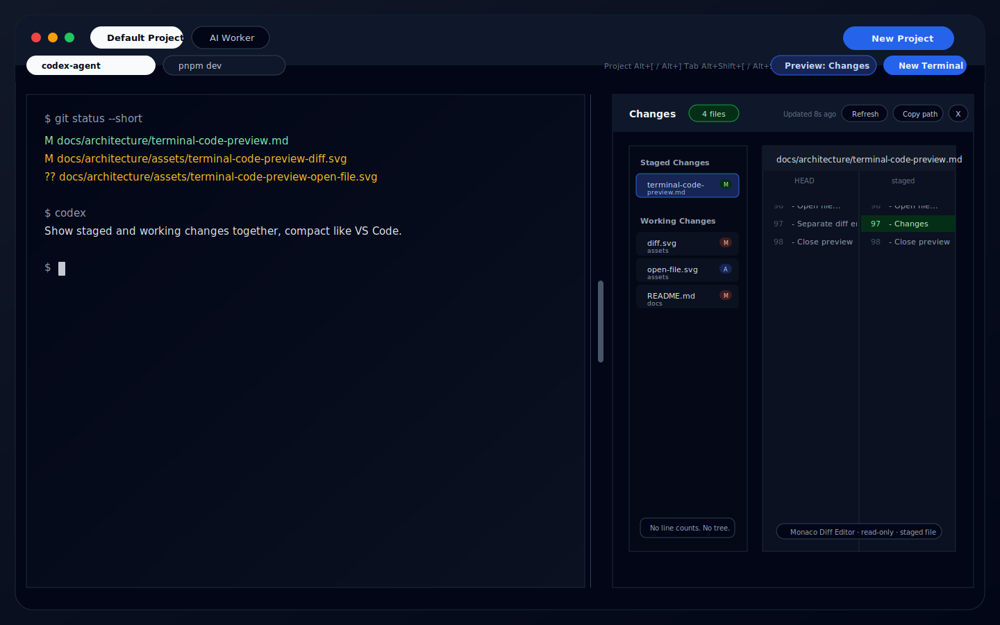

# Terminal 代码预览设计

说明 Runweave Terminal 中轻量代码预览能力的产品边界、交互形态和后端协议建议。

## 背景

Terminal 现在是 Runweave 里和 AI 协作最密集的页面。用户会在终端里让 AI 生成计划、修改代码、运行测试，然后在提交前快速确认结果。

但这里需要的不是完整 IDE：

- 偶尔通过明确路径查看 AI 生成或人工维护的方案文档
- 一边看计划一边继续和 AI 对话
- 提交前快速扫一眼 staged changes 和 working changes
- 不希望展示项目文件树
- 不希望把 Terminal 变成嵌入式 VS Code

因此预览能力应定位为 Terminal 的临时辅助上下文，而不是代码工作区。

## 当前代码事实

相关代码边界：

- `frontend/src/pages/terminal-page.tsx`：Terminal 路由入口，负责把路由参数传给工作台。
- `frontend/src/components/terminal/terminal-workspace.tsx`：Terminal 工作台，负责项目、会话、顶部栏、活动 session 容器、历史抽屉。
- `frontend/src/components/terminal/terminal-surface.tsx`：xterm 渲染与输入连接，不应承载代码预览业务。
- `frontend/src/components/terminal/terminal-preview-panel.tsx`：右侧 Preview 面板，负责 `file` / `changes` 两种模式的内容切换、文件读取、diff 读取、刷新、复制路径和关闭。
- `frontend/src/components/terminal/terminal-preview-menu.tsx`：Terminal 顶部栏里的 Preview 入口菜单，目前包含 `Open file...`、`Changes` 和 `Close preview`。
- `frontend/src/components/terminal/terminal-open-file-command.tsx`：Open file 的搜索输入和结果列表，不依赖 Monaco。
- `frontend/src/components/terminal/terminal-monaco-viewer.tsx`：只读 Monaco Editor / Diff Editor 封装，已通过 lazy boundary 加载。
- `frontend/src/features/terminal/preview-store.ts`：Preview 专用 Zustand store，当前 mode 为 `file | changes`，并按 project 保存 query、selected file、selected change。
- `frontend/src/services/terminal.ts`：Terminal HTTP API client 已提供 project-scoped Preview wrappers：文件搜索、文件读取、git changes、单文件 diff。
- `backend/src/routes/terminal.ts`：Terminal HTTP API 已提供 `/api/terminal/project/:id/preview/...` project-scoped Preview 路由。
- `backend/src/terminal/preview.ts`：后端 Preview service 已基于 project path 做路径约束、文件读取、语言识别、搜索、git changes 和 diff。
- `packages/shared/src/terminal-protocol.ts`：Terminal 共享协议已包含 Preview search/file/git changes/file diff 类型。
- 当前 `frontend/package.json` 已有 `monaco-editor`、`@monaco-editor/react` 和 `zustand`，但还没有 `markdown-it`、Markdown 插件及 Mermaid 依赖。
- 当前 Terminal Project 已有 `path: string | null` 字段。Preview 的文件根目录是 project path，不使用 terminal session 的实时 `cwd`。
- 后端已经把 `.md` / `.mdx` 识别为 `language: "markdown"`。因此 Markdown 预览不需要新增文件读取 API，属于前端渲染层能力。
- 当前后端还没有把独立 `.svg` 文件识别成可渲染预览类型；SVG 文件预览需要在后端语言识别和前端 file mode 渲染层补齐。

设计结论：

- 预览面板应挂在 `TerminalWorkspace` 的内容区布局中。
- `TerminalSurface` 继续只关心 xterm 连接、渲染、搜索、设置、粘贴等终端能力。
- Preview 的文件搜索、文件读取和 git changes 都基于 Terminal Project Path。
- Markdown 预览应复用当前 `file` 模式和当前 project-scoped file API，不新增 `markdown` 顶层 mode。
- Markdown 渲染只在打开 Markdown 文件时出现，作为 `file` 模式内的 `Source` / `Split` / `Preview` 视图切换。
- 独立 `.svg` 文件也复用当前 `file` 模式和当前 project-scoped file API。它默认展示 SVG 预览，并可切到源码；这不等同于 Markdown 文档中嵌入的 SVG。
- 独立图片文件预览也复用当前 `file` 模式，但不复用文本 file content 响应。图片预览通过 project-scoped asset endpoint 获取受限图片字节，默认展示图片预览；这不等同于 Markdown 文档中嵌入的图片。

## 目标

1. 在 Terminal 右侧临时预览代码、Markdown、图片、SVG 或 diff。
2. 默认关闭，不影响终端主体验。
3. 不展示项目级文件树。
4. 不提供编辑能力。
5. 使用 `@monaco-editor/react` 承载 Monaco Editor 和 Diff Editor，只使用只读预览能力。
6. 预览基于当前 Terminal Project 的项目路径，不基于 terminal session 的 `cwd`。
7. 桌面端优先，移动端默认不开放。

## 非目标

- 不嵌入 VS Code。
- 不接入 VS Code extension host。
- 不做文件树、全局搜索、符号索引、LSP diagnostics。
- 不做代码编辑、保存、重命名、删除。
- 不做 git commit、stage、unstage 等写操作。
- 不在 v1 处理大型二进制文件或超大文件。图片预览是受 MIME allowlist 和大小上限约束的例外，不扩展为通用二进制预览。

## 推荐方案

采用右侧 Temporary Preview Panel。

默认状态下，Terminal 保持全宽。桌面端在 Terminal session bar 右侧提供 `Preview` 按钮，位置靠近 `New Terminal`。用户点击 `Preview` 时先打开任务菜单；只有选择具体预览任务后，才打开右侧面板。



选择 `Open file...` 后，右侧显示 Spotlight / Cmd+P 风格的文件搜索面板。用户可以按文件名或相对路径模糊搜索当前项目路径内文件，选中后在右侧只读预览；绝对路径只能手动完整输入并打开，不参与模糊搜索。



打开 Markdown 文件时，右侧面板进入 Markdown view。默认显示 `Split`，左侧是只读原始 Markdown，右侧是 rendered Markdown 预览；顶部路径栏右侧提供 `Source` / `Split` / `Preview` 切换。



切到 `Preview` 后，只显示 rendered Markdown 预览。



切到 `Source` 后，只显示只读 Monaco Editor 中的 Markdown 源文。用户可以随时切回 `Split` 或 `Preview`。



Markdown 中指向当前 project 内其他 Markdown 文件的相对链接可以在 Preview 面板内跳转，仍复用 `Open file` 的文件读取链路。



打开独立 `.svg` 文件时，右侧默认展示 SVG 预览，而不是源码。路径栏右侧提供 `Preview` / `Source` 切换；`Source` 用只读 Monaco 显示 SVG XML。





打开独立图片文件时，右侧默认展示图片预览。第一版支持常见 raster 图片格式，不提供源码视图。



查看提交前变更时，右侧显示 Changes 面板和 Monaco Diff Editor。左侧只列本次变更文件，并按 `Staged Changes` / `Working Changes` 分组，不展示项目文件树。



### 交互草图索引

本文涉及会改变 Preview 面板状态或内容区域的交互，都需要对应草图：

| 交互                                                 | 草图                                                |
| ---------------------------------------------------- | --------------------------------------------------- |
| 点击 `Preview` 打开入口菜单，面板仍关闭              | `assets/terminal-code-preview-closed.svg`           |
| 选择 `Open file...` 并搜索文件                       | `assets/terminal-code-preview-open-file.svg`        |
| 打开 Markdown 文件后的 source + preview split view   | `assets/terminal-code-preview-markdown-split.svg`   |
| Markdown 切到仅 rendered preview，含 Mermaid diagram | `assets/terminal-code-preview-markdown-preview.svg` |
| Markdown 切到仅 source view                          | `assets/terminal-code-preview-markdown-source.svg`  |
| Markdown project 内相对链接跳转                      | `assets/terminal-code-preview-markdown-link.svg`    |
| 打开独立 `.svg` 文件后的默认 SVG preview             | `assets/terminal-code-preview-svg-preview.svg`      |
| SVG 文件切到 readonly source view                    | `assets/terminal-code-preview-svg-source.svg`       |
| 打开独立图片文件后的默认 image preview               | `assets/terminal-code-preview-image-preview.svg`    |
| 选择 `Changes` 并查看 staged / working diff          | `assets/terminal-code-preview-diff.svg`             |

## 信息架构

### 入口

桌面端 Terminal 第二行 session bar 的右侧操作区增加 `Preview` 入口，推荐位置：

```text
[terminal tab] [terminal tab]      Project shortcut hint   [Preview] [New Terminal]
```

如果横向空间不足，优先保留 session tabs、`Preview`、`New Terminal`：

```text
[terminal tabs scroll area]                         [Preview] [New Terminal]
```

`Preview` 不放在以下位置：

- 不放在第一行 project tabs 右侧。预览入口是当前工作流里的临时查看动作，不是 project 管理动作；真正的文件根目录由 active project 的项目路径提供。
- 不放在 `TerminalSurface` 右上角浮层。那里现在承载 xterm 设置与 terminal search，不应混入文件和 diff 预览。
- 不放在右侧常驻竖向 activity bar。该功能是偶尔使用的临时上下文，不应暗示存在完整代码工作区。

`Preview` 按钮是下拉菜单触发器，不是直接打开空面板的开关。

入口菜单：

- `Open file...`
- `Changes`
- `Close preview`

触发规则：

- 第一次点击 `Preview`：只打开菜单。
- 选择 `Open file...`：打开右侧面板，并在面板内显示文件搜索输入框。
- 选择 `Changes`：打开右侧 Changes 面板，左侧按 `Staged Changes` / `Working Changes` 分组展示文件，右侧显示当前文件 diff。
- 面板已打开时，`Preview` 按钮显示激活态，例如 `Preview: File` 或 `Preview: Changes`。
- 面板已打开时再次点击 `Preview`：仍打开菜单，不直接关闭面板。
- 关闭动作放在菜单的 `Close preview` 和右侧面板 Header 的 `Close` 按钮中。
- `Close preview` 在面板关闭时置灰或隐藏。

`Preview` 入口只在 desktop client mode 展示。mobile client mode 继续保持轻量 monitor 定位。

### 辅助入口

面板打开后，中间分隔线可以提供拖拽 handle，用于调整宽度。

面板关闭时，不建议保留右侧边缘竖条作为主入口。主入口仍是 session bar 里的 `Preview` 按钮，避免界面看起来像 IDE activity bar。

从 terminal 输出中点击文件路径打开预览可作为 v2 能力，不进入 v1。原因：

- xterm 里的选择、复制、链接点击容易冲突。
- 路径识别需要处理相对路径、绝对路径、行号、历史输出等边界。
- v1 的重点是轻量任务菜单和只读预览面板。

如果后续支持，可考虑 `Cmd/Ctrl + click` terminal 中的文件路径，在右侧 Preview 打开对应文件。

### 面板

右侧面板由三层组成：

1. Header
   - 当前模式：`Preview` / `Open file` / `Changes`
   - 状态 badge：`Read only`、文件数、加载中、错误
   - 操作：Refresh、Copy path、Close
   - 更新时间：例如 `Updated 12s ago`

2. Context bar
   - 当前路径
   - `Open another...`

3. Body
   - `file-picker`：文件搜索结果列表；选中文件后进入 file preview
   - `file`：Monaco readonly editor
   - `markdown-view`：Markdown 文件的 `Source` / `Split` / `Preview` 视图
   - `svg-view`：独立 SVG 文件的 `Preview` / `Source` 视图
   - `image-view`：独立图片文件的只读 preview
   - `changes`：Staged / Working 分组文件索引 + Monaco diff editor
   - `empty/error`：轻量空状态或错误状态

### 尺寸

桌面端建议：

- 默认宽度：50%
- 最小宽度：320px
- 最大宽度：60%
- 可拖拽调整宽度
- 关闭后释放全部空间给 Terminal

布局上应避免 iframe 或卡片化预览。它是 Terminal 工作台的一块辅助面板，不是嵌入外部应用。

### Header 操作

#### Refresh

`Refresh` 手动重新读取当前 preview 数据，不改变当前模式和选择。

不同模式下的行为：

| 当前模式       | Refresh 行为                               |
| -------------- | ------------------------------------------ |
| Open file 搜索 | 重新加载当前项目路径的文件候选索引         |
| Open file 预览 | 重新读取当前路径内容                       |
| Markdown 预览  | 重新读取当前 Markdown 文件并重新渲染       |
| SVG 预览       | 重新读取当前 SVG 文件并重新渲染            |
| 图片预览       | 重新读取当前图片文件并重新加载预览         |
| Changes        | 重新加载 staged changes 和 working changes |
| 空状态         | 不展示或置灰                               |

v1 不做自动实时刷新。原因：

- 文件和 git diff 变化可能很频繁。
- 自动刷新可能打断用户阅读位置。
- git diff 扫描有成本。
- 轻量预览更适合用户主动刷新。

刷新后如果当前文件不存在，显示明确空状态：

```text
File no longer exists

[Open file...] [Changes]
```

#### Copy path

`Copy path` 复制当前预览对象的路径引用，不复制正文或完整 diff。

不同模式下的行为：

| 当前模式       | Copy path 行为                 |
| -------------- | ------------------------------ |
| Open file 搜索 | 置灰或隐藏                     |
| Open file 预览 | 复制当前文件相对项目路径的路径 |
| Markdown 预览  | 复制当前 Markdown 文件相对路径 |
| SVG 预览       | 复制当前 SVG 文件相对路径      |
| 图片预览       | 复制当前图片文件相对路径       |
| Changes        | 复制当前选中变更文件路径       |
| 空状态         | 置灰或隐藏                     |

v1 不提供复制全文和复制完整 diff。后续如果需要，可把 `Copy path` 扩展为菜单：

```text
Copy
├─ Copy path
├─ Copy content
└─ Copy diff
```

但默认动作仍应保持为 `Copy path`，避免误复制大文件或大 diff。

## Project Path

Preview 的文件根目录是 Terminal Project Path，而不是 terminal session 的 `cwd`。

原因：

- 同一个 project 下通常会开多个 terminal，它们可能分别 `cd frontend`、`cd backend` 或临时进入其他目录。
- session `cwd` 依赖 shell integration 上报，适合展示 terminal 标签，但不适合作为代码预览的权限和搜索边界。
- PTY 进程退出后，session 记录仍可能存在；只要所属 project path 有效，Preview 仍应能查看项目文件和 git changes。

项目数据模型需要增加：

```ts
interface TerminalProjectListItem {
  projectId: string;
  name: string;
  path: string | null;
  createdAt: string;
  isDefault: boolean;
}
```

创建和编辑 project 时：

- 新建 project 时 `Project Path` 可选。用户只想分组管理 terminal 时，可以只填项目名称。
- 如果新建 project 时填写了 `Project Path`，需要校验该路径存在且是目录。
- 编辑 project 时允许修改名称和路径，因此 UI 文案建议从 `Rename Project` 调整为 `Edit Project`。
- 新建 project 未填写 path 或旧项目迁移后，`path` 可以为 `null`，不自动用 session `cwd` 兜底。
- 如果当前 project 没有 path，Preview 显示空状态：

```text
Set a project path to use Preview

[Set project path]
```

这个空状态不阻止 terminal 使用；它只说明 Preview 需要先给当前 project 设置路径。用户点击 `Set project path` 后进入 project 编辑弹窗，设置路径后即可使用 `Open file...` 和 `Changes`。

Terminal 行为保持宽松：

- 新建 terminal 时，如果所属 project 有 path，默认 `cwd` 使用 project path。
- 如果用户显式传入 `cwd`，或从某个 terminal 继承 `cwd`，仍然保留现有行为。
- 用户在 terminal 中 `cd` 到任何目录都不受限制。
- terminal session 的 `cwd` 继续用于 terminal 标签、历史记录和 session metadata，不用于 Preview 文件解析。

Preview API 使用 project-scoped 路由。Terminal session 只用于工作台内确定 active project，不参与 Preview API 的路径解析：

```text
projectId -> project.path -> previewRoot
```

只要 project 存在且 project path 有效，Preview API 即可工作；不需要 PTY runtime 存活。

## 切换行为

Preview 的状态分三层：

- 面板开关状态：`TerminalWorkspace` 级。
- 预览内容状态：Terminal Project 级。
- 文件搜索、文件读取、git changes 上下文：active project 的 project path。
- terminal session 只用于确定当前 active project。

这意味着 Preview 面板打开后，切换 project 或 terminal tab 不会自动关闭面板。右侧内容跟随 active project，而不是跟随 terminal 的实时 `cwd`。

### 切换 Terminal Tab

推荐规则：

1. Preview 面板保持打开。
2. 如果目标 terminal 属于同一个 project，Preview 内容保持不变。
3. 如果目标 terminal 属于另一个 project，Preview 切换到该 project 自己的 preview state。
4. 如果目标 project 之前打开过 preview，恢复它上次的 mode、path、open file query 或 changes selection。
5. 如果目标 project 没有 preview state，面板显示空状态：

```text
No preview for this project

[Open file...] [Changes]
```

6. 如果目标 project 没有配置 project path，面板显示设置路径的空状态。
7. Header 始终显示当前绑定的 project 和上下文，例如：

```text
Preview: File
project: browser-viewer
root: /repo
terminal: codex-agent
```

这样可以避免左侧已经切到新 project，但右侧仍显示旧 project diff 的误判；同一 project 内多个 terminal 则共享同一个 preview root 和 preview state。

### 切换 Project

Project 切换本质上会切换 active terminal session，因此沿用 terminal tab 切换规则：

- 面板保持打开。
- 右侧内容切到新 active project。
- 如果该 project 没有 preview state，显示空状态和快捷入口。
- 如果该 project 有历史 preview，恢复该 project 的 preview state。
- 如果该 project 没有配置 project path，显示 `Set a project path to use Preview`。

### 同 Project 的保留策略

如果切换前后两个 terminal 属于同一个 project，Preview 保持当前内容，不需要因为 terminal `cwd` 改变而重置。

例如：

- Project path: `/repo`
- Terminal A `cwd`: `/repo`
- Terminal B `cwd`: `/repo/frontend`

此时正在预览 `docs/architecture/terminal-code-preview.md`，切换 terminal 后继续显示同一路径，因为 Preview root 仍是 project path `/repo`。

不同 preview 类型的切换策略：

| 当前 Preview 内容  | 切换到同 project                                       | 切换到不同 project                 |
| ------------------ | ------------------------------------------------------ | ---------------------------------- |
| Open file 手动路径 | 保留当前文件；Refresh 时按 project path 重新读取       | 切到新 project state，若无则空状态 |
| Changes            | 保留当前 selection；Refresh 时按 project path 重新加载 | 切到新 project state，若无则空状态 |

Changes 预览不跨 project 沿用旧内容。切换 project 后必须重新加载或显示新 project 的 changes 空状态。

### Pin 行为

v1 不提供 Pin。

原因：

- Pin 会让右侧预览和左侧 active terminal 脱钩，增加误判风险。
- Pin 需要额外展示绑定 terminal、切回 follow active、关闭绑定等状态。
- 当前目标是轻量预览，不是多上下文工作区。

后续如果需要，可在 v1.1 或 v2 增加：

```text
Pin preview to this terminal
```

Pin 后 Header 必须明确显示：

```text
Pinned to project browser-viewer
root: /repo
[Follow active terminal]
```

## 用户流程

### 打开任意文件

1. 用户点击 `Preview`。
2. 选择 `Open file...`。
3. 右侧面板进入 `Open file` 模式，显示文件搜索输入框。
4. 用户输入文件名或相对路径片段，例如 `term work`、`network topology`、`docs arch`。
5. 前端请求当前 project path 内的文件搜索结果，展示 top results。
6. 用户点击结果或按 `Enter` 选择当前高亮结果。
7. 右侧显示只读 Monaco Editor。

绝对路径可以允许，但必须由用户显式输入并按 `Enter` 打开。绝对路径不进入候选列表，不做模糊搜索，不进入最近列表。v1 中绝对路径必须解析到当前 project path 内；跨项目或项目外路径不进入 Preview。

路径输入规则：

- 输入框 placeholder 使用当前上下文提示，例如 `Search file or paste absolute path...`。
- 普通输入作为当前 project path 内相对路径候选的 fuzzy query。
- 输入包含 `/` 时，仍可搜索相对路径，例如 `docs arch term` 或 `docs/arch`.
- 输入以 `/` 开头时，视为绝对路径输入，不展示模糊候选。
- 相对路径按 project path 搜索和解析。
- 绝对路径必须由用户完整输入，不通过 picker、候选项或建议项暴露。
- 绝对路径解析后必须位于 project path 内，否则展示 `Path is outside the project path`。
- `~` 展开可作为 v1.1 能力，v1 可不支持。
- 支持粘贴路径。
- 支持 `Enter` 打开当前高亮候选；没有候选时，按当前输入作为路径打开。
- 支持 `Esc` 回到空状态或关闭当前输入。
- 不提供目录树。

搜索请求策略：

- 前端对普通相对路径 query 做 200-300ms debounce 后再请求 `files/search`。
- debounce 期间保留当前结果和 loading 状态，不清空列表，避免输入时闪烁。
- 如果用户继续输入，取消或忽略上一轮未完成请求，避免乱序响应覆盖最新结果。
- 输入为空时不请求搜索接口。
- 输入以 `/` 开头的绝对路径时不请求搜索接口，只在用户按 `Enter` 后调用 file preview。
- `Enter` 打开当前高亮候选不等待 debounce；如果当前没有候选，则按当前输入作为路径打开。

搜索结果展示：

- query 为空时，v1 可以只显示空状态：`Type to search files or paste an absolute path`。
- query 非空时，展示 `Search results`，默认最多 50 条。
- 每条结果单行展示：basename、相对 dirname、git status badge。
- 不默认展示 match reason。match reason 可作为调试 tooltip 或开发辅助，不进入常规 UI。
- 高亮第一条结果，`Enter` 打开。
- 没有结果时仍允许按 `Enter` 以当前输入作为路径打开。

后续可增强的候选组：

- `Changed files`：working/staged changes 中的文件，尤其是新增或修改的 Markdown。
- `Recent`：当前 project 最近打开过的文件。
- `Suggested`：少量高价值根文档，例如 `README.md`、`AGENTS.md`。

这些候选组不进入 v1 的硬要求，避免第一版又退化成文档列表或文件浏览器。

打开后的显示：

- Header 显示 `Open file`、`Read only`、`Updated ... ago`、`Refresh`、`Copy path`、`Close`。
- Context bar 显示当前相对 project path 的路径，不常驻展示 project path 或 terminal `cwd`。
- 普通代码文件的 Body 使用 Monaco readonly editor。
- Markdown 文件的 Body 默认使用 `Split` 双列视图，左侧显示只读原始 Markdown，右侧显示 rendered Markdown 预览；路径栏右侧显示 `Source` / `Split` / `Preview` 切换。
- Markdown rendered preview 第一版需要支持语言标记为 `mermaid` 的 fenced code block。
- 独立 `.svg` 文件的 Body 默认使用 SVG preview；路径栏右侧显示 `Preview` / `Source` 切换。
- 独立图片文件的 Body 默认使用 image preview；不显示 source 切换。
- 如果文件语言可从扩展名推断，使用对应 language；否则使用 plaintext。

### 预览 Markdown

Markdown 预览是 `Open file` 模式下的文件视图，不是新的 Preview 顶层任务。

触发条件：

- 后端返回 `language: "markdown"`。
- 或前端根据 normalized path 判断扩展名为 `.md` / `.mdx`。前端判断只作为兜底，后端 `language` 仍是主信号。

默认显示：

- 打开 Markdown 文件后，默认进入 `Split` view。
- 路径栏仍显示当前相对 project path，例如 `docs/architecture/terminal-code-preview.md`。
- 路径栏右侧展示紧凑切换控件：`Source` / `Split` / `Preview`。
- `Source` 激活时，Body 只显示只读 Monaco Markdown 源文。
- `Split` 激活时，Body 左侧显示只读 Monaco Markdown 源文，右侧显示 rendered Markdown。
- `Split` 默认左右比例为 50% / 50%，用户可以拖拽中间分隔线调整 source / preview 宽度。
- `Preview` 激活时，Body 只显示 rendered Markdown。
- `Split` 下左右滚动需要联动：滚动 source 时 preview 跟随到对应段落，滚动 preview 时 source 跟随到对应 Markdown 源位置。
- Markdown 中的 Mermaid fence 在 `Split` 右侧和 `Preview` 中渲染为只读 diagram。
- 切换不改变 selected file，不重新走文件搜索，不关闭面板。

草图：


状态归属：

- 不新增 `TerminalPreviewMode = "markdown"`。
- 在当前 project preview state 中增加 `markdownViewMode?: "source" | "split" | "preview"`。
- `markdownViewMode` 按 project 隔离，和现有 `selectedFilePath`、`openFileQuery` 保持同样生命周期。
- `markdownSplitSourceWidthPct?: number` 可按 project 记录 Split 内部 source 宽度百分比，默认 50，建议限制在 30-70 之间。
- 关闭 Preview 后再打开同一 project，恢复该 project 上次选择的 Markdown view。
- 切换到其他 project 时使用目标 project 自己的 `markdownViewMode`，没有则默认 `split`。
- 非 Markdown 文件不展示切换控件，也不读取 `markdownViewMode`。
- 从 Markdown 文件切到非 Markdown 文件时，Context bar 必须按当前 `filePreview.language` 重新派生操作区，立即隐藏 `Source` / `Split` / `Preview` 控件，避免旧 Markdown 控件残留。

交互规则：

| 操作                          | 行为                                                           | 草图                                                  |
| ----------------------------- | -------------------------------------------------------------- | ----------------------------------------------------- |
| 打开 `.md` / `.mdx` 文件      | 默认显示左 source、右 preview 的 split view                    | `terminal-code-preview-markdown-split.svg`            |
| 点击 `Source`                 | 只显示 Monaco readonly source                                  | `terminal-code-preview-markdown-source.svg`           |
| 点击 `Split`                  | 左右默认 50/50，支持拖拽分隔线，左右滚动联动                   | `terminal-code-preview-markdown-split.svg`            |
| 点击 `Preview`                | 只显示 rendered Markdown                                       | `terminal-code-preview-markdown-preview.svg`          |
| 点击当前文档内 heading anchor | 在当前 rendered view 内滚动，不重新读取文件                    | `terminal-code-preview-markdown-preview.svg`          |
| 渲染 Mermaid diagram          | 在 split 右侧或 preview view 内显示只读 diagram                | `terminal-code-preview-markdown-split.svg`            |
| 点击 project 内 Markdown 链接 | 复用 `openFilePath` 打开目标文件，保留当前 Markdown view       | `terminal-code-preview-markdown-link.svg`             |
| 点击普通外链                  | 使用新窗口打开，附带 `rel="noreferrer"`                        | 不改变 Preview 面板，不需要额外草图                   |
| 点击不支持的本地图片          | 第一版显示 alt / fallback，Markdown renderer 不新增 asset 读取 | fallback 是内容渲染状态，不改变主交互，先不单独出草图 |

滚动联动实现边界：

- v1 接受段落级 / block 级联动精度，不要求达到 VS Code 的子行级或长段落内部精确对齐。
- Source 到 Preview：Markdown renderer 应尽量利用 markdown-it token 的 source line 信息，渲染 block DOM 时保留类似 `data-source-line` 的标记，再按当前 Monaco 可视行定位到最接近的 preview block。
- Preview 到 Source：可以用 `IntersectionObserver` 或节流后的 scroll event 找到当前可视区域内最接近顶部的 `data-source-line` block，再调用 Monaco 的 reveal line API 滚动到对应源位置。
- 双向同步必须有 `activeScrollSource`、同步 flag、`requestAnimationFrame` 或 debounce 机制，避免 source 滚动触发 preview，preview 再反向触发 source 的循环抖动。
- 长段落、表格、Mermaid diagram、代码块等区域如果无法精确映射，允许对齐到对应 block 的起始行。
- 如果实时滚动联动实现成本明显超出 v1 预算，可降级为点击同步：点击 source 某行或 preview 某个 block 时滚动到对应段落。降级需要在实现说明和验收中显式标记，不静默替代实时联动。

相对链接处理：

- `./next.md`、`../guide.md`、`docs/testing/layers.md` 这类 Markdown 链接，如果解析后仍在当前 project path 内，点击后在同一 Preview 面板中打开目标文件。
- 链接跳转后继续保持 `mode: "file"`，更新 `selectedFilePath` 和 `path`。
- 如果目标文件也是 Markdown，沿用当前 project 的 `markdownViewMode`。
- 如果链接带 hash，例如 `./next.md#section`，先打开目标文件，再滚动到目标 heading；找不到 heading 时只打开文件。
- 如果链接解析到 project path 外，阻止跳转并展示轻量错误，例如 `Path is outside the project path`。
- 非 Markdown 相对链接可以按普通文件打开；如果是二进制或不支持类型，沿用现有文件预览错误。

草图：


图片与资源：

- 第一版 Markdown renderer 不读取本地相对图片；独立图片文件预览使用的 `preview/asset` endpoint 不自动开放给 Markdown 内容。
- 远程 HTTPS 图片可以按浏览器默认加载，但要避免让 Markdown renderer 注入任意 HTML。
- Markdown 本地图片如果必须支持，应后续明确复用 `preview/asset` 的只读路径，继续遵守 project path containment、MIME allowlist 和 size limit；不要通过 `file://` 暴露本地路径。

Mermaid 支持：

- 第一版支持 Markdown fenced code block 中的 `mermaid` 语言标记。
- Mermaid diagram 在 rendered Markdown 内原位渲染，不提供编辑、缩放、导出、复制 SVG 或独立全屏预览。
- Mermaid 初始化使用只读、安全配置，例如 `startOnLoad: false`、`securityLevel: "strict"`，并禁用可执行 HTML label。
- `mermaid.initialize(...)` 只能在 Mermaid renderer 模块内以幂等方式执行；重复打开文件、切换 `Split` / `Preview` 或热更新时不得重复注册全局配置导致状态漂移。
- Mermaid 渲染必须由前端在当前 Markdown renderer 内完成，不新增后端 Mermaid API。
- Mermaid 渲染错误不能打断整篇 Markdown；只在该 diagram 位置显示轻量错误块，并保留 `Source` / `Split` 切换用于查看原始 fence。
- Mermaid 渲染应按文档内容生成稳定 container id，避免多个 diagram 或快速切换文件时互相覆盖。

安全策略：

- `markdown-it` 配置 `html: false`，默认不渲染 raw HTML。
- rendered HTML 再经过 sanitizer，例如 DOMPurify。
- 外链只允许安全协议，禁止 `javascript:`、`data:` 等危险链接。
- 代码块内容作为文本渲染，不执行。
- Mermaid source 作为 diagram DSL 处理，不允许通过 Mermaid label 注入可执行 HTML。
- Markdown 插件只启用阅读场景需要的能力，避免引入会执行脚本或访问本地文件的插件。

### 预览 SVG 文件

SVG 文件预览只针对独立 `.svg` 文件，不表示 Markdown 文档中嵌入 SVG 的能力。Markdown 内的图片和内嵌资源仍按 Markdown 渲染边界处理。

触发条件：

- 后端返回 `language: "svg"`。
- 或前端根据 normalized path 判断扩展名为 `.svg`。前端判断只作为兜底，后端 `language` 仍是主信号。
- `language: "svg"` 是 Preview 类型信号，用于进入 SVG preview；它不是 Monaco source view 的 language id。
- 后端需要把 `.svg` 纳入文本预览类型，仍受现有文件大小、project path containment 和 binary 检测限制。

默认显示：

- 打开 `.svg` 文件后，默认进入 `Preview`。
- 路径栏仍显示当前相对 project path，例如 `docs/architecture/assets/terminal-code-preview-open-file.svg`。
- 路径栏右侧展示紧凑切换控件：`Preview` / `Source`。
- `Preview` 激活时，Body 显示渲染后的 SVG。
- `Source` 激活时，Body 使用只读 Monaco 显示 SVG XML 源码，Monaco language 使用 `xml`。
- 切换不改变 selected file，不重新走文件搜索，不关闭面板。

草图：


状态归属：

- 不新增 `TerminalPreviewMode = "svg"`。
- 在当前 project preview state 中增加 `svgViewMode?: "preview" | "source"`。
- `svgViewMode` 按 project 隔离，和 `markdownViewMode` 保持同样生命周期。
- 关闭 Preview 后再打开同一 project，恢复该 project 上次选择的 SVG view。
- 切换到其他 project 时使用目标 project 自己的 `svgViewMode`，没有则默认 `preview`。
- 非 SVG 文件不展示 SVG view 切换控件，也不读取 `svgViewMode`。

交互规则：

| 操作                     | 行为                                                     | 草图                                    |
| ------------------------ | -------------------------------------------------------- | --------------------------------------- |
| 打开 `.svg` 文件         | 默认显示渲染后的 SVG preview                             | `terminal-code-preview-svg-preview.svg` |
| 点击 `Source`            | 只显示 Monaco readonly SVG XML source，language 为 `xml` | `terminal-code-preview-svg-source.svg`  |
| 点击 `Preview`           | 切回渲染后的 SVG preview                                 | `terminal-code-preview-svg-preview.svg` |
| SVG 渲染失败             | 在 preview 区域显示轻量错误，可切 source                 | `terminal-code-preview-svg-preview.svg` |
| SVG 文件包含外部资源引用 | 默认不加载外部资源，仍可切 source 查看 XML               | 不改变主交互，先不单独出草图            |

SVG 渲染安全：

- SVG preview 必须经过 sanitizer，禁止 script、event handler、foreignObject、内联可执行内容和危险 URL。
- 不通过 `file://` 直接展示本地 SVG 文件。
- 不把原始 SVG XML 直接插入主 DOM。
- 推荐用 sanitized SVG Blob URL 加 ``，或用 sandboxed iframe 且不授予 script 权限；实现时选择一种安全渲染路径，不混用。
- 外部资源引用默认不加载，例如外链 image、font、style import。
- SVG 渲染错误只影响当前 SVG preview，不影响面板关闭、复制路径、切到 source。

### 预览图片文件

图片文件预览只针对独立图片文件，不表示 Markdown 文档中嵌入本地图片的能力。Markdown 内的本地图片仍按 Markdown 渲染边界处理，第一版不因图片文件预览而自动支持 Markdown 本地图片。

触发条件：

- 前端只根据文件名扩展名判断是否进入 image preview；判断来源可以是 `Open file...` 搜索结果的相对路径，也可以是用户显式输入后 normalized 的 path。
- 打开命中图片 allowlist 的路径时，前端不先调用 `preview/file` 获取 metadata，直接进入 image preview 并请求 `preview/asset`。
- 第一版支持 raster 图片 allowlist：`.png`、`.jpg`、`.jpeg`、`.gif`、`.webp`、`.avif`。
- `.svg` 不走 image preview，继续走独立 SVG preview。
- 其他二进制文件仍按不支持处理。

默认显示：

- 打开支持的图片文件后，默认进入 image preview。
- 路径栏仍显示当前相对 project path，例如 `docs/assets/screenshot.png`。
- 图片默认使用 `object-fit: contain` 显示在 Preview 面板内，保留原始比例，不裁剪。
- `.gif` 使用浏览器 `` 原生加载，第一版支持 GIF 动画播放。
- 第一版不提供 source、zoom、pan、背景切换、旋转、导出、复制图片内容、GIF 暂停或逐帧控制。
- 切换文件或刷新时重新获取当前图片。

草图：


状态归属：

- 不新增 `TerminalPreviewMode = "image"`。
- 图片文件没有额外 view mode；进入图片文件时 Context bar 只展示路径和通用操作，不展示 Markdown / SVG 的 view 切换控件。
- 从 Markdown 或 SVG 文件切到图片文件时，Context bar 必须按当前文件类型重新派生，隐藏旧的 view 切换控件。

交互规则：

| 操作             | 行为                                 | 草图                                      |
| ---------------- | ------------------------------------ | ----------------------------------------- |
| 打开图片文件     | 默认显示图片 preview                 | `terminal-code-preview-image-preview.svg` |
| Refresh          | 重新读取并加载图片                   | `terminal-code-preview-image-preview.svg` |
| Copy path        | 复制当前图片相对项目路径             | 不改变 Preview 面板，不需要额外草图       |
| 图片加载失败     | 显示轻量错误，不关闭面板             | `terminal-code-preview-image-preview.svg` |
| 打开不支持的图片 | 显示 `Image format is not supported` | 不改变主交互，先不单独出草图              |
| 图片过大         | 显示 `Image exceeds preview limit`   | 不改变主交互，先不单独出草图              |

图片后端读取：

- 图片不走现有文本 `preview/file` JSON content 响应，避免把二进制塞进 JSON。
- 图片文件不要求 `preview/file` 返回 `language: "image"`、`language: "image/png"` 或空 `content` metadata；第一版没有图片 metadata 探测流程。
- 新增 project-scoped asset endpoint，例如 `GET /api/terminal/project/:id/preview/asset?path=<path>`。
- asset endpoint 只服务 allowlist 图片 MIME，且必须复用 project path containment、realpath / symlink 防逃逸和 auth 校验。
- 返回时设置正确 `Content-Type`，并设置 `Cache-Control: no-store`，避免用户刷新后看到旧图。
- 默认大小上限建议 5 MiB；超过上限返回明确错误。
- 不返回目录列表，不支持任意文件下载。

错误状态：

| 场景           | 展示                                 |
| -------------- | ------------------------------------ |
| 路径为空       | `Enter a file path`                  |
| 路径指向目录   | `Directories are not supported`      |
| 文件不存在     | `File not found`，保留输入框方便修改 |
| 文件过大       | `File exceeds preview limit`         |
| 二进制文件     | `Binary files cannot be previewed`   |
| 图片格式不支持 | `Image format is not supported`      |
| 图片过大       | `Image exceeds preview limit`        |
| 项目未设置路径 | `Set a project path to use Preview`  |
| 路径不允许     | `Path is outside the project path`   |

错误状态不关闭面板，也不清空用户输入。

### 查看 Changes

1. 用户点击 `Preview`。
2. 选择 `Changes`。
3. 后端在当前 project path 下解析 git repository。
4. 返回 staged changes 和 working changes 两组文件索引，不返回文件正文或 diff content。
5. 右侧面板左栏按组展示文件。
6. 前端自动选中第一个 staged 文件；如果没有 staged 文件，则选中第一个 working 文件。
7. 前端请求当前选中文件的 diff content。
8. 右侧显示当前选中文件的 Monaco Diff Editor。

文件索引只代表本次变更文件，不扩展成项目树。

左栏参考 VS Code Source Control 的紧凑结构：

```text
Staged Changes
  terminal-code-preview.md

Working Changes
  terminal-code-preview-open-file.svg
  terminal-code-preview-diff.svg
```

左栏不显示新增/删除行数。文件项只展示：

- basename
- 相对 dirname 或短路径
- git status badge，例如 `M`、`A`、`D`、`R`

选择文件时：

- 初次进入 Changes 模式时，自动选中第一个 staged 文件；如果 staged 为空，则自动选中第一个 working 文件。
- 自动选中后立即请求该文件的 `file-diff`，避免右侧 diff 区域为空。
- 来自 `Staged Changes` 的文件请求 staged diff。
- 来自 `Working Changes` 的文件请求 working tree diff。
- diff content 按文件懒加载；切换文件时只加载当前选中文件的 old/new content。
- 已加载的单文件 diff 可以在当前 project preview state 中短时缓存；`Refresh` 清空缓存并重新加载 changes index。
- 如果两组都为空，展示 `No changes`。

## Open File 搜索设计

`Open file...` 的目标是轻量文件定位，不是文件浏览器。它采用更接近 VS Code `Cmd+P` 的紧凑交互：顶部一个输入框，下方直接显示结果列表，选中后打开只读预览。

不常驻展示 project path。project path 只作为搜索和解析边界存在；如果用户需要确认上下文，可放在 tooltip、错误信息或调试信息里。常规 UI 只展示相对路径。

### 搜索范围

- 只搜索当前 project path 内的相对路径。
- project path 是唯一搜索根目录，不从 terminal `cwd` 推断。
- 如果当前 project 没有 path，搜索接口返回明确错误，不 fallback 到 session `cwd`。
- 绝对路径不参与搜索，只能完整输入后打开，并且必须位于当前 project path 内。
- 搜索接口不返回绝对路径候选。

### 技术选型

v1 明确采用后端搜索和排序，前端只负责 command palette 交互和结果展示。

前端使用 `cmdk` 承载 command palette 交互：

- `Command.Input` 负责输入。
- `Command.List` / `Command.Item` 负责键盘选择和点击选择。
- 使用 `shouldFilter={false}`，禁用 cmdk 内置过滤。
- 前端不使用 `match-sorter`、Fuse.js 或其他 fuzzy 算法做二次过滤和排序。
- 前端只展示后端返回的 items 顺序，保证键盘高亮、点击选择和 Enter 打开行为稳定。
- 后续如果文件候选量很大，再加虚拟列表或服务端分页。

后端负责：

- 扫描 project path 内的文件候选。
- 执行 fuzzy match。
- 计算 score / rank。
- 叠加 git changed/staged bonus、recent bonus 等业务权重。
- 按最终排序返回最多 `limit` 条结果。
- 可使用 `match-sorter` / `@tanstack/match-sorter-utils` 实现排序，也可以先用后端自定义 scorer；这是后端实现细节。

不采用“后端返回全量文件列表，前端本地 fuzzy 搜索”的原因：

- 大仓库文件列表可能很大，会增加首轮传输和前端内存压力。
- project path 下的排除规则、git status bonus、权限校验更适合后端统一处理。
- 后续如果要做短时索引或缓存，也应放在后端 preview search service 中。

### 排序规则

后端排序不只看 fuzzy 分数，应叠加文件路径语义：

1. basename 精确匹配。
2. basename 前缀匹配。
3. basename fuzzy 匹配。
4. path segment 匹配。
5. full relative path fuzzy 匹配。
6. git changed/staged bonus。
7. recently opened bonus。
8. shorter path bonus。
9. path 字母序兜底。

示例：输入 `term work` 时，`frontend/src/components/terminal/terminal-workspace.tsx` 应排在只在目录中弱命中的文件前面。

### 输入分流

| 输入                                         | 行为                                                                              |
| -------------------------------------------- | --------------------------------------------------------------------------------- |
| `term work`                                  | 搜索 project path 内相对路径                                                      |
| `docs arch`                                  | 搜索 project path 内相对路径                                                      |
| `docs/architecture/terminal-code-preview.md` | 搜索并优先匹配该相对路径；按 Enter 可直接打开                                     |
| `/Users/me/repo/README.md`                   | 视为绝对路径输入，不展示搜索结果；如果位于当前 project path 内，按 Enter 直接打开 |
| `~/repo/README.md`                           | v1 可提示不支持；v1.1 可支持 `~` 展开                                             |

### 空状态

query 为空时，v1 不展示所有文件。

默认空状态：

```text
Type to search files or paste an absolute path
```

这样可以避免文件列表退化成项目树。Changed / Recent / Suggested 候选可以作为后续增强。

## 前端设计

建议新增模块：

- `frontend/src/components/terminal/terminal-preview-panel.tsx`
- `frontend/src/components/terminal/terminal-preview-menu.tsx`
- `frontend/src/components/terminal/terminal-open-file-command.tsx`
- `frontend/src/components/terminal/terminal-monaco-viewer.tsx`
- `frontend/src/components/terminal/terminal-markdown-preview.tsx`
- `frontend/src/components/terminal/terminal-svg-preview.tsx`
- `frontend/src/components/terminal/terminal-image-preview.tsx`
- `frontend/src/features/terminal/markdown-preview.ts`
- `frontend/src/features/terminal/svg-preview.ts`
- `frontend/src/features/terminal/image-preview.ts`
- `frontend/src/features/terminal/preview-store.ts`
- `frontend/src/services/terminal.ts`

当前项目已经有前四个 Preview 组件、`preview-store.ts` 和 project-scoped service wrappers。Markdown / SVG / Image 增量建议只新增 renderer 组件和纯渲染工具，不拆出新的 service 文件。

### 状态管理

引入 `zustand` 作为 Preview 专用轻量状态管理。

原因：

- 当前 `TerminalWorkspace` 已经承担 project、session、activity marker、bell marker、history drawer、dialog 等大量局部状态。
- Preview 需要 UI 级 open/width，又需要按 project 恢复 mode、query、selected file、selected change。
- 用 `useState<Map<projectId, PreviewProjectState>>` 可以实现，但会继续加重 `TerminalWorkspace`，并让子组件通过 props 层层传递。
- Preview 的状态是独立 UI chrome 状态，适合用一个小 store 管理，不需要引入更重的全局架构。

依赖：

- `zustand` 已经存在，只为 Preview 使用，不借机重构现有 terminal project/session 状态。
- Markdown 增量需要在 `frontend/package.json` dependencies 增加 `markdown-it`、必要插件和 `mermaid`。
- 如果 Markdown / SVG renderer 输出 HTML 或 SVG，增加 sanitizer 依赖，例如 `dompurify` 及类型依赖，避免直接把 Markdown / SVG 产物塞进 DOM。

状态归属：

- `preview-store.ts` 持有 preview open/closed、width 和 per-project preview state。
- 每个 terminal project 在 store 中有自己的 preview mode、path、open file query、selected file path、selected change。
- Markdown source/split/preview 选择属于 file mode 内的视图偏好，按 project 保存在 `markdownViewMode`，不升级为新的顶层 mode。
- SVG preview/source 选择属于 file mode 内的视图偏好，按 project 保存在 `svgViewMode`，不升级为新的顶层 mode。
- `TerminalWorkspace` 负责把 active terminal session id、active project id 和 active project 数据传给 Preview 组件，并调用 store action。
- project path 来自 active project 数据，不写入 preview store，避免 project path 更新时出现双数据源同步问题。
- `TerminalSurface` 不感知 preview。
- 预览状态按 active project 生效，但不需要持久化到后端。
- v1 不使用 localStorage/sessionStorage 持久化 Preview 状态；刷新页面后丢失是可以接受的。
- 后续如果需要记忆 width 或最近打开文件，再单独评估 `zustand/middleware` 的 `persist`，不要默认打开持久化。

建议状态模型：

```ts
import { create } from "zustand";

type TerminalPreviewMode = "file" | "changes";
type TerminalMarkdownViewMode = "source" | "split" | "preview";
type TerminalSvgViewMode = "preview" | "source";

interface TerminalPreviewUiState {
  open: boolean;
  widthPx?: number;
}

interface TerminalPreviewProjectState {
  mode: TerminalPreviewMode | null;
  path?: string;
  openFileQuery?: string;
  selectedFilePath?: string;
  selectedChangePath?: string;
  selectedChangeKind?: "staged" | "working";
  markdownViewMode?: TerminalMarkdownViewMode;
  markdownSplitSourceWidthPct?: number;
  svgViewMode?: TerminalSvgViewMode;
}

interface TerminalPreviewStore {
  ui: TerminalPreviewUiState;
  projects: Record<string, TerminalPreviewProjectState>;
  openPreview: (projectId: string, mode?: TerminalPreviewMode) => void;
  closePreview: () => void;
  setWidth: (widthPx: number) => void;
  updateProjectPreview: (
    projectId: string,
    updates: Partial<TerminalPreviewProjectState>,
  ) => void;
  removeProjectPreview: (projectId: string) => void;
}
```

实现边界：

- `TerminalWorkspace` 不再新增多个 preview 相关 `useState`。
- `TerminalPreviewPanel`、`TerminalPreviewMenu`、`TerminalOpenFileCommand` 直接通过 store selector 读取所需状态。
- selector 应尽量细，避免 terminal 输出或 session list 变化导致 Preview 子树不必要重渲染。
- 删除 terminal session 时不需要清理 project preview state，除非该 session 是 project 删除的一部分。
- 删除 project 时调用 `removeProjectPreview(projectId)` 清理该 project 的 preview state。
- store 文件限制在 `features/terminal` 下，不放到应用级全局 store，避免扩大状态管理范围。

### 编辑器加载与依赖策略

Monaco 是重量级依赖，不能进入 Terminal 的默认首屏 bundle。v1 明确采用懒加载，并使用 React wrapper。

依赖选择：

- 使用 `@monaco-editor/react`，不直接手写 `monaco-editor` 初始化。
- 在 `frontend/package.json` dependencies 增加 `@monaco-editor/react` 和 `monaco-editor`。即使 wrapper 可能间接依赖 Monaco，也建议显式锁定 `monaco-editor`，避免 pnpm 解析和 worker 配置依赖隐式传递。
- 只有 wrapper 无法满足 worker、model 生命周期或 diff editor 行为时，才在局部封装里接触底层 `monaco-editor` API。

懒加载策略：

- `TerminalPreviewPanel` 由 `TerminalWorkspace` 通过 `React.lazy` / dynamic import 加载。
- 只有 preview store 的 `ui.open === true` 时，才渲染 lazy panel。
- `TerminalMonacoViewer` 再单独做一层 lazy boundary；打开 `Open file` 或 `Changes` 且需要 editor/diff editor 时，才下载 `@monaco-editor/react` 和 `monaco-editor` chunk。
- `Open file...` 的搜索输入和结果列表不依赖 Monaco。用户只打开文件搜索但还没选中文件时，不应下载 Monaco。
- lazy fallback 使用轻量 skeleton 或 `Loading preview...`，不要阻塞 Terminal 输入和输出。

建议拆包边界：

```text
TerminalWorkspace
  └─ lazy TerminalPreviewPanel
       ├─ TerminalOpenFileCommand
       ├─ ChangesFileList
       ├─ lazy TerminalMarkdownPreview
       ├─ lazy TerminalSvgPreview
       ├─ lazy TerminalImagePreview
       └─ lazy TerminalMonacoViewer
            ├─ @monaco-editor/react Editor
            └─ @monaco-editor/react DiffEditor
```

打包体积影响：

- Web 端：Monaco 相关代码必须进入独立 lazy chunk；验收时检查生产构建产物，确认 Terminal 初始 chunk 不包含 Monaco。
- Electron 端：懒加载不能减少最终安装包体积，但可以减少窗口首屏加载成本、JS parse/execute 成本和内存占用。
- Electron 打包体积会增加，v1 接受该成本，但需要在 PR 中记录 `pnpm build` / Electron renderer 产物变化；如体积不可接受，再评估只加载基础语言、进一步拆 worker 或改用更轻量 viewer。
- 不为降低体积改成手写代码高亮。预览 diff 和大文件滚动稳定性优先。

Markdown renderer 也应独立 lazy：

- 打开 Preview 面板但只停留在文件搜索时，不下载 Markdown renderer。
- 打开普通代码文件时，不下载 Markdown renderer。
- 打开 Markdown 文件且 `markdownViewMode === "preview" | "split"` 时，才加载 `markdown-it`、插件、Mermaid 和 sanitizer。
- `Source` 只加载 lazy Monaco viewer，不加载 Markdown renderer。
- `Preview` 只加载 Markdown renderer，不加载 Monaco。
- `Split` 同时加载 lazy Monaco viewer 和 Markdown renderer，并在同一面板内左右分栏。
- Mermaid 跟随 Markdown renderer lazy chunk 加载；普通代码文件、Changes、Markdown Source 模式不加载 Mermaid。

SVG renderer 也应独立 lazy：

- 打开 Preview 面板但只停留在文件搜索时，不下载 SVG renderer。
- 打开普通代码文件、Markdown 文件或 Changes 时，不下载 SVG renderer。
- 打开 SVG 文件且 `svgViewMode === "preview"` 时，才加载 SVG sanitizer / renderer。
- SVG `Source` 只加载 lazy Monaco viewer，不加载 SVG renderer。
- SVG `Preview` 只加载 SVG renderer，不加载 Monaco。

Image renderer 也应独立 lazy：

- 打开 Preview 面板但只停留在文件搜索时，不下载 Image renderer。
- 打开普通代码文件、Markdown 文件、SVG 文件或 Changes 时，不下载 Image renderer。
- 打开支持的图片文件时，才加载 Image renderer。
- Image preview 不加载 Monaco。

Markdown 插件建议：

- `markdown-it`
- `markdown-it-anchor`
- `markdown-it-task-lists`
- `markdown-it-footnote`
- `mermaid`
- sanitizer：`dompurify`

第一版明确支持 Mermaid。KaTeX、PlantUML 或其他重插件仍不进入第一版；它们会继续增加体积、样式和安全边界，应该按明确需求单独设计。
`markdown-it-container` 不进入第一版默认依赖；如果后续需要 admonition / callout 块，可在 v1.1 作为明确能力再引入。

Web Worker 配置：

- Monaco 需要 worker 支持 editor、JSON、CSS、HTML、TypeScript/JavaScript 等语言能力。
- 在 Vite 环境中应显式配置 `self.MonacoEnvironment.getWorker`，使用 `monaco-editor/esm/vs/.../*.worker?worker` 这类 worker import，避免开发环境可用但生产或 Electron renderer 失效。
- v1 至少配置 editor worker 和 TypeScript/JavaScript worker；JSON/CSS/HTML worker 可按预览语言支持范围加入。
- worker 配置放在 `TerminalMonacoViewer` 附近的独立模块中，例如 `frontend/src/components/terminal/monaco-workers.ts`，并只被 lazy Monaco viewer import。
- 不启用 LSP、项目级 diagnostics 或全仓库语义索引。worker 只服务当前打开的只读 model 和 diff model。

Monaco 使用边界：

- `readOnly: true`
- `minimap.enabled: false`
- `wordWrap: "on"` 可按文件类型调整
- diff editor 关闭编辑侧写入
- 不注册 LSP
- 不注册项目级 workspace model
- 文件内容按需创建 model，关闭面板时释放

## 后端协议建议

Terminal Project API 需要增加 `path`：

```http
POST /api/terminal/project
PATCH /api/terminal/project/:id
GET /api/terminal/project
```

建议语义：

- `POST /project` 新建 project 时只要求 `name`，`path` 可选。
- `PATCH /project/:id` 支持同时更新 `name` 和 `path`。
- `GET /project` 返回 `path: string | null`，用于兼容旧数据。
- 如果请求包含非空 path，后端校验 path 必须存在、是目录、可读。
- 如果请求 path 为空、空白或未提供，后端保存为 `null`。
- 旧数据迁移不猜测 path，不从历史 session `cwd` 自动填充。

示例：

```json
{
  "projectId": "project-1",
  "name": "browser-viewer",
  "path": "/Users/bytedance/Desktop/vscode/browser-hub/browser-viewer",
  "createdAt": "2026-04-17T00:00:00.000Z",
  "isDefault": false
}
```

Preview API 挂在 Terminal project 下：

```http
GET /api/terminal/project/:id/preview/files/search?q=<query>&limit=50
Authorization: Bearer <accessToken>
```

语义：

- project id 用于定位 project path。
- 如果 project path 为空或无效，返回需要设置 project path 的错误。
- 只返回 project path 内相对路径候选。
- `q` 是相对路径 fuzzy query。
- 如果 `q` 是绝对路径输入，返回 `absoluteInput: true` 和空候选。
- 默认 `limit` 为 50。
- 后端可使用 `rg --files` 或受限 Node 遍历生成候选。
- 后端负责 fuzzy match 和最终排序；前端不得对返回 items 做二次 fuzzy 排序。
- 可做 project path 维度的短时文件索引缓存，避免每次 query 都重新执行完整扫描。
- `Refresh` 清理或重建缓存。

返回：

```json
{
  "kind": "file-search",
  "projectId": "project-1",
  "projectPath": "/Users/.../browser-viewer",
  "query": "term work",
  "absoluteInput": false,
  "items": [
    {
      "path": "frontend/src/components/terminal/terminal-workspace.tsx",
      "basename": "terminal-workspace.tsx",
      "dirname": "frontend/src/components/terminal",
      "gitStatus": "modified",
      "reason": "basename fuzzy match",
      "score": 0.93
    }
  ]
}
```

绝对路径输入返回：

```json
{
  "kind": "file-search",
  "projectId": "project-1",
  "projectPath": "/Users/.../browser-viewer",
  "query": "/Users/me/repo/README.md",
  "absoluteInput": true,
  "items": []
}
```

```http
GET /api/terminal/project/:id/preview/file?path=<path>
Authorization: Bearer <accessToken>
```

语义：

- project id 用于定位 project path。
- `path` 可以是相对 project path 的路径，也可以是显式绝对路径。
- 相对路径按 project path 解析。
- 显式绝对路径必须位于 project path 内。
- 后端返回 normalized path、absolute path、解析基准和只读内容。
- 后端需要把 `.svg` 返回为 `language: "svg"`，不要只回退为 plaintext；前端据此默认进入 SVG preview。
- 前端不得把 `language: "svg"` 直接传给 Monaco。SVG source view 的 Monaco language 应映射为 `xml`；`svg` 只作为 Preview 类型判断使用。
- 前端打开图片文件时不调用该接口；图片文件由前端按文件名扩展名识别，并直接使用专用 asset endpoint。
- 该接口不定义图片 metadata 返回契约，不需要为图片返回 `language: "image"`、`language: "image/png"` 或空 `content`。
- 该接口不接受目录，不返回目录列表。

返回：

```json
{
  "kind": "file",
  "projectId": "project-1",
  "path": "docs/architecture/network-topology.md",
  "absolutePath": "/Users/.../docs/architecture/network-topology.md",
  "base": "project",
  "projectPath": "/Users/.../browser-viewer",
  "language": "markdown",
  "content": "...",
  "sizeBytes": 12345,
  "readonly": true
}
```

```http
GET /api/terminal/project/:id/preview/asset?path=<path>
Authorization: Bearer <accessToken>
```

语义：

- project id 用于定位 project path。
- `path` 可以是相对 project path 的路径，也可以是显式绝对路径；解析规则与 `preview/file` 一致。
- 前端只有在文件名扩展名命中图片 allowlist 时才调用该接口；后端仍必须自行校验真实 MIME 和大小，不能只信任扩展名。
- 只服务 allowlist 图片 MIME：`image/png`、`image/jpeg`、`image/gif`、`image/webp`、`image/avif`。
- `.svg` 不走该 endpoint，继续走文本 `preview/file` + SVG renderer。
- 响应直接返回图片字节，不包 JSON，不返回任意二进制文件。
- 设置 `Content-Type` 为实际图片 MIME，设置 `Cache-Control: no-store`。
- 默认大小上限建议 5 MiB；超过上限返回 `Image exceeds preview limit`。
- project path 缺失、路径越界、目录、symlink 逃逸和鉴权失败沿用 Preview file 的错误语义。

```http
GET /api/terminal/project/:id/preview/git-changes
Authorization: Bearer <accessToken>
```

语义：

- project id 用于定位 project path。
- 后端以 project path 作为 git working directory。
- 如果 project path 位于 git repo 子目录内，v1 只返回 project path 下的 changes；如果用户想看整个 repo，应把 project path 设置为 repo root。
- 如果 project path 不在 git repo 内，返回明确错误。
- 只返回 changes 文件索引，不返回 `oldContent` / `newContent`。
- 文件索引用于左侧列表和默认选中第一项；具体 diff content 由 `file-diff` 接口按需加载。

返回：

```json
{
  "kind": "git-changes",
  "projectId": "project-1",
  "projectPath": "/Users/.../browser-viewer",
  "repoRoot": "/Users/.../browser-viewer",
  "staged": [
    {
      "path": "docs/architecture/terminal-code-preview.md",
      "status": "modified"
    }
  ],
  "working": [
    {
      "path": "docs/README.md",
      "status": "modified"
    }
  ]
}
```

```http
GET /api/terminal/project/:id/preview/file-diff?path=<path>&kind=<staged|working>
Authorization: Bearer <accessToken>
```

语义：

- project id 用于定位 project path。
- `path` 必须是 project path 内的相对路径。
- `kind=staged` 返回 index 对 HEAD 的 diff。
- `kind=working` 返回 working tree 对 index 的 diff。
- 只返回单个文件的 `oldContent` / `newContent`，用于 Monaco Diff Editor。
- 对 deleted、added、renamed 文件要明确返回 `status`，缺失一侧内容用空字符串表示。
- 设置单文件大小上限和超时，避免大文件 diff 压垮响应。

返回：

```json
{
  "kind": "file-diff",
  "projectId": "project-1",
  "projectPath": "/Users/.../browser-viewer",
  "repoRoot": "/Users/.../browser-viewer",
  "changeKind": "working",
  "path": "docs/README.md",
  "status": "modified",
  "oldContent": "...",
  "newContent": "...",
  "readonly": true
}
```

## 安全与限制

文件读取限制：

- 默认基于 Terminal Project Path 解析相对路径。
- 绝对路径只在用户显式输入时允许，并且必须位于当前 project path 内。
- 不从 terminal session `cwd` 推断 preview root。
- 不接受目录读取。
- 最大文件大小建议 1 MiB，后续可配置到 2 MiB。
- 二进制文件不通过 `preview/file` 返回内容。
- 图片文件是 allowlist 二进制例外，只能通过 `preview/asset` 返回图片字节，并受 5 MiB 默认上限约束。
- 拒绝特殊设备路径、socket、FIFO。
- 错误信息不暴露不必要的系统细节。

文件搜索限制：

- 只返回 project path 内相对路径。
- 绝对路径输入不做搜索，不返回候选。
- project path 缺失或无效时返回明确错误，不 fallback 到 session `cwd`。
- 默认排除 `.git`、`node_modules`、`dist`、`build`、`coverage`、`.next`、`playwright-report`、`test-results`、cache/vendor/generated 类目录。
- 设置扫描超时，例如 2-3 秒。
- 默认最多返回 50 条结果。
- 不读取文件正文。
- 不返回目录树。

git diff 限制：

- 只读 git 命令。
- 设置超时，例如 5 秒。
- 限制最大 diff 文件数，例如 100。
- `git-changes` 只返回文件索引，不返回正文。
- `file-diff` 只返回当前选中文件的 old/new content。
- 限制单文件 diff 内容大小。
- git working directory 使用 project path，不使用 session `cwd`。
- 如果 project path 位于 git repo 子目录内，只展示 project path 下的 changes。
- 不执行 stage、checkout、commit、reset 等写操作。

鉴权：

- 复用现有 Terminal HTTP bearer token。
- Preview API 必须确认 project 存在。
- 后续如引入 capability，可把 preview 标记为 readonly terminal capability。

## 移动端边界

移动端 Terminal 当前定位是轻量 monitor 加受限输入。代码预览不进入 v1 移动端。

原因：

- 手机屏幕不适合 terminal + Monaco 并排。
- 文件和 diff 预览容易引入复杂手势与误操作。
- 当前移动端原则是不下放完整桌面工作台能力。

后续如果需要移动端预览，可以单独设计为只读底部抽屉，并且仍然不展示文件树。

## 分阶段实施

### v1

- Terminal Project 增加可选 `Project Path`；未设置 path 的 project 可以正常使用 terminal，但不能使用 Preview。
- 新建 terminal 在未显式指定 `cwd` 时，默认从所属 project path 启动。
- 引入 `zustand`，仅用于 Preview 状态。
- 引入 `@monaco-editor/react` 和 `monaco-editor`，仅在 Preview 打开并进入 editor/diff viewer 时懒加载。
- 右侧可折叠 preview panel。
- `Open file...` command palette。
- project path 内相对路径 fuzzy search。
- 绝对路径手动输入打开，不参与搜索，并且必须位于 project path 内。
- `Changes`
- Changes 左栏按 `Staged Changes` / `Working Changes` 分组。
- Changes 左栏不显示新增/删除行数。
- readonly Monaco Editor。
- Monaco Diff Editor。
- Vite / Electron renderer 下显式配置 Monaco web workers。
- 后端只读 file-search、file、git-changes 和 file-diff API。
- Markdown rendered mode，使用 `markdown-it` 和受控插件渲染 `.md` / `.mdx`。
- Markdown `Source` / `Split` / `Preview` 三种视图切换，其中 `Split` 左 source、右 preview。
- Markdown project 内相对链接跳转。
- Mermaid diagram 在 Markdown rendered 区域中原位渲染。
- 独立 `.svg` 文件默认显示 SVG preview，可切换到 readonly source。
- SVG preview 使用安全渲染路径，不通过 `file://` 或未经清洗的主 DOM 注入展示。
- 独立图片文件默认显示 image preview，不提供 source 视图。
- 图片 preview 第一版支持 `.png`、`.jpg`、`.jpeg`、`.gif`、`.webp`、`.avif`，通过 project-scoped asset endpoint 读取受限图片字节。

### v1.1

- 面板宽度本地记忆。
- 当前 project 维度保留最近打开路径。
- 复制文件路径、复制 diff。
- `Open file...` 可增加轻量候选组，例如最近打开的 Markdown、当前 working/staged changes 中的 Markdown、最近变更文件。
- `Open file...` 可增加路径补全，但只补当前 project path 内候选，不做项目文件树。
- Markdown admonition / callout 块可作为可选增强；如采用，可再引入 `markdown-it-container` 并限定允许的 container 名称。

### v2

- Markdown 本地图片接入只读 `preview/asset` API。
- Mermaid zoom / fullscreen / export 等增强交互按明确需求单独评估。
- KaTeX、PlantUML 等重插件按明确需求单独评估。
- AI artifact 显式注册，例如 plan、测试报告、review notes。
- 预览入口可由 AI 输出主动提示，但仍需用户点击打开。

## 验收标准

桌面端：

- Preview 默认关闭，Terminal 初始保持完整宽度。
- Preview 打开后的默认宽度是 50%，仍可拖拽调整，最大宽度保持 60%。
- Preview 关闭时，Terminal 初始 JS chunk 不包含 Monaco；未选中文件的 `Open file...` 搜索状态也不加载 Monaco。
- 打开 Preview 后，左侧 Terminal 仍可输入、搜索、接收输出。
- Preview 状态由 `zustand` store 管理，`TerminalWorkspace` 不新增 per-project preview `useState` / `Map` 状态。
- 切换 project 或 terminal tab 不关闭 Preview 面板。
- 同一 project 内切换 terminal 时，Preview 保持当前内容，不受 terminal `cwd` 影响。
- 切换 project 时，Preview 内容切到新 project 的 preview state，并显示当前 project/root/terminal 上下文。
- 当前 project 没有 project path 时，Preview 显示 `Set a project path to use Preview`，不 fallback 到 session `cwd`。
- Changes 预览在切换 project 后重新加载当前 project path 下的 staged / working changes 文件索引，不沿用旧 project changes。
- Changes 进入后自动选中第一个 staged 文件；没有 staged 文件时选中第一个 working 文件，并加载该文件 diff。
- `Open file...` 展示 command palette，支持按文件名和相对路径 fuzzy search。
- `Open file...` 输入搜索有 200-300ms debounce，不对每个 keystroke 立即请求后端。
- `Open file...` 搜索结果只包含 project path 内相对路径。
- `Open file...` 绝对路径只允许完整输入后打开，不参与 fuzzy search，且必须位于 project path 内。
- `Open file...` 错误状态不关闭面板，也不清空用户输入。
- Markdown 默认以 `Split` 打开，左侧是 readonly Monaco source，右侧是 rendered preview。
- Markdown `Split` 默认左右 50% / 50%，支持拖拽内部 source / preview 分隔线调整宽度。
- Markdown `Source` / `Split` / `Preview` 切换不改变 selected file，也不重新走文件搜索。
- Markdown `Source` 和 `Split` 中的 source 区域复用 readonly Monaco，不允许编辑保存。
- Markdown `Split` 中 source 与 preview 左右滚动联动，任一侧滚动时另一侧跟随到对应内容位置。
- Markdown `Split` 滚动联动 v1 只要求段落级 / block 级精度；长段落内部、表格、diagram 和代码块允许对齐到 block 起始行。
- Markdown `Split` 滚动联动不能出现明显循环抖动；实现需要防止 source / preview 相互触发无限滚动。
- 从 Markdown 文件切到普通代码、SVG 或其他非 Markdown 文件时，Context bar 不再显示 Markdown `Source` / `Split` / `Preview` 控件。
- Markdown project 内相对链接点击后在同一 Preview 面板打开目标文件，并继续受 project path 约束。
- Markdown Mermaid fence 在 `Split` 右侧或 `Preview` 内渲染为 diagram。
- Mermaid 渲染错误只影响该 diagram 块，不影响整篇 Markdown 阅读和 `Source` / `Split` 切换。
- Mermaid 使用安全配置，不允许通过 label 注入可执行 HTML。
- Mermaid 初始化幂等；多次打开 Markdown、切换视图或重新渲染不会重复污染 Mermaid 全局配置。
- Markdown raw HTML 不执行，危险链接不生效。
- Markdown 本地图片在未接入只读 asset 路径前不通过 `file://` 暴露本机路径。
- 独立 `.svg` 文件默认以 SVG preview 打开，而不是显示 XML source。
- SVG `Preview` / `Source` 切换不改变 selected file，也不重新走文件搜索。
- SVG `Source` 模式复用 readonly Monaco，不允许编辑保存。
- SVG preview 不执行 script、event handler、foreignObject 或危险 URL。
- SVG preview 不通过 `file://` 直接加载本地文件，也不把未清洗 SVG XML 注入主 DOM。
- SVG 渲染失败只影响当前 preview 区域，用户仍可切到 source 查看 XML。
- SVG source view 使用 Monaco `xml` language mode；`language: "svg"` 只用于 Preview 判断，不作为 Monaco language id。
- 独立图片文件默认以 image preview 打开，不显示 source 或 SVG / Markdown view mode 切换控件。
- 图片 preview 默认 `object-fit: contain`，保留原始比例，不裁剪。
- 支持的图片格式为 `.png`、`.jpg`、`.jpeg`、`.gif`、`.webp`、`.avif`；`.svg` 仍进入 SVG preview，不走 image preview。
- `.gif` 在 image preview 中按浏览器 `` 原生行为播放动画，不只显示第一帧。
- 打开图片文件时，前端按文件名扩展名直接调用 `preview/asset`，不先调用 `preview/file` 获取图片 metadata。
- 不支持的图片格式显示 `Image format is not supported`，超出大小限制显示 `Image exceeds preview limit`。
- 从 Markdown 或 SVG 文件切到图片文件时，Context bar 不再显示之前文件类型的 view mode 控件。
- `Changes` 能看到 staged / working 两组变更文件；选中文件后按需加载并展示当前文件 diff。
- Changes 左侧文件索引不扩展成项目文件树。
- Changes 左侧文件项不显示新增/删除行数。
- 生产构建和 Electron renderer 中 Monaco worker 正常加载，Editor / Diff Editor 不出现 worker fallback 或语法服务加载错误。
- PR 需要记录引入 Monaco 后的构建产物变化，确认体积增长来自 lazy chunk，而不是 Terminal 首屏 chunk。
- 面板关闭后释放空间。
- xterm 连接和 renderer 行为不受影响。

移动端：

- 不展示 Preview 入口。
- Terminal monitor 与受限输入能力保持原样。

后端：

- Project API 支持可选 path 字段；新旧 project path 为空时返回 `null`。
- 大文件被拒绝或提示超限。
- 二进制文件不通过 `preview/file` 返回正文。
- `preview/asset` 只返回 allowlist 图片字节，必须包含 project path containment、MIME 校验、`Cache-Control: no-store` 和默认 5 MiB 大小上限。
- `preview/file` 不需要为图片文件返回 language 或空 content metadata；图片打开流程由前端扩展名判断后直接走 `preview/asset`。
- 目录路径不返回列表。
- 文件搜索不返回绝对路径候选，不读取正文，有超时和结果数量上限。
- `git-changes` 不返回文件正文或 diff content，只返回 staged / working 文件索引。
- `file-diff` 只返回单个选中文件的 old/new content，并有单文件大小限制。
- Preview API 不依赖 PTY runtime 存活；只要 project 记录和 project path 有效即可使用。
- Preview API 不使用 session `cwd` 推断 root。
- git changes 超时、project path 缺失或非 git repo 时有明确错误。

## 待确认点

1. v1 是否完全只读。建议只读。
2. 是否允许绝对路径读取。建议允许显式输入，但必须限制在 project path 内。
3. Preview width 是否需要持久化。建议 v1 不持久化，后续再考虑 `zustand/middleware` persist。
4. Monaco v1 支持哪些语言 worker。建议先覆盖 editor、TypeScript/JavaScript、JSON、CSS、HTML，其余语言回退 plaintext 或基础 tokenization。
5. Markdown 第一版是否必须支持本地图片。建议不支持；如必须支持，需要明确复用 `preview/asset` 的只读读取规则。
6. Markdown 默认视图是否为 split view。建议默认 `Split`，因为当前需求要求原始 Markdown 和 rendered preview 可以共存。
7. Mermaid 第一版是否需要缩放、全屏、导出或复制 SVG。建议不做；第一版只做原位只读渲染。
8. SVG 文件第一版是否需要 zoom、背景切换、导出或复制 SVG。建议不做；第一版只做默认 preview 和 source 切换。

## 参考

- `cmdk`：React command menu 组件，支持自定义 filter、`shouldFilter={false}` 和 Radix Dialog 组合。https://github.com/pacocoursey/cmdk
- `match-sorter`：后端 fuzzy ranking 可选实现。https://github.com/kentcdodds/match-sorter
- TanStack `match-sorter-utils`：后端 fuzzy ranking 可选实现，可保留 ranking meta。https://tanstack.com/table/v8/docs/guide/fuzzy-filtering
- Fuse.js：后端 fuzzy search 备选，适合 weighted keys / token search。https://www.fusejs.io/
- uFuzzy：后端高性能 fuzzy search 备选。https://github.com/leeoniya/uFuzzy
- `@monaco-editor/react`：React Monaco Editor wrapper，提供 `Editor` 和 `DiffEditor`。https://github.com/suren-atoyan/monaco-react
- Monaco Editor：编辑器和 worker 源依赖。https://github.com/microsoft/monaco-editor
- `markdown-it`：Markdown parser。https://github.com/markdown-it/markdown-it
- `markdown-it-anchor`：heading anchor 插件。https://github.com/valeriangalliat/markdown-it-anchor
- `markdown-it-task-lists`：task list 插件。https://github.com/revin/markdown-it-task-lists
- `markdown-it-footnote`：footnote 插件。https://github.com/markdown-it/markdown-it-footnote
- Mermaid：diagram renderer。https://github.com/mermaid-js/mermaid
- DOMPurify：HTML sanitizer。https://github.com/cure53/DOMPurify
