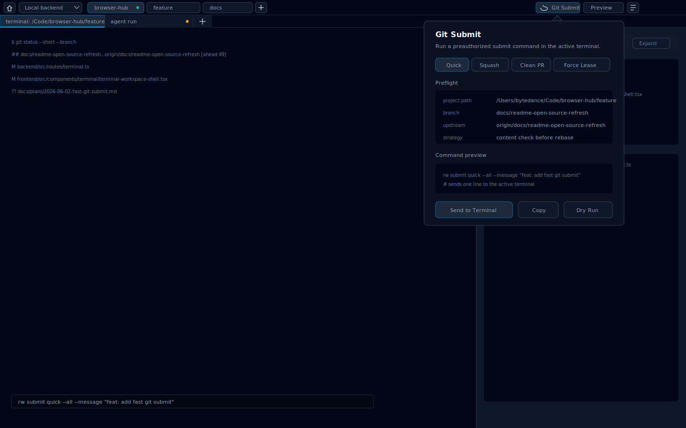

# Runweave 快速提交功能实施计划

> **给 agent 执行者：**本计划是 plan-only 产物。实现时优先做 CLI 能力，再把 UI 作为命令选择和投递入口接入现有 terminal，不要一上来新增后端直接执行 Git 的长任务调度系统。

**目标：**提供一个低确认、可预授权的快速提交流程，让用户在个人分支、远程 squash、clean PR、force-with-lease 等常见场景下用一个命令或一个 UI 入口尽快提交并推送代码。

**背景：**当前提交卡点主要来自两类问题：一是 agent 和仓库 hook 在每一步都要求确认；二是本地多 commit 与远程 squash 后的单 commit 内容等价时，普通 rebase 会制造“伪冲突”，agent 往往浪费时间解冲突。这个功能要把策略判断固化到工具里，让“内容等价时直接对齐远程历史”成为默认行为之一。

**计划级别：**Level 2 Implementation

**架构：**首期实现 `rw submit` CLI，负责 Git 状态预检、模式选择、提交、rebase/reset/push；同时定义 CLI 可用性探测和不可用提示契约，避免 UI 假设用户项目 terminal 的 `PATH` 一定有 `rw`。Runweave 前端在 terminal 顶栏增加一个紧凑的 Git Submit 入口，弹层里选择模式、查看 CLI 可用性状态，并把带可用性 guard 的单行命令发送到当前 terminal 执行。这样复用现有 terminal 输入链路，不新增高风险的后端 Git 执行 API。

**技术栈：**Node.js CLI、Git CLI、React + Vite、lucide-react、现有 terminal HTTP input API、Playwright E2E。

**非目标：**

- 不默认跳过远端或平台侧的 `quality:gate`。
- 不用裸 `git push --force`，只允许 `--force-with-lease`。
- 不在首期做跨仓库批量提交、自动解冲突或 AI 合并冲突。
- 不为前端 `src/` 新增 Vitest 单测；前端只做 E2E 或手工验证。
- 不直接在浏览器前端执行 Git，也不把任意 shell 执行能力暴露成通用后端 API。
- 不在首期依赖“用户项目 terminal 自然能找到 `rw`”这个隐式假设；必须有探测和不可用提示边界。

---

## 页面线框图



线框图基于当前 `TerminalWorkspaceShell` 的真实结构：第一行 32px 顶栏包含 Home、ConnectionSwitcher、project tabs、Preview 和 History；第二行 26px session tabs；主体区域是 terminal surface 和可选 preview sidecar。Git Submit 入口应放在第一行右侧工具区，位于 project tabs 之后、Preview 入口之前，避免挤压 session tabs。

## 需求整理

### 核心场景

1. **Quick Push**
   - 当前个人分支，本地有改动或本地提交，远程同名分支可能也有更新。
   - 默认入口负责自动判断普通 push、rebase push，以及远程 squash 后的内容等价对齐；用户不需要提前知道远程 commit 是否被合并过。
   - 内容等价对齐是 Quick Push 的内部策略，不作为独立用户模式暴露。

2. **Clean PR**
   - 当前分支历史很脏、ahead 很多、upstream 不可信，但用户只想把当前变更干净提交到目标分支。
   - 从 `origin/HEAD` 或指定 base 新建 `codex/<topic>` 分支，再 cherry-pick 或 apply 目标提交/patch。

3. **Force Lease**
   - 已有 PR/MR 分支需要改写历史，例如 rebase 到 base 后更新远程分支。
   - 只允许 `git push --force-with-lease`。

4. **Yolo All**
   - 用户显式选择“提交本地所有代码并推送”，表示授权 `git add -A` 覆盖 modified、deleted、renamed、untracked。
   - 仍然在冲突、认证失败、远程 lease 失败时停止。

### 成功标准

- 用户可以通过 `rw submit quick` 完成本地提交、远程同步和 push。
- 当用户项目 terminal 找不到 `rw` 时，UI 和 guarded command 只提醒用户 `rw` 不可用，不尝试替用户安装。
- 当本地与远程内容等价但 commit 历史不同，`rw submit quick` 自动识别远程 squash 场景；在工作区和 index 干净时不 rebase，直接把本地 reset 到远程 squash 后的历史。
- UI 能显示当前模式、将要执行的命令、关键预检状态，并能把命令发送到当前 terminal。
- UI 在 `rw` 不可用时不会发送裸 `rw submit ...` 导致 `command not found`，而是展示复制命令、不可用提示或发送带 guard 的命令。
- 命令输出机器可读 JSON 和人类可读 plain 两种格式。
- 失败时输出下一步最短修复路径，而不是继续猜测或要求多轮确认。

## CLI 可用性探测边界

### 当前约束

当前 `packages/runweave-cli/package.json` 是 private workspace 包，`bin.rw` 指向 `./dist/index.js`。Runweave terminal 的 cwd 是用户项目，不等于 Runweave monorepo；因此 UI 不能假设 workspace 内的 CLI 包或本地脚本天然可用。

首期边界是：如果用户 terminal 的 `PATH` 中没有 `rw`，Runweave 只负责提示不可用和保留复制命令，不负责自动安装、全局安装或修改用户 shell 配置。

### 第一阶段契约

- `command -v rw` 是 UI 和 guarded command 的最低成本可用性探测。
- `rw --version` 是可选的版本探测命令；JSON 探测使用 `rw version --json`。
- 文档必须说明：如果 `rw` 不在用户 shell 的 `PATH`，UI 一键提交不能直接运行，只提示用户让 `rw` 可用后重试。
- UI 生成的 terminal 命令首期必须带 guard，而不是裸发 `rw submit ...`：

```bash
command -v rw >/dev/null 2>&1 && rw submit quick --json || printf '%s\n' 'Runweave CLI not found. Make rw available in this terminal PATH, then retry.'
```

- 如果 UI 后续实现了主动探测，探测失败时禁用 `Send to Terminal`，保留 `Copy` 和不可用提示。

### 后续候选方案

1. **推荐后续方案：runtime 内置 launcher**
   - Electron/runtime 包内携带 `rw` launcher 或暴露一个绝对 launcher 路径。
   - UI 生成命令时优先使用该 launcher，避免依赖用户 shell `PATH`。
   - 仍然保留 `rw --version` 探测，确保 launcher 与当前 runtime 协议兼容。

2. **可选方案：用户级可用性说明**
   - 文档说明用户可以通过自己的环境管理方式让 `rw` 进入 PATH。
   - UI 只负责探测和提示，不负责安装。

3. **不推荐方案：后端 Git executor**
   - 不为了解决 `rw` 不在 PATH 的问题新增通用后端 Git 执行 API。
   - 该方案扩大执行权限面，也绕开了 CLI 的可测试边界。

## 命令设计

首期新增命令组：

```bash
rw submit <quick|clean-pr|force-lease|yolo> [options]
```

推荐快捷命令：

```bash
rw submit quick --json
rw submit quick --all --message "feat: update terminal submit flow"
rw submit clean-pr --base main --branch codex/fast-submit --message "feat: add fast submit"
rw submit force-lease --base main --json
rw submit yolo --all --push --message "chore: submit local work"
```

### Quick Push 策略

执行顺序：

```bash
git status --porcelain=v1 --branch
git add -A # 仅当传入 --all 或 UI 明确选择 Include all changes
git commit -m <message> # 仅当存在 staged/working changes
git fetch origin --prune
```

判断：

- 如果没有 upstream：`git push -u origin <current-branch>`。
- 如果本地与 `origin/<current-branch>` 内容等价，且 working tree 与 index 都干净：执行 content-equivalent sync，`reset --hard` 到 upstream，避免 rebase 伪冲突。
- 如果本地与 `origin/<current-branch>` 内容等价，但 working tree 或 index 不干净：停止，不 reset；提示用户先提交、stash，或显式选择 `--all` 让 Quick Push 先提交本地改动后重新判断。
- 如果远程是本地祖先：直接 `git push`。
- 如果本地是远程祖先：`git pull --rebase --autostash origin <current-branch>` 后 push。
- 如果两边分叉且内容不等价：进入 rebase；冲突时停止并列出冲突文件。

内容等价判断：

```bash
git diff --quiet
git diff --cached --quiet
git diff --quiet HEAD origin/<current-branch>
```

三个命令退出码都为 `0` 时，才说明 reset 路径安全：没有未提交 tracked working changes、没有 staged changes，且本地 `HEAD` 与 upstream 最终文件内容一致。此时执行：

```bash
git reset --hard origin/<current-branch>
```

Quick Push 进入 content-equivalent sync 时，输出要明确写出：

- `contentEquivalent: true`
- `action: "reset-to-upstream"`
- `reason: "local commits appear squashed remotely"`
- `workingTreeClean: true`
- `indexClean: true`

### Clean PR 策略

适合当前分支 ahead 很多或 upstream 不可信的场景。

行为：

```bash
git fetch origin --prune
git switch -c <branch> origin/<base>
git cherry-pick <commit...>
git push -u origin <branch>
```

首期不自动创建 PR；可以输出后续命令：

```bash
gh pr create --base <base> --head <branch>
```

如果要接入 PR 创建，作为第二阶段处理，避免把 GitHub、Codebase、MR 差异塞进首期。

### Force Lease 策略

行为：

```bash
git fetch origin --prune
git rebase origin/<base>
git push --force-with-lease origin <current-branch>
```

约束：

- 失败原因是 lease rejected 时必须停止，提示用户远程被别人更新。
- 不提供 `--force` 选项。

### Yolo All 策略

行为：

```bash
git add -A
git commit -m <message>
git fetch origin --prune
rw submit quick --push-only
```

约束：

- 只有用户显式选择 `yolo` 或传入 `--all --push` 才提交整个 worktree。
- 输出中列出纳入提交的文件数量和 untracked 数量。

## UI 呈现

### 入口位置

修改 `frontend/src/components/terminal/terminal-workspace-shell.tsx`：

- 在顶栏右侧、`TerminalPreviewMenu` 左侧增加一个 24px 高的图标按钮。
- 使用 lucide 图标，优先考虑 `GitBranch`、`UploadCloud` 或 `Rocket`。
- 按钮 aria-label：`Git Submit`。
- 移动端首期不显示该入口，避免小屏误触和弹层拥挤。

### 弹层结构

新增组件建议：

```text
frontend/src/components/terminal/terminal-submit-popover.tsx
```

弹层内容：

- 分段控制：`Quick`、`Clean PR`、`Force Lease`、`Yolo`。
- 状态区：CLI availability、当前 project path、active terminal cwd、branch、upstream、ahead/behind、worktree dirty、content-equivalent。
- 选项区：commit message、include all changes、base branch、new branch name。
- 命令预览：展示最终将发送到 terminal 的 guarded `rw submit ...` 命令。
- 操作按钮：
  - `Send to Terminal`：把命令发送到当前 terminal 并回车。
  - `Copy`：复制命令。
  - `Probe`：可选，把 `command -v rw && rw version --json` 发送到 terminal 做人工可见探测；首期不要求 UI 解析输出。

### UI 行为

- 如果没有 active terminal，禁用 `Send to Terminal`，只允许复制命令。
- 如果 active project 没有 `path`，显示不可用状态。
- 如果预检失败但仍可手动执行，保留 Copy，不允许一键发送。
- 如果 CLI availability 未知，命令预览必须包含 `command -v rw` guard；如果探测明确失败，禁用裸命令发送，只展示 Copy 和不可用提示。
- 发送命令时复用现有 `POST /api/terminal/session/:id/input`，不新增通用 shell executor。
- 命令注入格式使用单行命令加换行，避免多行 shell 片段误执行。

### 预检数据

首期推荐两档实现：

1. **低成本版本：**UI 不主动跑 Git 预检，只根据 `activeProject.path`、`activeSession.cwd` 和用户选择生成 guarded 命令。实际 Git 预检由 CLI 执行，CLI 可用性由 guard 在 terminal 中检查。
2. **增强版本：**新增只读 Git status API，返回 branch/upstream/ahead/behind/dirty/contentEquivalent，不执行写操作。

推荐首期采用低成本版本，避免扩大后端 API 和权限面。

## 文件结构

- 创建：`packages/runweave-cli/src/commands/submit.ts`
  - 负责：解析 `rw submit` 子命令、执行 Git 策略、输出 JSON/plain。
- 修改：`packages/runweave-cli/src/index.ts`
  - 负责：注册 `submit` 命令组。
- 创建：`packages/runweave-cli/src/commands/submit.test.ts`
  - 负责：用临时 Git repo 覆盖内容等价、rebase、force-with-lease 参数生成等核心行为。
- 创建：`packages/runweave-cli/src/git/submit-workflow.ts`
  - 负责：封装 Git 状态读取和策略决策，便于测试。
- 修改：`docs/deployment/overview.md` 或 `docs/testing/command-matrix.md`
  - 负责：记录 `rw` 可用性探测、不可用提示和 UI 降级边界。
- 创建：`frontend/src/components/terminal/terminal-submit-popover.tsx`
  - 负责：Git Submit 弹层 UI、命令生成、复制和发送。
- 修改：`frontend/src/components/terminal/terminal-workspace-shell.tsx`
  - 负责：在顶栏接入 Git Submit 入口，并传入 active project/session。
- 修改：`frontend/src/services/terminal.ts`
  - 负责：补充 `sendTerminalInput` 前端服务函数，复用已有后端 HTTP input API。
- 修改：`frontend/tests/terminal.spec.ts` 或新增 E2E 用例文件
  - 负责：验证弹层可打开、命令可生成、可发送到 terminal。
- 修改：`docs/testing/command-matrix.md`
  - 负责：记录 `rw submit` 的验证入口。

## 任务拆分

### 任务 1：实现 CLI 决策核心

**目标：**让 `rw submit` 能在不依赖 UI 的情况下完成核心提交流程。

**文件：**

- 创建：`packages/runweave-cli/src/git/submit-workflow.ts`
- 创建：`packages/runweave-cli/src/commands/submit.ts`
- 修改：`packages/runweave-cli/src/index.ts`
- 测试：`packages/runweave-cli/src/commands/submit.test.ts`

**实现要点：**

- 使用 `child_process.execFile` 调用 Git，避免拼接 shell 命令。
- 所有写操作前先 `git status --porcelain=v1 --branch` 和 `git fetch origin --prune`。
- `quick` 是唯一的日常同步入口；不新增 `squash-sync` 子命令。
- `git diff --quiet HEAD origin/<branch>` 为 0 时，只有在 `git diff --quiet` 和 `git diff --cached --quiet` 也通过时，才执行 reset-to-upstream。
- 如果内容等价但 working tree 或 index 不干净，返回失败并给出下一步：提交本地改动、stash，或用 `--all` 先提交后重试。
- 冲突时返回冲突文件列表和下一步命令，不自动解决。
- JSON 输出包含 `mode`、`branch`、`upstream`、`contentEquivalent`、`workingTreeClean`、`indexClean`、`actions`、`pushed`、`nextSteps`。

**验证：**

- 运行：`pnpm --filter @runweave/cli test -- submit.test.ts`
- 预期：覆盖本地 3 commit 与远程 1 squash commit 内容等价时，执行 reset 而不是 rebase。
- 预期：覆盖内容等价但 working tree 或 index 不干净时，`quick` 停止并输出 nextSteps，不执行 reset。
- 失败排查：优先检查临时 Git repo 的 remote/upstream 初始化和默认分支名。

### 任务 2：接入 CLI 命令组

**目标：**用户可以直接运行 `rw submit quick`。

**文件：**

- 修改：`packages/runweave-cli/src/index.ts`
- 修改：`packages/runweave-cli/package.json` 如需补充 bin 或测试脚本

**实现要点：**

- `rw submit` 无子命令时输出简短 usage。
- 默认模式可以映射到 `quick`，但 usage 里要明确说明。
- 错误码：参数错误为 2，Git 执行失败为 1，内容等价 reset 成功为 0。

**验证：**

- 运行：`pnpm --filter @runweave/cli build`
- 运行：`pnpm --filter @runweave/cli test`
- 预期：CLI 构建和现有测试通过。

### 任务 3：定义 CLI 可用性探测和不可用提示契约

**目标：**确保 UI 接入前，`rw submit` 在用户 terminal 中的可用性有明确探测和不可用提示边界。

**文件：**

- 修改：`docs/testing/command-matrix.md`
- 修改：`docs/deployment/overview.md` 如当前部署文档需要说明 runtime/CLI 关系

**实现要点：**

- 文档明确说明 Runweave terminal 的 cwd 是用户项目，UI 不能假设 workspace 内的 `packages/runweave-cli` 可直接执行。
- 文档列出 UI 探测失败时的降级口径：复制命令、不可用提示、guarded command，不新增后端 Git executor。
- 不要求 UI 或后端自动安装 `rw`，也不修改用户 PATH。

**验证：**

- 运行：`pnpm cli:build`
- 手工：在没有 `rw` 的 terminal 环境里触发 guarded command。
- 预期：输出 `Runweave CLI not found` 提示，不出现裸 `rw submit ...` 的 `command not found`。

### 任务 4：实现 UI 命令弹层

**目标：**在 terminal 顶栏提供可见但不打扰的 Git Submit 入口。

**文件：**

- 创建：`frontend/src/components/terminal/terminal-submit-popover.tsx`
- 修改：`frontend/src/components/terminal/terminal-workspace-shell.tsx`
- 修改：`frontend/src/services/terminal.ts`

**实现要点：**

- 弹层不要做成大卡片页面，保持 workbench 工具弹层密度。
- 使用图标按钮和 tooltip/title，避免在顶栏塞长文字。
- 模式选择使用 segmented control 或紧凑 tab。
- `Send to Terminal` 调用 `sendTerminalInput(apiBase, token, activeSession.terminalSessionId, { data: guardedCommand + "\n" })`。
- `guardedCommand` 必须先检查 `command -v rw`，失败时输出不可用提示，不发送裸 `rw submit ...`。
- 命令生成必须对 message、branch、base 做 shell-safe quoting。推荐在 CLI 侧支持 `--message-file` 或 JSON stdin；如果首期只用 `--message`，必须严格 quote。

**验证：**

- 运行：`pnpm --filter ./frontend typecheck`
- 运行：`pnpm --filter ./frontend e2e -- tests/terminal.spec.ts`
- 手工：打开 `/terminal/:id`，确认顶栏按钮不挤压 project/session tabs，弹层文本不溢出。

### 任务 5：补充 E2E 和文档

**目标：**保证 UI 可用，并把命令写进测试命令矩阵。

**文件：**

- 修改：`frontend/tests/terminal.spec.ts` 或创建 `frontend/tests/terminal-submit.spec.ts`
- 修改：`docs/testing/command-matrix.md`

**实现要点：**

- E2E 只验证 UI 行为和 input API 调用，不真实 push 远程。
- 可以拦截或使用测试 terminal，确认点击 `Send to Terminal` 后 terminal 收到包含 `command -v rw` 和 `rw submit quick ...` 的 guarded 文本。
- 增加 CLI 不可用场景：弹层展示不可用提示，命令不会退化成裸 `rw submit ...`。
- 文档列出 CLI 单测、前端 typecheck、E2E 验证命令。

**验证：**

- 运行：`pnpm --filter ./frontend e2e -- tests/terminal-submit.spec.ts`
- 运行：`pnpm typecheck`
- 预期：E2E 通过，typecheck 通过。

## 风险与边界

- `git reset --hard` 有数据丢失风险。Quick Push 只允许在内容等价、working tree 干净、index 干净这三个条件同时满足时执行；首期不在 reset 路径默认使用 autostash。
- `yolo --all` 会纳入 untracked 文件。UI 必须把 untracked 数量展示出来，CLI 输出也要列明。
- push hook 可能运行 `quality:gate`，这是正常提交链路，不应被误判为卡死。
- 当前分支 upstream 可能不是目标提交分支。Clean PR 模式必须优先解析 `origin/HEAD` 或用户指定 base。
- 远程分支不存在时，quick 只能 push 当前分支，不能做内容等价判断。

## 验收清单

- `rw submit quick` 在个人分支上可完成 commit + rebase/autostash + push。
- 文档明确说明 Runweave terminal 的 cwd 是用户项目；如果 `rw` 不在 PATH，UI 只提示不可用，不自动安装。
- 远程 squash、本地多 commit 且内容相同、working tree 与 index 都干净的 repo 中，`rw submit quick` 输出 `contentEquivalent: true`，并 reset 到 upstream。
- 远程 squash、本地内容相同但存在未提交改动的 repo 中，`rw submit quick` 不 reset，输出 `workingTreeClean: false` 或 `indexClean: false` 以及 nextSteps。
- `rw submit force-lease` 使用 `--force-with-lease`，代码中不存在裸 `--force` 路径。
- terminal 顶栏出现 Git Submit 图标按钮；桌面宽度下不遮挡 project tabs、preview 和 history 入口。
- 弹层中切换模式会更新命令预览。
- 点击 `Send to Terminal` 会把包含 `command -v rw` guard 和 `rw submit ...` 的单行命令发送到 active terminal。
- CLI 不可用时，terminal 输出明确不可用提示，UI 不发送裸 `rw submit ...`。
- 没有 active session 或 project path 时，发送按钮禁用。

## 建议提交方式

如果实现完成后需要提交本功能，建议使用本功能自身之外的普通流程先提交第一版：

```bash
pnpm --filter @runweave/cli test
pnpm --filter ./frontend typecheck
pnpm --filter ./frontend e2e -- tests/terminal-submit.spec.ts
git add packages/runweave-cli frontend/src/components/terminal frontend/src/services/terminal.ts frontend/tests docs/testing/command-matrix.md
git commit -m "feat: add fast git submit command"
git push -u origin <branch>
```
