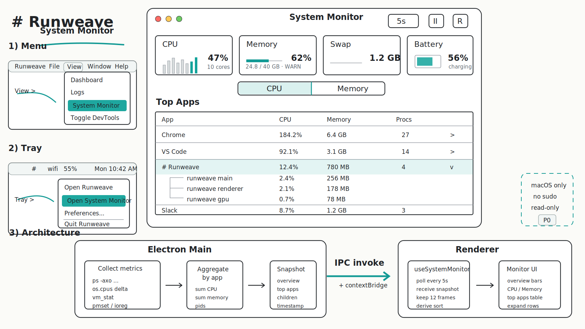

# Mac 系统资源监控（System Monitor）方案

> 状态：草案 / 仅设计，不动代码
> Owner：Runweave / Electron 端
> 日期：2026-06-06

## 1. 背景与目标

Runweave 用户经常同时开很多应用与本地服务，电脑会出现：

- 发热严重 / 风扇狂转
- 内存吃满，系统开始大量使用 swap
- CPU 长期高占，导致掉电飞快

但用户没有一个集中地方看「**到底是谁在吃 CPU、吃内存**」。本能力把这件事内化进 Runweave，作为本地诊断面板。

> 关于「能耗」：发热、掉电这类问题的根因 90%+ 由 CPU% 决定。在没有可信能耗源的前提下硬加 Energy 列只会误导用户。P0 **不做能耗维度**，详见 §1.4。

### 目标（P0）

只读看板。提供：

1. 系统总览：CPU 总占用、内存使用 / 压力、电池信息（电量、是否插电、放电速率）。
2. 进程 / 应用 Top N 列表（默认 N=20），按 CPU、内存两种维度可切。
3. 把同一个 App 的多个进程聚合成「按应用」粒度，并保留「按进程」粒度的展开。
4. 5–10 秒粒度的实时刷新（采样间隔可配置，前端只展示快照，不存历史）。

### 非目标（明确不做）

- 不做长时间历史数据库 / 趋势图（P0 只展示当前快照 + 短时滑动窗口）。
- 不做跨平台。Runweave 当前默认仅打包 mac，本能力只在 macOS 实现，Windows/Linux 直接展示空态。
- 不做 GPU、磁盘 IO、网络流量监控（P2 之后才考虑）。
- **不做能耗（Energy）维度**。下面 §1.4 单列说明。
- P0 不实现自动终止进程、不实现系统级自动操作。

### 1.4 为什么 P0 不做能耗

实测：`top -l 1 -stats pid,power` 不带 sudo 时 `power` 列大量返回 `0.00`（前几名经常全 0），无法稳定排序。可信能耗源只有两条：

- `sudo powermetrics`：提权体验差，砍掉。
- native module 调 `task_power_info` / IOKit：引入 `node-gyp` 与跨架构构建成本，对一个 P0 看板不划算。

实际能解决用户「发热 / 掉电快」诊断诉求的指标是 CPU%（高 CPU = 高发热 = 高耗电），P0 用 CPU% + 内存覆盖核心场景已经足够。

### 后续路线（P1 / P2，仅占位，本次不实现）

- P1：阈值规则（例如「单进程 CPU > 80% 持续 60s」「整机内存压力进入红区」）触发桌面通知 / Feishu / Coco。复用现有的 `feishu_notify.sh` 与 osascript 通知通道。
- P1（可选）：合成「Activity Score」列。基于 `top -stats pid,cpu,idlew` 的 `cpu + idlew * k`（社区逆向 Activity Monitor 公式），明确标注为合成值、非真实功耗。要做的时候再立项评估，不进 P0。
- P2：用户授权后的「Kill 进程 / Quit 应用」按钮。Quit 走 `osascript -e 'tell application "X" to quit'`，强杀走 `process.kill(pid)`，需 confirm dialog。
- P2+：录制最近 N 分钟的 CPU / 内存时间线（仍然只本地内存，不持久化）。
- P2+：真实能耗。要么 `powermetrics` + 一次性提权，要么 native module 调 `task_power_info`。届时单独立项。

## 2. 可行性评估

### 数据源（全部 macOS 自带，无需 sudo）

| 维度     | 数据源                                            | 备注                                                                                                                                                      |
| -------- | ------------------------------------------------- | --------------------------------------------------------------------------------------------------------------------------------------------------------- |
| 系统 CPU | `os.cpus()` Node API（**两帧 delta**）            | `times` 是自开机累计 jiffies，单点无意义；采样器维护 `previousCpuTimes`，第二帧起才输出 percent，第一帧 `cpu.totalPercent = null` 并标 `warmingUp = true` |
| 系统内存 | `os.totalmem()` / `os.freemem()` + `vm_stat`      | `vm_stat` 提供 wired / active / inactive / compressed / swap                                                                                              |
| 进程列表 | `ps -axo pid,ppid,pcpu,rss,user,comm,command`     | 通用 BSD 字段，全部用户态可读；`rss` 单位 KB；`pcpu` 已是衰减后瞬时值，无需 delta                                                                         |
| 应用归并 | `ps -o command` 中的 `.app/Contents/MacOS/...`    | 用 `.app` 路径作为 appKey；其它进程退化为按可执行名归并                                                                                                   |
| 电池     | `pmset -g batt` + `ioreg -r -n AppleSmartBattery` | 可读电量、是否充电、放电速率（mA）                                                                                                                        |
| 内存压力 | `memory_pressure` 命令                            | 输出 normal / warn / critical                                                                                                                             |

**关于系统 CPU 计算（避坑）：**

```
busy_t  = user_t + nice_t + sys_t + irq_t
idle_t  = idle_t
delta_busy = busy_2 - busy_1
delta_idle = idle_2 - idle_1
totalPercent = delta_busy / (delta_busy + delta_idle) * 100
```

每核分别算 delta 再聚合，避免某核 idle 占比稀释到整体。第一帧没有前序数据，UI 层直接显示骨架/`—` 即可。

**明确不用：**

- `top -stats power`：不带 sudo 大量返回 `0.00`，无法稳定排序，砍掉（详见 §1.4）。
- `powermetrics`：需要 sudo，提权体验差，砍掉。
- 私有 IOKit / task_info 调用：要 native module，超出本期范围。
- `osascript` 列举所有应用：拿不到资源数据，仅在「Quit 应用」时再用。

### 架构契合度

- 已有 `electron/src/runtime-monitor.ts` 采样 Electron 自身进程，**本期是它的横向扩展**：把采样源从 `app.getAppMetrics()` + 后端 `pidusage` 扩展到 `ps`。
- 已有 IPC 通道 `useElectronRuntimeStats`，可以照搬一份 `useSystemMonitor`。
- 已有桌面通知通道（`runweave-terminal-completion-notifications` 路径上的 osascript / Feishu），P1 阈值告警直接复用。

### 风险

| 风险                            | 缓解                                                                    |
| ------------------------------- | ----------------------------------------------------------------------- |
| `ps` 单帧 CPU 不稳              | 默认 5s 采样间隔，前端做 EWMA 平滑；内存直接显示瞬时值                  |
| `ps` 输出在大量进程时较大       | 主进程做一次解析 + 排序 + 截断 Top N，再 IPC 给渲染进程，避免大数据穿透 |
| 长时间运行采样累计内存          | 不存历史，每次采样覆盖；只保留最近 N 帧（默认 N=12，1 分钟滑窗）        |
| 用户在远程后端上跑 Runweave Web | 这是 **本机** 监控，必须 Electron。Web 端展示「需 Electron 客户端」空态 |

## 3. 架构

### IPC 模型：invoke + polling（与现有 runtime-monitor 对齐）

P0 复用 `useElectronRuntimeStats` 同款的 invoke + polling 模式（参考 `electron/src/main.ts:122` 的 `ipcMain.handle`、`electron/src/preload.ts:46` 的 `getRuntimeStats`、`frontend/src/features/use-electron-runtime-stats.ts:22` 的 `setTimeout` 轮询）：

- 主进程：`ipcMain.handle("system-monitor:get", () => buildSnapshot())`，每次调用现采样一帧。
- 主进程在模块作用域保留 `previousCpuTimes`，跨调用做两帧 delta（首次返回 `cpu.totalPercent = null` + `warmingUp = true`）。
- preload：`contextBridge.exposeInMainWorld("electronAPI", { getSystemMonitorSnapshot: () => ipcRenderer.invoke("system-monitor:get") })`。
- 渲染端：`useSystemMonitor` 抄 `useElectronRuntimeStats` 的轮询模板，默认 5s 一次；hook 卸载即停止，无需 push 取消订阅。

push 模型（`webContents.send`）留到 P1：阈值告警需要主进程脱离渲染端独立后台跑规则引擎，那时再加一条 `webContents.send("system-monitor:alert", ...)` 推告警事件。看板路径仍保留 invoke。

### 数据流

```
┌─────────────────────────────────────────────┐
│  Electron Main                              │
│                                             │
│  system-monitor.ts                          │
│   ├─ samplePsTop()    → 进程列表 + CPU/RSS  │
│   ├─ sampleSystemCpu()→ os.cpus() 两帧 delta│
│   ├─ sampleVmStat()   → 内存压力            │
│   ├─ samplePmset()    → 电池                │
│   ├─ aggregateByApp() → 按 .app 聚合        │
│   └─ buildSnapshot()  → SystemMonitorSnapshot
│           ▲                                 │
│           │ ipcMain.handle("system-monitor:get")
└───────────┼─────────────────────────────────┘
            │ contextBridge: getSystemMonitorSnapshot()
            ▼
┌─────────────────────────────────────────────┐
│  Renderer                                   │
│                                             │
│  useSystemMonitor() hook                    │
│   ├─ setTimeout poll loop (5s)              │
│   ├─ keep last 12 frames (in-memory)        │
│   └─ derive sorted views                    │
│                                             │
│  pages/system-monitor-page.tsx              │
│   ├─ <OverviewBar />                        │
│   ├─ <ProcessTable mode="cpu|mem"/>         │
│   └─ <BatteryCard />                        │
└─────────────────────────────────────────────┘
```

### 文件落点（占位，本期不写代码）

```
electron/src/
  system-monitor.ts            # 采样 + 聚合（纯函数 + 子进程 + previousCpuTimes 模块状态）
  system-monitor.test.ts       # 解析单测（ps / vm_stat / pmset 样本固件）
  main.ts                      # 注册 ipcMain.handle("system-monitor:get", ...)
  preload.ts                   # 暴露 getSystemMonitorSnapshot()

packages/shared/src/
  system-monitor.ts            # SystemMonitorSnapshot 类型 + 常量

frontend/src/features/system-monitor/
  use-system-monitor.ts
  format.ts                    # 字节/百分比格式化
  process-table.tsx
  overview-bar.tsx
  battery-card.tsx

frontend/src/pages/
  system-monitor-page.tsx      # 路由 /system-monitor

docs/plans/
  2026-06-06-mac-system-monitor.md  # 本文件
```

> 注：Runweave AGENTS.md 禁止前端 Vitest，前端只有 Playwright E2E；Electron 端可保留 `*.test.ts`。

## 4. 数据模型（packages/shared）

```ts
export interface SystemMonitorProcess {
  pid: number;
  ppid: number;
  command: string; // 可执行名，已截断
  cpuPercent: number; // 单核为单位（macOS 风格，可 > 100）
  memoryMb: number; // RSS
  appKey: string; // 归并键：.app 路径或 command
  appName: string; // 显示名
}

export interface SystemMonitorAppGroup {
  appKey: string;
  appName: string;
  processCount: number;
  cpuPercent: number;
  memoryMb: number;
  pids: number[]; // 详情展开用
}

export interface SystemMonitorSnapshot {
  sampledAt: number;
  platform: "darwin" | "other";
  cpu: {
    totalPercent: number | null; // 第一帧 null（warming up），之后是两帧 delta
    coreCount: number;
    warmingUp: boolean;
  };
  memory: {
    totalMb: number;
    usedMb: number;
    pressure: "normal" | "warn" | "critical" | "unknown";
    swapUsedMb: number;
  };
  battery:
    | { available: false }
    | {
        available: true;
        percent: number;
        charging: boolean;
        timeRemainingMin: number | null;
        dischargeRateMa: number | null;
      };
  apps: SystemMonitorAppGroup[]; // 已按当前 sortKey 排序，前端可重排
  processes: SystemMonitorProcess[]; // Top N（默认 50），用于详情展开
}
```

## 5. UI 草图

> 草图：用于对齐 System Monitor 的入口、主页面信息密度与 Electron Main → Renderer 数据流。



### 5.1 入口

```
应用菜单：
  Runweave  File  Edit  View ▾  Window  Help
                       │
                       └─ Reload
                          Toggle Full Screen
                          ─────────────
                          System Monitor          ⌘⇧M   ← 新增
                          Connections             ⌘⇧C

托盘菜单：
  ☰ Runweave
   ├─ Open Main Window
   ├─ Open System Monitor          ← 新增
   ├─ Connections...
   └─ Quit
```

### 5.2 主页面 `/system-monitor`

```
┌───────────────────────────────────────────────────────────────────────────────┐
│  System Monitor                                       [ ⟳ 5s ▾ ]   [ ⏸ ]      │
├───────────────────────────────────────────────────────────────────────────────┤
│                                                                               │
│  ┌── Overview ──────────────────────────────────────────────────────────────┐ │
│  │  CPU            ▓▓▓▓▓▓▓▓▓▓░░░░░░░░░░  47%   (10 cores)                   │ │
│  │  Memory         ▓▓▓▓▓▓▓▓▓▓▓▓▓░░░░░░░  62%   24.8 / 40 GB · pressure WARN │ │
│  │  Swap                              1.2 GB                                │ │
│  │  Battery        ▓▓▓▓▓▓▓▓▓▓▓░░░░░░░░░  56%   ⚡ charging · -1230 mA       │ │
│  └──────────────────────────────────────────────────────────────────────────┘ │
│                                                                               │
│  Top Apps           Sort:  ( CPU )  [ Memory ]                                 │
│  ┌──────────────────────────────────────────────────────────────────────────┐ │
│  │   App                       CPU%     Memory             Procs            │ │
│  │ ─────────────────────────────────────────────────────────────────────── │ │
│  │ ▸ Google Chrome             184.2%   6.4 GB              27   ⋯         │ │
│  │ ▸ Code (VS Code)             92.1%   3.1 GB              14   ⋯         │ │
│  │ ▸ Runweave (this)            12.4%   780 MB               4   ★         │ │
│  │ ▸ Slack                       8.7%   1.2 GB               3   ⋯         │ │
│  │ ▸ ...                                                                   │ │
│  │ ──────────────────────────── show 20 / 50 / all ─────────────────────── │ │
│  └──────────────────────────────────────────────────────────────────────────┘ │
│                                                                               │
│  Last sample: 19:42:06   ·   ⓘ Data source: ps + vm_stat + pmset (no sudo)   │
└───────────────────────────────────────────────────────────────────────────────┘
```

字段说明：

- `⟳ 5s ▾`：采样间隔下拉（2s / 5s / 10s / 30s），默认 5s。
- `⏸`：暂停采样（页面驻留但不刷）。
- `★`：当前 Runweave 自身。
- `⋯`：行尾右键 / 点击展开进程列表。

### 5.3 App 展开：进程详情

```
│ ▾ Google Chrome             184.2%   6.4 GB              27           │
│   ┌──────────────────────────────────────────────────────────────────┐ │
│   │ PID    Process                       CPU%    Memory              │ │
│   │ ─────────────────────────────────────────────────────────────── │ │
│   │ 8123   Google Chrome Helper (GPU)    62.1%   1.1 GB              │ │
│   │ 8190   Google Chrome Helper (Render) 48.3%   980 MB              │ │
│   │ 8201   Google Chrome Helper (Render) 33.2%   720 MB              │ │
│   │ 8042   Google Chrome (main)           7.8%   210 MB              │ │
│   │ ...                                                              │ │
│   └──────────────────────────────────────────────────────────────────┘ │
```

### 5.4 空态：非 macOS / 非 Electron

```
┌───────────────────────────────────────────────────────────────────────────────┐
│  System Monitor                                                               │
├───────────────────────────────────────────────────────────────────────────────┤
│                            ┌──────────────────────────┐                       │
│                            │      Mac only · Beta      │                      │
│                            └──────────────────────────┘                       │
│   System Monitor 目前仅支持 macOS Electron 客户端。                           │
│   - 在浏览器里访问到这个页面 → 提示需在客户端打开                              │
│   - 在非 macOS 客户端 → 提示数据源不可用                                      │
└───────────────────────────────────────────────────────────────────────────────┘
```

### 5.5 P1 阈值（仅占位，本期不做）

```
┌── Alerts (P1) ──────────────────────────────────────────────────────────────┐
│  ✚ Add rule                                                                 │
│                                                                             │
│  ◉  CPU of any app  >  80%   for  60s   →  desktop notify                   │
│  ◉  Memory pressure  ≥  warn          →  desktop notify + Feishu            │
│  ◯  Battery discharge rate  >  3000 mA  →  desktop notify                   │
└─────────────────────────────────────────────────────────────────────────────┘
```

### 5.6 采样生命周期

P0 走 invoke + polling，没有「主进程后台采样器」需要状态机。生命周期完全跟着 React hook：

```
page mounted
  → useSystemMonitor() useEffect 启动 setTimeout 轮询
  → 每 5s invoke("system-monitor:get") 一次
  → 主进程现采样并返回（previousCpuTimes 跨调用保留以做 CPU delta）
page unmounted
  → useEffect cleanup 取消 setTimeout
  → 主进程零开销（下次再有渲染端 invoke 才采样）
⏸ pause
  → hook 内部停掉 setTimeout，但保留最后一帧用于展示
▶ resume
  → 重新启动 setTimeout 立即拉一帧
```

P1 阈值告警需要主进程脱离渲染端独立后台跑规则引擎，那时再补一个 `setInterval` 常驻采样器 + `webContents.send("system-monitor:alert", ...)` 推告警，不影响 P0 看板的 invoke 路径。

## 6. 阶段拆分

| 阶段 | 范围                                                                                                         | 验证                                                            |
| ---- | ------------------------------------------------------------------------------------------------------------ | --------------------------------------------------------------- |
| P0a  | Electron `system-monitor.ts` + 解析单测（`ps` / `vm_stat` / `pmset` 样本固件）                               | `pnpm --filter electron test`                                   |
| P0b  | `ipcMain.handle("system-monitor:get")` + preload `getSystemMonitorSnapshot()` + `useSystemMonitor` 轮询 hook | 手动启动 `pnpm dev:electron`，DevTools 看每 5s 一次 invoke 返回 |
| P0c  | 页面 + 路由 + 菜单入口                                                                                       | 在本地真实环境观察一个高负载场景（开 Chrome + 多个 Electron）   |
| P0d  | Playwright E2E：能打开页面、能切排序、能展开应用                                                             | `pnpm test:e2e -- system-monitor`                               |
| P1   | 阈值规则 + 桌面/Feishu 通知（复用现有通道）；此时主进程加常驻 `setInterval` 采样 + `webContents.send` 推告警 | 跑 `stress` 工具触发                                            |
| P2   | Quit / Kill 操作（带 confirm dialog 与权限校验）                                                             | 手动 + Playwright                                               |

## 7. 验证方式（Goal-Driven）

P0 完成的判定：

1. 在打开 Chrome、VSCode、若干本地服务的真实环境下，进入 System Monitor。
2. 切到「内存」排序，前几名内存量级与 Activity Monitor 内存页量级一致。
3. 切到「CPU」排序，高 CPU 进程能稳定出现在前几名（采样窗口内），与 Activity Monitor CPU 页定性一致。
4. 关闭一个高占用应用后，下一帧（≤10s 内）该应用从列表消失。
5. 拔掉电源 / 插上电源，电池卡片状态在下一帧切换。
6. 离开页面后，主进程不应再有采样工作：因为 P0 是 invoke + polling，hook 卸载即停止轮询，主进程下次 invoke 才会再算 — 用 Activity Monitor 看 Runweave Helper 的 CPU 应回落到基线。

## 8. 决策点（需要在动手前对齐）

下面三个点先列出来，等用户确认再开工：

1. **入口位置**：主菜单 + 托盘 + 主窗口侧栏，三选一 / 全选？默认建议三处都加（成本极低）。
2. **采样间隔默认值**：5s / 10s。建议默认 5s，可在设置里调到 2s/10s/30s。
3. **是否把当前 Runweave 自身的 Electron 进程在列表里高亮**：建议高亮（避免用户误以为别人在偷资源）。

## 9. 与现有 runtime-monitor 的关系

- `runtime-monitor.ts`：Runweave 自身的健康。继续存在，不动。
- `system-monitor.ts`：本机系统全景。新增。
- 两者**不合并**。前者跟产品问题诊断绑定（"Runweave 自己有没有跑飞"），后者是用户工具。
