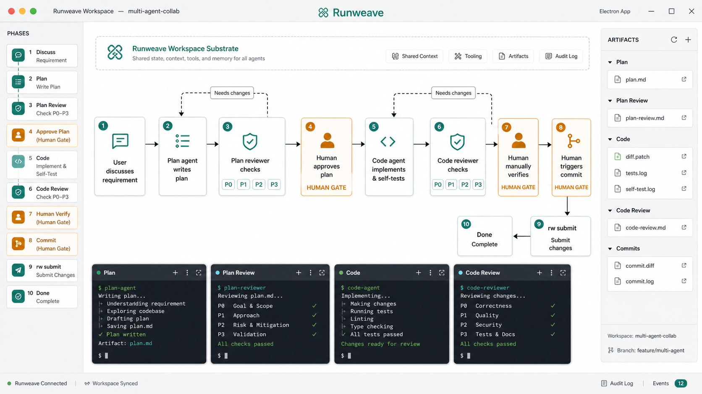
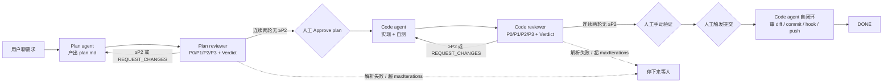
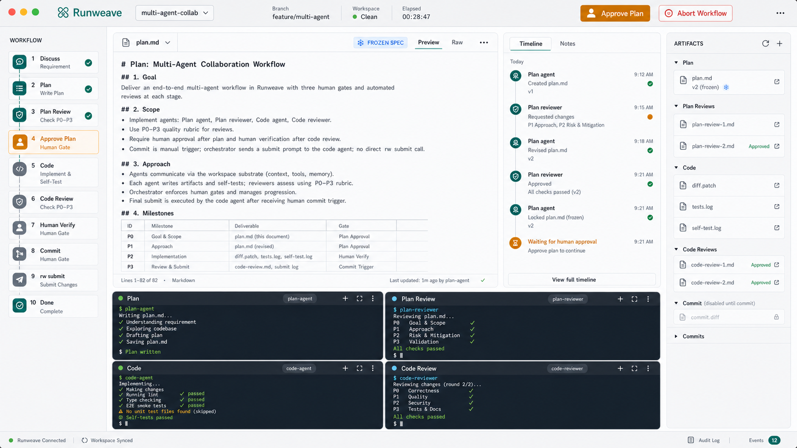
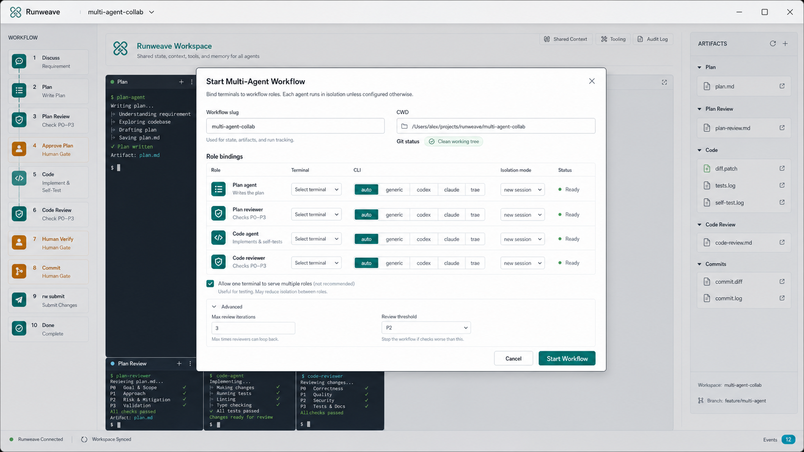
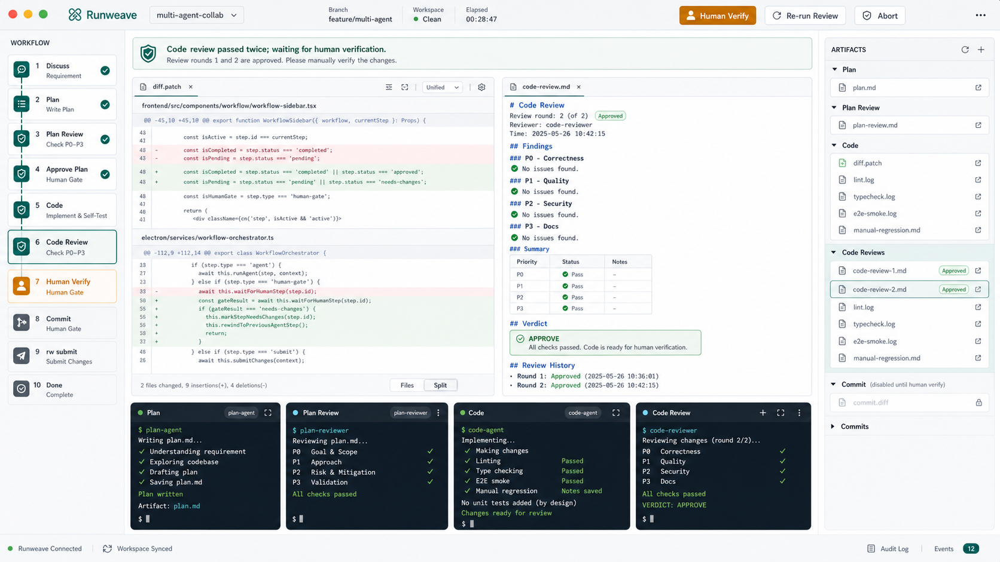

# 多 Agent 协作工作流 Plan

> 状态：draft / 脑暴定稿待评审
> 范围：Runweave Electron 桌面客户端
> 约束：单工作流串行、禁止并行；agent 既可同 CLI 多开也可异构（codex / claude / trae 混搭）

## 0. 背景与目标

用户希望在 Runweave 内驱动一条"多终端 / 多 panel"的 agent 协作流水线，每个 agent 仅是角色代名词（plan / plan-reviewer / code / code-reviewer），目的是**通过隔离上下文获得稳定结果**，而不是依赖单模型自身能力。

整条流水线的形状：

```
和用户聊 → Plan agent 写 plan
        → Plan reviewer 评审（仅处理 ≥P2 问题）→ 回喂 Plan agent，迭代
        → 人工 Approve plan
        → Code agent 实现
        → Code reviewer 评审（仅处理 ≥P2 问题）→ 回喂 Code agent，迭代
        → 人工手动验证
        → 人工触发提交：orchestrator 把"审 diff / 写 commit message / 跑 hook / push"作为 prompt 发回 Code agent，由它在自己的终端里完成，再回报结果
```

设计原则：

1. **角色 ≠ 模型**：同一 CLI 多开 session 也算"多 agent"；不同 CLI 混搭也支持。
2. **上下文隔离是第一公民**：每个角色拿到的是一个干净 session。
3. **强 schema 守门**：reviewer 必须输出 `[P0]/[P1]/[P2]/[P3]` 标签 + Verdict，否则停下来等人。
4. **人工卡口不可省**：Plan Approved / Human Verify / Commit 三处必须人工点确认。
5. **失控有兜底**：每 phase 有 `maxIterations`，异常即停，工件随时可回滚。
6. **第一版只用 generic adapter**：CLI 异构是次要工程量，真正的稳定性瓶颈在"完成事件 + 末段抽取 + reviewer 解析"。codex / claude 专属 adapter 推到后期、且为可选项。
7. **提交阶段不绑死 `rw submit`**：orchestrator 只发 prompt，由 code agent 在自己的终端里完成 diff 审阅 / commit message / hook / push，并回报结果。这才符合"人只做关键判断、agent 闭环"的设计哲学。

## 0.0 第一版成功标准（明确边界）

第一版成功 = 满足以下全部：

- 在 **plan-review、code-review 两段循环内部**能稳定自动接力，包含解析失败 fallback、`maxIterations` 兜底；
- **三处人工卡口**（Plan Approved / Human Verify / Commit Trigger）由人按下，orchestrator 永不自动越过；
- 工件全程**可见、可中止、可回滚**：plan.md / 各轮 review / diff / snapshot 全部落盘并能从 UI 打开；
- 提交阶段由 orchestrator 发 prompt 给 code agent 完成，**不直接调 `rw submit`**；
- 整条链路（Plan → Plan Review → Approve → Code → Code Review → Verify → Commit → DONE）能跑完一次真实小需求。

第一版**不要求**：

- 全自动（人工卡口存在即合理）；
- codex / claude 专属 adapter 精修；
- worktree 隔离（Slice 1 用 `git status` 必须干净 + 单工作区即可）。

## 0.1 视觉草图

Image2 早期概念图：



产品草图要表达的不是"多模型炫技"，而是：**Runweave 是包住整个协作现场的 Workspace Substrate**；左侧给人看 phase，中心跑工作流，底部是四个隔离 agent 终端，右侧沉淀工件。

工作流主线草图：



桌面端信息架构草图（对应 Image2）：

```text
┌────────────────────────────────────── Runweave Electron ───────────────────────────────────────┐
│ PHASES              │ Workspace Substrate                                       │ ARTIFACTS    │
│                     │ Shared context / tooling / artifacts / audit log          │              │
│ 1 Discuss           │                                                           │ Plan         │
│ 2 Plan              │  ┌────────┐   ┌────────┐   ┌────────┐   ┌─────────────┐   │ - plan.md    │
│ 3 Plan Review       │  │ User   │ → │ Plan   │ → │ Plan   │ → │ Human Gate  │   │              │
│ 4 Approve Plan ★    │  │ input  │   │ agent  │   │ review │   │ Approve     │   │ Plan Review  │
│ 5 Code              │  └────────┘   └────────┘   └────────┘   └─────────────┘   │ - 01.md      │
│ 6 Code Review       │                     ↑ needs changes                       │ - 02.md      │
│ 7 Human Verify ★    │                                                           │              │
│ 8 Commit ★          │  ┌────────┐   ┌────────┐   ┌─────────────┐   ┌────────┐   │ Code         │
│ 9 Submit            │  │ Code   │ → │ Code   │ → │ Human Gate  │ → │ Commit │   │ - diff.patch │
│ 10 Done             │  │ agent  │   │ review │   │ Verify      │   │ prompt │   │ - self-test  │
│                     │  └────────┘   └────────┘   └─────────────┘   └────────┘   │              │
│                     │       ↑ needs changes                         ↓          │ Code Review  │
│                     │                                      ┌──────────────┐     │ - 01.md      │
│                     │                                      │ DONE         │     │              │
│                     │                                      └──────────────┘     │ Commit       │
│                     │                                                           │ - commit.log │
├─────────────────────┴───────────────────────────────────────────────────────────┴──────────────┤
│ Terminal panels: [Plan] [Plan Review] [Code] [Code Review]                                      │
│ 每个 panel 是一个隔离 agent session；orchestrator 只负责发 prompt、等完成事件、解析 review、落工件。 │
└────────────────────────────────────────────────────────────────────────────────────────────────┘
```

UI 状态重点：

1. 左侧 `PHASES` 是用户判断当前进度的主入口，三个人工卡口用高亮态标识：`Approve Plan` / `Human Verify` / `Commit`。
2. 中心 canvas 只展示串行主线和两条 `needs changes` 回路，不展示多工作流列表，因为第一版禁止并行。
3. 底部四个 terminal panel 是多 agent 的真实载体，角色 badge 只标识职责，不绑定某个具体模型。
4. 右侧 `ARTIFACTS` 是可追溯性入口，按 plan / plan review / code / code review / commit 分组，而不是按 agent 分组。

## 0.2 高保真界面稿

上面的概念图偏流程表达，高保真稿按"真实产品长出来"拆成三张：主工作台、启动绑定弹窗、Review + 人工验证状态。

实现口径修正：Image2 生成图里若出现 `rw submit` 字样，只作为"提交阶段"占位。最终 UI 文案使用 `Submit` / `Commit Prompt`，语义是**人工触发后给 code agent 发送提交 prompt**，不是 orchestrator 直接执行 `rw submit`。

### 0.2.1 主工作台



主工作台应该避免把中心区域做成大流程图。更合理的信息层级是：

- 左侧 `Workflow` 侧栏承载 phase 和人工卡口状态；
- 中心上半区承载当前工件，例如 `plan.md` / `spec.md` / `diff.patch` / `code-review.md`；
- 中心右侧或次级面板展示 timeline，记录每轮 agent 输出和 reviewer 结论；
- 底部保留四个 terminal panel，作为真实 agent session 的载体；
- 右侧 `Artifacts` 抽屉按工件类型分组，保证随时可追溯。

### 0.2.2 启动与角色绑定



启动弹窗需要一次性解决"谁来扮演哪个角色"：

- 每个角色绑定一个 terminal，可选择复用已有终端或新建终端；
- CLI 选择保留 `auto / generic / codex / claude / trae`，但第一版默认 `generic`；
- 隔离策略默认 `new session`，同终端兼任多角色时也必须先 bootstrap 干净 session；
- `maxReviewIterations`、review 阈值默认收起，避免第一屏配置过重。

### 0.2.3 Code Review 与人工验证



Review 阶段的重点不是继续画流程，而是把"能不能进入人工验证"讲清楚：

- 顶部状态 banner 明确当前 phase、连续通过次数、下一步动作；
- 中心展示 `diff.patch` + `code-review.md`，让人能直接判断 reviewer 是否可信；
- `P0/P1/P2/P3` findings 和 `Verdict` 必须结构化展示；
- `Human Verify` 是主按钮，`Re-run Review` / `Abort` 是次级动作；
- commit 相关工件在人工验证前保持 disabled 或 pending，不暗示系统会自动提交。

## 1. 复用现有基建

| 能力                                  | 位置                                                                      | 用途                                                                                       |
| ------------------------------------- | ------------------------------------------------------------------------- | ------------------------------------------------------------------------------------------ |
| 多 PTY 终端面板                       | `frontend/src/components/terminal/terminal-workspace.tsx`                 | 多 agent 并存载体                                                                          |
| TerminalCompletionEvent + hook bridge | `browser-viewer-hook-bridge` + `packages/shared/src/terminal-protocol.ts` | 探测"agent 这一轮跑完了"                                                                   |
| `sendTerminalInput`                   | 后端 PTY 写入                                                             | 自动把新 prompt 回喂给某个终端                                                             |
| `rw` CLI                              | `packages/runweave-cli`                                                   | 暴露 `rw workflow *` 子命令                                                                |
| `rw submit` 流                        | 现有提交流                                                                | **不直接调用**；提交阶段由 orchestrator 发 prompt 给 code agent，复用 agent 自身的终端能力 |

新增不超过：1 个 orchestrator 服务、1 个 adapter 抽象、1 个 UI 侧栏 + 抽屉、1 组 `rw workflow` 子命令、1 个工件目录约定。

## 2. AgentAdapter 抽象（关键基建）

新文件：`packages/shared/src/agent-adapter.ts`

```ts
export type AgentRole = "plan" | "plan-review" | "code" | "code-review";
export type AgentCli = "codex" | "claude" | "trae" | "generic";

export interface AgentAdapter {
  id: AgentCli;
  bootstrap(
    terminalId: string,
    opts: { cwd: string; role: AgentRole },
  ): Promise<void>;
  sendPrompt(terminalId: string, prompt: string): Promise<void>;
  isTurnComplete(evt: TerminalCompletionEvent): boolean;
  extractLastResponse(scrollback: string): string;
}
```

三档"上下文隔离"由 adapter 内部决定，对外透明：

- `same-cli-new-session`：`codex --new-session` / `claude /clear` / `trae new-session`
- `same-cli-new-cwd`：依赖 `git worktree`，每个角色一个工作目录
- `cross-cli`：plan 用 claude、code 用 codex 这种混搭

**第一版只实现 `generic` adapter**：纯文本注入 + 完成事件触发 + 保守的末段抽取（按 prompt 重出现行切片）。codex / claude 专属精修推到 Slice 4 且明确标注"可选"。原因：CLI 启动差异是相对简单的工程问题，真正的稳定性瓶颈在 **completion event 时序、scrollback 末段切片、reviewer 输出解析** 这三件事，先用 generic 把这三件事跑稳。

## 3. Orchestrator 状态机

新文件：`electron/services/workflow-orchestrator.ts`
持久化：`.runweave/workflows/current/STATE.json`（重启 Electron 不丢上下文）

```
IDLE
  └─ start ─▶ PLANNING ─┐
                        ▼
                   PLAN_REVIEW ◀──┐
                        │         │
                  无 P2+│         │ 有 P2+ → 回 PLANNING
                        ▼
                  PLAN_APPROVED (人工卡口)
                        ▼
                     CODING ─┐
                             ▼
                       CODE_REVIEW ◀──┐
                             │        │
                       无 P2+│        │ 有 P2+ → 回 CODING
                             ▼
                        HUMAN_VERIFY (人工卡口)
                             ▼
                    COMMIT_TRIGGER (人工卡口)
                             ▼
                    SUBMITTING (Code agent 自闭环：审 diff / commit / hook / push)
                             ▼
                           DONE
```

- 全局单例：`start` 时若已有 `ActiveWorkflow` 直接抛错；UI 上 Start 按钮 disabled。
- 任意状态可 `abort` → 归档至 `.runweave/workflows/history/<ts>-<slug>/`。
- `COMMIT_TRIGGER` 永远人工触发，不自动。
- `SUBMITTING`：orchestrator **不调用 `rw submit`**，而是发结构化 prompt 给当前 code agent 终端（"请审阅 `git diff`、生成符合仓库 commit 规范的 message、执行提交并处理 husky / hook 失败、push 到当前分支、最后用 JSON 报告 branch / commit hash / push status"），完成事件回来后 orchestrator 把回报内容写入工件并进入 DONE。

## 3.5 驱动循环（一次 run 的事件序列）

> **核心：整套系统只有一个驱动者** —— `workflow-orchestrator.ts` 跑在 Electron 主进程，订阅 `TerminalCompletionEvent` 流，每来一个事件就查"当前 phase + 触发终端的角色 = 下一步动作"，执行后写工件 + 切 phase。
>
> **人只在 3~4 处按按钮：Start / Approve plan / Verified / Trigger commit**。其它所有 reviewer↔producer 的循环全部由事件驱动自动接力。
>
> 这一节回答"它到底怎么跑起来"——不是逐步点按钮，而是 **event-driven**。

### 驱动模型一句话

```
TerminalCompletionEvent 入 → orchestrator 查 (phase, role) 路由表 → 执行动作 →
  (写工件 / 切 phase / sendTerminalInput 回喂下一个 agent / 等人工卡口)
```

### 一次完整 run 的事件序列（T0 ~ T8）

| 步                        | 触发源                                             | orchestrator 动作                                                                                                                                                                                                     | 人是否需要操作                                 |
| ------------------------- | -------------------------------------------------- | --------------------------------------------------------------------------------------------------------------------------------------------------------------------------------------------------------------------- | ---------------------------------------------- |
| **T0 Start**              | 人按 UI Start                                      | 写 STATE phase=PLANNING；`adapter.bootstrap(planTerm)`；拼 plan prompt（用户需求 + "结尾输出 `===PLAN_END===`"）→ `sendTerminalInput(planTerm)`                                                                       | ✅ 按 Start + 选角色绑定                       |
| **T1 Plan agent 跑完**    | `TerminalCompletionEvent`（来自 plan 终端）        | ① `extractLastResponse` → 写 `plan.md`；② phase=PLAN_REVIEW；③ 拼 reviewer prompt（plan.md 全文 + 强 schema 模板）→ `sendTerminalInput(reviewTerm)`                                                                   | ❌ 自动                                        |
| **T2 Plan reviewer 跑完** | `TerminalCompletionEvent`（来自 review 终端）      | ① 抽 → 写 `plan-reviews/01.md`；② 解析 `[P\d]` + Verdict；③ 命中 ≥P2 / REQUEST_CHANGES → 拼"修这些问题"prompt 回喂 plan 终端、phase 回 PLANNING、iter+=1；④ 全 P3 + APPROVE → phase=PLAN_APPROVED，UI 弹 Approve 按钮 | ❌ 自动（含 T1↔T2 循环）                       |
| **T3 Approve plan**       | 人按 Approve                                       | 冻结 `spec.md`；phase=CODING；拼 code prompt（spec.md + "结尾输出 `===CODE_END===` + 改动清单"）→ `sendTerminalInput(codeTerm)`                                                                                       | ✅ 第二个人工卡口                              |
| **T4 Code agent 跑完**    | `TerminalCompletionEvent`（来自 code 终端）        | ① 抽 → 写 `diff/`；② phase=CODE_REVIEW；③ 拼 reviewer prompt → `sendTerminalInput(codeReviewTerm)`                                                                                                                    | ❌ 自动                                        |
| **T5 Code reviewer 跑完** | `TerminalCompletionEvent`（来自 code-review 终端） | 同 T2 路由表，循环 T4↔T5 直到连续两轮无 ≥P2 → phase=HUMAN_VERIFY                                                                                                                                                      | ❌ 自动                                        |
| **T6 Verify**             | 人按 Verified                                      | phase=COMMIT_TRIGGER，UI 显示 "Trigger commit" 按钮                                                                                                                                                                   | ✅ 第三个人工卡口（手工跑应用 / 看效果后打勾） |
| **T7 Trigger commit**     | 人按 Trigger commit                                | 拼 submit prompt → `sendTerminalInput(codeTerm)`                                                                                                                                                                      | ✅ 可与 T6 合并为 "Verify & Submit"            |
| **T8 Code agent 提交完**  | `TerminalCompletionEvent`（来自 code 终端）        | 抽回报 JSON → 写工件 → phase=DONE → 归档至 `history/<ts>-<slug>/`，UI 弹完成                                                                                                                                          | ❌ 自动                                        |

### orchestrator 内部路由表（伪代码）

```ts
// electron/services/workflow-orchestrator.ts
hookBridge.on("TerminalCompletionEvent", async (evt) => {
  if (!activeWorkflow) return;
  const role = activeWorkflow.roleOfTerminal(evt.terminalId);
  const phase = activeWorkflow.phase;

  switch (`${phase}::${role}`) {
    case "PLANNING::plan":
      return onPlanDone(evt);
    case "PLAN_REVIEW::plan-review":
      return onPlanReviewDone(evt);
    case "CODING::code":
      return onCodeDone(evt);
    case "CODE_REVIEW::code-review":
      return onCodeReviewDone(evt);
    case "SUBMITTING::code":
      return onSubmitDone(evt);
    default:
      // 不匹配的事件 → 忽略（人在终端里手动跑别的命令也不会触发误动作）
      return;
  }
});
```

每个 `onXxxDone` 的形状一致：

```ts
async function onPlanReviewDone(evt) {
  const text = adapter.extractLastResponse(await getScrollback(evt.terminalId));
  await writeArtifact(`plan-reviews/${nextIdx()}.md`, text);
  const findings = parseFindings(text); // [P\d] + Verdict
  if (findings.unparseable) return softRetry(); // 1 次软提示，再失败停
  if (findings.hasP2OrAbove || findings.verdict === "REQUEST_CHANGES") {
    if (iter >= maxReviewIterations) return stopForHuman("reviewer 满轮");
    setPhase("PLANNING");
    iter++;
    return adapter.sendPrompt(planTerm, buildFixPrompt(findings));
  }
  if (consecutiveCleanRounds >= 2) {
    setPhase("PLAN_APPROVED"); // 等人按 Approve
    return ui.requestApproval("plan");
  }
  // 单轮通过但还没满两轮 → 再发一次 review 请求
  return adapter.sendPrompt(reviewTerm, buildReReviewPrompt());
}
```

**关键点：所有跨阶段的"接力"动作，唯一触发源都是 `TerminalCompletionEvent`。** 人不按按钮的时候，orchestrator 在等事件；事件一到，路由表立刻接力。这就是它"自己跑"的方式。

### UI 上"很多按钮"是兜底，不是必须

正常 run 全程只用到这些按钮：

- **Start**（T0）
- **Approve plan**（T3）
- **Verified**（T6）
- **Trigger commit**（T7，可与 T6 合并为 "Verify & Submit"）

其它按钮（Re-run / Edit prompt / Abort / Force-advance）都是**异常时的人工接管入口**，正常 run 用不到。这是设计上的"failsafe"，不是流程的必经步骤。

### 失败 / 异常路径的驱动

| 异常                          | 触发                          | orchestrator 行为                                                            |
| ----------------------------- | ----------------------------- | ---------------------------------------------------------------------------- |
| reviewer 输出无法解析         | `parseFindings` 抛错          | 软提示重试 1 次 → 仍失败则停在当前 phase，UI 弹"Reviewer output unparseable" |
| 满 `maxReviewIterations`      | iter > 阈值                   | phase 不动，UI 弹 "已迭代 N 轮仍有 P2+，请人工介入"                          |
| 终端长时间无 completion event | `producerSilentTimeout` 10min | 弹 "Agent silent，请检查终端"，提供 Re-run / Abort                           |
| 人 Abort                      | 人按 Abort                    | 归档当前工件 → phase=IDLE                                                    |

异常路径**也都是事件驱动**，只是事件源换成了"超时定时器"或"解析失败"。orchestrator 始终保持 reactive，不轮询、不主动推进。

## 4. 工件目录约定

```
.runweave/workflows/current/
  STATE.json                  # phase / iteration / role bindings
  plan.md                     # plan agent 输出（每轮覆盖，旧版本进 snapshots/）
  plan-reviews/01.md, 02.md   # 每轮 review，append-only
  spec.md                     # 人工 Approve 后冻结
  diff/                       # code agent 的补丁 / git snapshot
  code-reviews/01.md ...
  snapshots/<phase>-<n>/      # 每次迭代前的工件 snapshot，便于回滚
.runweave/workflows/history/
  <ts>-<slug>/                # abort 或 done 后归档
```

- 1 工作流 ↔ 1 git 分支。
- 工作流启动前若 `git status` 非干净 → 阻止启动，提示先 commit/stash。
- **worktree 不在第一版**：Slice 1 只做"单工作区 + git clean 校验"。worktree 隔离推到 Slice 3 之后，且作为 opt-in 选项（"启用工作流隔离 worktree"），避免第一版被 Git 目录管理拖高复杂度。

## 5. Reviewer 输出强 schema

reviewer prompt 末尾固定追加（含**反形式主义**护栏）：

```
你的职责：只报告 bug / 风险 / 验收阻塞项。
严格禁止：
  - 评价代码风格、命名、格式、注释美感；
  - 提"未来可以重构 / 考虑增加日志 / 建议补单测"这类泛化建议；
  - 输出无具体定位的猜测性意见。

每条 finding 必须满足：
  - 含明确的 `file:line` 或可复现路径（命令 / 步骤 / URL）；
  - 描述"会导致什么实际后果"，不是"看起来不太好"；
  - 给出可操作的修法（不是"考虑一下"）。

不满足上述硬性要求的 finding，请自行降级为 P3 或不输出。

## Findings
请严格按以下格式输出，每条独立一行块：
[P0] <title>          # 阻塞性 / 安全 / 数据丢失
[P1] <title>          # 必须修但非阻塞
[P2] <title>          # 应当修
[P3] <title>          # 可选 nice-to-have
<空行>
<details: file:line / 复现步骤 / 实际后果 / 建议修法>
<空行 + ---- 分隔下一条>

## Verdict
APPROVE  /  REQUEST_CHANGES  /  NEEDS_DISCUSSION
```

orchestrator 解析逻辑：

| 解析结果                                      | 行为                                                                                                                                               |
| --------------------------------------------- | -------------------------------------------------------------------------------------------------------------------------------------------------- |
| 含 ≥1 个 ≥P2 **或** Verdict = REQUEST_CHANGES | 拼"修这些问题"prompt，回喂 producer                                                                                                                |
| 全 P3 且 Verdict = APPROVE                    | 进入下一态，等人工 Approve                                                                                                                         |
| 解析失败                                      | 先发 1 次软提示重试（"请按 P0/P1/P2/P3 + Verdict 格式重写 findings"），仍失败则停在当前态，UI 弹 "Reviewer output unparseable, retry / fix prompt" |
| 某条 finding 缺 `file:line` 或仅含泛化建议    | orchestrator 自动降级为 P3（不直接抛弃，但不计入 ≥P2 触发条件）                                                                                    |

阈值参数化：默认 `≥P2`，工作流配置可调到 `≥P1` 或 `≥P3`。

判停条件：reviewer **连续两轮无 ≥P2** 才放行（单轮容易侥幸通过）。

## 6. 角色 → 终端绑定

启动新工作流时弹出小弹窗：

```
启动新工作流 →
  Plan agent       [选已有终端 ▼ | 新建终端]   CLI: [codex/claude/trae/auto]
  Plan reviewer    [...]                       CLI: [...]
  Code agent       [...]                       CLI: [...]
  Code reviewer    [...]                       CLI: [...]
  ☑ 允许同一终端兼任多角色（默认勾，节省 PTY 数）
```

兼任时：orchestrator 在切换角色前先调 `adapter.bootstrap()` 起新 session，避免上下文串。

## 7. UI 落点

新模块：`frontend/src/components/workflow/`

- **WorkflowSidebar**（常驻侧栏）：
  - 顶部 phase chips：`Plan ✓ → Plan Review (2/3) → ...`
  - 中部 actions：Approve / Abort / Re-run / View artifact
  - 底部 iteration counter + 下一个动作的 prompt 预览（折叠）
- **ArtifactDrawer**（右侧抽屉）：渲染 `plan.md` / 各轮 review 的 markdown，diff 视图复用 monaco
- **TerminalWorkspace**（不动）：每个 PTY 头加个角色 badge `[Plan]` / `[Reviewer]`

因为单例 + 串行，**没有列表、没有 tab、没有路由**：常驻侧栏 + 抽屉即可。

## 8. `rw workflow` CLI

复用 `packages/runweave-cli` 已有结构，与 `rw submit` 同级：

```
rw workflow start --slug <name>
rw workflow attach --role plan --terminal <id> --cli codex
rw workflow advance        # 手动推进当前态
rw workflow approve        # 人工卡口通过
rw workflow abort
rw workflow status         # JSON 输出，给 hook / 外部脚本用
```

## 9. 防失控硬约束

| 约束                            | 默认值                        | 触发后行为                  |
| ------------------------------- | ----------------------------- | --------------------------- |
| `maxReviewIterations` per phase | 3                             | 强制停在 phase，UI 让人介入 |
| `reviewerOutputUnparseable`     | retry 1 次                    | 仍失败 → 停                 |
| `producerSilentTimeout`         | 10 min（无 completion event） | 停，提示用户检查终端        |
| `commitPhase`                   | 永远人工                      | 永不自动 commit             |
| `gitDirtyOnStart`               | block                         | 启动前必须干净              |

## 10. 落地切片（4 步，每步 1~2 天可验收）

### Slice 1 — 工件骨架 + 状态机

- `.runweave/workflows/current/` 目录约定 + STATE.json
- `electron/services/workflow-orchestrator.ts` 状态机
- WorkflowSidebar MVP（按钮全手动推进，不接 reviewer 解析）
- **验收**：能从 IDLE 一路点到 DONE，工件正确落盘 / 归档

### Slice 2 — Generic adapter + 自动接力

- 监听 `TerminalCompletionEvent` → 抽 scrollback → `[P\d]` 解析 → `sendTerminalInput` 回喂
- **验收**：plan / plan-review 这一段能自己跑通，含解析失败 fallback

### Slice 3 — 角色绑定 UI + maxIterations + Abort 归档

- 启动弹窗 + 终端角色 badge
- 硬约束触发后 UI 行为
- 归档目录 `.runweave/workflows/history/<ts>-<slug>/`
- **验收**：满 3 轮自动停 / abort 后历史可回看

### Slice 4 — codex / claude 专属 adapter（可选） + `rw workflow` CLI

- 精修 `extractLastResponse`（OSC 633 / prompt 重出现切片）—— **仅在 generic 实测稳定性不够时才做**
- `rw workflow start/attach/advance/approve/abort/status`
- 可选：worktree 隔离（"启用工作流隔离 worktree" 选项）
- **验收**：异构混搭场景跑通；CLI status 可被 hook 消费

## 11. 待决策

1. ~~异构 adapter 第一版要不要直接做 codex + claude 双适配~~ → **已决**：第一版只做 generic。
2. ~~worktree 目录布局~~ → **已决**：第一版不上 worktree，仅 `git status` 干净校验；worktree 推到 Slice 4 且 opt-in。
3. ~~reviewer 强 schema 不达标时是否软提示重试~~ → **已决**：允许 1 次软提示，再失败才停。
4. UI 上 prompt 预览要不要可编辑后再发送？倾向：允许，但需显式按钮 "Edit & Send"，避免误改。（Slice 2 落地时确定）
5. `SUBMITTING` 阶段 prompt 模板的具体措辞 —— 需要写进一个独立 `.runweave/templates/submit-prompt.md`，第一次跑通后根据效果迭代。

## 12. 不做的事（明确）

- ❌ 多工作流并行
- ❌ 自动 commit（COMMIT_TRIGGER 必须人工）
- ❌ orchestrator 直接调用 `rw submit`（改为发 prompt 给 code agent）
- ❌ 第一版做 codex / claude 专属 adapter
- ❌ 第一版上 git worktree
- ❌ 给前端补 Vitest 单测（遵守 AGENTS.md）
- ❌ 在 orchestrator 里塞模型推理 / LLM 调用（保持纯调度）
- ❌ 默认打包 Windows 客户端
