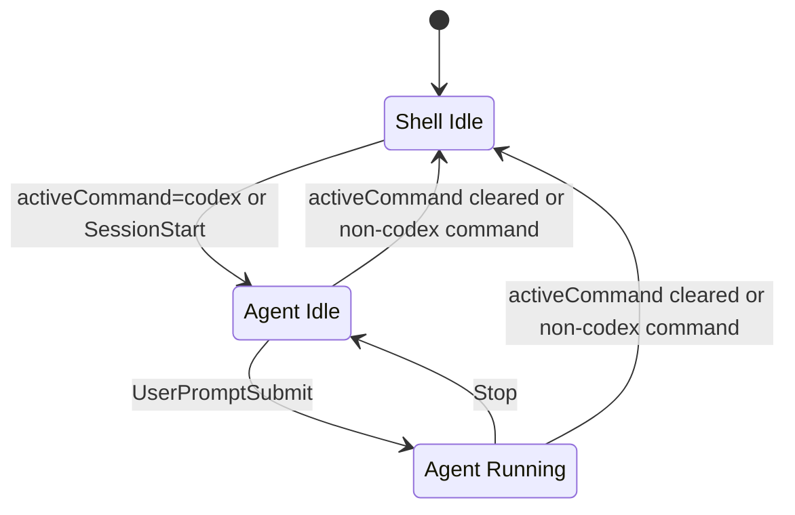

# Codex CLI 终端状态架构收敛计划

日期：2026-06-09

## 给实现 agent 的执行约束

本计划是一次终端状态模型的彻底重设计，不是对现有 `TerminalAgentRun` 的增量修补。执行时必须以本文档定义的 `TerminalState` 为唯一目标状态模型。

执行原则：

- 不做历史数据兼容。旧内存数据、旧 run 记录、旧 endpoint 返回值都不需要迁移、转换或保留。
- 不做历史逻辑兼容。旧 `TerminalAgentRun`、`agent-run` endpoint、`exec-json` run parser、completion 写 run、signal 写 run 等逻辑都应删除，而不是包一层 adapter。
- 不做代码兼容。现有 App、Web、CLI、backend 调用旧状态模型的地方必须直接改到 `TerminalState`，不要保留双写、双读、fallback 或桥接层。
- 不保留旧测试作为约束。旧测试如果验证的是 `TerminalAgentRun`、`agent-run` API、旧 completion/run 合并行为，应删除或改写为 `TerminalState` 测试。
- 不根据异常状态做复杂恢复。hook 丢失、事件乱序、旧状态残留时，不做补偿推断；下一次 `activeCommand` 或 agent hook 到达后直接覆盖当前状态。
- 不扩大范围。第一阶段只实现 `agent="codex"`；`trae`、`claude`、普通 shell running、历史列表、审计日志都不进入本次实现。

判断实现是否合格的硬标准：

- 运行时代码中不再有旧 `TerminalAgentRun` 状态链路。
- 对外状态 API 只返回 `TerminalState`。
- App/Web/CLI 只消费 `TerminalState` 判断 Stop、handoff 和展示。
- terminal signal / interrupt 不直接写终端状态。
- App/Web 不做 Stop 本地乐观状态；Stop 是否消失完全依赖后端返回的下一次 `TerminalState`。
- 本次不迁移通知 websocket/API，不新增 `TerminalNotification*` 协议、route、ws-ticket、ws server、auth token type 或 handshake。
- 旧 completion route / completion feed 不能作为 `TerminalState` 的状态来源；是否删除或替换旧通知链路，放到后续单独方案处理。

## 背景

当前 `TerminalAgentRun` 方案把 `codex`、`trae`、普通进程、`exec-json`、hook、heuristic、pid、operationId、turn/thread 等都放进同一个 run 模型里。这个模型有扩展性，但对当前本地产品目标过宽，也带来两个直接问题：

- UI 需要的是“这个终端现在是不是在 Codex CLI 里，以及 Codex 当前是否执行中”，不是完整的多 agent 历史 run 系统。
- 服务端已经暴露多个 ID，但事件合并仍主要按 terminal/source 匹配，容易把同一个终端内连续的 Codex turn 合并错。

本计划按当前目标彻底重设计：删除旧 `TerminalAgentRun` 状态模型和相关兼容逻辑，只做好本地 `codex` CLI。其他 CLI、普通命令、构建命令、dev server 统统不作为 running agent 状态处理。旧内存状态或旧接口数据不需要迁移；异常状态可以在下一次正确事件到达时直接覆盖，必要时也可以整体清空重置。

## 目标

1. 将终端状态收敛为一条产品状态：
   - `shell_idle`：没有运行受支持 CLI。普通 shell、普通命令、其他 CLI 都先归这里。
   - `agent_idle`：受支持 agent CLI 在前台，但没有正在执行的一轮任务。
   - `agent_running`：受支持 agent CLI 在前台，当前 turn 正在执行。
2. `activeCommand=codex` 只表示“终端在 Codex CLI 进程内”，不再直接表示 Codex 正在执行任务。
3. `agent_running` 包括模型生成、工具调用、请求权限、等待工具返回；失败后回到 `agent_idle`，因为用户仍在 CLI 中等待下一次输入。
4. 非 Codex 终端状态不细分。没有进入 `codex` CLI 时，不判断普通命令是否 running。
5. 后续可新增 `shell_running` 表示普通 shell 命令正在执行，但第一阶段不支持。
6. 前端 App、Web、CLI handoff 使用同一份后端状态，不再各自推断。

## 非目标

- 不在第一阶段支持 `trae`、`claude` 或其他 CLI。
- 不判断 `npm run dev`、`pnpm test`、`sleep` 等普通前台命令是否 running。
- 不读取 `~/.codex/sessions` 或 Codex 本地内部文件作为产品状态源。
- 不要求用户必须通过 Runweave wrapper 启动 Codex。
- 不新增前端 `src/` 下单测；前端只用类型检查、构建、E2E 或手工回归验证。
- 不把 `pid`、`operationId`、`codexThreadId`、`codexTurnId` 作为状态协议字段；这些只允许进入服务端日志或原始事件日志。

## 当前代码上下文

- `backend/src/terminal/shell-integration.ts` 通过 zsh `preexec/precmd` 输出 `BrowserViewerCommand`，维护 `activeCommand`。
- `backend/src/terminal/tmux-service.ts` 从 tmux pane option 和 `pane_current_command` 读取 `activeCommand`。
- `backend/src/routes/terminal-completion.ts` 是旧 Codex hook completion 链路；本计划只要求它不再作为 `TerminalState` 状态来源，不要求本阶段删除或替换旧通知接口。
- `electron/src/hooks/hook-installer.ts` 已能安装 Codex `SessionStart`、`UserPromptSubmit`、`Stop` hook；本计划要求把上报目标切到新的终端状态 hook endpoint。
- `backend/src/terminal/agent-run-service.ts` 当前是 run 历史模型，状态包括 `starting/running/waiting_input/completed/failed/cancelled/stale/unknown`；本计划要求删除这套模型，不做兼容。
- `app/src/pages/AppTerminalPage.tsx` 当前根据 `TerminalAgentRun` 判断 Stop 显示，且 HTTP interrupt 当前发送 ESC；本计划要求改为只根据 `TerminalState` 判断。
- `packages/runweave-cli/src/commands/terminal.ts` 的 `handoff` 已读取 current agent run；本计划要求删除这条依赖，切到新的终端状态。

## 推荐状态模型

在 `packages/shared/src/terminal-protocol.ts` 增加新的终端状态类型，并删除旧 `TerminalAgentRun` 类型、事件类型和响应类型。新 UI/API 只以 `TerminalState` 为准。

```ts
export type TerminalAgentKind = "codex";

export type TerminalStateValue = "shell_idle" | "agent_idle" | "agent_running";

export interface TerminalState {
  state: TerminalStateValue;
  agent: TerminalAgentKind | null;
}
```

语义约束：

- `state="shell_idle"` 时，`agent=null`。
- `state="agent_idle"` 或 `state="agent_running"` 时，第一阶段 `agent="codex"`。
- `TerminalState` 是产品状态快照，只放 UI 和 CLI 需要判断的字段。
- `terminalSessionId`、`projectId`、`cwd`、`activeCommand` 继续由已有 terminal session / metadata 协议提供，不重复放进 `TerminalState`。
- `session.status="exited"` 是终端 session 生命周期硬约束，不是 agent 状态事件；只要 session 已退出，`TerminalState` 必须返回 `shell_idle`，且优先级高于残留的 `activeCommand` 或 agent hook 状态。
- `activeCommand=codex` 只能把状态推进到 `agent_idle`，不能直接推进到 `agent_running`。
- `hook.user_prompt_submit` 把状态推进到 `agent_running`。
- `hook.stop` 把状态推进到 `agent_idle`。它表示 Codex 本轮处理已经结束；不区分成功、失败或被中断，结束后都回到等待用户输入。
- `activeCommand` 从 `codex` 清空或变成其他命令时，把状态推进到 `shell_idle`。
- `shell_running` 是后续普通 shell 命令状态扩展，不进入第一阶段类型。

## 状态机



状态解释：

- `Shell Idle`：没有运行受支持 CLI。普通 shell、普通命令、其他 CLI 都先归这里。
- `Agent Idle`：受支持 agent CLI 在前台；第一阶段只支持 Codex CLI，且没有正在执行的一轮任务。
- `Agent Running`：受支持 agent CLI 在前台；第一阶段只支持 Codex CLI，当前 turn 正在执行。权限确认、工具调用、失败前等待结果都仍是 running。
- `Shell Running`：后续预留状态，用于表达普通 shell 命令正在执行；第一阶段不实现、不返回。

## 状态来源

- Shell active command：判断是否在 Codex CLI 内。
  - `activeCommand=codex` -> `agent_idle`
  - `activeCommand=null` 或非 `codex` -> `shell_idle`
- Terminal session lifecycle：只作为 `getCurrent` 的最高优先级 guard，不作为状态机事件。
  - `session.status="exited"` -> `shell_idle`
  - 不要求 `markExited()` 清理 `activeCommand`；允许 `activeCommand=codex` 残留，但 `TerminalStateService.getCurrent(...)` 必须忽略已退出 session 的 `activeCommand`。
- Agent hook：判断 Codex CLI 内部任务态。第一阶段只处理 `agent="codex"`。
  - `SessionStart` -> `agent_idle`
  - `UserPromptSubmit` -> `agent_running`
  - `Stop` -> `agent_idle`
- Completion route：不作为新状态来源。
  - `/internal/terminal-completion`、completion feed 等旧 completion 产物不能写入 `TerminalState`。
  - 本次不迁移 completion feed 承载的通知能力，不新增 replacement notification API。
  - Codex 状态结束统一由 agent hook 的 `hookEvent="Stop"` 处理。
- Terminal signal / interrupt：不作为新状态来源。
  - 不属于 `TerminalState` 的状态来源。
  - Stop/ESC/SIGINT 只是向终端或 Codex CLI 发送控制输入，不允许直接写 `agent_idle`、`agent_running` 或 `shell_idle`。
  - 控制动作之后的状态变化只能由后续 `codex.stop` hook 或 `activeCommand` 变化自然校正。
- 不做 stale timeout。
  - 不根据“运行多久”猜测状态。
  - 如果 hook 丢失或异常，状态保持原值；下一次 `activeCommand` 或 agent hook 到达时直接覆盖。

## API 设计

新增终端状态 API：

```text
GET /api/terminal/session/:terminalSessionId/state
```

返回：

```ts
export interface TerminalStateResponse {
  terminalState: TerminalState;
}
```

内部 hook API 使用新的 endpoint，不复用旧 `/api/terminal/agent-run-events`：

```text
POST /internal/terminal/agent-hook
```

请求体：

```ts
export type AgentHookStateEvent = "SessionStart" | "UserPromptSubmit" | "Stop";

export interface AgentHookStateRequest {
  terminalSessionId: string;
  projectId?: string;
  agent: TerminalAgentKind;
  hookEvent: AgentHookStateEvent;
}
```

说明：

- `RUNWEAVE_HOOK_ENDPOINT` 是 backend 启动后全局设置的一条完整 endpoint，不能天然包含每个 terminal 的 id。
- 每个 terminal 的 id 继续由 runtime env `RUNWEAVE_TERMINAL_SESSION_ID` 注入给 hook bridge。
- hook bridge 调用 `RUNWEAVE_HOOK_ENDPOINT`，并把 `RUNWEAVE_TERMINAL_SESSION_ID` 放进 `AgentHookStateRequest.terminalSessionId`。

删除策略：

- 删除旧 `/agent-run/current`、`/agent-runs`、`/agent-run/:agentRunId` 和 `/agent-run-events` endpoint。
- 删除旧 `TerminalAgentRunService`、`TerminalAgentRunStore`、`parseCodexJsonLine` 以及只服务于旧 run 模型的测试。
- 解除旧 `/internal/terminal-completion`、completion event service/store、completion websocket/feed 对终端状态的影响；本次不要求删除或替换旧通知接口。
- 旧链路上的 Feishu 通知、绿点通知能力不在本次状态机重构中迁移；后续单独做通知方案。
- App/Web/CLI 同步切到 `/api/terminal/session/:terminalSessionId/state`；不提供旧响应转换层。
- 旧内存状态不迁移；服务重启或代码切换后由 active command 和 hook 事件重新建立当前状态。

## 实施任务

### 1. 替换共享协议

修改文件：

- `packages/shared/src/terminal-protocol.ts`

任务：

- 新增 `TerminalState`、`TerminalStateResponse` 类型。
- 删除 `TerminalAgentRun`、`TerminalAgentRunEvent`、`TerminalAgentRunCurrentResponse`、`TerminalAgentRunListResponse` 等旧 run 类型。
- 删除旧 `exec-json` / `interactive-hook` / `terminal-heuristic` 模式类型；第一阶段不再表达 run 置信度层级。

验证：

- `pnpm --filter @browser-viewer/shared typecheck`
- 预期无 TypeScript 错误。

### 2. 新增后端状态服务

新增文件：

- `backend/src/terminal/terminal-state-service.ts`
- `backend/src/terminal/terminal-state-store.ts`

任务：

- 以 `terminalSessionId` 为主键维护最新 `TerminalState`。
- 实现 `setShellActiveCommand(terminalSessionId, sessionSnapshot): TerminalState`。
- 实现 `handleAgentHook(terminalSessionId, agent, hookEvent): TerminalState`。
- 实现 `getCurrent(terminalSessionId, sessionSnapshot): TerminalState`。
- `getCurrent` 必须能在没有历史事件时，根据 session 的 `activeCommand/cwd/projectId` 返回：
  - `session.status="exited"` -> `shell_idle`，即使 `activeCommand="codex"`。
  - `activeCommand=codex` -> `agent_idle`
  - 其他情况 -> `shell_idle`
- 状态机只允许三种产品态：`shell_idle`、`agent_idle`、`agent_running`。
- `shell_running` 只作为后续扩展在文档中说明，第一阶段不要进入类型、API 响应或测试断言。

关键映射：

- `setShellActiveCommand` 收到 `activeCommand=codex` -> `agent_idle`
- `setShellActiveCommand` 收到非 `codex` 或 `null` -> `shell_idle`
- `getCurrent` 收到 `session.status="exited"` -> `shell_idle`
- `handleAgentHook("codex", "SessionStart")` -> `agent_idle`
- `handleAgentHook("codex", "UserPromptSubmit")` -> `agent_running`
- `handleAgentHook("codex", "Stop")` -> `agent_idle`
- terminal signal / interrupt 不进入状态映射；如果现有代码把 signal 写入终端状态，本次重构必须删除。

验证：

- 后端状态服务测试覆盖上述映射。
- 后端状态服务测试必须覆盖 `session.status="exited"` 且 `activeCommand="codex"` 时返回 `shell_idle`。
- `pnpm --filter ./backend test -- terminal-state-service`
- `pnpm --filter ./backend typecheck`

### 3. 接入 activeCommand 元数据变化

修改文件：

- `backend/src/ws/terminal-server.ts`
- 必要时调整 `backend/src/terminal/manager.ts`

任务：

- 在 metadata 更新时，如果 `activeCommand` 变化，调用 `TerminalStateService.setShellActiveCommand(...)`。
- 只识别精确规范化后的 `codex`。`trae`、`claude`、`node`、`npm` 等都按 `shell_idle` 处理。
- 保留 current/grace command gate 的防串台能力，避免 hook 误入其他终端；这属于新状态事件的安全边界，不是旧逻辑兼容。

验证：

- 更新现有 websocket/terminal metadata 相关后端测试，确认 `activeCommand=codex` 后终端状态是 `agent_idle`。
- 确认 `activeCommand=node` 或 `activeCommand=null` 后终端状态是 `shell_idle`。
- 确认已退出 session 即使残留 `activeCommand=codex`，终端状态仍是 `shell_idle`。
- `pnpm --filter ./backend test -- terminal-server terminal`

### 4. 接入 agent hooks

修改文件：

- `electron/src/hooks/hook-installer.ts`
- `backend/src/routes/terminal-state.ts`
- `backend/src/index.ts`

任务：

- hook bridge 继续读取 `RUNWEAVE_TERMINAL_SESSION_ID`、`RUNWEAVE_PROJECT_ID`、`RUNWEAVE_HOOK_ENDPOINT`、`RUNWEAVE_HOOK_TOKEN`。
- `RUNWEAVE_HOOK_ENDPOINT` 在新实现中直接指向 `/internal/terminal/agent-hook`，不再指向 `/internal/terminal-completion`，也不再从 completion endpoint 派生 agent endpoint。
- hook bridge 不拼接 session path；它从 `RUNWEAVE_TERMINAL_SESSION_ID` 读取 session id，并放入请求体 `terminalSessionId`。
- hook bridge 不再向旧 completion endpoint 双发请求，不再触发旧 completion feed。
- hook bridge 收到 `Stop` 后，本次只负责上报 agent hook state；通知触发不纳入本阶段改造。
- 不新增 Web/App 绿点、后台 terminal 标记、bell 的新 notification event。
- 将 Codex hook payload 映射到新的 `AgentHookStateRequest`：
  - `terminalSessionId=RUNWEAVE_TERMINAL_SESSION_ID`
  - `agent="codex"`
  - `SessionStart` -> `hookEvent="SessionStart"`
  - `UserPromptSubmit` -> `hookEvent="UserPromptSubmit"`
  - `Stop` / `SubagentStop` -> `hookEvent="Stop"`
- 事件上报必须仍经过 hook token 鉴权。
- 非 Codex source 事件第一阶段直接忽略，不创建 `trae` 或 `unknown` 状态。

验证：

- `pnpm --filter ./electron test -- hook-installer`，如果 electron 包没有独立 test 命令，则运行仓库现有 electron 相关测试命令。
- 手工验证：在 Runweave terminal 内启动 `codex`，提交一个 prompt 后状态变 `running`，完成后变 `idle`。

### 5. 通知链路暂不迁移

本阶段结论：

- 只把 completion 链路从 `TerminalState` 状态来源中移除。
- 不迁移 Web/App 绿点、后台 terminal 标记、bell。
- 不新增 notification 接口、shared 协议、ws-ticket、websocket server、auth token type 或 handshake。
- 不把旧 `completion-events` websocket/feed 改造成 `terminal-notifications`。
- 不要求本阶段删除旧 completion notification 相关代码；后续如果要删除或替换，必须另写通知迁移方案。

任务：

- `backend/src/routes/terminal-completion.ts` 不再写入或影响 `TerminalState`。
- `backend/src/terminal/completion-event-service.ts`、`backend/src/terminal/completion-events.ts` 不再作为状态来源。
- 新 `backend/src/routes/terminal-state.ts` 不依赖 completion event service/store。
- agent hook route 处理 `hookEvent="Stop"` 时，只更新 `TerminalState`，不派发 Web/App notification event。
- hook bridge 只调用新的 `/internal/terminal/agent-hook`，并在 body 中携带 `terminalSessionId`。
- 不修改以下通知接口和握手层：
  - `packages/shared/src/terminal-protocol.ts` 内旧 completion event 类型。
  - `backend/src/routes/terminal.ts` 内旧 completion events list / ws-ticket route。
  - `backend/src/ws/terminal-events-server.ts`。
  - `backend/src/ws/terminal-events-handshake.ts`。
  - `backend/src/auth/jwt.ts`、`backend/src/auth/service.ts` 内 `terminal-events-ws` token type。
  - `frontend/src/features/terminal/use-terminal-events-connection.ts`。
  - `frontend/src/components/terminal/terminal-workspace.tsx`。

验证：

- `rg -n "TerminalNotificationEvent|terminal-notifications|terminal-notification|baselineNotificationId|terminal-notifications-ws" packages backend frontend app electron` 无命中。
- `rg -n "completion-events|CompletionEvent|baselineEventId|terminal-events-ws" packages backend frontend app electron` 允许仍有旧通知链路命中，但这些命中不得参与 `TerminalState` 写入。
- 手工或自动验证 agent hook route 处理 `Stop` 后，只更新 `TerminalState`，不创建 notification event。
- `pnpm --filter ./backend typecheck`
- `pnpm typecheck`

#### 后续通知迁移风险记录

通知 websocket/API 迁移成本高于本阶段状态机重构，原因是它不只是换一个事件名，还会牵涉 shared 协议、route、ws-ticket、ws server、auth token type、handshake、前端 hook 和 workspace marker 状态。

本次明确不做：

- 不新增 `TerminalNotificationEvent`、`TerminalNotificationEventListResponse`、`TerminalNotificationWsTicketResponse`、`TerminalNotificationServerMessage`。
- 不新增 `GET /api/terminal/notifications` 或 `POST /api/terminal/notifications/ws-ticket`。
- 不新增 `terminal-notifications` websocket。
- 不新增 `terminal-notifications-ws` token type。
- 不修改 `backend/src/ws/terminal-events-handshake.ts`。
- 不迁移 `frontend/src/features/terminal/use-terminal-events-connection.ts` 和 `completionMarkers`。

后续如果重新启动通知迁移，必须单独设计以下内容：

1. notification shared type。
2. notification HTTP list / ws-ticket route。
3. `terminal-notifications-ws` token type 和 auth service 签发/校验。
4. websocket handshake 和 ws server catch-up/live 语义。
5. frontend hook、cursor、marker、bell 迁移。
6. completion feed 删除顺序和回归策略。

### 6. 修正 Stop/Interrupt 语义

修改文件：

- `backend/src/routes/terminal.ts`
- `backend/src/ws/terminal-server.ts`
- `app/src/pages/AppTerminalPage.tsx`
- `app/src/services/terminal.ts`

任务：

- UI 上的 Stop 表示“停止当前 Codex running turn”，而不是停止任意普通命令。
- 当 `terminalState.state` 是 `agent_running` 时展示 Stop。
- Stop 默认应发送能让 Codex 取消当前任务的控制动作。若当前 ESC 只适合取消 Codex UI，必须把接口命名为 `cancel-codex-turn` 或在响应里明确 `interruptSequence`。
- 不在 `shell_idle` 或 `agent_idle` 状态展示 Stop；普通命令停止能力后续另做。
- Stop 请求本身不更新后端 `TerminalState`，也不触发 App/Web 本地乐观隐藏 Stop。
- Stop 后 UI 继续按后端 `TerminalState` 渲染；只有后续 agent hook `Stop` 或 `activeCommand` 变化把状态推进到非 `agent_running` 后，Stop 才消失。

验证：

- App 手工回归：
  - 未进入 `codex` 时不显示 Stop。
  - 进入 `codex` 但等待输入时不显示 Stop。
  - 提交 prompt 后显示 Stop。
  - 点击 Stop 后，如果后端 `TerminalState` 仍是 `agent_running`，Stop 不因本地乐观状态提前消失。
  - Codex 一轮结束并触发 agent hook `Stop` 后，后端返回 `agent_idle`，Stop 消失，输入框仍可继续输入。
- `pnpm --filter @runweave/app typecheck`

### 7. App/Web/CLI 消费新状态

修改文件：

- `app/src/services/terminal.ts`
- `app/src/pages/AppTerminalPage.tsx`
- `packages/runweave-cli/src/client/terminal-http-client.ts`
- `packages/runweave-cli/src/commands/terminal.ts`
- 如 Web 侧有终端详情状态展示，再同步调整 `frontend/src/features/terminal/*`

任务：

- 增加 `getCurrentTerminalState` client 方法。
- App 轮询或通过已有 websocket metadata 触发刷新 `terminalState`。
- CLI `handoff` 输出新增或替换字段：
  - `terminalState`
  - `agent`
- CLI 不再把普通命令推断成 agent running。

验证：

- `pnpm --filter @runweave/cli typecheck`
- `pnpm --filter @runweave/cli test -- terminal`
- 手工运行 `node packages/runweave-cli/src/cli.ts terminal handoff <terminalId> --json`，确认非 Codex 命令输出为 shell idle。

### 8. 删除旧 TerminalAgentRun 链路

删除或重写文件：

- `backend/src/terminal/agent-run-service.ts`
- `backend/src/terminal/agent-run-store.ts`
- `backend/src/routes/terminal-agent-runs.ts`
- `backend/src/terminal/codex-json-events.ts`
- `backend/src/terminal/agent-run-service.test.ts`
- `backend/src/routes/terminal-agent-runs.test.ts`
- `backend/src/terminal/codex-json-events.test.ts`
- 所有仅服务于旧 `TerminalAgentRun` 协议的 App、CLI、backend 引用

任务：

- 从 `backend/src/index.ts` 移除旧 `createTerminalAgentRunsRouter` 和 `createTerminalAgentRunEventsRouter` 注册。
- 从 WebSocket、terminal route 中移除 `agentRunService` 注入和旧事件写入。
- 删除 WebSocket signal、HTTP interrupt 或 terminal route 对 terminal state 的任何直接写入。
- 删除旧 run 历史查询能力；本方案不提供历史 agent run 列表。
- 删除旧测试，不保留“旧 API 仍通过”的要求。
- 如果实现阶段发现某个旧类型仍被引用，直接改到 `TerminalState`，不要加 adapter。

验证：

- `rg -n "TerminalAgentRun|agent-run|agentRun|parseCodexJsonLine|codex-json-events" packages backend frontend app electron` 无运行时代码命中。
- `pnpm --filter ./backend test -- terminal-state-service terminal-server terminal`
- `pnpm --filter ./backend typecheck`

## 验收标准

1. 终端没有运行 `codex` 时：
   - API 返回 `state=shell_idle`
   - App 不显示 Codex Stop
   - CLI handoff 不显示 agent running
2. 终端进入 `codex` 但等待输入时：
   - API 返回 `state=agent_idle, agent=codex`
   - App 不显示 Stop
3. 在 Codex 内提交 prompt 后：
   - Codex `UserPromptSubmit` hook 到达后，API 返回 `state=agent_running`
   - App 显示 Stop
   - CLI handoff 显示 Codex running
4. Codex 一轮结束并触发 hook Stop 后：
   - API 返回 `state=agent_idle`
   - App Stop 消失
   - 终端仍被识别为 agent idle
5. 退出 Codex 或 active command 清空后：
   - API 返回 `state=shell_idle`
   - 不保留历史 running 状态影响 UI

## 验证命令

执行计划完成后至少运行：

```sh
pnpm --filter @browser-viewer/shared typecheck
pnpm --filter ./backend test -- terminal-state-service terminal-server terminal
pnpm --filter ./backend typecheck
pnpm --filter @runweave/app typecheck
pnpm --filter @runweave/cli typecheck
pnpm --filter @runweave/cli test -- terminal
```

前端 UI 还需要手工或 E2E 回归：

1. 打开一个 Runweave terminal。
2. 未进入 `codex`，确认 Stop 不显示。
3. 输入 `codex`，等待 Codex TUI 出现，确认状态是 idle。
4. 提交一个 prompt，确认状态变 running 且 Stop 显示。
5. 等待 Codex 一轮结束并触发 Stop，确认状态回 idle 且 Stop 消失。
6. 退出 Codex，确认状态回 shell idle。

## 风险与处理

- Agent hook 未安装或未触发：只能判断 `agent_idle`，不强行推断 running；UI 不显示 Stop，避免误停普通命令。
- `activeCommand` 丢失：状态回到 `shell_idle`，这是保守失败；后续可通过更稳定的 tmux pane option 修复。
- Hook Stop 晚到：只有 current/grace command 是 codex 时才接收，避免串台。
- 普通命令不能停止：这是本阶段明确非目标；后续可以单独设计 `foregroundProcessState` 和普通命令 SIGINT。
- `trae` 需求出现：复用 `TerminalState` 模型扩展 `TerminalAgentKind`，但不要在第一阶段混入。

## 执行顺序

1. 先加共享协议和后端 `TerminalStateService`。
2. 接入 active command，保证 `shell_idle` / `agent_idle` 的基础判断可靠。
3. 接入 agent hooks，保证 idle/running 转换可靠。
4. 切 App 和 CLI 消费新状态。
5. 删除旧 `TerminalAgentRun` endpoint、service、store 和测试，确保运行时代码只剩 `TerminalState`。

这套顺序的关键是先稳定“终端状态”，再处理 UI 和 CLI 表达；不要继续扩展 run 历史模型，否则会把当前简单需求重新复杂化。
