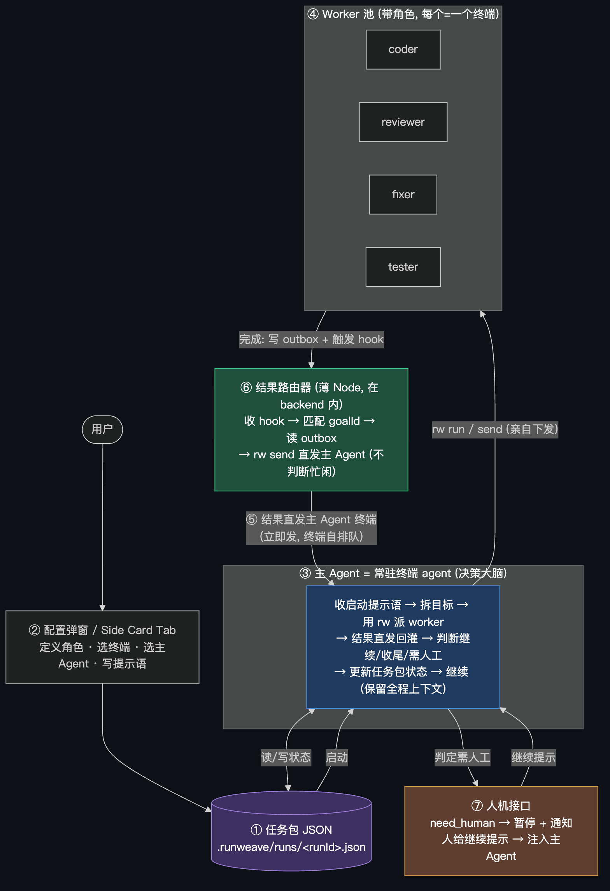
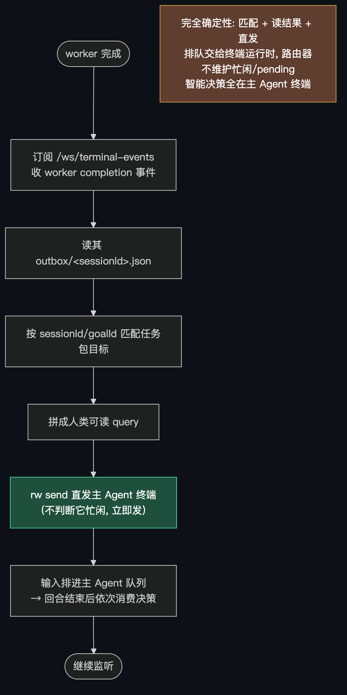
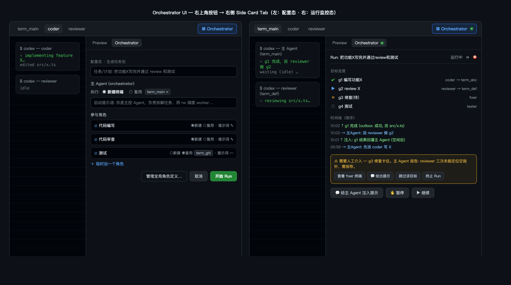
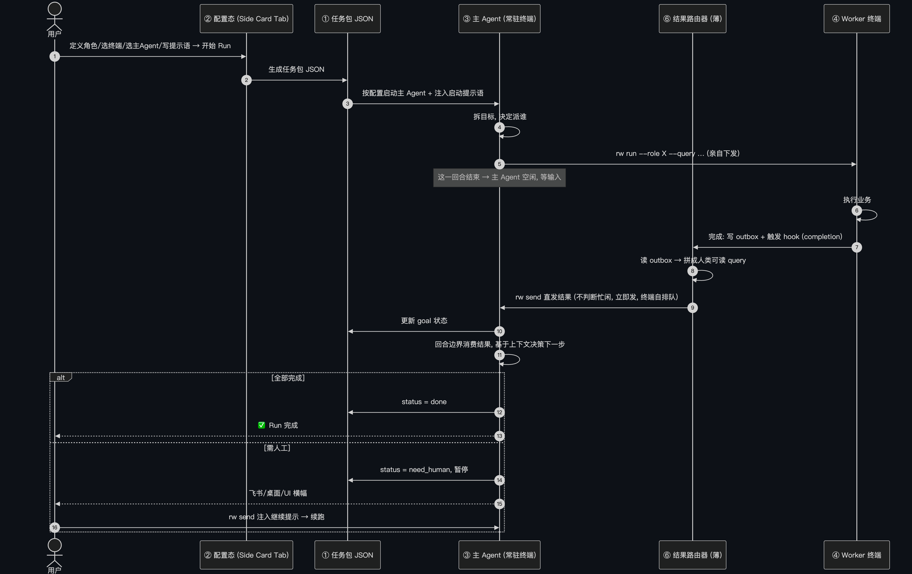

# Multi-Agent Orchestrator 设计稿

- 日期: 2026-06-13
- 状态: 设计中（仅计划，尚未编码）
- 关键词: orchestrator, 主 Agent(常驻终端), worker 终端, hook 事件驱动, 任务包 JSON, outbox, 直发回灌(agent 自排队), 角色定义

## 1. 目标与非目标

### 目标

构建一个「自主大脑」：用户对当前项目配置好角色与终端后提交一个任务/计划，系统能自主
驱动多个终端（每个终端 = 一个带角色的 worker agent，由 CLI agent 如 codex/claude/trae
承载）协同完成工作 —— 代码编写、review、发现问题后修复、测试等，默认无人值守，但人可
随时介入。

核心理念（本版按用户最新设想重写，关键变化见 §4.1）：

- **主 Agent 本身就是一个常驻的终端 agent**：它选定某个终端、拿到一段启动提示语后
  长期存活，**自己保留整段 run 的上下文**，自己通过 `rw` CLI 去调度 worker。它不是
  「每次决策新拉起一个无状态 LLM」—— 因为我们没有任何 LLM API，唯一能跑 LLM 的方式
  就是终端里的 CLI agent，所以让它常驻、留住上下文是这个约束下的自然解。
- **主 Agent 是决策大脑，不含任何业务逻辑**；业务全部发生在 worker 终端里。
- **主 Agent 唯一的手是 CLI 工具**（本地 `rw` CLI），它用 `rw` 派发 worker、更新任务包。
- **Node 服务端是「薄」的结果路由器，不是大脑**：收 hook → 按 goalId 匹配 → 读 worker
  的 outbox 结果 → **直接 `rw send` 进主 Agent 终端**。服务端只做匹配、读结果、转发，
  不做任何智能决策。
- **结果回流走「直发」（已定）**：worker 完成后，路由器拿到结构化结果就无脑发给主 Agent
  终端，**不判断主 Agent 是否空闲**。终端的输入是入队的（backend 始终 `inputEnqueued`，
  见 §4.1 代码依据），主 Agent 这一回合结束后会自然消费排在后面的输入。多个 worker 先后
  完成就是多条排队消息，主 Agent 依次处理。
- **任务 = 一个 JSON 任务包**：含 runId、目标、各角色与其终端绑定、主 Agent 及其终端、
  可自定义的提示语。配置弹窗生成它；主 Agent 在过程中更新它的状态；UI 读它做展示。
- **人是一等公民**：主 Agent 判定「完成」或「需要人工」时更新任务包状态、循环暂停；
  下一步由用户给出继续提示或具体命令再驱动；人也可随时主动注入指令。

### 非目标

- 不引入任何 HTTP/OpenAI 风格的 agent 调用协议；主 Agent 与 worker 一律是本地 CLI 终端。
- 本设计不依赖现有 CLI 的能力边界 —— CLI 缺什么就补什么（见 §8）。
- 不做可视化拖拽编排器（Dify/Flowise 一类）；编排由常驻主 Agent 的自主决策驱动。

## 2. 系统组成

整个系统由「一个常驻主 Agent 终端 + 一个薄结果路由服务 + 若干 worker 终端」构成。

| #   | 子系统             | 职责                                                                              | 落点                          | 现状              |
| --- | ------------------ | --------------------------------------------------------------------------------- | ----------------------------- | ----------------- |
| ①   | 任务包(JSON)       | 唯一配置 + 状态源：runId、目标、角色/终端绑定、主 Agent 绑定、提示语、进度        | `.runweave/runs/<runId>.json` | 新建              |
| ②   | 配置弹窗/面板      | 定义角色 + 选终端 + 选主 Agent + 自定义提示语 → 生成任务包                        | 前端 side-card tab            | 新建              |
| ③   | 主 Agent(决策大脑) | 常驻终端 agent；持有 run 全程上下文；用 `rw` 派 worker、判断继续/收尾、更新任务包 | 一个 worker 终端(特殊角色)    | 新建(=提示语+CLI) |
| ④   | Worker 池 + 角色   | 带身份的终端(coder/reviewer/fixer/tester…)，执行业务                              | 复用终端 + 补角色             | 复用+补角色       |
| ⑤   | 感知层(事件)       | worker 完成信号 + 结构化结果回流(outbox)                                          | 复用 hook + 事件总线          | 复用+补 outbox    |
| ⑥   | 结果路由器         | 薄 Node 逻辑：收 hook→按 goalId 匹配→读 outbox→直接 `rw send` 进主 Agent          | backend(薄)                   | 新建              |
| ⑦   | 人机接口           | 主 Agent 判定「完成/需人工」→ 暂停等用户提示；人也可随时注入                      | 复用通知 + 补注入             | 复用半边+补注入   |

> 与上一版的关键差异：不再有「持有 event loop 的 daemon 调用无状态 LLM」。大脑就是
> **常驻主 Agent 终端**本身；Node 侧退化为 ⑥ 结果路由器（薄）。原「黑板」概念由
> ① 任务包 JSON 承担其「唯一事实源」职责，但**写它的是主 Agent**（通过 `rw`），
> 不是 daemon。

## 3. 整体架构图



下方 ASCII 为同一架构的文本版（便于纯文本环境阅读）：

```
  用户 ─▶ ② 配置弹窗: 定义角色/选终端/选主Agent/写提示语 ─▶ ① 任务包 JSON
                                                              │ 启动
                                                              ▼
        ┌──────────── ③ 主 Agent = 常驻终端 agent (决策大脑) ────────────┐
        │  收到启动提示语 → 自主拆解目标 → 用 rw 派 worker → 等结果回灌   │
        │  → 判断继续/收尾/需人工 → 更新 ① 任务包状态 → 继续             │
        └───────┬──────────────────────────────────────────▲────────────┘
                │ rw run/send (主Agent亲自下发)              │ 结果作为新一轮 query 直发
                ▼                                            │ (无脑发, 主Agent自排队, §4.1)
      ④ Worker 池 (带角色, 每个=一个终端)             ⑥ 结果路由器 (薄 Node)
        coder   reviewer   fixer   tester  …                 ▲  收 hook→匹配 goalId
          │        │         │        │                      │  →读 outbox→rw send 直发
          └───┬────┴────┬────┴────────┘                      │
              │ 完成      │ 结构化结果(outbox)                 │
              ▼ hook      ▼                                   │
      ⑤ 感知层: completion 事件 + outbox 结果 ──push──────────┘
              │
              └─ 主 Agent 判定「需人工」→ ⑦ 人机接口: 通知用户, 循环暂停
                                          ▲ 人给继续提示/命令 → 注入主Agent继续
```

## 4. 主 Agent 如何「转」起来

主 Agent 是一个常驻终端 agent，它在自己的回合里反复做：

```
启动: 收到任务包里的启动提示语(含任务/计划/可用角色)
loop (主 Agent 的连续对话上下文里):
  think  ← 基于自己记得的全程上下文 + 任务包状态, 推理下一步
  act    → 用 rw 派 worker:  rw run --goal g2 --role reviewer --query "…"
  (主 Agent 这一回合结束, 终端转入空闲, 它在「等」, 不空转)
  wakeup ← ⑥ 结果路由器把 worker 结果 rw send 进它的终端(直发, 排在它输入队列里)
  update → 主 Agent 把结果记进上下文 + 更新任务包状态(rw)
  goto loop  (或判定: 完成/需人工 → 更新任务包状态, 暂停等用户)
```

设计要点：

- **上下文留在主 Agent 自己脑子里**：它是常驻 agent，记得这一轮 run 发生过什么，
  不需要每次把全局状态重新拼进 prompt。任务包 JSON 是**对外可见的同步状态**（给 UI、
  给重启恢复用），不是主 Agent 的唯一记忆来源。
- **主 Agent 亲自派发**：派 worker 这个动作是主 Agent 调 `rw`，不是某个外部 daemon 替它
  调。服务端不替它做决策。
- **「完成 / 需人工」是主 Agent 的判断**：它认为做完了、或遇到搞不定/高风险，就更新
  任务包状态并停下，把球交给用户；用户给继续提示后再驱动下一轮。

### 4.1 结果如何回灌——直接发，主 Agent 自己排队（关键澄清）

主 Agent 虽然常驻，但它仍是 LLM，**本质是回合制 (turn-based)**：

```
query → 主 Agent 思考/输出(可能含 rw 工具调用) → 工具返回 → 继续 → 这一回合结束 → 空闲
```

它在一个回合里要么在「思考/输出」，要么在「等某个工具返回」。一个直觉的担心是：worker
完成时若往它终端里塞输入，会不会和它正在进行的回合错乱？**实测代码表明不会，因为终端的
输入天然是排队的，我们直接发即可，不需要判断主 Agent 是否空闲。**

**代码依据**：`rw send` → backend `terminal.ts:237-251` 把输入直接写进 pty/tmux 运行时
并恒定返回 `inputEnqueued: true`。运行时（CLI agent 自身的输入缓冲 / tmux 缓冲）会把这条
输入排在主 Agent 当前回合之后；主 Agent 这一回合结束后自然消费下一条。backend 甚至已经
知道如何「在 `agent_running` 时发送」——`terminal.ts:195` 在检测到 `agent_running` 时只是
把提交键从 `C-m` 切成 `Tab`，说明「运行中发送」是被支持的既有行为，不是需要规避的禁忌。

**正确做法 = 直发（已定）**：

```
worker 完成 → hook → ⑥ 结果路由器 按 goalId 匹配 → 读 outbox 拿结构化结果
   → 立即 rw send 进主 Agent 终端(无脑发, 不查它忙不忙)
   → 输入排进主 Agent 的输入队列
   → 主 Agent 当前回合结束后, 依次消费这些结果, 基于上下文决定下一步
多个 worker 先后完成 = 多条排队输入, 主 Agent 逐条处理(无需服务端合并)
```

把三个角色分清（职责不重叠）：

| 角色           | 是什么                        | 状态                     | 谁感知事件                              |
| -------------- | ----------------------------- | ------------------------ | --------------------------------------- |
| **主 Agent**   | 常驻终端 agent（决策大脑）    | 长期存活，保留全程上下文 | ❌ 不直接订阅；结果被直发进它的输入队列 |
| **结果路由器** | 薄 Node 逻辑（在 backend 里） | 随 backend 存活          | ✅ 它收 hook、读 outbox、直发结果       |
| **Worker**     | 终端里的 CLI agent            | 各自独立运行             | ❌ 只管干活，完成时发 hook              |

类比：主 Agent 是「项目负责人」，结果路由器是「前台」。前台把报告**直接放进负责人的收件
箱**（输入队列），不需要先确认他是否在开会；负责人散会（回合结束）后自然按顺序处理收件箱
里的报告。

> 主 Agent 如何「等」而不空转？它在派完 worker、这一回合自然结束后就是空闲态，不占
> CPU、不烧 token。被唤醒完全由路由器把结果直发进它的输入队列触发——它消费到这条输入
> 就醒。**因此主 Agent 不需要额外的 Stop hook 来「判断空闲」**：服务端不关心它忙不忙，
> 排队机制保证了顺序正确。（主 Agent 终端的 completion 通知若用于 UI 展示是另一回事，
> 不参与结果回灌的控制逻辑。）

## 5. 事件驱动闭环（零轮询）

现有链路已是 push：worker 完成 → hook 触发
`POST /internal/terminal-completion` → 内存事件总线 → `/ws/terminal-events` 广播。
**收事件的是 ⑥ 结果路由器（backend 里的薄逻辑），不是主 Agent LLM**（见 §4.1）。
完整回路：

```
worker 完成 → hook(POST /internal/terminal-completion) → 事件总线
   │
⑥ 结果路由器 收到 completion:
   │  1. 读 outbox/<sessionId>.json (一次性文件读) → 拿结构化结果
   │  2. 按 sessionId/goalId 匹配到任务包里的目标
   │  3. 立即 rw send 进主 Agent 终端(直发, 不判断它忙不忙, §4.1)
   │
   └─ 输入排进主 Agent 输入队列 → 它当前回合结束后依次消费 → 决策下一步
```

CPU 空转为零，token 消耗为零，延迟 ≈ hook 触发延迟（worker 完成即发，无需等主 Agent
空闲再发）。worker 完成事件到达是「实时 push」，结果也「实时直发」给主 Agent，由终端的
排队机制保证主 Agent 按顺序、在自己回合边界处消费——这正是 §4.1 解决回合制冲突的关键。

### 5.1 现有事件契约（已对齐代码）

- 入站 hook body: `backend/src/routes/terminal-completion.ts:23-34`
  `{ terminalSessionId, source: "claude"|"codex"|"trae"|"unknown",
   completionReason?, commandName?, rawHookEvent?, cwd? }`
- 广播信封 `TerminalEventEnvelope`（kind: `completion` |
  `terminal_state_changed` | `terminal_notification`）:
  `packages/shared/src/terminal-protocol.ts:325-349`
- WS 服务端消息 `TerminalEventServerMessage`（`connected` / `terminal-events`
  catchup / `terminal-event` live / `error`）:
  `terminal-protocol.ts:371-389`
- 订阅入口: `POST /api/terminal/completion-events/ws-ticket` 拿 ticket，
  再连 `/ws/terminal-events?token=<ticket>&after=<baselineEventId>`
  （`after` 做断点续传，扛漏事件）。

> 关键点：结果回灌**不依赖**对主 Agent 空闲的判断。路由器收到 worker completion、读到
> outbox 后直接 `rw send` 进主 Agent 终端，由终端排队机制保证顺序（§4.1）。主 Agent 自己
> 的 completion 事件可用于 UI 展示其忙闲，但不参与回灌的控制逻辑。

### 5.2 关键缺口：completion 事件只带元数据，不带结果正文

这是逼出「抓 scrollback」的唯一根因。修法不是轮询，是让事件自带结果出口：

- worker 完成时把结构化结果写到固定路径 `.runweave/outbox/<sessionId>.json`。
- completion hook 的 payload 带上该文件路径（见 §6.4 对 hook 的扩展）。
- ⑥ 路由器收到 push 事件后按路径读一次文件，得到干净可解析的结果，直发主 Agent。

彻底摆脱「抓 scrollback 当结果」。

## 6. 数据契约（schema）

### 6.1 任务包 JSON（唯一配置 + 状态源）

任务包是 ② 配置弹窗生成、③ 主 Agent 过程中更新、UI 只读展示的一份 JSON，落在
`.runweave/runs/<runId>.json`。它同时承担：**配置**（角色/终端绑定、主 Agent 绑定、
提示语）与**状态**（目标进度、结果）。

> 它是对外的「唯一事实源」，但请注意：**主 Agent 自己的对话上下文才是它的工作记忆**
> （§4.1，它是常驻 agent）。任务包是把关键状态**外化**出来给 UI 展示、给重启恢复、给
> 结果路由器匹配 goalId 用 —— 由主 Agent 通过 `rw` 写入，不是某个 daemon 维护。

```jsonc
{
  "runId": "run_20260613_xxxx",
  "task": "把功能 X 写完并通过 review 和测试",
  "status": "running", // running|need_human|done|failed
  "orchestrator": {
    // ③ 主 Agent 自身的绑定（它也是一个终端 agent）
    "role": "orchestrator",
    "sessionId": "term_main",
    "startupPrompt": "你是主控 Agent，负责拆解任务、用 rw 调度 worker…", // 可自定义
    "launch": { "command": "codex", "args": [], "cwd": null },
  },
  "roles": [
    // ② 配置弹窗里定义/选择的角色 + 终端绑定
    {
      "id": "coder",
      "name": "代码编写",
      "binding": { "mode": "new", "sessionId": null }, // new=新建 | reuse+sessionId
      "launch": { "command": "codex", "args": [], "cwd": null },
      "prompt": "你是代码编写专家…", // 可自定义；派发时注入
    },
    {
      "id": "reviewer",
      "name": "代码审查",
      "binding": { "mode": "reuse", "sessionId": "term_def" },
      "launch": { "command": "codex" },
      "prompt": "你是代码审查专家…",
    },
  ],
  "goals": [
    // 主 Agent 拆出的目标（运行中可增补）
    {
      "id": "g1",
      "desc": "编写功能 X",
      "deps": [],
      "status": "done",
      "assignedRole": "coder",
      "sessionId": "term_abc",
      "result": { "...": "见 outbox schema" },
      "attempts": 1,
    },
    {
      "id": "g2",
      "desc": "review 功能 X",
      "deps": ["g1"],
      "status": "running",
      "assignedRole": "reviewer",
      "sessionId": "term_def",
    },
  ],
  "humanInbox": [], // 人注入的指令队列（暂停时用户给的继续提示）
}
```

任务包需持久化（现有事件总线是内存的、重启即丢；任务包补上这块，扛重启恢复）。

### 6.2 outbox（worker 结构化结果）

**写入方决定 = 路线②：纯 hook 包装脚本兜底，不依赖 worker agent 写任何东西。**
（理由：worker 是 codex/claude 这类 CLI agent，靠它自觉写 JSON 不可靠 —— 可能忘写、
写成非法 JSON，一旦文件缺失 ⑥ 路由器这一圈就瞎了。改由我们控制的 hook 脚本必定生成
一个合法 outbox。注意：路线②**仍能拿到 agent 的自然语言总结** —— hook 脚本可复刻
`feishu_stop_notify.sh:43-59` 从 transcript 抽取最后一条 assistant message，见下方
字段来源表的 `summary` 行。）

worker 完成时由 **hook 脚本**写 `.runweave/outbox/<sessionId>.json`：

```jsonc
{
  "sessionId": "term_abc",
  "projectId": "proj_123",
  "role": "coder", // 来自 dispatch sidecar (§6.4), 非 env
  "goalId": "g1", // 来自 dispatch sidecar (§6.4), 非 env
  "status": "completed", // completed|failed; hook 仅能粗判 (见来源表)
  "summary": "已完成 X 功能, 调整了 src/x.ts 的边界处理…", // agent transcript 末条总结
  "artifacts": [
    // 由 git diff --name-only 生成, 不依赖 agent
    { "type": "file", "path": "src/x.ts" },
  ],
  "error": null, // 失败时填退出码 + stderr 末尾
  "completionReason": "hook_stop", // 直接透传 hook 的 completionReason
  "finishedAt": "2026-06-13T10:00:00+08:00",
}
```

**字段来源表（已对照代码核实）：**

| 字段               | 来源                                                                                                 | 可靠性 / 依据                                                                                                                                                                                                                                                 |
| ------------------ | ---------------------------------------------------------------------------------------------------- | ------------------------------------------------------------------------------------------------------------------------------------------------------------------------------------------------------------------------------------------------------------- |
| `sessionId`        | env `RUNWEAVE_TERMINAL_SESSION_ID`                                                                   | ✅ 确定（`runtime-launcher.ts:157` 写死注入）                                                                                                                                                                                                                 |
| `projectId`        | env `RUNWEAVE_PROJECT_ID`                                                                            | ✅ 确定（`runtime-launcher.ts:158`）                                                                                                                                                                                                                          |
| `role` / `goalId`  | **dispatch sidecar**（§6.4）                                                                         | ⚠️ 现状 env 拿不到；需主 Agent 派发时 `rw` 落 sidecar，hook 反查                                                                                                                                                                                              |
| `finishedAt`       | hook 触发时间戳                                                                                      | ✅ 确定                                                                                                                                                                                                                                                       |
| `completionReason` | hook payload                                                                                         | ✅ 确定（透传现有字段）                                                                                                                                                                                                                                       |
| `artifacts`        | hook 在 worker cwd 跑 `git diff --name-only`（cwd 由 payload/env 提供，`hook-installer.ts:393-396`） | ✅ 确定且比 agent 自报更可靠                                                                                                                                                                                                                                  |
| `status`           | hook 退出码/completionReason 粗判                                                                    | ⚠️ 仅 completed/failed 粗判；hook 不含「成功/失败」业务语义                                                                                                                                                                                                   |
| `error`            | worker 退出码 + stderr 末尾                                                                          | ⚠️ 需扩 hook 桥抓取（当前 `buildLauncherScript` 不抓，见 §8）                                                                                                                                                                                                 |
| `summary`          | hook 从 transcript 末条 assistant message 提取（复刻 `feishu_stop_notify.sh:43-59`）                 | ⚠️ transcript 格式/路径因 agent 而异（jq 过滤 `.message.message.content`、`~/Library/Caches/coco/...` 路径是 coco/codex 专用），需按 `source` 适配；无法识别时落兜底文案。`summary` 是描述性正文，**≠** `status`（成功/失败），不能从 summary 文本反推 status |

> 注：原 schema 的 `needsHuman` 已删除 —— 「是否需要人」是主观判断，符合 §4.1
> 的分层应由**主 Agent 自己**在拿到 worker 结果后裁定（它判定搞不定/高风险 → 更新任务包
> `status=need_human` 并暂停），不由 worker 自报。`status` 取值简化为 `completed|failed`。

### 6.3 角色与执行（两段式：定义 + 执行绑定）

角色不是一行 `launch: "codex"` 的注册表。它拆成**两个解耦的部分**：

> 关键澄清：角色的「执行」= **在终端里跑命令**（terminal 是执行载体），
> 不是「直接调用 codex」。codex / claude 只是某个角色恰好选用的终端命令而已；
> 角色完全可以是「跑 `pnpm test` 的纯命令终端」「跑 `git ...` 的脚本终端」，
> 与某个具体 agent 无关。

#### A. 角色定义（UI 配置，与执行解耦）

在界面上定义一组角色。每个角色描述「它是什么 + 用哪个终端执行 + 提示词」，
**不绑定具体的某个终端实例**：

```jsonc
{
  "roles": [
    {
      "id": "coder",
      "name": "代码编写",
      "terminal": {
        // 该角色用哪个终端来执行
        "command": "codex", // 终端里实际跑的命令（也可是 claude / pnpm / 任意脚本）
        "args": [],
        "cwd": null, // null=继承项目默认；可指定工作目录
        "runtimePreference": "auto", // 对齐 CreateTerminalSessionRequest
      },
      "prompt": "你是代码编写专家…", // 可自定义；派发时作为 query 注入终端
    },
    {
      "id": "reviewer",
      "name": "代码审查",
      "terminal": { "command": "codex", "args": [], "cwd": null },
      "prompt": "你是代码审查专家…",
    },
  ],
}
```

- `terminal` 段直接对齐 `CreateTerminalSessionRequest`（`command/args/cwd/runtimePreference`），
  新建终端时原样透传，零额外映射。
- `prompt` **可自定义**，是派发该角色时注入终端的 query 主体（拼接当前任务上下文）。
- 角色定义是「模板」，本身不持有 `sessionId`；运行期才绑定到某个终端实例（见 B）。

#### B. 执行绑定（派发时选择终端）

派发一个角色去做某目标时，选择**用哪个终端实例承载**这次执行，两种来源：

| 来源             | 含义                                                         | 落到 CLI/接口                                                           |
| ---------------- | ------------------------------------------------------------ | ----------------------------------------------------------------------- |
| **复用已有终端** | 选某个已存在的 session（如某终端已 `cd` 到目标仓库、已登录） | `rw run --session <id> --role <roleId>`                                 |
| **新建终端**     | 按角色 `terminal` 定义新拉一个终端实例                       | `rw run --role <roleId> --new`（内部走 `CreateTerminalSessionRequest`） |

- 「复用」时只把角色的 `prompt + 任务上下文`作为 query 发进选定终端，不改它的命令。
- 「新建」时用角色 `terminal` 段创建 session（可 `inheritFromTerminalSessionId` 继承环境），
  再注入 query。
- 派发动作由**主 Agent 亲自调 `rw`**完成（§4），不是外部 daemon 替它调。
- 无论哪种，派发那一刻把 `role/goalId/sessionId` 落到 **dispatch sidecar（§6.4）**，
  供 hook 完成时反查回填 outbox、供 ⑥ 路由器匹配 goalId。

> **主 Agent 自己也是一个角色**：在 ② 配置弹窗里它作为 `orchestrator` 角色被定义，
> 同样要「选一个终端来执行」（复用或新建），同样有可自定义的启动提示语。区别仅在于
> 它的提示语让它去「调度」而非「干活」。

#### C. 每个任务的角色配置（弹窗 / 配置面板）

发起一个 Run（任务/计划）时，弹窗或配置区让用户：

1. 勾选本次任务要用到哪些角色（从已定义角色里选）；
2. 为每个角色指定执行方式（复用某终端 / 新建终端）；
3. 按需临时覆写该角色的 `prompt`（自定义提示词，仅本次 Run 生效，不改全局定义）。

> 后续若任务中途需要新角色，直接「新增一个终端」即可补一个临时角色绑定，
> 不必预先把所有角色配全。

### 6.4 dispatch sidecar（派发上下文，hook 反查用）

**为什么需要**：`role/goalId` 属于「派发那一刻才知道的上下文」，但 worker 终端的
env 注入是**写死的白名单**（`runtime-launcher.ts:156-165`，仅
`RUNWEAVE_TERMINAL_SESSION_ID/PROJECT_ID/HOOK_*` 等 7 个），**没有任何派发上下文入口**，
session 模型里也没有 `goalId` 字段。所以 hook 完成时单凭 env 拼不出完整 outbox。

**做法（零侵入 backend）**：主 Agent 调 `rw run --role X` 派给某 session 时，
`rw` 顺手把派发上下文写到约定文件 `.runweave/dispatch/<sessionId>.json`：

```jsonc
{
  "sessionId": "term_abc",
  "role": "coder",
  "goalId": "g1",
  "runId": "run_20260613_xxxx",
  "dispatchedAt": "2026-06-13T09:58:00+08:00",
}
```

hook 脚本完成时用 env 里稳拿的 `RUNWEAVE_TERMINAL_SESSION_ID` 反查这个 sidecar，
把 `role/goalId/runId` 回填进 outbox。

> 备选方案（未采纳）：扩 session env 白名单注入 `RUNWEAVE_GOAL_ID`。需改 session
> schema + 创建接口 + `runtime-launcher.ts` 白名单，**侵入 backend 核心**，故选 sidecar。

### 6.5 路由表（直发的核心数据结构）

⑥ 结果路由器为每个 run 维护一张**极薄的路由表**：从 worker 的 `sessionId/goalId` 找到
该 run 的主 Agent 终端，把结果直发过去。**没有「忙/闲」标志、没有 pending 队列、不做合并**
——排队由终端运行时负责（§4.1）。

```jsonc
// 内存态，键 = runId
{
  "run_20260613_xxxx": {
    "orchestratorSessionId": "term_main", // 哪个终端是这个 run 的主 Agent；直发目标
  },
}
```

收事件与直发：

- worker 的 completion 到达（`source` 是某 worker session）→ 路由器读其 outbox
  （取 `summary/status/artifacts`）→ 拼一条人类可读 query → `rw send` 进
  `orchestratorSessionId` 对应的终端。**立即发，不查主 Agent 忙不忙。**
- 直发示例：「worker [g1/coder] 已完成：成功，改动 src/x.ts…。这是它的结果，请决定下一步。」
- 多个 worker 先后完成就是多次 `rw send`，每条排进主 Agent 输入队列，主 Agent 在自己的
  回合边界依次消费——无需服务端合并成一条。

> 这是纯内存结构，扛重启靠任务包 JSON（§6.1）：路由表可由「任务包里 status=running 的 run
>
> - 其 orchestrator.sessionId」直接重建；未消费的 outbox 文件仍在，重启后对应 worker 的
>   completion 若已错过，可由主 Agent 在恢复时主动 `rw` 查 goal 状态补齐。

## 7. 实现形态：常驻主 Agent 终端 + 薄结果路由器

**整体形态已定**：大脑 = 一个常驻的主 Agent 终端 agent；服务端只加一层「薄结果路由器」
（直发，§4.1/§6.5）。无独立 daemon 进程、无外部 event loop 持有大脑 —— 大脑就
活在主 Agent 终端里。

### 7.1 三个进程角色

```
┌─ 前端 side-card tab ─┐  生成/展示任务包(§6.1), 人工注入入口
└──────────┬───────────┘
           │ 创建 run
           ▼
┌─ backend: ⑥ 结果路由器 (薄) ─────────────────────────────────┐
│  · 订阅事件总线(已有)                                          │
│  · 收 worker completion → 读 outbox → rw send 直发主 Agent     │
│  · 不判断主 Agent 忙闲；排队交给终端运行时(§4.1)               │
│  · 维护任务包 goal 状态(也允许主 Agent 自己 rw 更新)            │
└──────────┬─────────────────────────────────┬─────────────────┘
           │ 启动主 Agent 终端                 │ 直发 worker 结果
           ▼                                  ▼
┌─ 主 Agent 终端(常驻) ─┐   rw run    ┌─ worker 终端(coder/reviewer/…) ─┐
│ 决策大脑, 留全程上下文 │ ──────────▶ │ 干活, 完成发 hook + 写 outbox    │
└───────────────────────┘             └──────────────────────────────────┘
```

### 7.2 路由器的事件处理（确定性，零 LLM）



下方 ASCII 为同一结构的文本版：

```
┌──────── ⑥ 结果路由器 (backend 内, 薄逻辑, 不含任何 LLM 决策) ────────┐
│                                                                     │
│  订阅 /ws/terminal-events ── 收 worker completion 事件               │
│        │                                                            │
│        └─ 读其 outbox → 拼成人类可读 query                          │
│              → rw send 直发主 Agent 终端(不判断它忙闲)               │
│              → 输入排进主 Agent 队列, 它回合结束后依次消费决策        │
│                                                                     │
│  完全确定性: 匹配 + 读结果 + 直发。智能决策全在主 Agent 终端里。     │
│  排队由终端运行时负责(§4.1), 路由器不维护忙闲/pending。              │
└─────────────────────────────────────────────────────────────────────┘
```

- 优点：心智简单（大脑就是个终端 agent，路由器无状态机）、无新常驻进程、复用现有
  hook/事件总线/`rw send`；主 Agent 留住上下文，决策连贯。
- 注意点：
  1. 主 Agent 长上下文：**无需我们处理**，CLI agent 自身会做上下文压缩（已定，§10）。
  2. 直发依赖终端输入排队语义可靠（`terminal.ts:237-251` 恒 `inputEnqueued`，已验证）；
     M2 仍要实测确认多条 `rw send` 在主 Agent 回合边界按序消费、不丢不乱。
  3. 直发的 query 要足够结构化，让主 Agent 能识别这是「哪个 worker / 哪个 goal 的结果」
     （§6.5 直发格式）。

### 7.3 落地分两步（共享同一形态）

- **第一步（串行验证）**：单 worker。主 Agent 派一个 worker → 路由器收到完成后直发结果
  进主 Agent 终端 → 主 Agent 决策下一步。验证直发闭环与提示语/结果格式。
- **第二步（并行）**：主 Agent 一回合派多个 worker；路由器把先后到达的多份结果各自直发
  （多条排队输入）。验证扇出/汇聚与主 Agent 按序消费多条结果的正确性。

> 与上一版差异：删除了「独立 daemon 持有 event loop 调无状态 LLM」的 C 方案 —— 因为没有
> LLM API，大脑只能是常驻终端 agent；event loop 的职责退化为 backend 里的薄结果路由器。

## 8. 需要新增/补全的 CLI / 服务端能力（不受现有边界约束）

| 能力                                                 | 用途       | 形态                                            |
| ---------------------------------------------------- | ---------- | ----------------------------------------------- | ---- |
| `rw run --role --query [--session <id>               | --new]`    | 主 Agent 派 worker：复用/新建终端绑定（§6.3 B） | 新增 |
| 角色定义（UI 配置）+ 按角色定义拉起/复用终端         | ④ §6.3     | 新增                                            |
| 任务包读写（`rw run create` / 更新 goal 状态）       | ① §6.1     | 新增                                            |
| outbox 读取（优先于 snapshot）                       | ⑤ 结果回流 | 新增                                            |
| hook payload 带 outbox 路径                          | ⑤ 缺口修补 | 扩展 hook                                       |
| ⑥ 结果路由器：读 outbox + 直发主 Agent（不判断忙闲） | §6.5/§7.2  | 新增（backend 薄逻辑）                          |

现有可直接复用：事件总线 + ws 广播(⑤)、终端 session 模型(④)、
完成 hook + 飞书/桌面通知(⑤⑦)、`rw terminal send`(下发 + 注入)。

## 9. 落地路线（里程碑）

形态 = 常驻主 Agent 终端 + 薄结果路由器（见 §7）。

1. **M1 地基契约**：定任务包 JSON(§6.1) + outbox schema(§6.2) + 角色定义(§6.3) +
   dispatch sidecar(§6.4) + hook payload 带 outbox 路径。
   verify：手动造一个任务包 + 一个 outbox，路由器能按 goalId 匹配读到结构化结果。
2. **M2 单 worker 闭环（直发）**：实现 ⑥ 路由器（收 worker completion → 读 outbox →
   `rw send` 直发主 Agent）+ `rw run --role`。主 Agent 派一个 worker、收到直发结果、
   决策下一步。
   verify：单 worker「主 Agent 派发 → worker 完成 → 直发回灌 → 主 Agent 决策」闭环跑通，
   全程零轮询；**前置门槛**：实测确认 `rw send` 在主 Agent `agent_running` 时也能入队、
   并在其回合结束后按序被消费（`terminal.ts:237-251/195` 的排队语义在真实 agent 上成立）。
3. **M3 串行编排闭环**：主 Agent 自主跑一个 coder→reviewer→fixer 的链路。
   verify：一个会触发修复的任务能自主收敛。
4. **M4 并行扇出/汇聚**：主 Agent 一回合派多 worker；路由器把先后到达结果各自直发
   （多条排队输入）。verify：两 worker 并行，主 Agent 按序消费多条结果并正确区分处理。
5. **M5 人工介入闭环**：主 Agent 判定 `need_human` → 暂停 + 通知；用户经 UI 注入继续
   提示 → 主 Agent 续跑。verify：构造卡住场景，主 Agent 暂停、人给提示后继续。

## 10. 待拍板

- ✅ **已定**：形态 = 常驻主 Agent 终端 + 薄结果路由器；结果回流 = 直发（路由器读 outbox 后
  无脑 `rw send`，不判断主 Agent 忙闲，靠终端排队，§4.1/§7）。
- ✅ **已定**：outbox 由 hook 脚本写（路线②，§6.2）。
- ✅ **已定**：主 Agent 长上下文**无需我们处理** —— CLI agent 自身会做上下文压缩。
- ✅ **已定**：全局角色定义存放在**用户目录下、跨项目共用**（如 `~/.runweave/roles.json`），
  不放项目级（§6.3 A / §11.4）。
- 任务包存储与恢复：M1 本地 JSON 即可；路由表（§6.5）为内存态，重启靠任务包重建。

## 11. UI 设计

### 11.1 入口与形态决策（右上角按钮 → 右侧 Side Card Tab）



**决定：用右侧 Side Card 加一个 `Orchestrator` Tab，而不是独立弹窗。** 理由：

- run 进行中需要**边看终端边看编排状态**；模态弹窗会挡住终端，无法长期驻留观察。
- 现有右侧 Side Card 已承载 preview，新增一个并列 Tab 是**附加式**改动，不重写终端区。
- 「发起 Run 的配置」本身是一次性步骤 —— 它作为该 Tab 内的一个**配置态**（或从 Tab 内
  唤起的轻量 modal），点「开始 Run」后 Tab 切换到**运行监控态**。

```
┌─ 顶栏 ───────────────────────────────────────────── [▦ Orchestrator] ─┐ ← 右上角按钮
│  …现有终端 tab / 工具栏…                              （点击 toggle 右侧 Tab）│
├──────────────────────────────────────┬──────────────────────────────────┤
│                                      │  Side Card                        │
│        现有终端区 (worker 们在这跑)    │  [ Preview ] [ Orchestrator ● ]   │ ← 新增 Tab
│                                      │  ┌──────────────────────────────┐ │
│                                      │  │  配置态 / 运行监控态 (见下)    │ │
│                                      │  └──────────────────────────────┘ │
└──────────────────────────────────────┴──────────────────────────────────┘
```

- 右上角按钮 = 对「当前项目」开启编排：点击展开 Side Card 的 Orchestrator Tab。
- Tab 旁 `●` 在有 run 进行中时点亮（复用现有 `agent_running` 指示风格）。
- worker 终端**仍在主终端区**用现有终端组件渲染，Orchestrator Tab 只负责配置 + 监控 +
  人工介入，不重画终端。

### 11.2 配置态（生成任务包）

对应 §6.1/§6.3。点右上角按钮、当前项目还没有进行中的 run 时，Tab 显示配置态：

```
┌─ Orchestrator · 配置 ───────────────────────────────┐
│ 任务/计划: [______________________________________] │
│                                                     │
│ 主 Agent (orchestrator):                            │
│   执行: ◉ 新建终端  ○ 复用 [term_main ▾]            │
│   启动提示语: [你是主控 Agent, 负责拆解…] (可自定义) │
│                                                     │
│ 参与角色:                                           │
│  ☑ 代码编写  执行 ◉新建 ○复用[▾]  提示词[…]✎        │
│  ☑ 代码审查  执行 ◉新建 ○复用[▾]  提示词[…]✎        │
│  ☑ 测试      执行 ○新建 ◉复用[term_ghi ▾] 提示词[—] │
│  [＋ 临时加一个角色]                                 │
│                                                     │
│ [管理全局角色定义…]              [取消]  [开始 Run]  │
└─────────────────────────────────────────────────────┘
```

- 主 Agent 自身也是一个可配置角色（选终端 + 自定义启动提示语，§6.3 B 末注）。
- 每个角色：选执行方式（新建终端 / 复用某终端）+ 可临时覆写提示词（仅本次 Run）。
- 「管理全局角色定义」打开长期复用的角色库（§11.4）。
- 点「开始 Run」→ 生成任务包 JSON(§6.1) → 启动主 Agent 终端 → Tab 切到运行监控态。

### 11.3 运行监控态（任务包的只读视图 + 人工介入）

run 进行中，Tab 显示监控态。它是**任务包(§6.1) + 事件流的只读视图**，不替主 Agent 决策：

```
┌─ Orchestrator · 运行中 ──────────────────────────────┐
│ Run: 把功能X写完并通过review和测试    状态:运行中 ⏸ ⛔ │
├──────────────────────────────────────────────────────┤
│ 目标进度                                              │
│  ✔ g1 编写功能X      coder    → term_abc             │
│  ▶ g2 review X       reviewer → term_def             │
│  ⏸ g3 修复(待)       fixer                            │
│  ○ g4 测试           tester                           │
├──────────────────────────────────────────────────────┤
│ 时间线 (倒序, 事件 + 主 Agent 决策)                    │
│  ⇡ 10:02 g1 完成 (outbox: 成功, 改 src/x.ts)          │
│  → 10:02 主Agent: 派 reviewer 做 g2                   │
│  ⇡ 10:01 直发: g1 结果已发给主 Agent (排队中)          │
│  → 09:58 主Agent: 先派 coder 写 X                     │
├──────────────────────────────────────────────────────┤
│ 人工介入:  [💬 给主 Agent 注入提示]  [✋ 暂停] [▶ 继续] │
└──────────────────────────────────────────────────────┘
```

区块说明：

- **目标进度**：任务包 `goals[]` 可视化。图标 `✔done ▶running ⏸blocked ○pending ✗failed`，
  每个目标显示 `assignedRole` 与绑定的 `sessionId`（点击可跳到主终端区那个终端）。
- **时间线**：两类条目混排（倒序）：`⇡ event`（worker completion + outbox 摘要、
  结果直发主 Agent）、`→ 主Agent 决策`（从主 Agent 终端输出里抽取的派发/收尾/叫人）。
- **人工介入**：「注入提示」走 `rw send` 把用户指令送进**主 Agent** 终端（进任务包
  `humanInbox`，排进主 Agent 输入队列、回合边界消费）；暂停/继续控制路由器是否自动直发
  worker 结果。

> 监控态展示的是「外化到任务包的状态」，不是主 Agent 的完整内心 OS —— 主 Agent 的连贯
> 推理留在它自己的终端上下文里（§4.1），需要看细节可点开它的终端。

### 11.4 全局角色定义（长期复用）

对应 §6.3 A。从配置态的「管理全局角色定义」进入，列表 + 编辑表单：

```
┌─ 角色定义 ──────────────────────────────────────────────┐
│ 角色      终端命令        工作目录     提示词           │
│ 代码编写  codex           (项目默认)   你是代码编写… ✎ │
│ 代码审查  codex           (项目默认)   你是代码审查… ✎ │
│ 测试      pnpm test       (项目默认)   —              ✎ │  ← 角色可以是纯命令终端
│ [＋ 新增角色]                                            │
└──────────────────────────────────────────────────────────┘
```

- 角色定义是模板（命令 + 工作目录 + 提示词），不绑定具体终端实例；运行期在配置态绑定。
- 角色可以是纯命令终端（如 `pnpm test`），不必都是 codex/claude（§6.3 关键澄清）。
- 角色库存放在**用户目录、跨项目共用**（`~/.runweave/roles.json`，§10），各项目发起 Run
  时都从这同一份角色库里挑选。

### 11.5 需要人工时的提示

主 Agent 判定 `need_human` 时更新任务包状态、循环暂停，复用现有飞书+桌面通知，
监控态 Tab 内同时弹横幅：

```
┌─ ⚠ 需要人工介入 ────────────────────────────────────────────────┐
│ g3 修复 卡住。主 Agent 报告: reviewer 三次未能定位空指针, 需指导。  │
│ [查看 fixer 终端]   [💬 给出提示]   [跳过该目标]   [终止 Run]      │
└──────────────────────────────────────────────────────────────────┘
```

- 「给出提示」= 向主 Agent 终端注入用户提示 → 主 Agent 续跑（§1「下一步由用户给出
  继续提示」）。

## 12. 端到端流程图（用户视角）



下方 ASCII 为同一流程的文本版：

```
   用户
    │ 1. 配置态: 定义角色/选终端/选主Agent/写提示语 → 点「开始 Run」
    ▼
 ┌──────────────┐  2. 生成任务包 JSON(§6.1), 按配置启动主 Agent 终端
 │ ① 任务包 JSON │◀───────────────────────────────────────────┐
 └──────────────┘   状态被读/写                                 │ 更新 goal 状态(rw)
    │ 启动提示语注入                                            │
    ▼                                                           │
 ┌──────────────────────┐ 3. 主 Agent 拆目标, 决定派谁          │
 │ ③ 主 Agent (常驻终端) │ 4. act: rw run --role X --query …     │
 │  保留全程上下文        │────────────────────────┐            │
 │  (回合结束→空闲, 等输入)│                         ▼            │
 └──────────────────────┘                  ┌──────────────────┐ │
    ▲  9. 结果排进输入队列, 消费到即醒决策    │ ④ Worker 终端     │ │
    │     (直发, 自排队, §4.1)              │  coder/reviewer… │ │
    │                                       └──────────────────┘ │
    │                                          │ 5. 执行业务       │
    │                                          │ 6. 完成→写outbox  │
    │                                          ▼   +触发 hook      │
    │   ┌──────────────────────────────┐  7. completion 事件      │
    │   │ ⑥ 结果路由器 (薄, backend 内) │ ◀─ push (零轮询) ───────┘
    │   │  收 worker 完成→读 outbox      │
    │   │  →拼 query→rw send 直发主A     │  8. 不判断忙闲, 立即直发
    └───┤  (不判忙闲, 终端自排队)        ├───────────────────────────
        └──────────────────────────────┘
          │
          ├─ 主 Agent 判定「全部完成」──▶ 更新任务包 status=done ─▶ ✅ Run 完成
          │
          └─ 主 Agent 判定「需人工」──▶ status=need_human, 暂停
                                       (飞书+桌面+UI横幅) → 人给继续提示
                                       (rw send→主Agent) → 主 Agent 续跑
```

人工随时可主动介入：在监控态注入提示（`rw send` 进主 Agent 终端 / 任务包 `humanInbox`）、
暂停/继续；提示同样排进主 Agent 输入队列，它在回合边界消费。

## 13. UI 相关里程碑（接 §9）

- **M2.5 Orchestrator Tab 配置态**：右上角按钮 + Side Card 新 Tab + 配置态生成任务包。
  verify：能配出主 Agent + 角色绑定，点「开始」生成任务包并拉起主 Agent 终端。
- **M3.5 运行监控态（只读视图）**：目标进度 + 时间线，数据来自任务包 + ws 事件流。
  verify：M3 的 coder→reviewer→fixer 闭环能在 Tab 内实时看到目标推进与结果注入。
- **M4.5 人工介入**：注入提示 / 暂停继续 / 卡住横幅。
  verify：M5 的卡住场景能在 Tab 内召唤人工，并由人注入提示后主 Agent 续跑。
