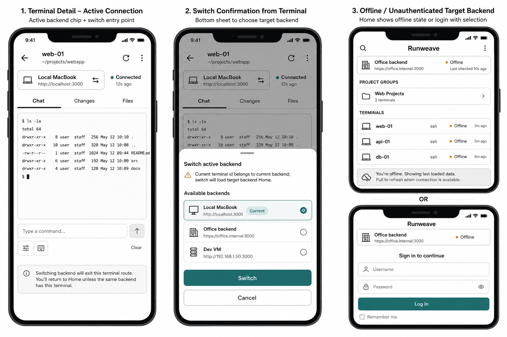
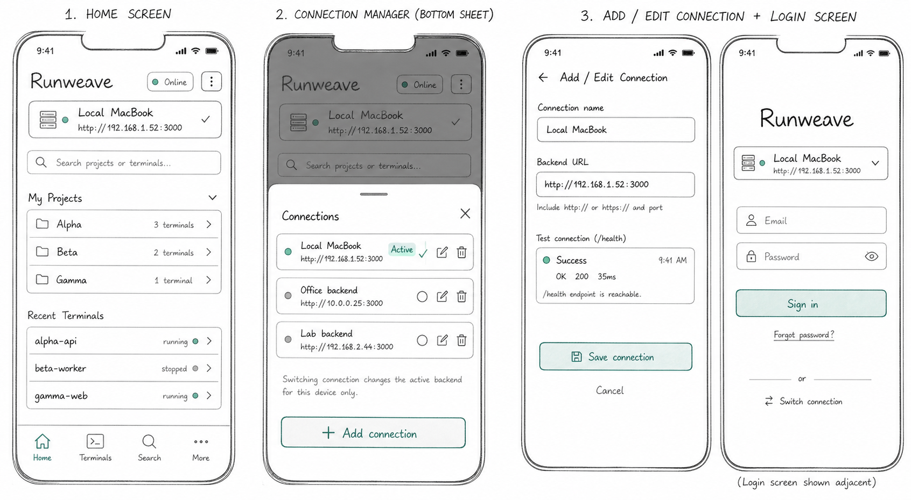

# App 后端连接管理实施计划

日期：2026-06-17

## 目标

让 Ionic React App 支持像桌面端一样管理和切换多个 Runweave 后端连接。App 只管理客户端本地连接配置，业务请求继续复用现有后端接口，包括 `/health`、`/api/auth/*`、`/api/app/home/overview`、terminal session API、terminal WebSocket ticket API 和 terminal-events ticket API。

本计划是 Level 2 结构化实施计划，先解决 App 状态模型和路由行为，再接入移动端 UI。

## 代码事实

- 桌面端连接管理在 `frontend/src/features/connection/use-connections.ts` 中实现，使用 `viewer.connections` 保存 `ConnectionStore`，连接列表和 activeId 都在前端 localStorage 中；新增、编辑、删除、切换连接不会调用新增的后端连接管理接口。
- 桌面端连接 UI 在 `frontend/src/components/connection-page.tsx` 和 `frontend/src/components/connection-switcher.tsx`，其中连接测试直接请求目标后端 `/health`。
- 桌面端认证通过 `frontend/src/features/auth/use-scoped-auth.ts` 按 `connectionId` 隔离 token，切换连接不等同于全局 logout。
- App 当前只有单一后端地址：`app/src/config/api-base.ts` 从 `VITE_RUNWEAVE_API_BASE` 读取默认 `apiBase`。
- App 当前认证存储在 `app/src/store/use-auth-store.ts`，使用单一 key `runweave-app-auth-session`，没有按连接隔离 session。
- App 当前会把 `apiBase` 注入 `app/src/hooks/use-app-session.ts`，再传给 Home、Terminal、`useAppDeviceConnection`、`useAppTerminalEventsConnection` 和所有 service 函数。
- App 终端详情 URL `/terminal/:terminalSessionId` 的 session id 属于某一个后端。切换 active backend 后不能复用旧 URL 中的 terminal id。

## 草图

本轮已用 ChatGPT Image 生成两张基于现有代码能力的低保真草图，并复制到计划资源目录：

- 
- 

草图刻意只表达当前代码已经具备或可通过前端接线获得的能力：本地连接列表、active connection、`/health` 检测、登录前选择连接、Home 显示当前连接、Terminal 切换后回到目标后端上下文。不包含云端同步、扫码配对、团队空间或新增后端连接管理 API。

## 用户可见行为

1. App 首次启动时，如果没有可用 active connection，进入连接管理视图，用户可以添加后端名称和 URL。
2. 如果存在默认 `VITE_RUNWEAVE_API_BASE`，App 可创建一个默认连接作为初始 active connection，避免破坏现有本地开发流程。
3. 登录页显示当前连接名称和 host，用户可以在登录前打开连接管理并切换后端。
4. Home 页显示当前连接名称、host 和现有 device status；更多菜单中增加“连接管理”入口。
5. 连接管理支持新增、编辑、删除、选择 active connection 和手动检测 `/health`。
6. 每个连接的认证 session 独立保存。切到已登录且 token 仍有效的连接时，直接进入 Home；切到未登录连接时进入 Login。
7. 当前 active connection 明确返回 401 时，只清理该连接的认证 session，不影响其他连接。
8. 目标后端网络不可达、`/health` 超时或普通 HTTP 错误时，显示离线或不可用状态，但不清理该连接保存的 token。
9. 在 Terminal 页切换连接时，不沿用当前 URL 的 `terminalSessionId`。切换成功后回到目标连接的 Home；如果目标连接未登录，进入 Login。

## 非目标

- 不新增后端 API，不新增数据库表，不把连接列表同步到服务器。
- 不迁移桌面端 Electron packaged backend 的系统连接能力到 App；App 只管理用户手动配置或默认配置的远程后端 URL。
- 不把 desktop shadcn 连接组件直接复用到 App；App 继续使用 Ionic primitives 和项目已有原生按钮样式。
- 不新增单元测试、Vitest、Node test、coverage 门槛或非 E2E `*.test.*` / `*.spec.*` 文件。
- 不改 Web/Electron 现有连接管理行为，除非实现时选择抽取 Web/App 共同前端 helper 且同一变更补齐两端调用方。

## 数据模型与存储

新增 App 侧连接 store，建议文件：

- `app/src/features/connections/types.ts`
- `app/src/store/use-app-connection-store.ts`

建议类型保持和桌面端 `ConnectionConfig` 语义一致，但 App v1 只使用移动端需要的字段：

```ts
export interface AppConnectionConfig {
  id: string;
  name: string;
  url: string;
  createdAt: number;
  available?: boolean;
  statusMessage?: string | null;
  isDefault?: boolean;
  canEdit?: boolean;
  canDelete?: boolean;
}

export interface AppConnectionStore {
  connections: AppConnectionConfig[];
  activeId: string | null;
}
```

存储 key：

- 连接列表：`runweave-app-connections`
- 按连接隔离的认证索引：`runweave-app-auth-session-index`
- 旧单 session 兼容读取：`runweave-app-auth-session`

认证凭据不直接作为一个多后端 JSON 放入 WebView localStorage。连接列表、activeId、最近选择等非敏感 UI 状态可以继续走 localStorage 或 Capacitor Preferences；`refreshToken` 必须通过认证存储适配层写入原生安全存储。浏览器开发环境允许 localStorage fallback，但该 fallback 只用于 `pnpm app:dev` / Web 调试，不作为 native 上线方案。

认证存储适配层建议语义：

```ts
export interface AppAuthCredentialStore {
  loadSession(connectionId: string): Promise<AppAuthSession | null>;
  saveSession(connectionId: string, session: AppAuthSession): Promise<void>;
  clearSession(connectionId: string): Promise<void>;
  clearAllSessions(): Promise<void>;
}
```

native 实现要求：

- iOS 使用 Keychain；Android 使用 Keystore 支撑的安全存储或项目认可的原生桥接。
- localStorage 中最多保存 connectionId 到凭据记录 key 的索引、兼容迁移标记、非敏感过期时间摘要；不得保存多个后端的 refresh token 明文集合。
- 如果当前依赖中没有安全存储插件或原生桥接，v1 计划必须把 native secure storage 标为上线前阻断项，而不是静默降级到 localStorage。

迁移规则：

1. 第一次加载连接 store 时，如果 `resolveDefaultApiBase()` 非空或当前浏览器 origin 可作为相对 API 基址，创建默认连接。
2. 浏览器开发环境第一次读取新认证 store 时，如果新 store 为空且旧 `runweave-app-auth-session` 存在，可以把旧 session 迁移到当前 active connection 的 fallback store。
3. native 环境读取到旧 `runweave-app-auth-session` 时，不自动把 refresh token 扩散为多连接 localStorage 结构；应要求用户重新登录当前 active connection，登录成功后写入 secure storage，并清理旧 key。
4. 连接删除时，只删除该 connectionId 下的认证 session；如果删除的是 active connection，选择默认连接或第一个剩余连接；没有剩余连接时 activeId 置空。
5. 更新连接 URL 时，保留该连接 session，但下次 verify/refresh 失败后按现有 auth-expired 规则清理。这样避免编辑 host 时立即丢 token。

## 文件范围

### 新增文件

- `app/src/features/connections/types.ts`：App 连接配置类型。
- `app/src/store/use-app-connection-store.ts`：连接列表、active connection、add/update/remove/select、本地持久化。
- `app/src/store/app-auth-credential-store.ts`：定义 `AppAuthCredentialStore`，按 connectionId 保存、读取、清理 `AppAuthSession`。
- `app/src/store/app-auth-credential-store.web.ts`：浏览器开发 fallback，实现 localStorage 读写，并标注仅用于 Web/dev。
- `app/src/store/app-auth-credential-store.native.ts`：native secure storage 适配层；如果项目尚未引入安全存储插件或原生桥接，该文件先作为阻断项占位，不允许 native build 静默使用 Web fallback。
- `app/src/store/use-app-auth-sessions-store.ts`：只维护当前连接认证状态和非敏感索引，敏感 session 读写委托给 `AppAuthCredentialStore`。
- `app/src/components/AppConnectionChip.tsx`：显示当前连接名称和 host，支持打开管理弹层。
- `app/src/components/AppConnectionManager.tsx`：Ionic modal 或 full-screen page 里的连接列表和新增/编辑表单。

### 修改文件

- `app/src/hooks/use-app-session.ts`：从 active connection 派生 `apiBase`，按 connectionId 读写认证，切换连接时清空 overview/error/loading 并重新 verify 当前连接 session。
- `app/src/store/use-auth-store.ts`：重构为按连接认证 store，或拆出新 store 后让该文件变成兼容 re-export；不要继续只暴露全局单 session。
- `app/src/routes/AppRoutes.tsx`：处理没有 active connection、未登录、已登录、Terminal 切换后的路由跳转。
- `app/src/pages/LoginPage.tsx`：展示当前连接 chip，并提供连接管理入口。
- `app/src/pages/HomePage.tsx`：把 header 中单纯的 `apiBase` host 文案升级为当前连接 chip；更多菜单增加“连接管理”。
- `app/src/pages/AppTerminalPage.tsx` 和 `app/src/components/AppTerminalHeader.tsx`：展示当前连接，并在切换连接时回到目标连接 Home 或 Login。
- `app/src/services/device-health.ts`：可复用现有 `getBackendHealth(apiBase, ...)` 做连接管理表单的测试，不新增接口。
- `app/src/main.css`：补 App 连接 chip、连接管理列表、表单、状态点和底部弹层样式，保持 8px radius 和当前 App 紧凑风格。

## 实施步骤

1. 建立 App 连接 store。
   - 实现 `runweave-app-connections` 读写、URL normalize、默认连接生成、active connection 解析。
   - 验证：清空 localStorage 后，有默认 API base 时 active connection 可解析；无默认 API base 时返回 `null` 并让路由进入连接管理。

2. 建立按连接隔离的认证 store。
   - 先定义 `AppAuthCredentialStore` 接口，不让 UI/hook 直接碰具体存储介质。
   - native 环境通过 secure storage 保存 `connectionId -> AppAuthSession`；Web/dev 环境使用 localStorage fallback。
   - 兼容读取旧 `runweave-app-auth-session`：Web/dev 可迁移到 fallback；native 要求重新登录并清理旧 key。
   - 验证：A/B 两个连接分别登录后，切换连接不会覆盖对方 token；删除 A 不影响 B；native localStorage 中不出现多个 refresh token 明文集合。

3. 改造 `useAppSession` 为 active connection 驱动。
   - `apiBase` 从 active connection 的 `url` 派生。
   - `login`、`refreshSession`、`verifySession`、`logout` 只作用于当前 connectionId。
   - active connection 变化时关闭旧 overview 语义：清空 loading/error，重建 device health，重新 verify 当前连接 session，重新连接 terminal-events。
   - 验证：切换连接后 `/api/app/home/overview`、terminal-events ticket 和 `/health` 都打到新 `apiBase`。

4. 接入登录页和首页 UI。
   - Login 展示当前连接 chip，允许登录前切换。
   - Home header 展示连接名称和 host，更多菜单增加“连接管理”。
   - 连接管理弹层支持列表、选择、添加、编辑、删除和 `/health` 检测。
   - 验证：用户能从 Login 和 Home 打开连接管理；新增连接后可直接成为 active connection。

5. 接入 Terminal 页切换行为。
   - Terminal header 展示当前连接 chip。
   - 用户从 Terminal 切换到另一个 connection 时，先关闭当前连接管理弹层，再 `history.replace("/home")` 或由 `AppRoutes` 根据目标连接 auth 状态进入 `/login`。
   - 不尝试把旧 `terminalSessionId` 带到目标后端。
   - 验证：从 `/terminal/old-id` 切到 B 后，地址不再保留 `old-id`；B 的 Home 加载 B 后端 overview。

6. 处理离线和 401 边界。
   - `/health` 失败、网络超时、terminal-events close 只更新 active connection 的 deviceConnection 离线状态，不清理 token。
   - `/api/auth/verify`、`refresh`、业务 API 明确 401 时，只清理当前 connectionId 的 session。
   - 验证：B 后端关停后切换到 B 显示离线；切回 A 仍保持 A 登录态。

7. 补支持日志上下文。
   - 在 support log 中继续只记录 host、route、deviceStatus 等非敏感信息。
   - 可以增加 `connectionId` 和 `connectionName`，但不记录 accessToken、refreshToken、完整敏感 URL query。
   - 验证：导出的 support logs 不包含 Authorization、token 或密码。

8. 补 native 安全存储上线门禁。
   - 如果选择安全存储插件，需要在 `app/package.json`、Capacitor 配置和 native 工程中加入对应依赖与初始化。
   - 如果当前阶段没有引入插件或原生桥接，计划实施到 Web/dev fallback 后必须停止在 native 发布前，不能把 fallback 当生产实现。
   - 验证：native build 路径明确使用 secure storage；缺少 secure storage 时构建或启动阶段给出明确错误。

## 验证计划

静态验证：

```bash
pnpm --filter @runweave/app typecheck
pnpm --filter @runweave/app build
```

如果实现时触碰 `packages/common` 或桌面端前端：

```bash
pnpm --filter ./packages/common typecheck
pnpm --filter ./frontend typecheck
```

浏览器/App 行为验证必须使用 `$playwright-cli`，并先启动 App dev：

```bash
pnpm app:dev
```

手工验收路径：

1. 清空 App localStorage，打开 App；如果没有默认 API base，必须先进入连接管理；如果有默认 API base，登录页显示默认连接 chip。
2. 添加连接 A 和 B，分别使用 `/health` 检测；A/B 都能保存，active connection 显示正确名称和 host。
3. 在 A 登录并进入 Home；切到 B，若 B 未登录则进入 Login；B 登录后进入 B 的 Home。
4. 从 B 切回 A，A token 未过期时不重新登录，Home 加载 A 的 `/api/app/home/overview`。
5. 在 A 的 Terminal detail 打开连接管理并切到 B；页面不能继续停留在 `/terminal/<A-session-id>`，应进入 B 的 Home 或 Login。
6. 停止 B 后端或配置一个不可达 URL，切到 B 后显示离线/不可用；再切回 A，A 的登录态和列表不受影响。
7. 让 B 返回真实 401 后，App 只清理 B 的认证 session；A 仍保持登录。
8. 在 native 环境检查 WebView localStorage，确认不存在 `runweave-app-auth-sessions` 这类多后端 refresh token JSON，也不存在多个 refresh token 明文。

失败判断：

- 任意请求仍打到切换前的 `apiBase`，视为失败。
- 切换连接后仍使用旧后端 `terminalSessionId`，视为失败。
- 网络失败导致其他连接 token 被清理，视为失败。
- native 路径把多个后端 refresh token 明文写入 WebView localStorage，视为上线阻断失败。
- 新增非 E2E 测试文件，视为违反仓库测试约束。

## 风险与回滚

- 最大风险是旧单 session 到多 session 的迁移。回滚时可以保留旧 `runweave-app-auth-session` 读取逻辑，并只禁用连接管理入口。
- 多后端 refresh token 会扩大凭据暴露面。上线前必须完成 native secure storage 适配；Web/dev localStorage fallback 只能服务浏览器调试。
- Terminal 页切换最容易产生旧 session id 混用。v1 直接回 Home，比尝试跨后端恢复 terminal 更稳。
- App Native 环境如果没有 `VITE_RUNWEAVE_API_BASE`，必须让用户先添加连接，不能依赖相对 URL。
- 本方案不改后端接口，服务端回滚风险低；主要回归面在 App 本地存储、路由和 WebSocket 重连。

## 交付标准

- App 可以新增、编辑、删除、检测和选择多个后端连接。
- App 认证态按连接隔离，切换连接不会互相覆盖 token。
- native 环境 refresh token 通过安全存储适配层保存；localStorage fallback 仅用于浏览器开发。
- Home、Login、Terminal 均能看到当前连接并进入连接管理。
- Terminal 切换连接后不会复用旧后端 terminal id。
- 所有业务请求继续复用现有后端接口，没有新增后端路由。
- `pnpm --filter @runweave/app typecheck` 和 `pnpm --filter @runweave/app build` 通过。
- 需要打开页面验证的场景全部通过 `$playwright-cli` 执行并记录结果。
