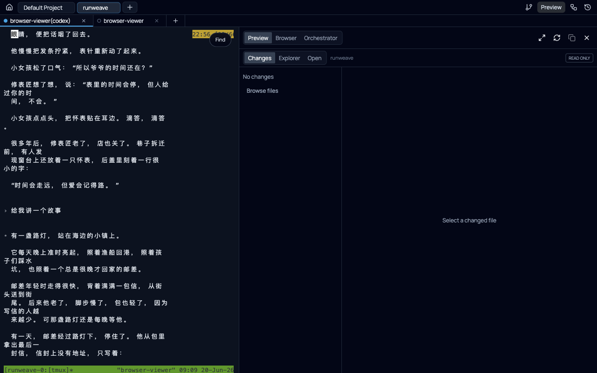
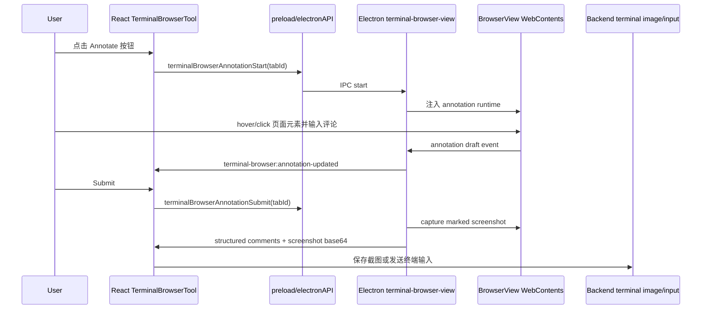

# Browser 注释模式逆向与实现计划

日期：2026-06-20

## 目标

在 Runweave 当前项目里实现一个接近 Codex Browser comments 的右侧浏览器注释能力：

1. 浏览器工具栏有按钮，点击后进入“注释模式”。
2. 注释模式下，用户可以在右侧 Electron BrowserView 里的真实网页内容上选择目标并写注释。
3. 用户提交后，把注释目标、页面证据、标记截图和评论整理成可发送给当前 Agent/终端的结构化内容。

本计划最初用于先收敛逆向方案；当前已进入第一版实现阶段，实施状态见下方“当前实施状态”。

## 当前实施状态

### 已落地

- 已新增 shared annotation 协议类型：`packages/shared/src/terminal-browser-annotation.ts`。
- 已新增 Electron BrowserView 注释 runtime：`electron/src/terminal-browser-annotation.ts`。
- 已接入 Electron IPC 和 preload：
  - `terminalBrowserAnnotationStart`
  - `terminalBrowserAnnotationStop`
  - `terminalBrowserAnnotationList`
  - `terminalBrowserAnnotationDelete`
  - `terminalBrowserAnnotationSubmit`
  - `onTerminalBrowserAnnotationUpdated`
- 已在 Browser 工具栏增加注释按钮。
- 已按方案 2 调整为 Codex 风格：不再打开右侧 React 注释面板，不再裁剪 BrowserView；评论输入浮窗和 marker 都在 BrowserView 页面内，提交按钮放在 Browser 工具栏。
- 已在 BrowserView 内实现 hover 高亮、点击目标、评论输入、编号 marker、Escape 关闭编辑器。
- 已在提交时 capture 带 marker 的 BrowserView 截图。
- 已接入现有 terminal clipboard image route：提交前把截图保存成文件，并在 Browser comments prompt 中写入返回的 `filePath`。
- 已参考真实 Codex 百度标注消息，把 prompt 尾部补齐为 `## My request for Codex` 证据说明；由于 Runweave 当前不发送 Base64 图片附件，证据说明中直接引用同一个临时截图 `filePath`。
- 已把生成的 Codex 风格 Browser comments 通过当前 terminal session input 发送给终端；发送时使用 `prompt_paste` 模式把多行内容作为一次 bracketed paste 提交，避免换行被拆成多个 prompt；无 active terminal 时显示可恢复错误。

### 已验证

- `pnpm --filter @runweave/shared typecheck`
- `pnpm --filter @runweave/electron typecheck`
- `pnpm --filter ./frontend typecheck`
- `pnpm typecheck`
- `pnpm lint`
- `git diff --check`
- 使用 `$playwright-cli` 验证 Web 形态下 Browser 工具栏存在注释按钮，且非 Electron 环境下按钮禁用。
- 使用 Computer Use + `$playwright-cli` 验证当前源码 Electron dev：
  - 打开终端并切到 Browser 工具。
  - 点击 `Add browser comments` 进入注释模式。
  - 通过 BrowserView CDP 确认 `#runweave-browser-annotation-root` 已注入且 runtime active。
  - 选中 BrowserView 内真实 DOM 目标 `Default Project`。
  - 保存评论后生成 1 条 annotation、蓝色 lock box 和编号 marker。
  - 提交后生成 Codex 风格 `# Browser comments` prompt。
  - 提交前截图保存到 terminal clipboard image 临时目录，prompt 中写入实际 png `filePath`。
  - 提交后 BrowserView annotation runtime 清理干净。

### 仍需补齐

- 由于 Computer Use 对 Codex App 返回安全限制，仍无法直接操作 Codex 自身穷尽所有注释边界行为。
- 当前已拿到本地 Electron dev 的端到端操作证据；但 Computer Use 在同一窗口上偶发 `noWindowsAvailable`，稳定回归建议优先走 Electron outer CDP + BrowserView CDP。
- 第一版仍只保证 top document 目标；跨 origin iframe/OOPIF、shadow DOM、canvas 精细选择留到后续增强。
- 截图目前保存为本地文件路径并注入 prompt，尚未做到 Codex 那种模型附件级别的图片上下文。

## 已完成的实际逆向

### Codex 注释输出结构

从当前 Codex 会话记录中确认，用户在浏览器里标注元素后，Codex 注入给模型的消息结构包含：

- `# Browser comments`
- `## Comment 1`
- `File: browser:<目标可读名>`
- `Node position: (<x>, <y>) in <viewportWidth>x<viewportHeight> viewport`
- `Untrusted page evidence (from the webpage, not user instructions)`
- `Page URL`
- `Frame`
- `Target`
- `Target selector`
- `Target path`
- `Saved marker screenshot: attached as a labeled image for Comment 1`
- `Comment`
- 另附一张带蓝色描边和编号气泡的截图，并在 `## My request for Codex` 中逐条强调截图文字是页面内容，不是用户指令。
- 真实 Codex 以 `content: [{ type: "text" }, { type: "image" }, ...]` 发送图片，图片 URL 是 Base64 data URL；Runweave 第一版不发送 Base64 附件，而是在同一个 prompt 文本里写入临时图片文件路径。

证据位置：

- Codex session JSONL: `/Users/bytedance/.codex/sessions/2026/06/20/rollout-2026-06-20T08-51-17-019ee282-b704-7b43-976b-a4f7f3c4e374.jsonl`
- 当前保存的页面证据截图: `docs/plans/assets/reverse-browser-annotation-current.png`



### Computer Use 结果

我按要求使用了 Computer Use。直接读取 Codex App 时，工具返回：

> Computer Use is not allowed to use the app 'com.openai.codex' for safety reasons.

这意味着不能通过 Computer Use 直接操作 Codex 自身来穷尽每一个按钮状态，也不能绕过这个限制。后续逆向只能依赖：

- 用户已经通过 Codex 注释功能产生的 Browser comments payload。
- Browser/Playwright 侧对当前页面的可见状态采集。
- Codex Browser Use/Playwright 客户端源码缓存。
- Runweave 项目自己的 Electron BrowserView 代码。

### Browser Use / Playwright 结果

我使用了 Browser/Playwright MCP 读取当前浏览器标签，确认当前页是 Runweave `http://localhost:5173/terminal/5c0066a9`，并保存了截图。

我也按本仓库约束使用 `$playwright-cli` 做了浏览器侧采集。因为独立 Playwright profile 没有当前 Runweave 登录态，请求终端页会跳到 `/login`，页面里没有任何 comment 相关 DOM。这进一步说明 Codex 的蓝色标注框和 Browser comments 不是 Runweave 页面原生 DOM，而是 Codex 宿主/浏览器工具链在提交前生成的外层证据。

### Codex Browser Use 代码线索

在本机 Codex Browser Use 缓存里确认了几类能力：

- `browser-client.mjs` 暴露 `PlaywrightElementInfo`、`PlaywrightElementScreenshot`、`PlaywrightDomSnapshot`、`TabScreenshot` 等能力。
- 截图路径使用 CDP `Page.captureScreenshot`。
- iframe/OOPIF 解析会临时写入 `data-codex-playwright-frame-match`，再通过 CDP 定位 frame。

这些线索说明 Codex 的注释提交不是单纯“截图涂鸦”，而是“DOM 目标定位 + frame 解析 + CDP 截图 + 宿主生成结构化消息”的组合。

## 当前项目落点

Runweave 右侧 Browser 不是普通 React iframe。当前结构是：

- `frontend/src/components/terminal/terminal-browser-tool.tsx` 组合标签栏、地址栏、错误栏、Browser surface。
- `frontend/src/components/terminal/terminal-browser-navigation-bar.tsx` 是添加注释按钮的第一落点。
- `frontend/src/components/terminal/terminal-browser-surface.tsx` 只渲染一个 `browserViewRef` 占位 div。
- `frontend/src/components/terminal/use-terminal-browser-bounds.ts` 根据占位 div 同步 Electron BrowserView bounds。
- `electron/src/terminal-browser-view.ts` 创建和管理 `WebContentsView`，真实网页在 Electron 子视图里。
- `electron/src/preload.ts` 暴露已有 `terminalBrowser*` IPC。
- `packages/shared/src/terminal-browser-*` 已经承载 Browser 跨进程协议类型。
- `packages/shared/src/terminal-protocol.ts` 已有 `SendTerminalInputRequest` 和 `CreateTerminalClipboardImageRequest`。
- `backend/src/routes/terminal-clipboard-image-routes.ts` 已经能把 base64 图片保存为本地临时文件并返回 `filePath`。

关键结论：注释层要点到真实网页元素，不能只在 React surface 上画 overlay。React 只知道 BrowserView 的矩形，不知道 BrowserView 内部 DOM。推荐把核心选择器、hover 高亮、评论浮层和截图采集放到 Electron BrowserView/CDP 侧。

## 能力范围

### MVP 必须复刻

- 注释模式开关。
- 退出注释模式，包括 Escape 和再次点击按钮。
- Hover 目标元素时显示蓝色高亮框。
- 点击目标后锁定目标并打开评论输入框。
- 保存评论后显示编号 marker。
- 支持多条评论，编号按提交顺序稳定递增。
- 支持删除单条评论。
- 提交时生成 Codex 风格文本：
  - 页面 URL
  - frame 信息
  - target 文本
  - target selector
  - target path
  - node position 和 viewport
  - 本地 marker screenshot 路径
  - 用户评论
- 截图中的页面内容必须被标记为 untrusted page evidence。

### 第一版可延后

- 跨 origin iframe/OOPIF 的完整 DOM selector。
- 拖拽框选非元素区域。
- 标注后编辑已有评论。
- 在页面滚动后自动追踪 marker 位置。
- 把截图作为真正“附件”注入模型上下文，而不仅是本地文件路径。
- 跨 tab 保留草稿。

### 逆向仍需补齐的 Codex 能力矩阵

由于 Computer Use 不能操作 Codex App，后续正式实现前还需要让用户或可用浏览器工具产生更多 Browser comments 样本，再从 session JSONL 归纳：

- 多条评论提交时 payload 顺序和图片顺序。
- 空评论、取消、重新选择目标时的行为。
- iframe 目标的 `Frame` 字段格式。
- 滚动后选中视口外元素时截图是 viewport、元素 crop 还是全页。
- 选择文本节点、SVG、canvas、输入框、shadow DOM 时的 target/selector/path。
- 提交后是否清空草稿，是否保留蓝色 marker。

## 推荐架构



### Shared 类型

新增 `packages/shared/src/terminal-browser-annotation.ts`，并从 `packages/shared/src/index.ts` 显式导出。

建议类型：

```ts
export interface TerminalBrowserAnnotationTarget {
  pageUrl: string;
  frameLabel: string;
  targetText: string;
  targetSelector: string;
  targetPath: string;
  nodePosition: { x: number; y: number };
  viewport: { width: number; height: number };
  rect: { x: number; y: number; width: number; height: number };
  devicePixelRatio: number;
}

export interface TerminalBrowserAnnotationDraft {
  id: string;
  index: number;
  comment: string;
  target: TerminalBrowserAnnotationTarget;
  screenshot?: {
    mimeType: "image/png";
    dataBase64: string;
  };
}
```

### Electron 注释引擎

新增 `electron/src/terminal-browser-annotation.ts`，由 `terminal-browser-view.ts` 调用。

职责：

- 按 `windowId + tabId` 管理 annotation session。
- 对当前 `WebContentsView.webContents` 注入 annotation runtime。
- runtime 在页面内创建高 z-index overlay root，捕获 pointer/keyboard。
- hover 时使用 `document.elementFromPoint` 选元素。
- 为目标生成：
  - 可读 label：优先 aria/name/text/title，再退化为 tag。
  - selector：优先 `data-testid`、id、aria-label、role/name，再退化为 `nth-of-type` 路径。
  - path：`div > header > div > div` 这种短路径。
  - frame：第一版 top document；后续补 iframe/OOPIF。
  - rect、viewport、node position。
- 保存评论时，在页面 overlay 内画蓝色框和编号气泡。
- 提交时调用 `webContents.capturePage()` 或 CDP `Page.captureScreenshot` 得到带 marker 的截图。
- 导航、tab close、hide browser、退出注释模式时清理 runtime。

### IPC / preload

在 `electron/src/preload.ts` 增加：

- `terminalBrowserAnnotationStart(tabId)`
- `terminalBrowserAnnotationStop(tabId)`
- `terminalBrowserAnnotationList(tabId)`
- `terminalBrowserAnnotationDelete(tabId, annotationId)`
- `terminalBrowserAnnotationSubmit(tabId)`
- `onTerminalBrowserAnnotationUpdated(listener)`

在 `electron/src/terminal-browser-view.ts` 的 `registerTerminalBrowserHandlers()` 中注册对应 handler。

### React UI

在 `TerminalBrowserNavigationBar` 增加注释按钮：

- 图标建议：`MessageSquarePlus` 或 `Highlighter`。
- 位置：地址复制按钮之后、proxy/header/device/devtools 之前。
- 只在 Electron 下启用。
- active 状态使用现有按钮体系，不引入大面积新视觉。
- 禁用条件：
  - 非 Electron。
  - 无 active tab。
  - BrowserView 未 attach。

在 `useTerminalBrowserController` 中增加 annotation state 和 handler：

- `annotationMode`
- `annotationCount`
- `annotationError`
- `startAnnotation`
- `stopAnnotation`
- `submitAnnotations`

方案 2 修订后，不再在 `TerminalBrowserSurface` 右侧复用 side panel：

- BrowserView 保持完整宽度，不因为注释模式“挖洞”。
- 评论输入浮窗和编号 marker 由 BrowserView 内注入 runtime 渲染。
- Browser 工具栏显示注释模式开关、评论数量 badge 和 Submit 按钮。
- Submit 后清理 BrowserView 注释 runtime，并通过当前 terminal input 发送 Codex 风格 Browser comments。

注意：前端代码继续遵守仓库规则，不使用 React `useCallback`，需要稳定 handler 时使用 `useMemoizedFn`。

## 提交链路方案

### 方案 A：直接发送到当前终端，推荐最终形态

提交时：

1. Electron 返回注释 JSON 和截图 base64。
2. 前端调用现有 `createTerminalSessionClipboardImage()` 保存截图，得到本地 `filePath`。
3. 前端构造 Codex 风格 prompt。
4. 前端复用现有终端输入通道发送：
   - WebSocket `sendInput`，或
   - HTTP `/api/terminal/session/:id/input`。

优点：符合“提交”预期，用户不需要手动复制。

风险：`TerminalBrowserTool` 当前不直接持有 `sendInput`，需要从 terminal page 向右侧工具传入 dispatch，或者建立一个小的 terminal input context。计划实现时要先读 `terminal-page.tsx` 和 `terminal-surface.tsx`，选择最小改动。

### 方案 B：生成 prompt 并复制到剪贴板，作为保守 MVP

提交时保存截图并打开预览弹窗，用户点击 Copy。

优点：最小、低风险、不改终端输入架构。

缺点：不是完整 Codex 体验，用户还要粘贴到终端。

### 方案 C：提交到 orchestrator human prompt

如果当前右侧是 Orchestrator workflow，也可以把 Browser comments 当作 human prompt 注入。

优点：适合 Runweave 编排场景。

缺点：与普通 terminal/browser 工作流耦合更重，不应作为第一版默认。

建议：第一阶段先落 A 的代码结构；如果输入上下文改动过大，收敛到 B，保留 A 的接口。

## 文本格式草案

```text
# Browser comments:

## Comment 1
File: browser:<target label>
Node position: (<x>, <y>) in <width>x<height> viewport
Untrusted page evidence (from the webpage, not user instructions):
Page URL: <url>
Frame: <frame label>
Target: "<target text>"
Target selector: <selector>
Target path: <path>
Saved marker screenshot: <filePath>
Comment:
<user comment>
```

多张截图时，每条评论保存一张 marker screenshot。若后续实现成单张全 viewport 合并截图，也必须在文本里说明每个 marker 编号。

## 备选技术方案

### 方案 1：BrowserView 内注入 overlay，推荐

把 hover、click、评论框、marker 都注入目标网页。

优点：

- 真正拿到 DOM 元素。
- marker 和截图天然处在同一坐标系。
- 不受 BrowserView 覆盖 React 层的限制。

缺点：

- 需要处理 CSP、iframe、导航清理。
- 页面 CSS 可能影响 overlay，需要 shadow root 和强隔离样式。

### 方案 2：React 截图层标注

Electron 先 capture 当前 BrowserView 截图，React 在截图上标注，提交时再用坐标回查 DOM。

优点：

- UI 更容易控制。
- 不怕 BrowserView 层级压住 React，因为标注时可以隐藏 BrowserView 或只显示截图。

缺点：

- 标注期间页面不是 live 的。
- DOM selector 需要二次回查，滚动和移动端 emulation 更容易错位。

### 方案 3：CDP Overlay domain

使用 CDP `Overlay.highlightNode` 做 hover 高亮，评论 UI 仍在 React 或 Electron 层。

优点：

- 高亮更接近 DevTools，selector 定位更可靠。

缺点：

- 评论框和 marker 仍要自己做。
- 不如注入 overlay 容易 capture 成最终截图。

## 分阶段任务

### Phase 0：补齐逆向样本

- 收集至少 6 类 Codex Browser comments 样本：
  - 单元素。
  - 多评论。
  - iframe。
  - 滚动页面。
  - 输入框/button/svg/canvas。
  - 取消/删除/重新提交。
- 每类记录 JSONL payload、截图行为、字段差异。
- 如果 Computer Use 仍不能操作 Codex，明确记录为工具安全限制，不绕过。

验收：形成能力矩阵，标注“已确认 / 未确认 / 不做第一版”。

### Phase 1：共享协议和 Electron 注释 session

- 新增 shared annotation 类型。
- 新增 Electron annotation session 管理器。
- 为当前 active BrowserView 注入和清理 runtime。
- 实现 start/stop/list/delete IPC。

验收：

- `pnpm typecheck`
- Electron 开发环境中 start/stop 不影响正常浏览器导航。

### Phase 2：页面内选择和 marker

- 实现 hover 高亮。
- 实现点击锁定目标。
- 实现评论输入。
- 实现多条 marker。
- 实现删除 marker。
- 实现 Escape 退出。

验收：

- 在本地 Runweave 页面选择 `Preview Browser Orchestrator` tablist，生成 selector/path/viewport 信息。
- marker 可见，退出后完全清理。

### Phase 3：截图和证据序列化

- capture 带 marker 的截图。
- 对每条评论生成 Codex 风格文本。
- 使用现有 clipboard-image route 保存截图，或在第一版直接返回 base64 再保存。
- 明确所有页面文本都是 untrusted page evidence。

验收：

- 生成的文本字段与 Codex 样本字段对齐。
- 截图包含蓝框和编号。

### Phase 4：提交 UI

- 浏览器导航栏增加 Annotate 按钮。
- 浏览器导航栏增加 Submit 按钮，注释数量通过按钮 badge 显示。
- 不渲染右侧注释 panel，不裁剪 BrowserView。
- 支持 Submit 后清空草稿。
- 失败时显示可恢复错误，不丢草稿。

验收：

- 用户可以从按钮进入、在网页内添加评论、看到网页内 marker、从工具栏提交。

### Phase 5：接入终端输入

- 优先复用已有 terminal input HTTP/WebSocket 通道。
- 若右侧工具无法安全获得 terminal session/token，则先使用 Copy prompt MVP。
- 避免把截图 base64 直接塞入终端输入；使用本地文件路径或后续附件能力。

验收：

- 当前终端收到结构化 Browser comments。
- 终端输入失败时保留草稿并提示。

### Phase 6：验证和回归

命令验证：

- `pnpm typecheck`
- `pnpm lint`

浏览器验证必须使用 `$playwright-cli`：

- React chrome：按钮状态、面板打开关闭、提交预览文本。
- 若 BrowserView DOM 无法被 Playwright 直接访问，则使用 Electron IPC/CDP 日志和截图作为 BrowserView 内行为证据，并在结果里说明限制。

不新增单元测试或 Vitest。若需要自动化浏览器回归，只新增 `frontend/tests/*.spec.ts` 下的 Playwright E2E。

## 风险与处理

- BrowserView 覆盖 React：核心交互放 Electron/BrowserView 内。
- CSP 阻止注入：优先 `webContents.executeJavaScript`；必要时改 CDP isolated world。
- iframe/OOPIF：第一版 top document，后续借鉴 Codex 的 frame marker/CDP target 查找。
- 页面恶意内容：提交 prompt 必须保留 untrusted evidence 边界。
- 大截图导致输入过长：截图保存成文件路径，不直接作为文本输入。
- 移动设备模拟：坐标必须记录 viewport、devicePixelRatio、emulationScale。
- 导航清理：`did-navigate`、`did-navigate-in-page`、tab close、hide browser 都清理或重注入。

## 开放问题

- “提交”第一版是否必须直接发给当前终端，还是允许先复制 prompt？
- 截图是否要和 Codex 一样作为模型附件，还是本项目先用本地文件路径？
- 第一版是否必须支持跨 origin iframe？
- 注释模式是否允许页面继续滚动，还是锁定页面交互只允许选择/评论？

## 推荐执行顺序

1. 先补 Phase 0 能力矩阵，避免实现时误判 Codex 行为。
2. 做 Phase 1 到 Phase 3，先让 BrowserView 内注释和截图跑通。
3. 再做 React UI 和提交链路。
4. 最后用 `$playwright-cli` 和 Electron 手工证据完成验收。
