# Agent 自进化与反思 V1 实施计划

> 日期：2026-07-19
> 级别：L3（新持久化域、跨 Backend 并发、外部 Agent 进程、运行时注入）
> 来源：`docs/architecture-flows/agent-self-evolution-v1/` 方案讨论与 grilling 决策
> 验收合同：
>
> - `docs/testing/evolution/agent-self-evolution-core.testplan.yaml`
> - `docs/testing/evolution/agent-self-evolution-activation.testplan.yaml`

## 1. 明确结论

V1 不是“每天生成一份总结”，而是一个由 Backend 托管、可手动或定时触发的长期学习控制面：它从现有 DB 冻结一次可审计的证据视图，让两个独立 Agent 先分别调查、再交叉质疑，把事实、判断、分歧和新颖性分开保存，最终维护可持续修订的 Insight 与候选资产。

第一版同时交付两条链路，不把其中一条推迟成没有日期的后续工作：

1. 运行与分析链路：Trigger → Evolution Run → Context Pack → 双 Agent 分析 → Claim/Novelty → Insight revision。
2. 激活与验证链路：Memory Candidate → Shadow → 检索/选择 → Control/Canary → RuntimeTrace → Revalidation/Promotion/Rollback。

第二条链路的代码和真实 canary 能力随 V1 落地，但默认策略关闭注入。只有某个主项目的 scope policy 被明确开启，且资产达到所需证据等级后，才允许影响 Agent Team 的 `code` worker。Prompt、Skill、Routing、Product、Code 在 V1 只形成结构化提案，不自动修改任何运行时或仓库。

## 2. 成功标准

### 2.1 工程完成标准

- Stable、Beta、Dev 任一 Backend 存活时都能承接任务，多进程共用 `~/.runweave/evolution/learning.sqlite`，全机同一时刻最多执行 1 个 Evolution Run。
- 手动触发和持久化 Schedule 都进入同一个 `EvolutionRunService`，不复制分析流程；错过多个时间槽只合并成一次 catch-up。
- 同一主项目的多个 workspace/worktree 共用同一 `learningScopeId`；workspace 增删、改名和路径消失不会拆分历史知识。
- standard profile 至少运行两个首轮相互不可见的 Analyst，之后才交叉质疑；证据不足时能保留 contested/unknown，而不是强制共识。
- 没有实质新知识时，Run 能以 `no_material_novelty` 正常结束，产出 0 个 Insight revision 和 0 个 Candidate。
- `activity.sqlite` 不改 schema、不接收学习结果；所有派生知识进入新的 `learning.sqlite`。
- quick/standard 的本地 Codex/Trae 进程只能使用 run-scoped 只读工具，不能直接读 DB、写用户 workspace、使用用户 MCP、联网或请求审批。
- `/evolution` 页面和 `rw evolution` CLI 使用同一 Backend API；CLI 和 Agent 都不直接打开 SQLite。
- V1 至少在明确 opt-in 的项目上完成 1 次真实 Memory live canary 闭环，证明检索、注入、control/canary 分配、后续客观结果关联和回滚链路可运行；这只证明链路成立，不宣称长期统计改善。
- 两份 YAML 验收合同通过 `pnpm testplan:validate`，新增 verifier、类型检查、lint、build 与真实浏览器验收全部有结果记录。

### 2.2 不把以下结果冒充成功

- 模型说“建议有帮助”不等于行为改善。
- Run 或命令 `completed` 不等于用户目标成功。
- 两个 Agent 给出相同文本不等于结论已被事实证实。
- E1 模型互评或 E2 反事实推演不等于 E3/E4 行为证据。
- 一次 canary 跑通只证明链路可用，不等于可自动全量推广。

## 3. 当前代码基线与差距

| 能力              | 当前可复用事实                                                                                                                        | V1 差距                                                             |
| ----------------- | ------------------------------------------------------------------------------------------------------------------------------------- | ------------------------------------------------------------------- |
| Activity 数据     | `backend/src/activity/` 由 Backend worker 独占 SQLite 访问，已有查询、保留期、删除和加密边界                                          | 缺少按学习 scope 和 snapshot high-watermark 的内部只读视图          |
| 跨 workspace 身份 | `packages/shared/src/terminal/project-context.ts` 已有 `resolveTerminalParentProjectId(projectId)`，子 projectId 保留 parent identity | 缺少显式 `learningScopeId` 合约和历史子 workspace 查询              |
| Work History      | `backend/src/work-history/` 已统一 Activity 与 App Server 数据                                                                        | 缺少冻结 revision/cursor 与 Evolution 专用查询工具                  |
| Agent Team        | 已有 primary run、dispatch、round、review/behavior gate 和 startup prompt 构建链路                                                    | 缺少 Episode 映射、Memory 检索、显式注入块和 RuntimeTrace           |
| Provider          | 本机 Codex 与 Trae CLI 均支持非交互 exec、JSON/schema 输出、ephemeral、read-only sandbox                                              | 缺少统一 adapter、预算、进程回收、run-scoped MCP 和结构化结果校验   |
| Backend 生命周期  | `backend/src/bootstrap/runtime-services.ts` 和 `backend/src/index.ts` 管理服务创建、监听与 shutdown                                   | 缺少共享 lease、Scheduler、恢复状态机和 provider child process 清理 |
| Web/CLI           | 前端已有独立页面路由模式；CLI 已有命令模块与 Backend API 客户端                                                                       | 缺少 `/evolution` 和 `rw evolution` 命令族                          |
| 架构原型          | `docs/architecture-flows/agent-self-evolution-v1/` 能说明概念                                                                         | 其 `app.js` 是讲解原型，不是产品代码，不能作为运行时实现复用        |

## 4. 冻结架构

```mermaid
flowchart LR
  Manual[Manual trigger] --> RunService[EvolutionRunService]
  Schedule[Persistent schedule] --> Scheduler[EvolutionScheduler]
  Event[Configured event adapter] --> RunService
  Scheduler --> RunService

  RunService --> Lease[(global lease\nlearning.sqlite)]
  Lease --> Pack[Context Pack builder]
  Activity[(activity.sqlite)] --> Source[Backend source readers]
  AppServer[(App Server / Work History)] --> Source
  Repo[AGENTS / canonical docs / source] --> Source
  Source --> Pack

  Pack --> MCP[run-scoped read-only MCP]
  MCP --> A[Analyst A]
  MCP --> B[Analyst B]
  A --> Cross[Cross-question]
  B --> Cross
  Cross --> Claims[Claim ledger]
  Claims --> Novelty[Novelty Gate]
  Novelty --> Insight[(Insight revisions)]
  Insight --> Candidate[Candidate assets]

  Candidate --> Shadow[Memory shadow]
  Shadow --> Retrieve[Hard filter + FTS + LLM selector]
  Retrieve --> Policy{scope policy enabled?}
  Policy -->|no| Trace[RuntimeTrace: not exposed]
  Policy -->|yes| Split[control / canary]
  Split --> Inject[Agent Team code worker\nexplicit context block]
  Split --> Trace
  Inject --> Trace
  Trace --> Eval[E3/E4 evaluation and drift]
  Eval --> Candidate
```



### 4.1 运行边界

- Evolution Scheduler 属于 Backend runtime。Electron、Web 和 App 只是控制端；没有新 daemon，也不要求桌面窗口常驻。
- Stable、Beta、Dev Backend 共享一个用户级数据库和全局 lease。第一个成功 claim lease 的兼容 Backend 执行，其他 Backend 只排队和展示状态。
- 全机 `maxActiveRuns=1` 是 V1 硬约束，不做按项目并发。一个 Run 内部可有多个 Agent attempt，但都计入同一预算。
- 用户主动工作优先于后台 Schedule。manual Run 优先级高于 schedule；正在执行的 Run 不被粗暴抢占，新任务只调整队列顺序。
- `activity.sqlite` 继续是行为事实源；`learning.sqlite` 只保存控制状态和派生知识，不反向修改 Activity。

### 4.2 触发模型

所有来源只调用一个入口：

```ts
type EvolutionTrigger =
  | { type: "manual"; requestedBy: string }
  | { type: "schedule"; scheduleId: string; dueAt: string }
  | { type: "event"; eventKey: string; sourceRef: string };
```

- manual：由 API、UI 或 CLI 创建。
- schedule：持久化 cron expression、timezone、profile、provider policy、budget 和增量范围；Backend 重启后恢复。
- event：V1 先落统一合约和内部 adapter，不擅自绑定某个产品事件。没有被显式配置的 event source 不自动创建 Run。
- 三者都只创建 Run 记录；不能直接启动 Provider 或绕过 lease。

### 4.3 Analysis Profile

| Profile          | 首轮调查             | 质疑/裁决                            | Replay                         | 典型用途               |
| ---------------- | -------------------- | ------------------------------------ | ------------------------------ | ---------------------- |
| quick            | 1 Analyst            | 结构校验；不启 Judge                 | 0                              | 人工快速扫一段明确窗口 |
| standard（默认） | 2 个相互隔离 Analyst | 双向交叉质疑；重大分歧按条件启 Judge | 0                              | 日常手动或定时反思     |
| deep             | 2 个相互隔离 Analyst | 交叉质疑 + 条件 Judge                | policy 允许时最多使用预算内 E3 | 高风险争议或资产重验证 |

预算是 Run 的持久字段，不由 Provider 自己决定。至少包括：

```ts
interface EvolutionBudget {
  maxAgents: number;
  maxModelTurns: number;
  maxWallTimeMs: number;
  maxContextBytes: number;
  maxToolCalls: number;
  maxReplays: number;
}
```

超出任一上限后终止新增工作，保留 attempt 审计，Run 进入 `partial`。partial、failed、cancelled 结果不提交长期知识。

## 5. 共享合约

新增 `packages/shared/src/evolution.ts`，并仅通过 `@runweave/shared/evolution` 子路径导出。这里放跨 Backend/Web/CLI 的 DTO 和枚举，不放 SQLite row、Provider 私有参数或前端组件。

最小合约包括：

- `EvolutionRun`、`EvolutionRunStage`、`EvolutionRunOutcome`、`EvolutionTrigger`、`EvolutionBudget`。
- `AnalysisProfile = quick | standard | deep`。
- `ProviderPolicy = auto | codex | trae | mixed` 与脱敏后的 `ProviderAvailability`。
- `LearningScopeRef`、`ContextPackManifest`、`SourceBoundary`、`DataQualityIssue`。
- `TraceSegment`、`Episode`、`EpisodeEvidenceRef`、`ObservedFact`。
- `AssessmentDimension`、`OutcomeVector`；每个维度允许 `unknown` 和 Analyst disagreement。
- `Claim`、`ClaimStatus = corroborated | contested | insufficient_evidence | rejected`。
- `NoveltyClass = known | reinforced | novel | contradiction | drift`。
- `Insight`、`InsightRevision`、`ContributionEdge`。
- `CandidateAsset`、`CandidateType = memory | prompt | skill | routing | product | code`。
- `AssetLifecycle = draft | shadow | canary | promoted | needs_revalidation | retired | rejected`。
- `EvidenceGrade = E1 | E2 | E3 | E4`。
- `EvolutionScopePolicy`、`RuntimeTraceSummary`、Run/Schedule/API 请求响应 DTO。

所有结构化 Agent 输出使用 Zod/JSON Schema 双份来源中的一个生成另一个，避免手写 schema 漂移。Provider 私有事件先归一化成内部 attempt event，再进入持久层。

## 6. learning.sqlite 与并发协议

### 6.1 文件与访问者

- 新增路径解析：`backend/src/utils/path.ts` 返回 `~/.runweave/evolution/learning.sqlite` 和私有临时目录。
- 新增 `backend/src/evolution/storage/`，沿用 Activity 的 worker-owned SQLite 模式：主线程通过协议调用，不在 route/Agent/CLI 中直接执行 SQL。
- 多个 Backend 会各有一个 SQLite worker connection；数据库使用 WAL、`busy_timeout` 和短事务。
- schema migration 在 `BEGIN IMMEDIATE` 下执行。V1 migration 只做向后兼容的 additive change。
- 数据库记录 `schemaVersion` 和 `minimumWriterVersion`。旧 Backend 遇到更高且不兼容的版本时禁用自身 Evolution runtime 并暴露明确 degraded 状态，不能降级或改写 DB。

### 6.2 表与不可变性

第一版按领域建表，不把所有结构塞进一个 JSON blob：

- 控制：`evolution_runs`、`evolution_run_attempts`、`evolution_leases`、`evolution_schedules`、`evolution_watermarks`。
- 冻结视图：`context_packs`、`context_pack_sources`。
- 语义模型：`trace_segments`、`episodes`、`episode_evidence`、`analysis_reports`、`claims`、`claim_evidence`。
- 长期知识：`insights`、`insight_revisions`、`contribution_edges`、`candidate_assets`、`evaluations`。
- 激活：`evolution_policies`、`runtime_traces`、`runtime_trace_events`。
- 检索：Memory 当前有效 revision 的 FTS5 投影；FTS 是可重建索引，不是权威记录。

`InsightRevision`、`ClaimEvidence`、`ContributionEdge` 和 `RuntimeTraceEvent` 采用 append-only。状态变化新增 revision/event，不原地覆盖历史 statement、证据或评估。

### 6.3 Lease 与 fencing

- lease key 固定为 `global-evolution-runner-v1`，而不是按 Backend/profile/project 分片。
- claim 使用单事务比较 `ownerId`、`expiresAt` 并递增 `fencingToken`。
- 每次阶段提交同时校验 `runId + ownerId + fencingToken`；旧 owner 的迟到 Provider 结果必然写入失败。
- heartbeat 间隔必须小于 lease TTL 的 1/3；具体值进入常量并由 verifier 验证关系，不允许运行时随意配置成不安全组合。
- Provider 调用开始前记录 attempt；正常返回后先校验和持久化完整 artifact，再推进阶段。Backend 在未知点崩溃时将调用标为 `abandoned`，不会把同一外部调用推定为成功。
- 只有 `validating → completed/no_material_novelty` 的同一 fenced 事务能提交 Insight/Candidate/Watermark。失败和 partial 只保留隔离审计。

### 6.4 Queue 与 watermark

- 排序：已运行 manual 不抢占；等待队列中 manual 高于 event，高于 schedule，同优先级按 createdAt。
- 同一 Schedule 错过多个时间槽时，只保留最新 dueAt 并合并成一个 catch-up Run。
- source watermark 只在知识事务成功后前进。Run 失败时仍从旧 watermark 重试。
- 使用 `learningScopeId + source boundaries + profile + baseline digest` 生成 Context Pack digest；重复触发可以复用已完成的冻结清单，但不会复制 Insight revision。

## 7. 数据读取、冻结视图与隐私

### 7.1 learningScopeId

以 `resolveTerminalParentProjectId(projectId)` 的结果作为主项目身份。新增共享 helper 只负责：

- 把任意主项目/子 worktree projectId 归一化为同一个 `learningScopeId`。
- 生成历史子 projectId 的可查询 selector；判断基于稳定 ID 结构，不依赖 workspace 路径今天是否存在。
- 保留每条证据的原始 `projectId`、path、branch、revision，不在聚合时抹平来源。

V1 不承诺“主项目被删除后，以新 identity 重新添加”时自动继承旧知识。这需要显式 merge/claim 流程，不能靠路径相似度猜测。

### 7.2 Activity snapshot

在以下文件扩展 Backend 内部查询能力，不新增给 Agent 的 SQL 或数据库路径：

- `packages/shared/src/activity/contracts.ts`
- `backend/src/activity/worker-protocol.ts`
- `backend/src/activity/activity-store.ts`
- `backend/src/activity/activity-database.ts`
- `backend/src/activity/database-query.ts`
- `backend/src/activity/query-service.ts`

新增 snapshot boundary 使用 Activity 的稳定单调序列/row identity，不以 wall clock 猜测。查询必须同时带：

- `learningScopeId` selector；
- `afterWatermark`；
- `atOrBeforeSnapshotBoundary`；
- 允许的数据类型和数量上限。

Context Pack 只保存 boundary、Evidence ID、digest、可用性和关系索引，不复制 Activity 正文。运行 deadline 前会自然过期的 raw content 在 Pack 建立时标记 unavailable，保证 A/B 不出现随机差异。用户主动删除优先于 snapshot：删除发生后工具立即返回 unavailable，Run 记录 DataQuality；若关键证据因此无法验证，禁止提交长期知识。

### 7.3 Work History、App Server 和 Agent Team

- 先从 Activity 冻结集合中得到 terminal/thread/run/dispatch 身份，再经 `WorkHistoryService` 和 `AppServerHistoryGateway` 读取关联 revision，不能对整个 App Server 做无界扫描。
- App Server cursor、thread revision、Agent Team run revision 都进入 `ContextPackManifest.sources`。
- Agent Team primary run 锚定 Episode；worker dispatch/round 是 Attempt；code_review、behavior_verify 和 fixture 是结果证据，不独立生成学习样本。
- 来源缺失、版本不匹配或历史被删除时写 DataQualityIssue，不用模型补齐“可能发生了什么”。

### 7.4 Knowledge Baseline 与源码

Novelty 比较对象明确限定为：

- 当前证据 scope 下适用的 `AGENTS.md`；
- scope policy 配置的 canonical docs；
- promoted assets；
- 既有 Insight revisions；
- rejected/retired candidates；
- 用户决策和治理 policy。

源码、Activity 和终端行为是 Evidence，不因为“界面或代码里能查到”就自动算作已知知识。源码与文档读取也由 Backend 工具执行，并受 source root/path/byte 限制；workspace 已删除时返回 unavailable。

### 7.5 数据最小化

- `learning.sqlite` 不长期保存用户 prompt、代码片段、完整 tool output 或 Provider stdout。
- 允许长期保存的只有去敏 statement、范围、结构化 outcome、Evidence ID/hash、revision 和不可逆统计。
- Provider JSONL/stdout 写入权限为 `0600` 的 run 临时目录，仅用于结构校验和恢复边界；attempt 完成、取消、失败或 Backend 恢复清理后删除。
- prompt 通过 stdin 发送，不进入 argv；Backend 日志只写 provider、attemptId、阶段、耗时、token/tool 计数和脱敏错误码。
- 原始来源到期或删除后，`ContributionEdge` 更新可用性；剩余证据不足时降低置信度、标记 needs_revalidation 或退休资产。

## 8. run-scoped 只读 MCP

新增 `backend/src/evolution/tools/` 和内部 Streamable HTTP MCP endpoint。引入官方 `@modelcontextprotocol/sdk`，不自造 MCP wire protocol。

### 8.1 安全边界

- endpoint 只监听现有 Backend loopback listener 下的内部路径，不经 tunnel 对外公开。
- 每个 attempt 生成随机 bearer token，绑定 `runId + attemptId + analystRole + allowedTools + expiresAt`。
- token 只存在内存和 0600 临时 provider config；数据库只保存 hash 和生命周期审计。
- cancel、lease loss、attempt complete 后立即吊销。
- 非 loopback、跨 Run、跨 role、过期或未知 tool 请求全部拒绝。

### 8.2 工具集合

工具只返回分页、带 Evidence ID 的小块数据：

- `context.describe`：Pack boundary、DataQuality、预算余量。
- `episodes.list_segments` / `episodes.get_segment`：确定性 Trace Segment。
- `activity.search_facts` / `activity.get_content`：冻结 boundary 内事实和仍可用正文。
- `history.get_thread` / `history.get_agent_team_run`：已绑定身份的 Work History。
- `source.search` / `source.read`：scope 内允许的源码和规范文档。
- `knowledge.search_baseline` / `knowledge.get_revision`：Novelty baseline。
- `evidence.batch_get_metadata`：只取 hash、revision、可用性等元数据。

每次调用记录 tool、参数摘要、Evidence IDs、返回 bytes、耗时和结果码。Agent 没有 shell/SQLite/任意文件/任意 URL 工具。

## 9. Provider Adapter 与多 Agent 编排

### 9.1 统一 Provider 接口

新增：

- `backend/src/evolution/providers/types.ts`
- `backend/src/evolution/providers/process-runner.ts`
- `backend/src/evolution/providers/codex.ts`
- `backend/src/evolution/providers/trae.ts`
- `backend/src/evolution/providers/availability.ts`

adapter 负责 binary/auth/version 探测、结构化请求、事件归一化、预算和 child process 生命周期。Provider policy 语义：

- `auto`：两者可用时让独立 Analyst 尽量跨 Provider；仅一方可用时允许 fallback 并显式记录。
- `codex` / `trae`：显式选择不可用时 blocked，不静默替换。
- `mixed`：要求两个 Provider 都可用，否则 blocked/partial，不伪装成跨模型验证。

Codex/Trae 进程采用各自非交互 `exec` 入口，基线参数必须表达以下约束：ephemeral、ignore user config/rules、read-only sandbox、approval never、JSON event、output schema、no color、ephemeral working directory。具体 CLI 差异封装在 adapter，业务层不拼参数。

- prompt 走 stdin。
- 每个 attempt 使用独立临时 cwd 和临时 config，只配置本次 MCP。
- child env 使用 allowlist；保留 Provider 完成认证所需的最小配置访问，但绝不把凭据写入日志/DB/prompt。
- wall time、model turns、tool calls、output bytes 和 schema retry 共用 Run budget。
- cancel、shutdown、lease loss 先发送温和终止，超时后强制回收整个 process group。

### 9.2 阶段状态机

```text
queued
  → snapshotting
  → segmenting
  → independent_analysis
  → cross_questioning
  → adjudicating?        # 仅重大/高风险分歧且预算允许
  → novelty_check
  → validating
  → completed | no_material_novelty

任意活动阶段 → partial | failed | cancelled
```

阶段 artifact 只有通过 JSON Schema、Evidence ID 存在性、snapshot boundary 和引用可用性检查后才算完整。恢复只从最后一个完整阶段继续。

### 9.3 Episode 与 Outcome

1. `TraceSegmenter` 先用 threadId、runId、dispatchId、interactionId、causationId、terminalId 等权威关系确定性分段。
2. `EpisodeBuilder` 只在这些 Segment 上做语义 merge/split，输出理由和边界置信度。
3. `ObservedFact` 保留来源原话的结构化含义，不包含 Agent 归因。
4. `Assessment` 分开评价意图理解、目标结果、行动质量、自我纠错、效率、安全；每维独立证据和 unknown。
5. 不产生无法从各维复核的单一 success/fail 标签。

### 9.4 独立分析、交叉质疑与 Judge

- Analyst A/B 使用同一 Context Pack 和 role-equivalent prompt，但首轮 input artifact 不含对方 report。
- 首轮 report append-only，后续质疑不能回写首轮文本。
- 交叉质疑要求逐条指出 support、counterexample、scope boundary 和 missing evidence。
- Synthesizer 只构建原子 Claim ledger，不负责“选一个听起来最好”的答案。
- 重大分歧或高风险 Candidate 才触发 Judge；Judge 同样只能引用冻结 Evidence，不能用多数票或模型身份决定结论。
- 结果允许 `corroborated`、`contested`、`insufficient_evidence`、`rejected` 并存。

### 9.5 Novelty Gate 和 Insight

- 每条 Claim 必须引用具体 baseline revision，判断为 known/reinforced/novel/contradiction/drift。
- known 只留审计；reinforced 必须说明新增证据；novel/contradiction/drift 才进入高优先级候选。
- 所有 Claim 都没有 material novelty 时，以合法 `no_material_novelty` 结束，不设最低 Insight 数量。
- Insight 通过稳定 semantic identity 维护 revision；新证据更新 revision、scope、confidence 或 competing branch，不按 Run 重复建卡片。
- rejected/retired 也进入 baseline，除非出现新 Evidence/依赖变化，否则不得重复生成相同候选。

## 10. Candidate、Memory 与真实激活

### 10.1 Candidate 模型

六类 Candidate 共用来源、风险、适用范围、反例、排除条件、依赖 fingerprint、证据等级和生命周期。V1 能力矩阵：

| 类型    | 自动生成 draft | 自动 shadow |    真实 canary/promotion |     自动修改目标 |
| ------- | -------------: | ----------: | -----------------------: | ---------------: |
| Memory  |             是 |          是 |     仅 scope policy 允许 | 仅显式上下文注入 |
| Prompt  |             是 |          否 | 否，需人工批准后另行实现 |               否 |
| Skill   |             是 |          否 | 否，需人工批准后另行实现 |               否 |
| Routing |             是 |          否 | 否，需人工批准后另行实现 |               否 |
| Product |             是 |          否 |                       否 |               否 |
| Code    |             是 |          否 |                       否 |               否 |

### 10.2 检索

Agent Team 创建 `code` worker startup prompt 前调用 `EvolutionMemoryProvider`：

1. 硬过滤：learning scope、asset status、worker role、代码/协议/provider 依赖、版本、有效期、排除条件、scope policy。
2. FTS/结构化召回：按 task intent、路径、命令、failure signature 和目标召回有限候选。
3. LLM Selector：只看过滤后候选，输出 select/reject、理由和置信度；超时或低置信时返回空。
4. 上限：最多 3 条，且总 bytes 不超过 scope policy；硬边界不能被 LLM 覆盖。

默认策略建议值是 `maxInjectedAssets=3`、`maxInjectionBytes=6000`、`canaryRate=0`、`autoPromotion=false`。管理员显式开启时才允许更改 `canaryRate`；V1 API 对上限设置硬 cap，防止把 Memory 变成第二份无限 system prompt。

### 10.3 注入点

在 `backend/src/agent-team/service-execution.ts` 调用纯 `buildWorkerStartupPrompt` 前完成检索，把可选 Evolution Context 作为显式参数传给 `backend/src/agent-team/prompt-builders.ts`。

注入块必须类似：

```text
<evolution-context status="canary" advisory="true">
- assetId: mem_...
  reason: ...
  evidenceGrade: E4
  guidance: ...
</evolution-context>
```

- 不重写 user task、system prompt、AGENTS.md、intent、review target 或 worker outbox 合同。
- 只用于 Agent Team `code` worker；review/behavior worker 不注入，避免污染评估证据。
- 检索/Selector/learning DB 故障全部 fail-open：不注入，Agent Team 继续运行，并写脱敏 RuntimeTrace reason。
- Evolution 自己启动的 Provider 不走 Agent Team，且忽略用户 hooks/MCP，避免把反思运行再次当作普通任务递归学习。

### 10.4 RuntimeTrace 与评价

每个 eligible code task 无论 control/canary 都记录：

- retrieved/filtered/selected/exposed asset revisions；
- Selector version、理由、置信度、policy revision；
- assignment bucket 和稳定 hash；
- Agent 自述 adopted/ignored/conflicted（只作为观察）；
- review findings、behavior gate、repair、用户纠偏、完成与取消等后续客观事实；
- Provider/model/tool/system prompt/source revision fingerprints。

E1/E2 只能到 shadow。自动 promotion 至少满足 scope policy 指定的 E3 或 E4，并且关键安全/权限维度回归数为 0。默认 `autoPromotion=false`；初次 dogfood 只做人工 opt-in 的低风险 canary 和可回滚结论，不用小样本百分比自动晋级。

相关代码、协议、Provider/模型、工具、system prompt、证据删除或新反例变化时，资产进入 `needs_revalidation` 并停止新的注入。无关文件变化不能触发全量过期。

## 11. Backend API、CLI 与页面

### 11.1 API

新增 `backend/src/routes/evolution.ts`，沿用现有用户认证和 tunnel 权限：

- `POST /api/evolution/runs`
- `GET /api/evolution/runs`
- `GET /api/evolution/runs/:runId`
- `POST /api/evolution/runs/:runId/cancel`
- `POST /api/evolution/runs/:runId/retry`
- `GET /api/evolution/providers`
- `GET|POST /api/evolution/schedules`
- `PATCH|DELETE /api/evolution/schedules/:scheduleId`
- `GET /api/evolution/insights`
- `GET /api/evolution/insights/:insightId`
- `GET /api/evolution/candidates`
- `GET /api/evolution/candidates/:candidateId`
- `GET|PUT /api/evolution/scopes/:learningScopeId/policy`

Run 创建 API 只允许用户创建 `manual` trigger；schedule/event 的身份由 Scheduler/内部 adapter 填写，防止伪造审计来源。列表默认返回摘要，正文类证据必须经现有 Activity/Work History 权限路径读取。

### 11.2 CLI

新增 `packages/runweave-cli/src/commands/evolution.ts` 并在 `packages/runweave-cli/src/index.ts` 注册：

```text
rw evolution run
rw evolution list
rw evolution get <run-id>
rw evolution cancel <run-id>
rw evolution retry <run-id>
rw evolution providers
rw evolution schedule list
rw evolution schedule create|update|delete
```

所有命令支持现有文本/`--json` 输出，复用 Backend API/auth；连接失败时明确失败，不能降级成直接读写 `learning.sqlite`。

### 11.3 Web

新增：

- `frontend/src/services/evolution.ts`
- `frontend/src/pages/evolution-page.tsx`
- `frontend/src/pages/evolution/` 下的 run、schedule、insight、candidate 视图组件

更新 `frontend/src/App.tsx` 和 Home 入口，新增独立 `/evolution`。页面职责：

- 手动创建 Run，设置 profile、provider policy、数据窗口和预算。
- 管理 Schedule，而不是内置“每天一次”。
- 显示 queue/stage/budget/Provider/DataQuality。
- 优先呈现 novel/contradiction/drift、contested claim、Insight revision 与 Candidate 生命周期。
- 明确展示 `no_material_novelty`，不为了充满页面生成报告。
- Evidence 链接回 Activity/Work History；Activity 只增加来源/反向链接，不塞入完整 Evolution 控制面。

交互回调遵循项目约定优先使用 `useMemoizedFn`。`docs/architecture-flows/.../app.js` 只作为视觉参考，不能拷贝成产品状态或假数据源。

## 12. 实现文件布局

建议按以下边界落地，避免单文件膨胀和循环依赖：

```text
packages/shared/src/evolution.ts

backend/src/evolution/
  runtime.ts
  service.ts
  scheduler.ts
  context-pack.ts
  trace-segmenter.ts
  storage/
    store.ts
    database.ts
    migrations.ts
    sqlite-worker.ts
    worker-protocol.ts
  providers/
    types.ts
    process-runner.ts
    availability.ts
    codex.ts
    trae.ts
  tools/
    mcp-router.ts
    registry.ts
    context-tools.ts
    evidence-tools.ts
  analysis/
    orchestrator.ts
    episode-builder.ts
    claim-ledger.ts
    novelty-gate.ts
    output-schemas.ts
    prompts.ts
  knowledge/
    insight-service.ts
    candidate-factory.ts
    retrieval.ts
    selector.ts
    evaluation.ts
  injection/
    memory-provider.ts
    runtime-trace.ts
    outcome-observer.ts

backend/src/routes/evolution.ts
backend/src/routes/evolution-mcp.ts
packages/runweave-cli/src/commands/evolution.ts
frontend/src/services/evolution.ts
frontend/src/pages/evolution-page.tsx
frontend/src/pages/evolution/
```

目录是责任边界，不要求每个文件预先创建空壳。只有出现第二个真实调用方时才抽象通用 helper。

## 13. 并行交付顺序

基础设施和 Agent 分析并不冲突。先冻结共享合约，随后三条泳道并行；每条 PR 都必须能独立验证，不做长期悬空的大分支。

### PR 1：共享合约、learning store 与统一 Run 骨架

改动：

- 新增 `@runweave/shared/evolution` 合约与 export。
- 新增 learning path、SQLite worker、migrations、全局 lease/fencing、Run/Schedule/Watermark store。
- 新增 `EvolutionRuntime`，接入 Backend bootstrap/listen/shutdown。
- 新增 Run/Schedule/Provider status API，但 Provider 执行先使用明确的 unavailable 状态。
- 新增结构验证脚本 `scripts/evolution/verify-foundation.mjs` 和 package script，不写单测。

完成门槛：ASEC-001、002 的状态骨架、003、004、015、018 中不依赖真实 Provider 的部分通过；两个 Backend 竞争测试证明活动 Run 数为 1，旧 fencing 写入失败。

### PR 2A：冻结证据工具与多 Agent 反思（与 PR 2B 并行）

改动：

- Activity learning scope/snapshot 内部查询、Work History/App Server revision reader、Context Pack。
- run-scoped MCP、Codex/Trae adapter、预算和 process cleanup。
- Trace Segment、Episode Builder、A/B 独立报告、交叉质疑、条件 Judge。
- Fact/Assessment/Outcome、Claim ledger、Novelty Gate、Insight revisions。
- 新增 `scripts/evolution/verify-analysis.mjs`。

完成门槛：ASEC-005 至 014、019 通过；真实 Codex/Trae 至少各做一次最小 read-only smoke，自动 verifier 主要使用可控 fake provider 验证故障、预算和恢复，不把外部模型随机性写成固定断言。

### PR 2B：Scheduler、CLI 与 `/evolution` 控制面（与 PR 2A 并行）

改动：

- 完成 Schedule cron/timezone/catch-up 和 manual 优先队列。
- 完成 `rw evolution` 命令族。
- 完成 `/evolution` Run/Schedule/Insight 页面与 Activity backlink。
- 页面先使用 PR 1 API 合约与真实空/queued/degraded 状态，PR 2A 合入后展示真实分析 artifact。

完成门槛：ASEC-002、003、016、017 通过；浏览器验收必须附着受控 Dev Session 的真实 surface。

### PR 3：Candidate、检索与默认关闭的注入路径

改动：

- 六类 Candidate 和 lifecycle/evidence grade。
- Memory hard filter、FTS recall、LLM Selector、scope policy。
- Agent Team code worker 的显式 Evolution Context 注入点。
- control/canary assignment 与 RuntimeTrace；默认 `canaryRate=0`、`autoPromotion=false`。
- 新增 `scripts/evolution/verify-activation.mjs`。

完成门槛：ASEA-001 至 006 通过；默认策略下同一 Agent Team task 的 startup prompt 与功能基线无变化，注入服务故障不阻塞 worker。

### PR 4：真实 canary、漂移与回滚闭环

改动：

- Outcome observer 关联后续 review/behavior/repair/用户纠偏。
- dependency fingerprint、needs_revalidation、rollback、retirement。
- 在独立 dogfood scope 明确 opt-in 一条低风险 Memory，完成 control/canary 和关闭注入的回滚演练。
- 更新正式架构文档与运维文档；冻结 architecture-flow 原型为历史设计材料。

完成门槛：ASEA-004、005、007 完整通过；至少 1 次 E4 链路有 RuntimeTrace 和客观后续结果，但不因单样本自动 promotion。

### PR 5（可选，不阻塞 V1）：Deep E3 Sandbox Replay

只有 V1 核心稳定且需要 E3 时再做 ASEA-008。必须使用一次性 worktree、固定 revision、受限命令和强制清理；不能借 deep 名义操作用户当前 workspace、Git remote 或外部消息系统。

## 14. 验证方案

### 14.1 文档与静态门禁

```bash
pnpm testplan:validate docs/testing/evolution/agent-self-evolution-core.testplan.yaml
pnpm testplan:validate docs/testing/evolution/agent-self-evolution-activation.testplan.yaml
pnpm typecheck
pnpm lint
pnpm build
git diff --check
```

### 14.2 行为 verifier

新增的 verifier 是可执行集成校验，不创建 `.test.*` 或单元测试文件：

```bash
pnpm evolution:verify-foundation
pnpm evolution:verify-analysis
pnpm evolution:verify-activation
```

它们至少覆盖：

- 两/三个 Backend 竞争 lease、fencing、重启恢复和 schema skew。
- Schedule catch-up、manual 优先级、watermark 原子推进。
- Snapshot 后追加事件、删除证据、正文到期和跨 scope 隔离。
- fake Codex/Trae 的超时、非法 JSON、引用越界、预算耗尽、进程残留和迟到返回。
- Analyst 首轮 artifact 不可见、分歧保持、Novelty 零产出。
- 默认关闭注入、硬过滤不可绕过、最多 3 条/byte cap、fail-open。
- control/canary 幂等分配、RuntimeTrace、drift 和 rollback。
- 检查临时文件、Backend log 和 learning DB 中不存在 seeded secret marker。

### 14.3 真实 Provider 验收

- 用当前登录的 Codex 和 Trae 各运行一个最小 Context Pack，只允许 `context.describe` 和一条 Evidence 查询。
- 检查实际 child argv/env 摘要、MCP audit、结构化输出、取消/超时回收和临时目录清理。
- 再运行 standard mixed/auto，确认两个首轮报告隔离、Provider fallback 语义和交叉质疑。
- 外部 Provider 不可用时记录 blocked/partial，不把 fake provider 的通过冒充真实 Provider 通过。

### 14.4 Web 与 CLI 验收

- 需要执行 Dev Session 时严格使用 `$toolkit:runweave-dev-session` 获取准确 session/profile/surface。
- 用 `pnpm dev:open --session <id> --surface web --json` 解析目标，再用 `$toolkit:playwright-cli attach --cdp=<endpoint>` 附着；不另开无关浏览器。
- 按 ASEC-017 在真实 `/evolution` 创建 Run、管理 Schedule、检查 contested/no_material_novelty/partial 详情和 Activity backlink。
- 同环境执行 ASEC-016 的 CLI 文本/JSON/auth/backend-down 路径。
- 验收结束关闭本次创建的 tab、detach，并用 Dev Session 技能停止和确认资源清理。

### 14.5 首个真实 canary

选择一条低风险、容易观察、不会改变安全/权限的 Memory，例如“某类 code worker 在指定文件范围内应先读取某个明确协议文件”。要求：

- scope owner 显式把 `canaryRate` 从 0 调高；
- 资产已有 corroborated Claim 和至少 E1/E2，但 canary 本身标为实验，不预先称为 promoted；
- control/canary 都走真实 Agent Team code task；
- 关联真实 code_review、behavior_verify 和用户纠偏事实；
- 演练停止新注入、needs_revalidation 和 rollback；
- 单次结果只用于验收闭环，不触发自动 promotion。

## 15. 兼容、迁移与回滚

- 首次启用只创建新目录和新 DB，不迁移或重写 `activity.sqlite`。
- Evolution runtime 初始化失败时 Backend 其余能力继续启动，`/api/evolution/providers`/health 返回 degraded 原因。
- Schedule、Run、Insight 和 policy 使用稳定 schema version；不兼容旧 Backend 只读/禁用 Evolution，不允许降级数据库。
- 关闭功能的最低风险操作是将所有 scope policy 的 `canaryRate=0` 并停止 Scheduler claim；已有 Insight/RuntimeTrace 保留审计。
- 注入链路故障默认 fail-open；回滚 PR 3/4 不应影响 Agent Team 的原始 prompt 构建和执行。
- 删除 `learning.sqlite` 是显式的全量 Evolution 数据清除操作，不能作为正常升级手段，也不能由自动恢复执行。
- Provider child process、run MCP token、temporary config/stdout 在 shutdown/recovery 中都有清理清单；清理失败会阻止该 Evaluation 成为通过证据。

## 16. 风险与对应门禁

| 风险                     | 具体后果                         | 门禁                                                                  |
| ------------------------ | -------------------------------- | --------------------------------------------------------------------- |
| 多 Backend 双执行        | 重复花费、重复 Insight、交叉覆盖 | global lease + fencing + 单事务知识提交 + ASEC-004/015                |
| 旧版本写新 DB            | schema 损坏或语义倒退            | minimumWriterVersion + additive migration + degraded disable          |
| 两个 Agent 互相锚定      | 伪造“交叉验证”                   | 首轮 artifact isolation + append-only report + ASEC-010               |
| LLM 复述显性事实         | 页面看似丰富但没有新价值         | Knowledge Baseline + Novelty Gate + 合法零产出                        |
| 把推测当事实             | 错误资产进入注入                 | Fact/Assessment/Claim 分层 + Evidence ID validator                    |
| Agent 直接读 DB/用户配置 | 隐私与权限越界                   | ephemeral cwd + run MCP + no shell/network/user MCP + ASEC-006/018    |
| 原始正文被长期复制       | 绕过 7 天保留和 scoped delete    | 只存去敏派生结论 + ContributionEdge + secret-marker verifier          |
| Memory 污染用户指令      | 隐性修改意图或验收合同           | 显式 advisory block + code role only + startup prompt diff            |
| 模型互评自证             | 错误自动 promotion               | E1/E2 只到 shadow，默认 autoPromotion=false，E3/E4 门禁               |
| 自我学习递归             | Evolution 输出被再次当输入放大   | Provider ignore hooks/rules/user MCP + Evolution source tag/exclusion |
| 后台抢占用户资源         | App 存活但交互变慢               | 全局并发 1、manual 优先、后台让步、预算与 process cleanup             |
| workspace 生命周期变化   | 经验被拆散或错混                 | parent project identity；不按当前路径存在性判断；跨 scope 硬隔离      |

## 17. 文档收口

V1 行为稳定后：

- 新增正式架构文档 `docs/architecture/agent-self-evolution.md`，记录实际代码与协议，而不是继续让 flow 原型承担规范职责。
- 新增 `docs/cli/evolution-cli.md`，记录命令、Schedule 和 provider availability 语义。
- 更新 `docs/README.md` 索引。
- 更新 `docs/architecture-flows/agent-self-evolution-v1/README.md`，明确其为历史决策/可视化材料，并链接正式架构和测试计划；只有实现语义变化时才同步 `app.js`/mock state。

## 18. 最终 Definition of Done

- [ ] 手动与 Schedule 通过同一 Run 服务执行；不是“日报生成器”。
- [ ] 同一主项目的动态 workspace 共用知识，不同主项目硬隔离。
- [ ] 全机活动 Run 数量在所有故障注入下都不超过 1。
- [ ] 双 Analyst 首轮隔离、交叉质疑、分歧与 unknown 可审计。
- [ ] Novelty Gate 能产生零产出，Insight 以 revision/ContributionEdge 长期演化。
- [ ] raw content 留存、删除与敏感信息边界未被 learning DB 绕过。
- [ ] `/evolution`、CLI、API、Provider adapter 和恢复流程通过核心 YAML 合同。
- [ ] Memory 路径默认关闭；显式 opt-in 后完成至少一次真实 E4 canary 和 rollback。
- [ ] 非 Memory 资产没有自动改 Prompt/Skill/Routing/Product/Code。
- [ ] typecheck、lint、build、verifier、Playwright 实际行为验证均有可复核证据。
