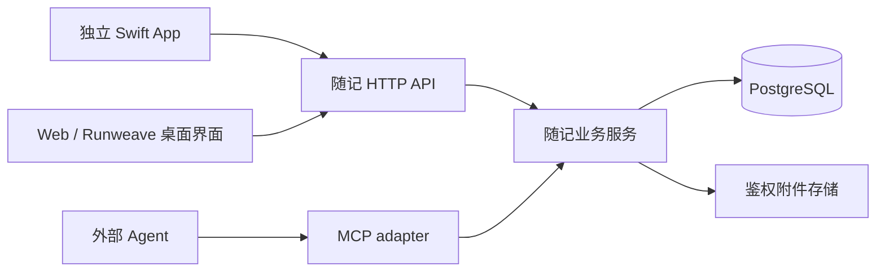

# 随记：分阶段实施计划

- 日期：2026-09-07
- 状态：M1/M2 已实现，W1 与 M3 本地 CLI 回顾已跑通；原生 UI、向量检索及完整云部署恢复仍待完成。
- 代码盘点基线：`3b14587d`。开始执行时重新检查分支、工作区和就近 `AGENTS.md`。
- 计划编写阶段仅产出文档；后续按用户“实现这个计划”指令实施 M1，未提交 Git 或发布生产。
- 当前实现与证据见 [随记架构与交付状态](../architecture/suiji.md)。
- M2：MCP 代码与本机 13 条验收已完成，包含真实 Codex CLI 读改写；连接合同见[服务入口](../../packages/suiji-server/README.md#外部-agent-mcp)。

## 1. 阅读顺序与权威来源

1. 本文：范围、阶段和工程默认。
2. [M1 云服务计划](./suiji/2026-09-07-service-m1.md)：身份、协议、事务、附件、部署与恢复。
3. [M1 原生应用计划](./suiji/2026-09-07-ios-m1.md)：Swift 包、UI、认证与草稿生命周期。
4. [领域词汇](../../CONTEXT.md)与 [ADR-0003](../adr/0003-suiji-independent-cloud-service.md)：已确认的语义与独立云服务边界。
5. [原交接文档](../../suiji-agent-handoff.md)：详细产品背景；下表明确覆盖其中已经改变的前提。

用户最新明确指令优先于本文，本文中的本轮确认优先于原交接中的冲突内容。
数字限额、文件命名和技术工具属于工程默认，可以在不改变需求和验收合同的前提下调整并记录理由。

| 原交接前提             | 本轮确认                                                       |
| ---------------------- | -------------------------------------------------------------- |
| 先加入已有 App         | 新增独立 Swift App；未来可能与 `packages/app-ios` 合并         |
| 优先复用已有身份和后端 | 独立云服务器、单人自用；现有节点账号不是随记云端账号           |
| M1 同时交付 Web/iOS    | M1 先交付 Swift App 与云服务；后续 Web 接入 Runweave 桌面端    |
| 保存失败保留输入       | 草稿在本机持久化，重启可恢复；恢复网络后手动保存，不自动补传   |
| HTML 原型作为参考      | 采用 A 的视觉与信息结构，交互用原生 SwiftUI；不引入 SwiftUIX   |
| 分阶段实现是建议       | 已确认先核心记录，再 MCP，最后真实 AI 回顾；Web 是后续独立阶段 |

## 2. 现状与复用边界

| 已检查入口                                                                                                                                                        | 当前事实                                                             | 实施含义                                                                                           |
| ----------------------------------------------------------------------------------------------------------------------------------------------------------------- | -------------------------------------------------------------------- | -------------------------------------------------------------------------------------------------- |
| [app-ios 包](../../packages/app-ios/Package.swift)、[App host](../../packages/app-ios/ios/RunweaveNative.xcodeproj/project.pbxproj)                               | Swift 包加 Xcode 宿主；SwiftUI/UIKit；整个库依赖 SwiftTerm           | 沿用组织方式；随记不导入整个 RunweaveIOS 库或终端依赖                                              |
| 同上                                                                                                                                                              | Package 声明 iOS 15，App target 的 Debug/Profile/Release 实际为 18.6 | 新应用工程默认统一为 iOS 18.6；这是跟随当前可安装宿主的选择，不宣称已验证 iOS 15；不顺手修改旧工程 |
| [APIClient](../../packages/app-ios/Sources/RunweaveIOS/Services/APIClient.swift)、[AppSession](../../packages/app-ios/Sources/RunweaveIOS/State/AppSession.swift) | 独立端点、Keychain、认证刷新与旧响应隔离；终端草稿仅内存保存         | 复用设计模式；随记实现自己的请求客户端和持久草稿，不能原样复制终端会话模型                         |
| [媒体服务](../../packages/app-ios/Sources/RunweaveIOS/Services/MediaService.swift)                                                                                | 图片接口依赖 terminalID，返回主机文件路径                            | 不作为随记附件服务；可以参考系统选择图片的交互                                                     |
| [Backend 规则](../../backend/AGENTS.md)、[App Server 规则](../../app-server/AGENTS.md)                                                                            | 本机控制面与 Agent 事件服务；没有随记 PostgreSQL 服务                | 新建独立服务包，不扩展两个本机运行时来托管云端记录                                                 |
| [Web 装配](../../frontend/src/App.tsx)、[组件配置](../../frontend/components.json)                                                                                | React、shadcn/Radix；认证与数据上下文当前绑定 Runweave 节点          | 后续 Web 复用组件；随记路由、云身份和 API 客户端独立于节点登录门禁                                 |

压缩包 `suiji-agent-handoff.zip` 的五项 SHA-256 均已核对，包内交接文档与根文件一致。
包内原型为去标签的版本 4；线上页面仍有标签。曾使用仓库 Playwright CLI 查看新增弹层、待办筛选与 AI 页，
这仅是 Web 原型参考证据，不是 Swift 应用验收。保留用户的两个原始交接文件，不覆盖或移动它们。

## 3. 目标架构

以上云端能力归属 `packages/suiji-server/`；客户端不能直接访问数据库或服务器文件路径。
MCP 与 HTTP 共享业务服务，不复制状态机与持久化逻辑。M1 不预先创建空 MCP 或模型运行时。

| 拟新增位置                   | 职责                                                                              |
| ---------------------------- | --------------------------------------------------------------------------------- |
| `packages/suiji-ios/`        | `SuijiIOS` Swift 功能库与 `Suiji` Xcode App 宿主，包名 `@runweave/suiji-ios`      |
| `packages/suiji-server/`     | 独立 Node/TypeScript 服务，包名 `@runweave/suiji-server`                          |
| `packages/shared/src/suiji/` | 跨 Swift/HTTP/后续 Web 的协议语义、DTO、枚举与限额；公开 `@runweave/shared/suiji` |
| `deploy/suiji/`              | 随记自己的 Compose、镜像、迁移、备份和恢复入口                                    |
| `docs/testing/suiji/`        | 分离服务事务、原生体验、部署恢复的 YAML 验收合同                                  |

`packages/*` 已在 pnpm workspace 与架构扫描范围内。新增 Node 包需补 ESLint globals；协议出口需补 shared exports。
Swift DTO 对照共享合同，以真实 HTTP JSON 验证映射；不把 Swift 代码、数据库模型或文件驱动放进 TS 共享包。
若架构检查尚不识别新服务的导入边界，补充该包的单向依赖规则和 package resolution，不扩大到无关运行时重构。

## 4. M1 的用户可见范围

- 首屏是按创建时间倒序的记录流，不弹键盘；全部/想法/待办筛选，全部保留三种待办状态。
- 点右下角加号打开编辑器；记录入口默认笔记，待办入口默认待办。
- 支持原样短文本、图片和 Markdown 附件；URL 属于正文。正文不自动摘要、不解析标签、不自动抓链接。
- 详情、编辑、正文关键词搜索、附件阅读；纯附件记录允许正文为空。
- 待办仅 `open → done` 或 `open → archived`。已完成/不再做可编辑文字；再次想做只预填正文创建独立待办。
- 断网、失败、冲突保留本地草稿；重启恢复；上传与写操作不因联网或回到前台自动补发。
- 保留 AI 导航占位，明确“后续阶段开放”；无演示回答、可发送的假输入框或看似可用的“聊聊这条”。
- 个人账号登录；一个可配置云服务地址。开发和生产隔离，身份不与 Runweave 节点共享。

工程默认：正文最多 20,000 个 Unicode 标量，首版每条至多一张图片与一个 Markdown 附件，每个不超过 5 MiB。
这些附件限额延续交接包的最小 UI 范围，服务合同使用数组并通过 info 返回限额，后续可调整；不能以槽位覆盖造成附件静默丢失。
服务接收 JPEG、PNG 和 UTF-8 Markdown；iOS 选择 HEIC/HEIF 后先转为 JPEG，按上传后的文件检查限额。
其他类型明确拒绝，不直接沿用原型宽泛的 `image/*`。
后台保留版本快照与请求幂等结果，不提供历史版本 UI、自动清理或真正删除 API。

## 5. UI 决定

采用 SwiftUI 与 SF Symbols，不引入 SwiftUIX，也不建立跨 Swift/React 的 UI 框架。
原型的颜色、留白、卡片和筛选结构作为参考；系统弹层、键盘、图片选择与无障碍行为遵循原生平台。

原生库内集中管理主题和约 6～8 个业务组件。业务组件接受数据与动作，不读取凭据或发 HTTP；
通用样式不包含 RecordService。未来有第二个真实消费者时，再提取公共 Swift UI 包。
Nuke 等专用库仅在真实图片缓存需求和兼容性评估后引入；M1 不因推荐清单一次加入所有依赖。
后续 Web 沿用现有 shadcn/Radix/Tailwind，统一颜色与状态语义，分别实现平台组件。

## 6. 阶段与退出条件

| 阶段 | 实施范围                                       | 退出条件                                                                                   |
| ---- | ---------------------------------------------- | ------------------------------------------------------------------------------------------ |
| M1-S | [独立云服务](./suiji/2026-09-07-service-m1.md) | 真实 PostgreSQL 上记录、鉴权附件、并发、幂等与迁移通过服务用例                             |
| M1-I | [原生应用](./suiji/2026-09-07-ios-m1.md)       | Simulator 与真机完成记录、草稿恢复、原生输入及附件闭环                                     |
| M1-D | 云服务计划中的独立部署与恢复                   | 专用部署环境验证版本化升级、失败停止与备份恢复；实际云端地址连通另取证                     |
| M2   | HTTP 业务服务之上的 MCP adapter                | 目标 Agent 真正执行 list/search/get/create/replace/status，引用正确 ID/version，冲突不覆盖 |
| M3   | 中文检索、按需真实 AI 对话与原文引用           | 模型与索引失败不阻断保存；回答有证据，无结果不编造，写入仅由用户主动要求                   |
| W1   | 集成进现有桌面端的 Web 录入界面                | 与 iOS 读取相同记录 ID；切换 Runweave 节点不改变随记身份和内容                             |

先完成 M1-S 协议与最小纵向链路，再连接 M1-I。M1-D 可以先在隔离环境准备，不以生产机器配置阻塞代码开发。
M2 在 M1 后推进，M3 在 M2 后推进；W1 依赖 M1，具体排在 MCP/AI 前后由后续任务决定，不默认绑在 AI 完成之后。
本文只细化 M1；进入其他阶段时各自补代码盘点、实施计划和 YAML 用例，不把本轮占位当作那些阶段已经交付。

M2 已按代码盘点、计划、实现与验收完成本机闭环。阶段事实与连接合同已迁入服务入口和架构文档，
临时 M2 实施计划依文档治理删除。W1 的 12 条 Web/桌面用例、M3 本地 CLI 的 12 条用例通过，
具体合同与证据迁入包入口和架构文档，已完成的本地实施计划删除。
M3 的向量索引及中文召回评测尚未实现；原生 UI 自动化连接失败，保留原生计划继续验收。
用户明确云部署和恢复后面再做，当前不以云端配置阻塞本地开发。

## 7. 验收与交付

| 合同                                                             | 真实证据                                                               |
| ---------------------------------------------------------------- | ---------------------------------------------------------------------- |
| [服务数据与身份](../testing/suiji/service-records.testplan.yaml) | 真实进程、HTTP 响应、专用 PostgreSQL 数据与文件校验                    |
| [原生记录体验](../testing/suiji/ios-capture.testplan.yaml)       | Simulator/真机实际交互、重新启动后的状态、脱敏请求与对应服务端记录     |
| [部署恢复](../testing/suiji/deployment-recovery.testplan.yaml)   | 空库迁移、旧数据升级、注入失败、恢复到隔离目标并读取附件               |
| [MCP 与 Agent](../testing/suiji/mcp-agent.testplan.yaml)         | 真实 MCP Client、并发/响应丢失与隔离 Codex CLI 工具事件，HTTP 独立读回 |

依仓库规则不写单元测试、XCTest 或新的 live-test 框架。执行 YAML 用例用 `toolkit:run-test-cases`。
原生 UI 通过设备/Simulator 工具实际操作；Playwright 用于 Web 原型对照及实际 Web/桌面页面，不得代替 SwiftUI 验收。
运行和测试数据放根 `.runweave/suiji/`；不把账号、记录正文或附件加入 Git。

执行阶段按协议与服务、原生应用、部署运维三个可审查范围组织改动；只提交本任务文件。
用户原始交接资料是否纳入提交必须单独明确，不顺手添加；本计划不执行 commit、push、PR 或生产发布。
每阶段交付区分：代码已实现、静态门禁通过、真实用例通过、未验证和环境阻塞。
结束实施后把仍有效合同迁入包入口与架构/部署文档，再按仓库治理删除已完成的计划；当前设计文档不冒充实现事实。

## 8. 明确延期的决定

- 其他 Agent/OAuth 接入：后续按目标客户端确定；M2 当前以 Codex CLI、Streamable HTTP 与独立个人凭据验证，禁止任意 SQL/shell 工具。
- 本地模型已使用现有登录 Codex CLI；embedding/pgvector、中文召回评测、聊天持久化、私有文档连接器尚未实现。
- Web 已通过独立 `/suiji` 路由接入桌面首页、连接页与终端顶部；公开网站发布仍待云部署。
- 云机器、域名、外部备份位置、实际 RPO/RTO：首次真实发布前提供配置并完成恢复演练，见云服务计划的可执行发布前置。
- 真正删除、历史版本 UI、离线同步、任务撤销/复活、优先级、提醒与自动研究：不属于 M1。

## 9. 初始计划格式校验记录（历史）

2026-09-07 已通过：

- 三份 YAML 格式校验：服务 20 条、原生 17 条、部署恢复 9 条，共 46 条 required 用例。
- `pnpm docs:check`：143 份 Markdown、17 个必需入口通过。
- `git diff --check`：已跟踪文档的差异检查通过。

以上是初始计划编写时的格式校验，当时未执行 46 条业务用例。后续 M1/M2 实现与真实验证已更新到
[架构交付状态](../architecture/suiji.md)，以该入口为准，不把历史格式校验当作当前业务验收结论。
