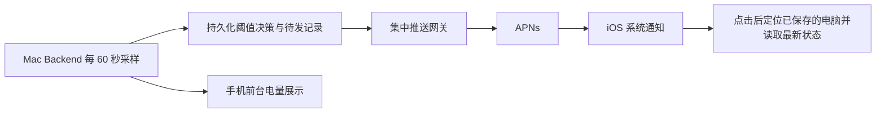

# Mac 低电量告警与 iOS 锁屏推送实施计划

状态：代码、本地专项验证与 iPhone 17 安装交互检查已完成；真实 APNs 推送和完整多设备联调尚未完成。粒度 L3，原因是跨设备授权、推送凭据、去重和撤销。代码基线 `a256e1dd`，核对日期 2026-09-10。

依赖[电量监控计划](2026-09-10-mac-battery-monitor.md)定义的真实采样、hostId 和新鲜度。本计划的目标是手机未打开 Runweave 时也能收到所订阅 Mac 的低电量提醒；第一期只建设 APNs 通道，飞书保留为备选，不同时实现双通道。

## 当前事实与上线前提

- 当前原生 Xcode host 只有 SwiftUI App 入口，没有 APNs delegate、注册逻辑或推送 entitlement。工程已有 Team 配置，但它不能证明付费资格、App ID 的推送能力、有效 provisioning profile 或推送密钥均可用。
- 当前 Backend 负责独立登录域，未发现可直接复用的 Runweave 云端推送服务。[认证服务](../../backend/src/auth/service.ts)刷新 token 时保留 sessionId；退出和改密会使相关会话失效，订阅可依此绑定和撤销。
- APNs provider 可以运行在 Mac 上，不强制需要公网服务器。本计划默认使用集中网关，原因是 App 推送私钥只保管在一处；网关可部署在已有常驻服务器，Mac 只需出站 HTTPS，不开放额外入站端口。
- 本机当前为免费 Personal Team，无法签发推送权限；适用的付费团队、APNs 私钥与集中网关部署尚未配置。协议、告警规则和集成驱动可以先完成；以下门槛未通过时不能把真机推送验收标为通过，也不能静默改成飞书提醒。

上线前执行者必须验证：

- [ ] App ID `com.runweave.app.native` 已启用 Push Notifications，实际签名产物包含与 APNs 环境一致的 entitlement；保留既有 Bundle ID 和 Keychain 标识。
- [ ] 推送私钥、Key ID、Team ID 的权限和环境正确，由运营者装入网关的私密配置；不把文件或值提交仓库、传给手机或分发到被监控 Mac。
- [ ] 网关有有效 HTTPS、持久存储和到 APNs 的 HTTP/2 出站连通性；完成脱敏健康检查、重启恢复与备份演练。
- [ ] 用本轮专用手机安装候选签名产物，获得真实 token，取得用户通知授权，并实际核对锁屏横幅。

若没有集中部署资源，下一步只需决定“部署小型网关”或“由自管 Mac 直接持有 APNs 凭据”；不能为了跑通演示把 `.p8` 打包进 App。当前文档只细化集中网关这一条实现路径。

## 用户行为和阈值规则

连接详情增加“低电量提醒”开关，每台电脑独立启用、默认关闭。用户主动开启时才请求 iOS 系统通知权限；拒绝后显示“系统通知未允许”，保留电量显示，后续不重复弹权限框。不开启任何订阅也不产生推送。

| 条件                                   | 决策                                               |
| -------------------------------------- | -------------------------------------------------- |
| 新鲜样本，使用电池，21% 以上           | 不创建告警                                         |
| 新鲜样本，使用电池，11%–20%            | 20% 档告警                                         |
| 新鲜样本，使用电池，0%–10%             | 10% 档告警                                         |
| 首次启用或重启后第一次观测已是 8%      | 只发一条 10% 档，不叠发 20% 档                     |
| 20% 附近反复、断开重连、短暂接电后拔电 | 同一轮已通知的档位不重复                           |
| 接电、无电池、未知或采样失败           | 不创建或重试低电量推送；接电取消尚未提交的待发记录 |
| 新鲜样本回升至 25% 及以上              | 结束当前轮次，下一次降到阈值可重新提醒             |

Backend 为每个低电量轮次持久化 cycleId 和已达到的最高严重度；为每个手机安装分别记录各档投递结果。低电量期间新启用订阅，只基于当下新鲜样本发送最高有效档，不补发旧历史。关闭再开启同一安装的订阅不能绕过去重。百分比上升到 21% 但不到 25% 不重置已通知档位。

文案使用采样事实，例如“工作 Mac 电量低：18%，正在使用电池，请连接电源”，附采样时间；不承诺剩余工作时长。电脑名称采用首次订阅时的名称，后续可在提醒设置同步修改；长度限制 80 字符，不携带终端、项目路径或命令。

## 链路与责任



Backend 判断是否需要提醒、保存订阅授权及重试意图；网关只验证发送主体、限定模板、去重并调用 APNs，不执行命令、不代理 Backend 请求、不保存项目或终端数据。网络不可达和 Mac 休眠不在本期建立额外的“掉线报警”规则。

## 订阅与身份合同

### 手机到 Backend

新增纯合同 `packages/shared/src/monitoring/device-notifications.ts`；全部 API 使用已有 Bearer 身份，不接受 body 自报 username、ownerSessionId 或 hostId 来决定归属。

| API                                                              | 输入与输出                                                                                                                                               |
| ---------------------------------------------------------------- | -------------------------------------------------------------------------------------------------------------------------------------------------------- |
| `GET /api/device/notifications/status`                           | 返回 `{available, reason, subscriptions}`，只列当前身份有权管理的记录，token 不回显                                                                      |
| `PUT /api/device/notifications/subscriptions/:installationId`    | 输入 `{connectionId, deviceToken, environment, displayName, enabled}`；返回 `{subscriptionId, hostId, installationId, environment, state, revokeToken?}` |
| `DELETE /api/device/notifications/subscriptions/:installationId` | 撤销当前身份下的订阅，幂等返回 204；重复删除不重新创建                                                                                                   |

`installationId` 为手机安装生成的 UUID，保存在 Keychain；同一手机对不同连接使用不同订阅。token 按系统返回的字节编码为十六进制，不假定固定长度；请求总大小限制 8 KiB。environment 只接受 sandbox/production，并由网关的允许列表和实际签名产物核对，不用 Debug 字符串猜测环境。

订阅拥有者保存真实 username、sessionId、connectionId；发送每次尝试前检查 `AuthService.getActiveSession`，改密、撤销或过期后不再发送。刷新 token 保留同一 sessionId 时订阅继续有效。重新登录可以把同一安装的订阅迁移至当前有效会话，但必须验证相同用户名及已有订阅身份，不创建第二份投递。

同一 Backend 的多个 URL 别名可能对应多个登录会话：按 `(hostId, installationId, environment)` 聚合为一个设备投递目标，保存其有效授权绑定集合；只要仍有一个显式启用且有效的绑定可继续提醒，删除一个别名不能撤销另一个别名的授权。不同 hostId 必须隔离。

`subscriptionId` 对应一条 session/connection 授权绑定；多个绑定共享一个投递目标。网关也保存这个关系：revokeToken 只能撤销一条绑定，最后一条失效时才停用目标。因此手机离线删除一个地址别名不会误停其他有效别名。

### Backend 到集中网关

新增独立运行包 `packages/push-gateway`，配置、存储和生命周期与 Backend、App Server、Suiji 分离。仓库 workspace 已覆盖 `packages/*`；新增依赖须同步 lockfile。

每个正式 Backend 安装由运维 CLI 创建一枚高熵发送凭据，绑定 hostId、允许的 topic/environment；网关仅存凭据哈希。开发、Beta 和验收环境使用独立凭据和目标，默认没有真实发送能力。撤销或轮换一台 Mac 的凭据不影响其他 Mac。

| 网关 API                                   | 约束                                                                                                                                                      |
| ------------------------------------------ | --------------------------------------------------------------------------------------------------------------------------------------------------------- |
| `PUT /v1/subscriptions/:subscriptionId`    | 发送凭据鉴权；绑定 hostId、installationId、token、environment、displayName，返回只可撤销该记录的 revokeToken                                              |
| `DELETE /v1/subscriptions/:subscriptionId` | 允许所属 host 发送凭据或该记录的 revokeToken，均不能访问其他记录                                                                                          |
| `POST /v1/battery-alerts`                  | `{notificationId, subscriptionId, cycleId, level, percent, observedAt}`；网关从凭据及订阅确定 host、topic、接收者和模板，不接受任意 token、URL 或通知正文 |
| `GET /health`                              | 仅提供活性；另用管理员鉴权的状态命令查看配置与发送错误计数，不暴露 token 或私钥                                                                           |

服务端限制同一 host 最多 100 条活跃订阅，每条每分钟最多 4 次发送尝试；管理员配置可收紧。网关拒绝未注册 host、跨 host subscriptionId、越界百分比、未知档位及超过 5 分钟的观测事实。存储使用持久事务或串行原子写和单实例锁，不把进程内 Set 当永久去重。

撤销保留绑定墓碑：迟到的 token 同步 PUT 对已撤销 subscriptionId 返回 409，发送返回 410，Backend 据此停用本地绑定；不能让 Mac 恢复联网后的旧同步重新开启提醒。只有用户再次明确启用产生新的 subscriptionId，目标级低电量轮次去重记录仍沿用，不因换绑定重发。同一绑定的并发修改使用版本号比较，旧版本不能覆盖新 token 或撤销状态。

## 投递、失败与撤销

1. Backend 原子保存轮次、每档决策和待发记录后才提交网络请求；持久化失败时只显示监控错误，不边发送边丢去重记录。`notificationId` 由 hostId、cycleId、level、installationId、environment 的稳定组合生成。
2. 网关先持久化发送意图；相同 notificationId 并发调用只允许一个发送者。已取得 APNs 接受结果的重复调用返回已知状态，不再次发送。
3. 超时或断线发生在 APNs 请求可能已提交之后，状态记为 `unknown`，不盲目重发；网关重启遇到未完成的 sending 记录也按 unknown 处理。这会牺牲少量告警的补送，以避免重复打扰，不能承诺网络端到端 exactly-once。
4. 对明确可重试的 429/5xx，在尊重 Retry-After 的前提下按 5、30、120 秒退避，最多 3 次重试，总期限 5 分钟。每次必须重新核对授权、最新有效档位及供电方式；20% 告警不得在已进入 10% 档时继续补发。采样超过 180 秒、接电、撤销或过期立即取消待发。
5. 设置 `apns-push-type: alert`、topic 为固定 Bundle ID、普通通知优先级 10；`apns-collapse-id` 使用 hostId 的稳定短哈希，长度不超过 64 字节，较新的同机提醒合并。`apns-expiration: 0`，不让 APNs 长时间储存已失去时效的电量提醒；已显示的通知不会因此自动消失。[Apple 请求合同](https://developer.apple.com/documentation/usernotifications/sending-notification-requests-to-apns)
6. 200 只代表 APNs 接受，不代表用户已看到；不可标记“已送达”。BadDeviceToken、DeviceTokenNotForTopic 等永久错误停止该目标并提示配置/注册问题；Unregistered 只作废与失败请求匹配的 token 版本，不能删除刚轮换的新 token。[Apple 响应处理](https://developer.apple.com/documentation/usernotifications/handling-notification-responses-from-apns)
7. 关闭提醒或退出登录时撤销绑定，最后一个有效绑定移除后撤销网关目标；已提交给 APNs 的通知不能保证撤回。Mac 暂时不可达时，手机可凭 Keychain 中的 revokeToken 直接撤销该连接的授权绑定，其他别名的有效绑定继续存在。
8. 手机自己也离线时，将待撤销记录留在 Keychain，恢复网络后先撤销再注册；本地删除连接不被无限阻塞，但必须提示“远端提醒关闭尚未确认”。不能把本地移除直接报告成远端注销成功。
9. Backend 或网关故障不阻断终端和电量 GET；提醒设置显示“推送暂不可用”，使用脱敏 notificationId 跟踪状态。保留必要投递去重至轮次结束后 7 天，终结记录定期清理，活跃轮次不因简单 TTL 被重发。

## 原生通知处理

- 在 Xcode host 使用 UIApplicationDelegateAdaptor 注册 APNs、接收 token，并接入 UNUserNotificationCenter delegate；原生包持有独立 NotificationCoordinator，不让 View 自行请求权限。
- token 更新时通过已有凭据更新已启用的连接，最多并发 3 个，不改变 activeID；无法连接的记录标记待更新，不假装旧 token 仍有效。设备 token 只存 Keychain 或受保护存储，禁止日志明文。
- 前台继续显示电量状态；本地 UI 不再额外调度同一低电量系统通知。APNs 在前台到达时由统一 delegate 展示一次，按 notificationId 去重；不能 WebSocket 一次、APNs 再一次。
- 推送自定义字段只含 protocolVersion、hostId、notificationId、level、percent、observedAt。点击时仅在已保存且已授权的连接中匹配 hostId：有多个别名优先当前有效连接，否则选最近成功的那个；无匹配显示“此电脑连接已移除”。不使用 payload URL 自动添加连接或携带 token 跳转。
- 冷启动先完成连接存储和通知协调器初始化，再消费待处理通知。切换连接时保留原终端草稿，读取目标的当前状态；若需要重新登录则停在该连接的登录页，不能把旧告警当成当前事实，也不向终端发送输入。
- 使用普通通知，不申请 Critical Alerts，不承诺绕过专注模式、通知关闭或系统节流。无需为了普通 alert 推送维持后台 socket 或增加后台轮询。

## 文件与实施顺序

| 任务              | 文件范围                                                                                                                                                                                                                                       | 完成条件                                                     |
| ----------------- | ---------------------------------------------------------------------------------------------------------------------------------------------------------------------------------------------------------------------------------------------- | ------------------------------------------------------------ |
| P2.1 状态机与存储 | 新建 `backend/src/device-monitor/{alerts,subscriptions,delivery}.ts`，扩展 P1 store 与 shared 通知合同                                                                                                                                         | 阈值、迟到、持久去重和失败判定明确                           |
| P2.2 Backend API  | 新建 `backend/src/routes/device-notifications.ts`、`backend/src/device-monitor/push-client.ts`；修改 `backend/src/index.ts`、`bootstrap/runtime-services.ts`                                                                                   | 真实 session 鉴权、状态读取、发送时撤销检查                  |
| P2.3 网关         | 新建 `packages/push-gateway/package.json`、`src/{index,config,app,auth,store,apns}.ts`、`scripts/admin.mjs`、`AGENTS.md`、`README.md`；更新 lockfile                                                                                           | 固定模板、发送者命名空间、APNs 配置、去重和脱敏状态命令      |
| P2.4 原生接入     | 新建 `Services/NotificationCoordinator.swift`、`Contracts/DeviceNotification.swift`、`Features/Connections/DeviceNotificationSettings.swift`；扩展 `Services/APIClient.swift`、`App/RootView.swift`、`State/ConnectionStore.swift`、连接管理页 | 权限、订阅、token 轮换、撤销和冷启动路由                     |
| P2.5 签名装配     | 修改 `packages/app-ios/ios/RunweaveNative/RunweaveNativeApp.swift`、Xcode project，新增设备构建用 entitlement 文件                                                                                                                             | 正确环境与能力；不新增或改写个人 Team 身份；不更换 Bundle ID |
| P2.6 集成与文档   | `scripts/verify/device-monitor/`；网关 README；`packages/app-ios/docs/architecture.md`、`validation-status.md`                                                                                                                                 | 故障注入与真实 APNs/真机证据分别记录                         |

上表 P2.4 相对路径均位于 `packages/app-ios/Sources/RunweaveIOS/`。如 AuthService 需要通知撤销的窄观察接口，只在其领域层增加，不反向导入 HTTP 路由。

## 验收、迁移与估算

配套[低电量推送用例](../testing/app/mac-battery-alerts.testplan.yaml)，共 20 条 required 用例。使用隔离 Backend、网关数据目录、host 凭据和专用手机；只允许采样源及 APNs 传输边界注入故障，鉴权、存储、规则和 UI 走真实代码。物理电池无需放到危险低电量。注入用例、APNs 接受记录和手机实际横幅是三个不同层级的证据。

```bash
pnpm install --frozen-lockfile
pnpm --filter @runweave/shared typecheck
pnpm --filter @runweave/backend typecheck
pnpm --filter @runweave/backend lint
pnpm --filter @runweave/push-gateway typecheck
pnpm --filter @runweave/push-gateway lint
pnpm architecture:check
pnpm testplan:validate docs/testing/app/mac-battery-alerts.testplan.yaml
pnpm docs:check
```

新增 package 时先用仓库固定 pnpm 更新 lockfile，再执行 frozen 安装检查。原生构建命令同 P1；sandbox 和 production APNs 都需匹配环境的实际签名设备验收。`simctl push` 或 HTTP 200 不能替代该门槛。本次细化阶段不执行这些运行验证、不发送通知、不部署网关。

迁移：新通知订阅默认关闭，老 Backend 返回不支持；网关未配置仅降级提醒，P1 可独立使用。回滚顺序为停发送和撤销订阅、确认网关停发、再回滚 App/Backend；保留版本化存储，未知 schema 拒绝覆盖。不得删除用户认证、连接或终端数据。

规划估算：单名熟悉仓库的实现者 4–6 个工作日，包含授权/撤销故障注入和真实手机验收；账号开通、签名问题、部署资源准备的等待时间另计。建议先完成 P1，再以一台 Mac 和一部手机贯通 P2，最后验证两台 Mac 同时订阅。交付实际合同后按文档治理清理本临时计划。

Apple 平台依据：[配置推送能力](https://developer.apple.com/documentation/usernotifications/registering-your-app-with-apns)、[APNs 请求与尽力投递边界](https://developer.apple.com/documentation/usernotifications/sending-notification-requests-to-apns)、[可变长度 device token](https://developer.apple.com/documentation/uikit/uiapplicationdelegate/application%28_%3Adidregisterforremotenotificationswithdevicetoken%3A%29)。详细协议实现时以对应官方页面再次核对。

## 实施进度

当前代码合同已迁入 [设备监控架构](../architecture/device-monitor.md)，实际验证与剩余门槛见
[iOS 验收状态](../../packages/app-ios/docs/validation-status.md)。注册增加持久化撤销凭据后的版本确认步骤，
防止未收到注册响应的手机留下已启用但没有撤销凭据的绑定；此步骤属于原撤销保证的实现。
