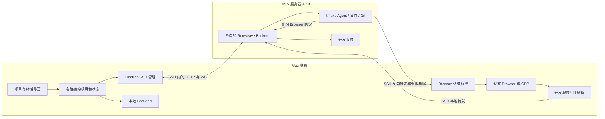

# SSH 远程项目：调研与设计方案

日期：2026-09-24。代码核对基线：`79b7a3c4`，另有与本需求无关的工作区改动。

状态：核心 SSH、多连接工作区与 Browser 通道已实现，正在按 2026-09-25 用户确认的范围精简和验收。下文实验记录保留当时证据，不代表最新验收状态。
本文属于临时过程材料，不代表当前产品能力。

## 1. 推荐方向与已确认需求

推荐采用 **桌面聚合多个项目上下文，SSH 接入远端现有 Backend，远端继续拥有任务和代码，本地继续拥有 Browser** 的结构。

用户于 2026-09-25 收窄范围：聚焦连接已有 Backend、远程项目和终端、开发服务与本地 Browser。环境安装和源码升级由 Agent 根据现有仓库、服务与账号引导或执行；不增加安装/升级 GUI、IPC、专用自动化脚本或 Linux 制品 CI。该决定取代此前的自动准备要求。

实验证据进一步简化了实现：现有 Workspace Services 的 HTTP/WS 路由经普通 SSH `-L` 即可访问并完成 Vite HMR；Browser 2 也已通过临时认证网关和 SSH `-R` 被 Linux 上的 Playwright CLI 操作。第一版优先沿这两条已验证链路产品化。

用户已确认：

- 个人使用；一个桌面同时管理本地项目和多个 Linux 远程项目，并看到各项目的终端状态。
- 一个远程项目固定绑定一条远程连接和一个远端目录；同一服务器可以有多个项目。
- 本机已有可用 SSH 配置，优先复用；连接远端已有服务；缺少环境时由 Agent 引导准备。
- 终端、Agent、文件与 Git 在远端；桌面支持文件浏览、Diff、直接编辑和保存。
- Agent 优先使用远端已有模型、账号等配置；缺少时由 Agent 引导补齐。
- Browser 在本地运行，访问远端开发服务；远端 Agent 能通过 Playwright 控制本地 Browser。
- Browser 的 Profile、工作组和交互尽可能与现状一致。
- 桌面断线不主动结束远端终端；Browser 不可用时明确失败，恢复后允许人工让 Agent 重新检查并继续。
- 特殊内网访问继续使用现有切连接入口；自定义域名映射可以后续配置。

本期范围边界：多人共同控制、远端浏览器画面传输、自动暂停并恢复任意 Agent、全量 Browser 流量经 Linux 代理、完整本地仓库同步，均不纳入第一版。现有全局切连接入口保留。

连接成功不等于远端 Agent 均已就绪；界面只呈现能力状态，环境问题交由 Agent 排查。

## 2. 当前代码提供了什么

| 核对结果                                                                                             | 代码或当前文档                                                                                                                                                                 | 设计影响                                                                |
| ---------------------------------------------------------------------------------------------------- | ------------------------------------------------------------------------------------------------------------------------------------------------------------------------------ | ----------------------------------------------------------------------- |
| 应用从一个 `activeConnection` 取得 `apiBase`、鉴权与页面上下文                                       | [App.tsx](../../frontend/src/App.tsx)、[connection/types.ts](../../frontend/src/features/connection/types.ts)                                                                  | 新增 SSH 地址不能自动形成多连接工作区；核心改动是请求和状态的归属       |
| QueryClient 已按连接与地址分开，但当前只装配一个活动 scope                                           | [connection-query-provider.tsx](../../frontend/src/features/query/connection-query-provider.tsx)                                                                               | 可复用分域思想；隧道端口变化不能成为项目永久身份                        |
| RuntimeStatusProvider 只汇总本地和当前 Backend                                                       | [runtime-status/provider.tsx](../../frontend/src/features/runtime-status/provider.tsx)                                                                                         | 远程项目后台状态需要独立的连接订阅层                                    |
| 已有终端列表、全局终端事件和 Attention 聚合                                                          | [connection/use-events.ts](../../frontend/src/features/terminal/connection/use-events.ts)、[attention-service.ts](../../backend/src/attention/attention-service.ts)            | 复用真实状态；Attention 不包含所有空闲 shell，不能独自承担终端清单      |
| 文件、保存、目录和 Git Diff 都由 Backend 根据项目路径执行                                            | [preview routes](../../backend/src/routes/terminal/preview/index.ts)、[preview.ts](../../backend/src/terminal/preview/preview.ts)                                              | 接对远端 Backend 即可复用领域实现，无需新增一套 SFTP 文件与 Git 逻辑    |
| Preview 持久化状态直接以 `projectId` 索引                                                            | [preview/store.ts](../../frontend/src/features/terminal/preview/store.ts)                                                                                                      | 多 Backend 必须补连接命名空间；这是一项设计缺口，并非已观察到串数据故障 |
| 三个 Browser Profile 是全局能力；工作组不是项目私有 Browser                                          | [Terminal Browser 当前合同](../architecture/terminal-code-preview.md#terminal-browser-与-automation)、[profile/runtime.ts](../../electron/src/browser/profile/runtime.ts)      | 保留现有工作组、Profile 与切换行为，补充远端身份即可                    |
| Workspace Services 使用 Backend 上的 `*.localhost:<BackendPort>` URL，支持 HTTP/WS，入口限制本机请求 | [workspace services](../architecture/terminal-workspace-services.md)、[proxy.ts](../../backend/src/terminal/workspace-service/proxy.ts)                                        | 远端返回的 URL 需要在桌面解析成正确的访问入口                           |
| 本地 CDP resolver/WS 依靠 loopback 边界；调用者可传 Profile/Group；automation token 用于归因         | [cdp/proxy/index.ts](../../electron/src/browser/cdp/proxy/index.ts)、[browser-profile.ts](../../packages/runweave-cli/src/commands/browser-profile.ts)                         | 远程接入需要认证与 scope 校验，不能直接把现有物理 CDP 端口反向转发出去  |
| 已有独立 Backend 发布包、完整性与 ABI 校验、版本目录和原子切换                                       | [独立 Backend 发布](../deployment/backend-standalone.md)、[build-backend.mjs](../../scripts/release/build-backend.mjs)、[backend installer](../../scripts/install/backend.mjs) | 沿用现有部署工具，Agent 按实际启动方式操作                              |
| tmux 可在 attach 断开后存活，保活依赖实际 runtime、store、socket 与退出策略                          | [tmux 生命周期](../architecture/terminal-tmux-recovery.md)                                                                                                                     | 分开表达连接状态、进程状态、任务状态                                    |
| 现有 Browser assistance 是协作交接，不是通用 Agent 中断机制                                          | [browser-assistance/service.ts](../../backend/src/terminal/browser-assistance/service.ts)                                                                                      | 不承诺断线时自动挂起、自动续跑                                          |

另一个容易混淆的入口是 [connectExternalBackendRuntime](../../electron/src/backend/packaged/controller.ts)：它服务于桌面本地 Backend 生命周期，要求 loopback HTTP。远程项目应该有独立连接管理器，不通过放宽这个本地合同实现。

## 3. 业界方案与选择

| 参考                                                                                                                         | 值得采用的部分                                                                       | 本项目的选择                                                                        |
| ---------------------------------------------------------------------------------------------------------------------------- | ------------------------------------------------------------------------------------ | ----------------------------------------------------------------------------------- |
| [VS Code Remote SSH](https://code.visualstudio.com/docs/remote/ssh)                                                          | 远端服务负责远端开发，SSH 承载通信，开发端口可转发；服务包可以本机下载再上传         | 采用这个部署和传输模式；多项目状态聚合仍由 Runweave 自己实现                        |
| [Zed Remote Development](https://zed.dev/docs/remote-development)                                                            | 本地 UI、远端任务与终端；调用系统 SSH，复用 SSH 配置；支持本机下载远端二进制         | 采用系统 OpenSSH 与项目目录绑定；远端协议优先复用已有 Backend                       |
| [VS Code Integrated Browser](https://code.visualstudio.com/docs/debugtest/integrated-browser#browse-over-remote-connections) | 可将浏览器 HTTP/HTTPS 流量经远端代理；当前标记为 Preview，且不能使用全局共享存储模式 | 用户没有全流量代理需求；保留 Runweave 全局 Profile，先实现明确的开发服务转发        |
| [OpenSSH](https://man.openbsd.org/ssh)                                                                                       | `-L` 提供本地端口转发，`-R` 提供反向转发，系统配置支持跳板机                         | Backend/开发服务用 `-L`；Browser 用 `-R` 接到新增的受限认证网关，已在实验服务器验证 |
| [Playwright BrowserType](https://playwright.dev/docs/api/class-browsertype#browser-type-connect-over-cdp)                    | 能通过 CDP 连接 Chromium；官方明确其协议能力低于 Playwright 原生连接                 | 延续现有 Electron CDP 适配，不宣称任意 Playwright 功能天然兼容远程运行              |

三个候选实现的取舍：

1. **只增加多 Backend URL 聚合**：能改善已有服务的状态查看，但 SSH-only 服务器的隧道与 Browser 回连仍缺失。适合作为内部第一阶段。
2. **SSH shell + SFTP + 自建文件/Git/状态协议**：需要复制现有 Backend 已经拥有的领域能力，既有项目与运行终端也难以直接接续。
3. **多连接项目上下文 + SSH + 既有 Backend**：覆盖已部署和 SSH-only 两种环境，能复用最多现有行为。推荐。

## 4. 运行时分工



- Electron 主进程拥有 SSH 子进程、受管隧道、已有服务发现和本地 Browser 桥接；renderer 通过窄 IPC 获取能力。
- Frontend 持有每条连接的独立数据上下文，生成统一项目与终端视图。每个 Backend 继续提供自己的 HTTP/WS API。
- 本地 Backend 继续管理本地任务；第一版无需把它升级为代理所有远端 API 的中央服务。
- 远端 Backend 拥有远端项目、tmux、Agent 与状态源；项目代码保留在 Linux。
- SSH 登录用户与 Backend 运行用户可以不同。实验使用普通 SSH 账号连接由 `root` 运行的 Backend；通过既有 Backend 的业务权限访问已有项目，不自动按 SSH 用户另起第二套服务，也不把自动 sudo 作为桌面连接流程。
- Browser 页面、Cookie、Profile、工作组、网络配置仍由本地 Electron 管理。
- App Server 继续遵循既有独立事件链路。Agent 准备新服务器时须检查对应 Agent 的事件接入；仅有 Backend `/health` 成功不能证明 Agent 状态准确。

## 5. 多连接数据与状态

### 5.1 身份合同

建议新增以下跨运行时合同，具体 TypeScript 名称允许在实现时按仓库风格调整，语义固定：

```ts
type ResourceRef = { connectionId: string; id: string };
type ProjectBinding = {
  connectionId: string;
  remoteProjectId: string;
  remoteDirectory: string;
};
type ConnectionRuntime = {
  connectionId: string;
  generation: number;
  installationId: string | null;
  serviceInstanceId: string | null;
  apiBase: string | null;
  status:
    | "disconnected"
    | "connecting"
    | "ready"
    | "reconnecting"
    | "needs_auth"
    | "incompatible"
    | "failed";
  lastObservedAt: string | null;
};
```

- `connectionId` 是持久的桌面连接身份；动态本地端口与 SSH 进程 PID 都不能作为它。
- `installationId` 标识远端服务的数据实例；`serviceInstanceId` 标识一次运行。后者重启变化不能自动产生第二套项目。
- 项目、session、panel、Attention、Browser 归因、编辑草稿、请求缓存与错误处理，都携带所属连接。远端 API 内部仍使用原始资源 ID。
- 一个服务器上的多个项目共享一条连接和 Backend。SSH 别名可能指向同一服务；发现身份一致时引导复用，不能仅凭 hostname 猜测。
- 连接重建增加 `generation`，旧连接的异步结果不得覆盖新快照；旧鉴权失败也不能清掉另一连接的登录态。
- 现有项目/终端优先重新关联，不能因导入桌面工作区就重新创建远端任务。

### 5.2 订阅方式

- 每条已加入工作区且启用的 Backend 连接维持一份终端元数据订阅，重连后先重取快照，再接续事件。
- 原始终端输出只为实际显示的终端附着；后台状态使用已有事件、Attention 等数据，避免为全部终端启动屏幕流。
- 原有业务状态继续来自 Backend；连接可达性是独立状态。
- 断线时显示“连接中断，最后更新于 …”，保留上次状态作为历史信息；不能把上次 `working` 显示成实时运行证明。
- Attention 与系统通知按连接与事件身份去重；点击跳到所属项目/终端，不要求用户先切全局 Backend。
- 第一版统一 Terminal 工作区。全局其他页面继续遵循当前选中连接，不能静默向用户没有选择的所有服务器执行写操作。

## 6. SSH 与远端服务生命周期

### 6.1 连接已有服务

用户流程：添加远程项目 → 选择已有 SSH 主机 → 检查连接与服务能力 → 选择已有项目或远端目录 → 加入项目列表。

1. 通过系统 OpenSSH 使用现有配置、ssh-agent、密钥和跳板机设置。主机指纹和交互认证沿用 SSH 语义，不能用关闭 host-key 检查来掩盖错误。
2. 建立 SSH 隧道，检查已有 Backend 的健康状态、身份和能力。
3. 已有服务使用正常 Backend 鉴权与原数据目录接入。SSH 登录身份和 Backend 业务会话分别校验。
4. 服务不可用时展示连接错误，由 Agent 检查已有仓库、服务运行用户和配置，按需准备环境。
5. 远端服务作为独立用户进程或用户服务运行，脱离一次 SSH 会话；桌面只拥有 SSH/隧道的关闭权。
6. 连接就绪后再加载项目和事件订阅；Agent 缺少登录或配置时给出该 Agent 的准备状态。

### 6.2 复用现有更新流程与兼容

已有独立 Backend 包记录 platform、arch、Node ABI，并检查 SQLite/node-pty。它不等于已有完整的远程自动部署产品。

实验服务器的源码位于 `/root/run-weave`，服务启动入口为 `/opt/runweave/backend-runtime/current/start.mjs`。因此“更新代码，然后更新服务”可以沿用既有流程；只更新 Git 工作树不会自动替换当前运行包。本轮未执行 pull、部署或重启。

第一版只增加新功能需要的 Backend/CLI 能力并沿用现有更新入口：

- 当前实验环境为 Linux x64、Node 22.16.0、tmux 3.3a，已有可用发布包。不新增 Linux 制品 CI 或桌面自动准备。
- 接入未部署服务器时，由 Agent 准备 Backend、匹配运行时、`rw` 与所需终端集成。tmux 缺失必须明确提示，不能静默降级后仍承诺断线保活。
- 保留现有安装器的文件完整性、原子激活与旧版本目录机制；数据、认证和 tmux socket 放在版本目录之外。
- 使用能力握手区分终端、文件、事件流、服务转发、Browser bridge 的支持情况。旧服务可以继续使用已支持的能力。
- 借用的已有 Backend 不在连接时强制升级或重启。升级由 Agent 沿用现有仓库和服务流程，保留任务和数据所有权。
- 回滚二进制前检查数据格式兼容；不能假设切回旧符号链接就能撤销数据库迁移。

### 6.3 断线和退出

- 自动重连仅恢复传输与订阅；不会自动重放终端输入、文件保存或 Browser 操作。
- 主动退出桌面释放自己拥有的本地隧道和 Browser 通道，不结束远端终端。
- “从桌面移除项目”删除本地关联；“删除远端项目”“终止终端”沿用明确的远端操作入口。
- 普通连接中断与远端 Backend 重启分开验收。现有 Workspace Services 在 Backend 退出时会回收自己的服务进程，不能借用 tmux 保活合同宣称开发服务也跨 Backend 重启存活。

## 7. 本地 Browser 访问远端开发服务

### 7.1 保留交互，增加连接身份

现有三个 Profile 与工作组保持原语义。切换项目不会把整个 Browser workspace 替换为另一个项目的私有副本。Profile 仍决定 Cookie/Storage 与网络设置；Group 仍是页面组织与自动化可见范围。

远端项目的默认 Profile、终端派生工作组身份与 Automation 归因增加连接命名空间。界面中只有在需要识别来源时显示服务器/项目标记。

### 7.2 开发服务地址

推荐在 Electron 增加开发服务地址解析，接收结构化服务引用，而不是直接打开远端返回的 `localhost` 字符串。

```ts
type RemoteServiceRef = {
  connectionId: string;
  projectId: string;
  serviceId: string;
};
type ResolvedServiceAccess = {
  ref: RemoteServiceRef;
  desktopUrl: string;
  generation: number;
};
```

- 对受管 Workspace Services，复用该 Backend 的 SSH 本地转发，保留原服务 hostname，将浏览器访问端口解析为本地隧道端口。该方案已在真实 Vite 页面验证 HTTP、交互与 HMR。
- 对手动运行的开发进程，允许显式转发已知远端端口。
- 同一台 Mac 上，Linux A 的 3000、Linux B 的 3000、本地 3000 必须可同时访问。
- 转发记录以连接和服务身份索引，本地端口不交给其它连接复用。服务 hostname 必须来自已验证的远端服务快照；未知 Host 仍由既有 Backend 路由拒绝。
- 第一版不新增通用 HTTP 重写网关。SSH 直接传输保留 HTTP/WS，避免加入会被当前 loopback 校验拒绝的转发头；页面请求不携带 Backend 管理凭据。
- 当前成功证据覆盖 Local Origin 的 HTTP/Vite HMR。应用硬编码其它 localhost 地址、严格 Origin/重定向或生产域名语义时，按实际应用配置转发或后续域名映射，不能据此宣称任意应用透明工作。
- Profile 的 Cookie 共享语义保持现状；端口隔离不是 Cookie 隔离。复制了同一项目身份的两台服务器可能产生相同服务 hostname，交付前须验证此场景；若需要独立域名，再增加连接别名，不能悄悄改成每项目一个 Profile。
- 保留 Profile 当前 `direct/whistle` 设置；不能为了连接远程项目，切换整个 Profile 的代理出口。
- 重连时优先复用原入口；端口不可复用时返回新访问地址并让用户重新打开，不能把旧地址静默交给别的服务。

已完成单台服务器的真实 HTTP/HMR 验证；多主机、复制身份和严格 Origin 应用仍需覆盖。生产域名映射保留后续扩展入口。

## 8. 远端 Agent 控制本地 Browser

### 8.1 推荐通道

```text
远端 Agent / Playwright
  → 远端 rw Browser resolver（稳定的远端入口）
  → 远端 Backend 校验终端身份并查询当前桌面绑定
  → SSH 反向转发上的短期 scoped WebSocket endpoint
  → Electron Browser bridge 再次核对连接、终端与授权范围
  → 现有 Profile / Group scoped CDP
  → 用户正在看的本地页面
```

实验已验证：`ssh -R 127.0.0.1:<动态端口>:127.0.0.1:<认证网关>` 能让 Linux 的 Playwright CLI 操作本地同一个 Browser 2 页面。网关只接受持有临时能力地址的连接，上游固定到本次解析的 Profile/Group；没有反向暴露原始全局 CDP 入口。

基于当前个人部署，第一版推荐将这条已验证通道产品化：增加稳定 resolver、绑定登记、短期票据、撤销与重连生命周期。若其它服务器禁止反向转发，再考虑复用桌面主动连接 Backend 的双向 WS relay；不提前引入完整 CDP 多路复用协议。

### 8.2 建议的新增合同

下列均为拟新增合同，尚不存在。共享 DTO 放入 `packages/shared`：

| 入口                                             | 输入和输出                                                | 约束                                                                         |
| ------------------------------------------------ | --------------------------------------------------------- | ---------------------------------------------------------------------------- |
| `GET /api/remote/capabilities`                   | 返回安装身份、协议版本、各能力支持情况                    | 使用既有 Backend 鉴权；不能用 SSH 已登录替代                                 |
| `POST /api/desktop-browser/bindings`             | 登记桌面身份、连接 generation 与反向网关位置              | 使用现有应用会话；只登记该桌面实际创建的 loopback 转发，验证连通性与绑定身份 |
| `DELETE /api/desktop-browser/bindings/:id`       | 撤销当前桌面绑定                                          | 校验 owner；撤销网关票据和关联连接，不结束远端 Agent                         |
| `POST /api/terminal/session/:id/browser/resolve` | 请求 Profile/Group 偏好，由已登记网关签发 scoped endpoint | 校验终端能力凭据、项目、所属绑定；原始 ID 本身不是凭据                       |
| 网关上的 scoped WS endpoint                      | Playwright 经反向转发连接                                 | 使用短期一次性票据；固定实际 scope，不能通过 query 改为别的 Profile/Group    |

绑定管理复用既有业务认证；网关票据采用独立用途与校验规则。网关一条 WS 对应一条已限定 scope 的现有 CDP 连接，不重写命令 ID，不缓存并重放未知结果的操作。截图和其它消息采用有界传输，不能让一个连接无限占用队列。

建议票据默认 60 秒内使用、单次消费；活跃通道随桌面连接存活，撤销或断线即失效。数值属于设计默认值，需通过真实大图和并发场景校准，不能直接当性能结论。

### 8.3 授权与兼容边界

- 桌面从自己建立的连接记录识别来源，校验 `connectionId + projectId + terminalSessionId + generation`；不能相信远端消息随意声明的本地 connectionId。
- Desktop 决定最终 Profile/Group scope。远端可提出与现有 CLI 一致的偏好，但不能凭空扩大可操作范围；显式 group 复用必须对应已认可的绑定。当前默认 Profile 被占用时保留冲突，不能自动抢占；本次实验在用户明确选择后使用 Browser 2。
- `automationToken` 继续用于现有 UI 归因，新增授权能力不能只复用该 token 的名称而省略认证。
- 能力凭据按终端签发、轮换和撤销；不将本机全权限 Backend token 或原始全局 CDP endpoint 写入远端项目配置。
- SSH 用户拥有的 shell 权限保持原样。项目目录和终端 token 都不构成对同一 Linux 用户或 root 的进程安全沙箱。
- `rw browser profile resolve` 增加远端模式，通过稳定 Backend 入口查当前桌面绑定；远端模式 resolver 不可用时明确失败，不回退到未认证的 ambient endpoint。
- 已在运行的 Agent 不会因为父进程环境变量变化就自动取得新配置。保留其任务，更新 CLI/工具连接后重新 resolve；不为启用 Browser 杀掉原终端。
- 截图与页面数据按字节返回；本地批注继续上传到对应远端 Backend。文件上传、下载和 trace 涉及两端文件路径，须单独验证并使用显式文件传输，不能将 Linux 路径直接当作 Mac 路径。
- 现有 CDP 的连接与页面上限继续生效。多台服务器共用这些本地资源，达到限制返回明确错误。

### 8.4 错误语义

连接、任务和 Browser 分别报告状态：

- `DESKTOP_UNAVAILABLE`：桌面离线，Browser 调用失败；远端终端是否仍运行由终端状态源报告。
- `BROWSER_SCOPE_DENIED`：来源或 scope 不匹配，拒绝操作。
- `BROWSER_CAPACITY_EXCEEDED`：本地 CDP 资源达到上限。
- `BROWSER_OPERATION_RESULT_UNKNOWN`：操作可能已执行但响应丢失；用户或 Agent 重新观察页面后决定下一步。
- `REMOTE_CAPABILITY_UNSUPPORTED`：旧 Backend/CLI 不支持该能力，保留其它可用功能。

不把这些错误转换为“Agent 已暂停”。重连恢复通道以后，需要新的 resolve、连接和页面观察；任何点击、提交、输入均不得由基础设施自动重试。

## 9. 文件保存的准确承诺

保存复用远端 Preview API，成功结果必须来自所属 Backend。网络错误时保留本地编辑草稿，展示保存结果不确定，重连后重读远端文件再决定是否重新保存。

现有实现以 `expectedMtimeMs` 检查外部修改，检测到不一致返回 409。这是保存前的冲突检查；当前 `stat/read/check/write` 并非与任意外部 Agent 写文件组成原子事务。

第一版延续现有冲突提示，不把它宣传为“同时写入绝不覆盖”。同一连接的保存请求需串行归属正确，草稿按连接和文件隔离。若后续要求强协同编辑，需要单独确定所有写入方参与的版本协议。

## 10. 改动边界

| 模块               | 已有入口                                                                                                                                 | 建议新增职责                                                                                           |
| ------------------ | ---------------------------------------------------------------------------------------------------------------------------------------- | ------------------------------------------------------------------------------------------------------ |
| 共享合同           | `packages/shared/src/desktop/bridge.ts`、`packages/shared/src/terminal/`                                                                 | 新增 `packages/shared/src/remote/`，定义连接、资源引用、能力、Browser channel 合同；配置明确子路径导出 |
| Electron           | `electron/src/main.ts`、`electron/src/preload.ts`                                                                                        | 新增 `electron/src/remote/` 管理 SSH、连接发现、服务入口与 Browser bridge                              |
| Frontend 连接      | `frontend/src/features/connection/`、`frontend/src/App.tsx`、`frontend/src/features/query/`                                              | 多连接运行上下文、独立鉴权/缓存、统一项目列表；避免全局 activeConnection 污染项目请求                  |
| Frontend 终端      | `frontend/src/features/terminal/connection/`、`frontend/src/features/terminal/preview/store.ts`                                          | 多连接事件订阅、命名空间、断线和最后更新时间、草稿保留                                                 |
| 开发服务与打开页面 | `frontend/src/components/terminal/workspace/workspace-services-popover.tsx`、`frontend/src/features/terminal/navigation/open-browser.ts` | 传结构化所属连接与服务引用，解析桌面可访问 URL                                                         |
| Browser            | `electron/src/browser/profile/`、`electron/src/browser/cdp/proxy/`、`electron/src/browser/automation/`                                   | 保留现有 UI 和 Profile 行为；接入受限认证网关，修正项目/终端归因作用域                                 |
| Backend            | `backend/src/bootstrap/runtime-services.ts`、`backend/src/server/transport-runtime.ts`、`backend/src/auth/`                              | 新增 `backend/src/remote/` 领域服务及对应 routes 装配；负责能力握手、Browser 绑定发现和终端授权        |
| CLI/终端环境       | `packages/runweave-cli/src/commands/browser-profile.ts`、`backend/src/terminal/runtime/environment.ts`                                   | 稳定 resolver 发现、远端模式和错误合同；能力凭据与现有身份环境分开                                     |
| 部署更新           | `scripts/release/build-backend.mjs`、`scripts/install/backend.mjs` 和远端现有更新入口                                                    | 由 Agent 复用现有仓库和部署入口，不新增产品界面和发布 CI                                               |

表中新增目录为建议位置。已经存在的文件、Git、tmux 和 Browser 协议领域逻辑优先复用，不在 SSH 模块复制。

## 11. 分阶段验证与交付

### A. 可行性实验与剩余覆盖

在进入全面实现前，分别形成有证据的可行性结论：

- **Linux 制品与保活**：在匹配目标系统的 Linux 使用现有独立包完成启动、真实终端创建、桌面/SSH 断开和重新附着。比对原 tmux pane 与任务 PID，不能以重新创建的 shell 代替保活。
- **远端开发服务访问**：同时打开两台 Linux 上的同端口服务，在同一 Profile 中编辑代码触发 HMR，再验证请求、重定向及服务切换。须确认每个页面始终落在原连接的服务。
- **远端 Playwright 操作本地页面**：远端 Agent 通过候选认证通道完成导航、读取、点击和截图，用户在本地看到同一页面变化；伪造其它连接/工作组、断线旧票据、结果丢失均有明确处理。

已在真实 Linux、真实 Electron Browser 2 和 Linux Playwright CLI 上验证了其中的基础链路，详见第 13 节。尚未验证完整桌面连接 UI、多主机并发和远端模型 Agent 的自主任务闭环；隔离 fixture 不能替代最终产品路径验收。

### B. 可独立推进的三个工作包

| 工作包            | 可评审的产出                                                      | 通过条件                                                                              |
| ----------------- | ----------------------------------------------------------------- | ------------------------------------------------------------------------------------- |
| 多连接项目上下文  | 共享资源引用、各连接数据域、项目列表与后台状态、本地数据迁移      | 本地 + 两个已有 Backend 同时显示；相同资源 ID 不串数据；断一条连接不影响另一条        |
| SSH 与 Linux 接入 | 系统 SSH 集成、已有服务发现、隧道与生命周期、开发服务访问         | 通过已有部署验收；同主机多项目复用连接；HTTP/HMR 正常；退出桌面后原任务可重新附着     |
| Browser 双向通道  | 认证网关与 SSH 反向转发、CLI resolver、scope/归因、错误和恢复语义 | 远端 Agent 操作本地现有页面；Profile/工作组行为保持；断线明确失败，恢复不重放未知操作 |

以上是内部拆分；完整第一版交付必须包含三个工作包，不能把只有 SSH shell 的阶段当成最终完成。

### C. 集成完成标准

- 使用一个本地项目、Linux A 的两个项目、Linux B 的一个项目，并行运行终端；当前只查看一个项目时仍能看到其它项目的状态变化。
- 使用已有 Backend 验证；已有项目与运行任务不因接入被复制、重建或终止。环境安装与升级不属于产品验收范围。
- 在正确远端读取、编辑、保存文件并查看 Git Diff；Agent 先修改文件后，桌面旧版本保存会提示冲突；断线保留草稿。
- 两台 Linux 上相同端口的开发服务可同时打开，HMR/WebSocket 可用，页面访问和 Agent 操作均不串连接。
- 远端 Agent 的模型配置来自远端；本地 Browser 的 Cookie/Profile 和工作组体验符合现有合同。
- 退出/休眠、SSH 断开、Backend 重启分别验证；UI 明确区分连接不可用、终端存活、任务完成与 Browser 不可用。
- 旧模式、原有全局切连接、本地项目和本地 Agent 使用 Browser 均继续可用。

### D. 实现阶段的检查入口

按改动范围执行，而非每阶段全量运行：

```bash
pnpm --filter @runweave/shared typecheck
pnpm --filter @runweave/backend typecheck
pnpm --filter @runweave/frontend typecheck
pnpm --filter @runweave/electron typecheck
pnpm --filter @runweave/cli typecheck
pnpm architecture:check
pnpm workspace-services:verify
pnpm docs:check
```

对应包的 lint、CLI build、Backend 生命周期验证按各自 AGENTS.md 执行。任一静态检查失败须区分本次改动与既有问题；全部通过也不能替代上述真实行为证据。

现有验收基线可参考 [tmux persistence](../testing/terminal/runtime/tmux-persistence.testplan.yaml)、[output recovery](../testing/terminal/runtime/output-recovery.testplan.yaml)、[Workspace Services](../testing/terminal/workspace/services.testplan.yaml)、[Browser groups](../testing/terminal/browser/agent-work-groups.testplan.yaml)、[Browser profiles](../testing/terminal/browser/multi-profile-whistle.testplan.yaml)、[Browser assistance](../testing/browser-assistance.testplan.yaml)。这些已有材料不覆盖完整 SSH 多连接链路。

本轮交付架构设计、验收标准和隔离实验记录，不新增单元测试或仓库测试计划。真实界面验证使用 `toolkit:playwright-cli`；需要启动 Dev Session 时使用 `toolkit:runweave-dev-session`。后续若要求独立可执行的新增测试计划，须按仓库规范使用 YAML。

## 12. 迁移与回退

- 新的远程项目列表以版本化桌面配置保存；现有连接配置只做可逆关联，保留原入口。
- 原有本地项目的持久化状态迁入明确的本地连接命名空间。无法确定来源的旧缓存可以失效，但不能猜测归属后复用。
- 远端能力未就绪时按能力提示，原终端/文件访问继续可用；不能以安装另一套空 Backend 隐藏版本问题。
- 回退桌面功能时停止本机 owned SSH/Browser 通道，保留远端数据和任务。清理版本包与终止任务是独立操作。
- 本方案完成后，已落地的合同再迁入当前架构/部署文档；此过程方案按仓库文档治理删除。

## 13. 用户提供环境后的真实实验

目标：用户授权的 Linux 实验服务器（省略实际账号和地址）；用户指定本地 Browser 2，Browser 1 由其它 Agent 使用。

### 环境事实

- Linux x86_64，Node `22.16.0`，tmux `3.3a`。
- 既有 `runweave.service` 由 root 运行，Backend 端口 `5001`，工作目录 `/root/run-weave/backend`。
- 远端源码 HEAD `257a4d2d`；当前包 `backend-257a4d2d-linux-x64`；tmux shutdown policy 为 `preserve`。
- 实验开始时已有 2 个项目、4 个终端；本轮没有更新代码、重启服务或操作这些既有终端的输入。

### 已验证结果

| 实验                              | 证据与结论                                                                                                                                           |
| --------------------------------- | ---------------------------------------------------------------------------------------------------------------------------------------------------- |
| SSH 接入既有 Backend              | 本地转发后的 `/health` 与远端返回同一 `serviceInstanceId`；未登录终端 API 返回 401                                                                   |
| 远端文件读取和保存                | 隔离目录中的文件经 SSH + Preview API 读写成功；旧 mtime 保存返回 409                                                                                 |
| 远端 Git Diff                     | 远端 Git 仓库基线为 `baseline-from-linux`，Diff 返回新内容 `saved-from-mac-through-ssh`                                                              |
| 断开 SSH 后任务存活               | 实验 shell PID `3668532` 保持，心跳从 1 增至 5；重连仍为原 terminal ID，Backend 实例未变                                                             |
| 本地 Browser 打开远端服务         | Linux 上由既有 Workspace Services 启动 Vite，Browser 2 经 SSH 转发访问并点击成功                                                                     |
| Vite HMR                          | Linux 源码 `remote-v1` 改为 `remote-v2` 后本地页面更新；页面 boot 标记始终为 `1790238179661`，计数保持 1，证明没有整页重载                           |
| Linux Playwright 控制本地 Browser | 远端与本机均使用仓库锁定的 Playwright CLI `1.62.1`；Linux 发起点击后，Mac 观察到同一页面计数 1 → 2                                                   |
| 截图回传                          | 远端 Playwright 截取本地页面，PNG 在 Linux 保存，回传检查显示 `remote-v2` 与计数 2，文件 12,662 字节                                                 |
| 临时网关范围                      | 固定 Browser 2/当前终端 Group；未授权 HTTP 和修改 scope 的 WS upgrade 均返回 403；只有 1 条成功控制连接                                              |
| 清理                              | 实验终端、项目、Vite 服务、临时目录、正反向隧道和实验登录会话已清理；本地页面恢复 about:blank，两端 CLI detach；原项目/终端保留，原 Backend 实例未变 |

证据： [结构化记录](../../artifacts/ssh-remote-projects-20260924-0829/evidence.json)、[远端 Playwright 截图](../../artifacts/ssh-remote-projects-20260924-0829/remote-playwright.png)。这些是本机实验产物。

### 新发现与真实边界

- 当前 Browser 1 的 resolver 返回 `BROWSER_PROFILE_ROUTE_CONFLICT`，按技能要求停止；用户指定 Browser 2 后继续，未强行覆盖 Browser 1 的路由。
- 全局 AI tab 上限 10 已达到。实验使用当前终端 Group 已有的 about:blank 页面，没有清理其它 Agent 页面来腾位置。
- `rw project ensure` 当前在 CLI 所在机器执行 `realpath`。桌面创建远端项目时应把路径校验交给远端 Backend；不能拿 Linux 路径到 Mac 上验证。本次通过正常项目 API 创建隔离项目。
- 远端 pnpm 必须在 `/root/run-weave` 工作目录执行，才能选择仓库指定的 `10.6.2`；从其它目录调用会命中不完整的全局 `12.6.0` 安装。本轮没有修改包管理器。
- Browser 控制证明来自 Linux Playwright CLI 和临时认证网关，尚未实现生产级 resolver、票据轮换、重连与多连接 UI，也未让远端模型 Agent 自主完成开发任务。
- 本次只用一台 Linux；两台服务器的同端口服务、跨连接状态、休眠恢复和严格 Origin 应用仍需后续集成验收。当前结果证明核心传输与能力复用可行，不代表完整产品已完成，也不据此给出精确工期。
