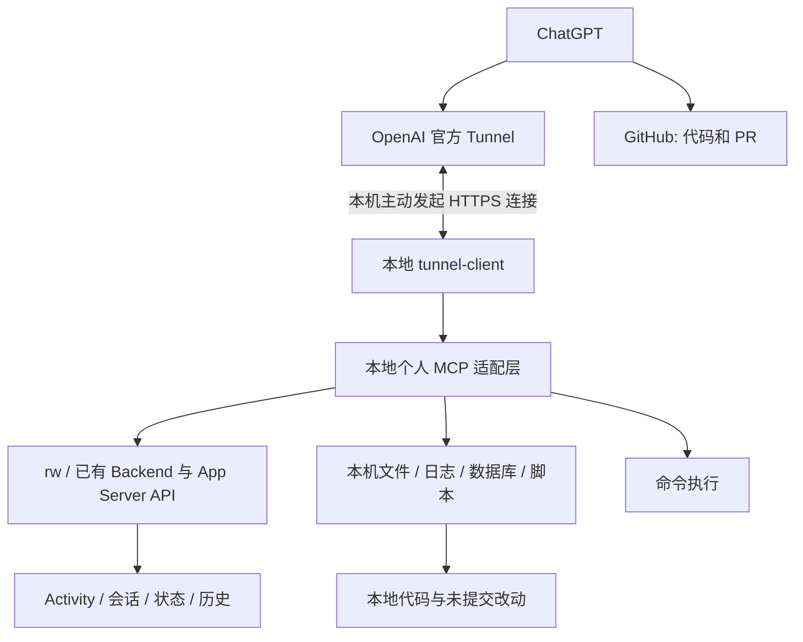

# Runweave 自用调查 MCP 方案

日期：2026-09-28。状态：本地第一版已实现，官方 Tunnel 已配置并完成认证、MCP 握手及云端轮询验证；用户已确认 ChatGPT 应用创建成功。完整对话调查与停止恢复用例仍待验收，因此暂保留本计划。当前操作方式以 [接入指南](../deployment/runweave-research-mcp.md) 和 [MCP 包文档](../../packages/runweave-mcp/README.md) 为准。下文调研数据为方案阶段快照。

## 1. 目标与最新约束

用户希望 ChatGPT 在排查问题和深度调研时，既能读代码，也能取得实际运行数据，并根据调查需要继续查询、计算和验证。

用户明确：单人自用，信任 Agent，平时使用 full-access；本工具沿用运行账号已有的完整读写能力，不建设多用户权限、项目授权、内容分级、外发审批、专用只读身份或独立审计平台。原方案中相关限制撤回。操作依据当前任务进行；数据原文中的指令不成为新任务。

推荐：**先做一个轻量 MCP 适配层，连接现有 rw、Backend/App Server 和本机工具；常用查询提供结构化入口，未覆盖的调查允许执行命令、SQL 或脚本。** 不要求所有数据先统一进数据库，也不把新建 ResearchQueryService 平台作为前置工程。

rw 是优先复用的入口，不是唯一入口。必要时直接使用现有 API、原生会话文件、日志、SQLite 或已有脚本；Activity 加密原文沿用现有 Backend 解密能力。重复查询逻辑稳定后，再沉淀为 MCP 和 rw 共用的函数或接口。

本地实现包含五工具、现有 rw 登录复用、原生文件读取、Activity 查询和可取消命令；写入验证仅在隔离 fixture 执行。B/C 阶段按后续实际调查需要扩展。

## 2. 本轮调研与证据边界

本轮只读研究代码与运行元数据，抽样读取了一条已有工具结果的 API 响应并仅输出可用性和字节数。读取沿用已有认证和访问审计；未输出工具原文、未修改业务状态、未启动分析任务或额外模型。

源码 HEAD 为 `5fdf0d847afb2babde073306510b19897771e61a`；本机 Stable `/health` 返回的运行版本为 `18c8faea116d56d5a1c76c9576a3aba3cc01844f`。两者不同，因此下表区分源码事实与运行抽样，不能把当前源码全部视为已安装实现。

| 来源                                 | 已确认事实                                                                                             | 对方案的影响                                                                 |
| ------------------------------------ | ------------------------------------------------------------------------------------------------------ | ---------------------------------------------------------------------------- |
| `rw --instance stable health --json` | 本机 5001 可达、已认证、环境标记 stable；CLI 为 0.10.0                                                 | 可以进行真实读取，但连接身份与数据集身份需分别确认                           |
| `rw project list` / `terminal list`  | 此次返回 5 个项目、16 个终端，其中 14 个有 lastThreadId                                                | 当前列表可用于导航；不代表所有历史任务或所有机器                             |
| `rw activity sources`                | 605 个生产者记录中 stable 176、beta 256、dev 173；返回 2 个 open gap                                   | 通过 Stable 读取不会天然过滤共享库中的其他环境；gap 是完整性线索，不是失败率 |
| 最近 30 条 Activity 抽样             | 19 条带内容描述符且标为 available，分别为 10 个工具结果、9 个工具参数；19 条有 threadId，0 条有 turnId | 需要显式关联与缺失标记；这是最近数分钟的样本，不能外推全历史覆盖率           |
| Activity 原文 API                    | 一条工具结果读取成功，4932 字节                                                                        | 已有可用的原始证据通路；其他记录仍可能失效或缺失                             |
| `/api/activity/policy`               | fact 30 天、content 7 天；数据库文件约 928 MiB                                                         | 不能承诺数月原文可读，也不能每次调研扫描整库                                 |
| 样本 runtime.sourceRevision          | 均为 `bundled`                                                                                         | 不能当成 Git commit；当前 health 的 SHA 也不能反填为历史事件版本             |

相关当前实现与缺口：

| 数据域             | 当前入口                                                                                                                                                                          | 关键限制                                                                                                                        |
| ------------------ | --------------------------------------------------------------------------------------------------------------------------------------------------------------------------------- | ------------------------------------------------------------------------------------------------------------------------------- |
| 活动事实与工具原文 | [查询实现](../../backend/src/activity/database/query.ts)、[HTTP](../../backend/src/routes/activity/index.ts)、[合同](../../packages/shared/src/activity/contracts.ts)             | 有游标、水位与内容引用；当前 facts 搜索只匹配事件名/部分 ID，不检索参数、结果或错误正文；缺少通用时间区间与统计查询             |
| 工作历史           | [WorkHistoryService](../../backend/src/work-history/work-history-service.ts)                                                                                                      | 已聚合 terminal、thread、Activity、run；终端列表基于当前已知 sessions，并非完整历史任务索引；列表中会先枚举 ThreadRef           |
| Provider 历史      | [Thread readers](../../app-server/src/agents/thread-readers.ts)、[Codex detail](../../app-server/src/codex/thread-detail.ts)                                                      | Provider 能力不同；Codex 当前归一化只保留用户/助手消息，过滤工具项。不能把这一展示 DTO 当作完整调查证据                         |
| Backend 日志       | [Logger](../../backend/src/logging/logger.ts)、[请求上下文](../../backend/src/logging/request-context.ts)                                                                         | 默认按 3 天/50 MiB 文件轮转；已有 requestId，未建立通用日志检索 API；与 Activity 的关联需验证真实 ID                            |
| 专项诊断录制       | [Recorder](../../backend/src/diagnostic-logs/recorder.ts)                                                                                                                         | 只在录制开启时采集，默认保留至多 20 次持久化结果；没有过去某个时段的录制就不能补造                                              |
| 当前运行状态       | [Runtime Status](../architecture/runtime-status.md)                                                                                                                               | 是带观察时间和过期状态的当前报告，不能替代昨日的状态历史                                                                        |
| CPU/内存           | [System Monitor](../architecture/system-monitor.md)                                                                                                                               | 当前 Electron 本地快照；不持久化、不向 Backend 同步，不能直接回答历史峰值                                                       |
| Token/耗时         | [本地报告](../cli/token-report.md)、[效率采集](../../backend/src/execution-efficiency/collector/reader.ts)、[用量计算](../../backend/src/execution-efficiency/collector/usage.ts) | 已有累计差值、证据片段等基础；现有 collector 有批次和场景约束，不能原样作为全量分析器；collect 会产生分析状态，不是普通只读查询 |
| 项目经验           | [ExperienceService](../../backend/src/experience/service.ts)、[合同](../cli/experience-cli.md)                                                                                    | 按仓库身份隔离；历史结论与原始事实应分别标记；查询审计可写，但不得提交采用回执或改变经验状态                                    |
| 自进化 MCP         | [现有 MCP](../../backend/src/routes/evolution/mcp.ts)                                                                                                                             | 绑定特定 run、冻结 Context Pack、临时授权，可复用设计经验；生命周期不适合直接作为通用 ChatGPT 入口                              |
| 业务库/外部指标    | 取决于具体项目                                                                                                                                                                    | Runweave 管理了开发终端，不等于持有该项目线上数据库、账单、缓存指标或请求链路                                                   |

## 3. 模型怎样完成一次调查

1. 发现当前连接的实例、项目、日志、会话、数据库和分析脚本，读取其路径、schema 和时间覆盖。
2. 根据问题先查询数量与分布，明确时间、环境及统计分母。
3. 读取失败样本与成功样本的工具参数、结果、日志和会话上下文。
4. 沿真实 threadId、toolUseId、operationId、requestId 关联记录，并对照运行版本的代码。
5. 现有工具缺能力时，用命令、SQL 或脚本继续探索，无需先开发新适配器。
6. 输出结论、依据、查询口径、反例与未知部分，供后续实现或复查使用。

工具读取本身按其语义执行；创建临时分析文件、运行诊断或改变状态属于显式执行动作，返回实际执行内容及结果。工具拥有完整能力，不代表调查必须修改业务数据。

## 4. 简化架构



### 4.1 实现选择

| 路径                   | 使用时机                                                           |
| ---------------------- | ------------------------------------------------------------------ |
| rw JSON 输出           | 已有命令能回答问题时优先复用；参数独立传递，返回退出状态和原始错误 |
| 现有 HTTP 接口         | 比 CLI 更完整、可分页，或需要内容解密时直接复用                    |
| 本机文件、数据库与脚本 | 原生会话、日志正文、自定义统计；复用现有定位/解析能力              |
| 新增领域查询 API       | 只有现有入口确实缺少必要能力时补，例如 Activity 时间过滤和稳定分页 |
| 新建共享查询层         | 同一逻辑已被多个入口实际复用后再抽取，不作为首版前置条件           |

不因假设的 CLI 进程开销而提前建设平台。先验证一次真实调查；持续重复且昂贵的命令才改成常驻适配或领域接口。外部项目数据库可使用机器上现有的连接和客户端，不要求先接入数据平台；仍需发现实际连接地址和数据结构，full-access 本身不会生成不存在的业务数据。

### 4.2 已选接入路径：本地 MCP + OpenAI Secure MCP Tunnel

用户已确认采用官方 Tunnel 路径。Runweave MCP 和数据均位于本机，使用 OpenAI 提供的 `tunnel-client` 转发 ChatGPT 请求，无需公网 IP、路由器端口映射或本机公网监听。隧道支持私有连接及开发者模式，不以公开发布插件为交付目标。

`tunnel-client` 是独立的本地转发程序：主动向 OpenAI 发起出站 HTTPS 长轮询，取得 MCP 请求，交给本地 MCP，再将结果返回。数据读取、SQL 和命令执行由 Runweave MCP 实现。原数据库与日志继续留在本机，每次查询的返回内容会传给 ChatGPT。

首版 MCP 使用仅监听 loopback 的 HTTP 端点，供同机 `tunnel-client` 调用；官方也支持 stdio，但首版不同时建设两套传输。隧道程序使用官方发行版，不自行实现或封装一套隧道协议。

接入的安装、运行、停止恢复和 ChatGPT 表单操作统一维护在
[接入指南](../deployment/runweave-research-mcp.md)，不在计划内复制命令。
实际使用官方客户端管理后台进程；尚未配置开机自启动。

账号入口、隧道认证、本机 MCP 握手和云端轮询已在本次接入中验证；用户确认应用创建成功。
完整调查的数据核对、Deep research 及隧道停止恢复仍需按测试计划取证。
隧道沿用平台身份关联，MCP 内部保持个人 full-access，不新增项目/字段权限系统或 OAuth 服务。

依据：[Secure MCP Tunnel](https://developers.openai.com/api/docs/guides/secure-mcp-tunnels)。

## 5. 最小工具面

首版五个工具，避免把每条 CLI 命令注册为一个 MCP 工具：

| 工具         | 合同与用途                                                                                             |
| ------------ | ------------------------------------------------------------------------------------------------------ |
| list_sources | 返回已连接实例、机器、项目、数据位置、schema/使用说明、覆盖时间和可用状态；项目/环境用于筛选，不是权限 |
| search       | 标准 query 字符串；返回 results 中的 id/title/url，寻找错误、任务和原始证据                            |
| fetch        | 标准 id；返回 id/title/text/url/metadata，读取具体证据；长文本按带版本的片段读取                       |
| query_data   | source、查询类型、参数、游标；常用明细、聚合、关联查询；数据库来源可接受 SQL                           |
| run_command  | command、cwd、timeout、输出预算；执行 rw、rg、Git、数据库客户端和分析脚本，允许读写                    |

list_sources 的详情支持按需展开，避免一次塞入所有目录和 schema。未知来源可通过 run_command 自主发现，再用临时脚本分析，不要求修改服务器代码后才能继续调查。

run_command 返回 commandId、状态、退出码、stdout/stderr 分片及继续读取的位置；长任务可用同一工具按 commandId 查询、取消，保持调用状态明确。命令工作目录和目标实例显式返回，避免在错误 checkout 或 Stable/Beta 上执行。

固定的 search/fetch 是读取工具；可执行任意 SQL 的 query_data 与 run_command 必须如实标注为可能写入，不能伪装 readOnlyHint。ChatGPT 自身的工具确认行为由客户端控制，本服务不另加审批层。

普通聊天使用完整工具面；专门 Deep research 模式的工具能力须单独验收，保留标准 search/fetch 以兼容其检索入口，不能承诺该模式能执行任意命令。

依据：[MCP 检索合同](https://developers.openai.com/api/docs/mcp#create-an-mcp-server)。

## 6. 保留的数据质量要求

删除权限平台后，以下能力仍直接决定分析是否有用：

- **原文完整**：读取原生工具参数/结果，不能只看当前 UI 的用户/助手消息投影。
- **来源准确**：返回 node/provider/project/channel；Stable、Beta、Dev 可以全部读，但统计时明确区分。
- **版本准确**：对照实际 commit；bundled 和缺失版本返回未知。读取本地工作区时标注 HEAD 与 dirty 状态。
- **统计可复算**：说明时间窗、单位、分母、去重和累计值处理；不能把事件条数直接当请求数。
- **缺失可见**：未采集、已过期、离线、只扫描部分数据分别说明；已有访问能力不等于历史数据实际存在。
- **关联有依据**：真实 ID 关联与时间相邻候选分开，缺少 turnId 不伪造。
- **结果可继续读取**：输出过长时返回片段和游标，不强制丢弃剩余原文。
- **执行可观察**：返回命令、目标、开始/结束时间、退出状态；需要复算时可以重跑。

常用结构化结果保留 source、effectiveFilters、时间范围、版本、水位或文件读取边界、rows/buckets、nextCursor、coverage、truncated、证据 ID 与指标定义。不新增权限 scope、内容许可等级或外发授权状态。

搜索首版复用索引/rg/有界文件读取；需要扩大调查范围时支持继续查询。日常默认最近 24 小时、50 条结果，可由调用者调整，不限制用户只能读取某些数据。尚未扫描的范围明确标记，跨历史全文索引待性能证据出现后再增加。

长文本分片与分页用于控制上下文体积，超时、取消和并发管理用于避免挂住会话。它们不是数据权限；可按任务调整。对共享 SQLite 优先复用 owner 或独立读连接；写操作如有需要沿用现有业务入口，避免破坏数据库结构不变量。

Token 统计复用累计差值、重复值去重与区间合并逻辑。缓存输入和推理输出分别是输入/输出的子集；并行工具时长不能相加作为墙钟时间。Token、账单和会员额度各自说明来源，不自行换算。

### 6.1 引用与留存

先复用能定位原文的现有链接、记录 ID 或路径。正式 search/fetch 引用需要可供用户打开的绝对 URL；缺少原文页面的来源，在本机 MCP 旁提供最小证据展示即可，不建设完整证据管理站点。官方 Tunnel 转发 MCP 请求，不自动把任意本机网页发布出去；本机引用页由用户在该电脑打开，异机不可达需明确说明。模型读取原文通过 fetch，不能依赖它自行浏览 localhost。引用能否在目标 ChatGPT 客户端打开须单独实测。

过期和文件轮转返回明确状态；首版不自动延长留存、不制作整库副本。确有跨月研究需求时，再配置现有留存或按任务导出分析结果。原始数据变化后，旧结论引用应说明读取时间和版本。

## 7. 第一版交付范围

### A. 先跑通一次真实调查

1. 先确认账号的 Tunnel 入口与工作区关联，再建立本地 MCP 进程及 tunnel-client 配置，复用 rw 登录及现有运行环境，不新增用户/角色系统。
2. 实现五工具及命令结果分片，接入 Activity、原生会话、Backend 日志、当前状态；本地代码通过 Git/文件命令可读。
3. 补必要的数据缺口：原生工具记录、Activity 时间范围与分页；其他探索先允许脚本完成。
4. 通过官方 Tunnel 打通真实 ChatGPT 连接，验证隧道停止与恢复，再用一个已知故障和一个成功样本验证数据、代码和结论。
5. 验证一次自定义查询：问题超出预置 schema 时，模型能发现文件/数据库结构并通过脚本得到答案。

这一步的成功标准是用户提问后，模型能取得需要的真实材料；不能仅用工具列表、握手或最后的自述作为验收。

### B. 将重复调查沉淀成便捷能力

真实使用后，把耗时/Token 统计、经验读取、任务历史等高频脚本提取为 query_data 适配器，必要时补 rw 命令。仍允许临时探索，不逐步收紧为只能回答预设问题。

### C. 扩展具体业务来源

按一个实际问题接入对应机器、数据库、日志或指标平台；已有命令能读到就复用，只有频繁使用时才做专用适配。项目范围由调查条件决定。

## 8. 建议文件范围与兼容策略

以下为实现落点及后续按需扩展范围，实际交付合同见 MCP 包文档。

| 路径                                                           | 职责                                                                                                     |
| -------------------------------------------------------------- | -------------------------------------------------------------------------------------------------------- |
| packages/runweave-mcp/                                         | 轻量 MCP、来源目录、rw/API/文件适配、命令执行与结果分片、最小引用展示                                    |
| packages/runweave-mcp/README.md                                | 官方 tunnel-client 安装来源、个人配置步骤、doctor/run、ChatGPT Tunnel 连接与停止恢复说明；不保存真实凭据 |
| packages/shared/src/research/（按需）                          | 被多个运行时实际共用的查询/证据类型；单包内部类型留在包内                                                |
| backend/src/activity/database/query.ts 与对应 HTTP/worker 合同 | 必需的时间过滤、分页或关联读取，复用现有认证和解密                                                       |
| app-server/src/agents/ 与 provider readers                     | 保留原生工具调用及结果的调查读取，保护原有 UI 投影语义                                                   |
| packages/runweave-cli/src/commands/（后续按需）                | 提供已经稳定且值得手工复用的查询入口                                                                     |

不预建 policy.ts、专用权限 token、授权数据表、独立审计服务或查询 worker 平台。查询出现明显阻塞时，先定位具体来源，再使用现有 worker 能力或拆出对应重任务。

采用新增入口和适配器，不迁移原存储。停止 tunnel-client 即可中断云端到本机的转发，停止 MCP 进程则关闭本地工具入口；未改变现有工具/终端主链路。停止转发不保证已交付本机的命令自动取消，进行中的命令需按 commandId 明确取消。显式写操作的后果按具体操作处理，停止连接不会撤销已执行的变更。

## 9. 验收

配套 [验收草案](../testing/architecture/research-mcp.testplan.yaml)已移除细粒度授权、专用只读凭据及 OAuth 权限矩阵，聚焦数据完整性、自由探索、计算、取消和真实 ChatGPT 调查。草案格式通过不代表功能已经实现。

实现后执行新包 build/typecheck 和被修改模块的既有门禁；修改 Activity 时参考 [Activity 验收](../testing/architecture/activity-data-foundation.testplan.yaml)，修改用量计算时参考 [执行效率验收](../testing/execution-efficiency/core.testplan.yaml)。不新增单元测试文件。

本轮文档验证：

```bash
pnpm testplan:validate docs/testing/architecture/research-mcp.testplan.yaml
pnpm docs:check
git diff --check
```

实际验收时使用现有技能启动 Dev Session、操作 ChatGPT 页面；连接受限记录实际阻塞，不能用本地工具调用成功替代云端接入成功。

### 本地交付记录（2026-09-28）

- RMCP-001 至 RMCP-008 通过独立 fixture 的真实 MCP HTTP 调用验收；72 KB 中文/emoji 原文分片、并发追加分页、SQL/文件写入、取消、版本与失效恢复均已取证。
- 从仓库外启动构建产物，实际读取 Stable 的五类 Backend 来源，并通过 run_command 执行 rw health 成功。Stable 未升级；新时间/关联过滤在旧 Backend 上由 MCP 再核对。
- 新包 build/typecheck/lint、shared/Backend/CLI typecheck、Backend lint、architecture:check、docs:check、YAML 格式校验和 activity:verify 通过。
- backend:verify-lifecycle 未通过：在 verifyActivityDrain 的 Activity 初始化处得到 store=null（scripts/verify/backend/runtime-lifecycle.ts:59），没有取得整套生命周期回归通过证据；未修改该既有脚本。
- Tunnel 后续已完成客户端安装、认证、MCP 握手和成功云端轮询，用户确认 ChatGPT 应用创建成功。RMCP-009 的完整真实调查、RMCP-011 的停止恢复尚未取证；RMCP-010 为可选 Deep research 用例，未执行。不能将连接 ready 或应用创建成功视为这些用例通过。
- 进程并发补充检查：同时提交 12 条命令，8 条启动、4 条明确拒绝；取消与带运行命令的服务关闭完成。
