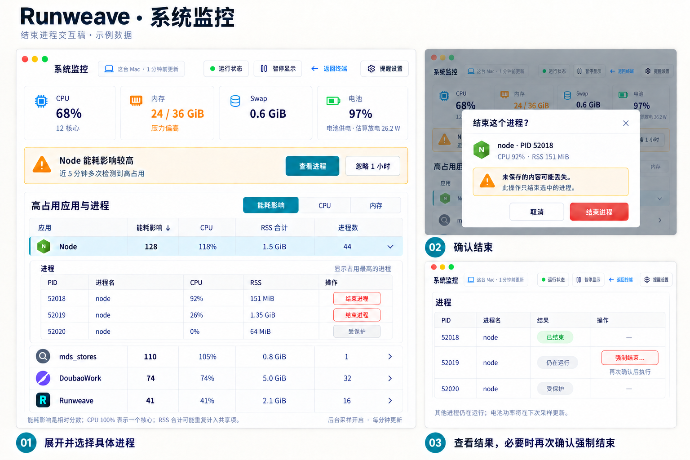

# 电池与应用资源监控实施计划

日期：2026-10-01。粒度：L2。状态：已实现主体闭环，正在完成验收。当前实现事实见架构文档；最终 Beta 页面、原生通知授权与可归因电池成本仍待验收，未标记全部完成。

## 1. 目标与判断依据

用户要在不插电时及时找出值得关闭的应用或任务，延长续航。第一版交付的是「按应用/进程排行 → 多次高占用提醒 → 选定具体进程 → 用户确认结束 → 验证退出并观察耗电」闭环。

衡量四个结果：用户能在一页内定位高占用来源；关掉页面后仍可发现异常；用户能确认结束有操作权限的具体进程并看到实际退出结果；处理后能看到同口径的能耗影响与电池放电变化。CPU、内存是解释数据，电池侧放电功率是整机结果；不把高内存占用当成耗电证据，也不承诺固定节省百分比。

本轮已验证的事实，详见 [历史采样数据](./2026-10-01-battery-resource-monitor/baseline.json)：

- 01:14–01:24 拔电观察共 21 帧：电池侧估算平均放电 26.155 W，整机 CPU 平均 68.39%。电量显示从 100% 到 97%，但前约 7 分钟一直显示 100%，所以即时百分比下降率不能独立判断耗电。
- 同一窗口的高 CPU 候选包括 Spotlight 索引进程、DoubaoWork、Defender、Node、Runweave。未出现 swap-out，不足以认定内存交换是本次发热原因；也不等于没有内存压力。
- 另一段 15 秒实验中，普通用户通过 `proc_pid_rusage/RUSAGE_INFO_V6` 成功读取 671 个进程，267 个受权限限制，验证了进程能耗计数器可用。该实验不能与前一个窗口拼成完整电池耗电分摊。
- 现有 Electron 电池解析把 `ioreg` 文本的无符号 64 位放电电流直接转成 `Number`，实际读出约 `1.84e19 mA`；必须修正。

社区可复用方向：

| 实现                                                                                                         | 已核对内容                                                              | 本方案使用方式                                                             |
| ------------------------------------------------------------------------------------------------------------ | ----------------------------------------------------------------------- | -------------------------------------------------------------------------- |
| [Stats](https://github.com/exelban/stats/tree/d85c26351cb16335d6af2219f19e543016d4d416)                      | MIT；电池进程排行调用系统 `top -o power -l 2`；原生内存压力读取系统级别 | 第一版参考其采集方法，记录参考版本与许可                                   |
| [Apple top](https://github.com/apple-oss-distributions/top/blob/main/power.c)                                | POWER = CPU 时间与 idle wakeups 的加权分数                              | 明确标为「能耗影响」，不标 W 或电池百分比；调用系统工具，不复制 Apple 源码 |
| [macmon](https://github.com/vladkens/macmon/tree/6919d7781b6c55a6e3bedff83a210435837e1dfe)                   | MIT；整机 CPU/GPU 等功耗与结构化输出                                    | 后续硬件功耗细分参考，第一版不增加依赖                                     |
| [OpenMacBattery](https://github.com/MuratDugan/openmacbattery/tree/d8412db4cea9ba1eec605d6431d1fb7abca85b73) | AGPL；按应用历史与异常分析；当前仍早期                                  | 参考交互思路，第一版不复制代码或引入其整套存储                             |

实施修订：`top` 实测每分钟消耗约 1.7–2.3 秒 CPU，超过 1 核 1% 预算。改为 Backend 自有、公开 libproc 的 RUSAGE_INFO_V0 小程序，分钟差值提供 CPU / package idle wakeups；15 次实读采集约 0.12 秒 CPU / 次。未知覆盖显式返回，分数只是代理指标，不声称完整归因。无客户端采集依赖。

## 2. 现状、范围与边界

当前真实入口：

- [Electron 采集器](../../electron/src/monitoring/system.ts)：CPU、RSS、应用聚合、电池、内存；按需执行一组系统命令。
- [共享监控合同](../../packages/shared/src/monitoring/system.ts)：现有 Desktop IPC payload。
- [监控 hook](../../frontend/src/features/system-monitor/use-system-monitor.ts) 与 [页面](../../frontend/src/pages/system-monitor-page.tsx)：只从 Electron bridge 轮询，默认 5 秒，只保留 12 帧；普通 Web 没有完整数据。
- [电量服务](../../backend/src/device-monitor/service.ts)：启动及每 60 秒独立采样、single-flight、新鲜度；[设备 API](../../backend/src/routes/device-status.ts) 已鉴权。
- [资源边界](../architecture/system-monitor.md) 与 [电量推送边界](../architecture/device-monitor.md) 描述的是当前能力，不代表本计划已实现。

第一版范围：连接到 macOS Backend 的普通 Web 与 Electron renderer 使用同一资源事实；能耗影响、CPU、RSS 排行；复用行内进程展开；应用内提示和经用户开启的 Mac 系统通知；紧凑设置、必要的观察计数及提醒去重；本机直连下按具体进程执行用户确认的终止操作并反馈结果。保留现有 CPU、内存、Swap、电池四张总览卡。

本轮不改产品代码。第一版不做按阈值自动退出/kill、Node 等通用分组的一键批量终止、管理员提权、远程进程终止、内存清理、浏览器标签页归因、跨平台能耗适配、长期资源数据库、真实逐应用电池百分比分摊，也不新增侧栏、趋势图、提醒中心或通用告警框架。完整项目/服务归因不是第一版门槛。手机提醒独立作为后续阶段，不改现有低电量和定时任务订阅，不提前向网关增加类别。

采集运行在当前连接的 Mac Backend，普通浏览器负责展示及提交明确的用户操作。终止入口仅在本机直连且当前会话有权限时开放；远程连接资源视图保持只读。远程连接时标题显示目标电脑，不暗示正在读取浏览器所在电脑。Backend 不运行或电脑睡眠时不能继续观察；恢复后重新积累有效窗口，不补造睡眠期间数据。

## 3. 用户交互（精简版）



这是静态交互设计稿，数字为示例，不是运行截图或已接通的数据。左侧是同一监控页的提醒与具体进程操作；右侧展示确认框和结果状态。提醒设置仍沿用上一轮的小弹窗，不新增设置页。

### 监控页与应用排行

沿用 `/system-monitor`、现有卡片组件与表格。普通 Web 的路由按 `App.tsx` 中已鉴权页面的方式接收 `apiBase/token/connectionId`；不能仅删除 Electron 空态就认为已经支持 Web。

顶部显示当前连接电脑和成功采样时间，保留运行状态入口、返回终端及暂停显示操作，新增「提醒设置」。CPU、内存、Swap、电池卡片顺序不变；电池卡补充估算放电 W，无法取得时保持未知，后台采样状态用小字显示，不新增第五张卡。内存压力未知时不染成已确认偏高。

表格新增「能耗影响」列与排序，保留应用、CPU、RSS 合计、进程数。显示当前采样分数，不混用当前 CPU 与未标明口径的五分钟平均分数。观察不足显示「观察中」，未知数值为「—」且排序在末尾。全量聚合之后才取 Top 50；不新增检索与历史视图。

表头/底部保留必要的指标解释：能耗影响是相对分数；进程 CPU 的 100% 表示一个核心；RSS 合计含共享页重复计入。整机 CPU 保持全核心 100% 口径。

### 行内进程展开

沿用现有 `AppRow` 点击展开，新增列后同步表格 `colSpan`。详情显示 PID、进程名、CPU、RSS，并在具体进程行增加操作列；沿用占用最高的进程窗口与数量提示，不做侧栏和曲线。

按现有应用路径/可执行名聚合。Node 等通用组直接显示 Node 与真实 PID，不默认添加项目或 backend 服务名称；SDK 和现有快照没有提供这份映射。有现成、可核对的归属信息时可以作为可选次级文字，但不为第一版新增跨服务 PID 归因器，不逐个 PID 调用 `lsof`，不读取或回显完整 argv、cwd、环境变量。

进程身份结合 PID 与启动时间，降低重用后误指向其他进程的风险。结束动作只能出现在具体进程行，应用/Node 聚合行保留展开，不提供整组结束按钮。系统进程、其他用户进程、当前 Runweave 控制进程及身份无法可靠核对的对象显示禁用状态与原因。

### 用户确认的结束流程

1. 点击具体行的「结束进程」，用现有 AlertDialog 显示进程名、PID、所在电脑、CPU/RSS，以及「未保存的内容可能丢失。此操作只结束选中的进程」。取消不发送请求。
2. 确认后显示「正在结束…」并防止重复提交。Backend 重新核对进程实例、所有者、当前会话及本机直连资格，再对普通用户进程发送 SIGTERM；不把 SIGTERM 称为保存后正常退出，不对未知进程树发送组信号。
3. 在最多三秒内确认原进程实例退出才显示「已结束」，其它 PID 保持不变。已自行退出显示「进程已退出」；目标身份变化提示重新选择；权限不足/受保护显示明确原因，不能把信号请求成功当成退出成功。
4. 普通进程仍存活则显示「仍在运行」和「强制结束…」。再次确认同一目标与内容丢失风险后才可发送 SIGKILL；不超时自动升级。Backend 每次都重新核对身份，前端不能直接选择任意 signal。
5. 如能精确对应 Runweave 已托管的 workspace service，行操作改为「停止服务」，复用 [已有停止能力](../../backend/src/terminal/workspace-service/owned-process.ts)，确认框说明会停止该服务及其子进程。现有托管服务停止逻辑会先 SIGTERM、约三秒后按自身生命周期规则升级 SIGKILL；与普通进程的再次确认分支分开表达。只映射已有 owned PID，不新增通用项目归因系统。
6. 操作结束只更新该目标的结果及必要缓存，下一轮后台采样继续更新占用与电池侧估算功率。其它进程仍运行时如实展示；同应用出现新实例时提示「该应用仍有进程运行」，有可靠托管来源证据时才标记重新启动。不能宣称关闭一个进程就结束了整个应用或已经省电。

第一版不增加应用级正常退出按钮，因此不用引入新的 macOS 应用控制 SDK；目标是结束可操作的程序进程。系统 GUI 应用的整体退出作为另一个明确动作后续评估，不用结束全部同名进程来替代。

### 资源提醒

在现有页上显示一条紧凑提示，不新建提醒中心。标题为「Node 能耗影响较高」，正文为「近 5 分钟多次检测到高占用」；提供「查看进程」与「忽略 1 小时」。查看进程滚动并展开对应表格行；已退出或不在展示窗口时明确显示该状态，不误指向新进程。

高内存规则使用「内存占用较大」，说明内存占用不代表耗电量；可以在应用行显示小标签。同一事件只提示一次，静默不停止排行或采集。其它页面的资源提示参考现有快捷指令通知 hook 的入口与展示方式，不增加独立全局通知中心。

Mac 系统通知只在 Electron 中可启用；普通 Web 该开关禁用。参考既有 Electron `Notification` 与主 renderer 校验模式，新增窄资源通知输入与点击定位，不直接复用带任务/终端目标的通知 DTO。开关只表达用户希望接收通知，系统权限及投递错误仍要真实反馈，不能把开关开启当成已经获得授权。桌面客户端未运行时 Backend 继续采样，但没有 Mac 系统通知；普通浏览器全部关闭时也不能弹出应用内提示。

### 小型设置弹窗

使用现有 UI Dialog/Popover，不做新设置页。只有三个开关：

- 后台资源监控：默认开启；关闭后停止资源采样，原电量采样仍运行。
- 资源占用提醒：默认开启；统一控制高能耗影响及高内存提醒。
- Mac 系统通知：本机 Electron 偏好，默认关闭；普通 Web 禁用，不作为远端电脑设置持久化。

固定规则以只读摘要展示：能耗影响 ≥ 100、RSS 合计 ≥ 4 GiB，六次成功采样跨满五分钟；高能耗规则仅在电池供电时有效。阈值是未经跨设备校准的起点，第一版不开放数字框或时长下拉框。后续实用反馈证明确需调节，再增加相关设置。

取消不修改已保存值；保存失败保留原值并提示。关闭提醒取消未展示事件并清空观察计数，保留必要去重与静默期限。重新开启需积累新窗口。忽略一小时由提示中的快捷操作完成，不再增加静默管理页面。

## 4. 采样与提醒规则

### 数据与频率

新增独立 `ResourceMonitorService`，复用电量服务的 single-flight、生命周期、新鲜度模式，但不扩充低电量持久化 schema。资源服务订阅现有电量事实；资源关闭不停止原有电量/手机低电量采样。

每 60 秒采一次，第一帧也执行；客户端 GET、页面打开、点击刷新只读取缓存，不启动采样。系统命令使用固定路径、参数数组、`LC_ALL=C`，不经过 shell；整轮预算 5 秒、输出上限 2 MiB，超时清理本轮子进程。只有上一轮结束后才允许下一轮。

- Backend 编译并打包 `resource-sampler`，通过公开 `RUSAGE_INFO_V0` 取得累计 CPU 与 package idle wakeups，以 mach 时间基准精确换算相邻采样差值；首帧、计数重置、实例改变或间隔超过 90 秒返回未知。
- 进程归属与 RSS 使用固定参数 `ps`；DTO 标记 `native-minute-delta`。相对能耗影响 = CPU 百分比 + 每次 package idle wakeup 按 0.5 ms 折算的百分比，不是应用 W，也不等于活动监视器 Energy Impact。先完整聚合再分别排序 Top 50；最多采集 4096 PID，有缺失时 CPU / 分数 null、partial，禁止该行参与告警。
- 电池电压/电流读取结构化 IOKit/plist 数据。在转 `Number` 前以精确整数处理符号，文本无符号值必须先按 64 位有符号整数解码；电池供电、实际放电且电压/电流合法时估算 `V × |I|`，接电、未知或读数无效则为 null。不从百分比反推即时 W，不显示由 10 分钟窗口外推的精确续航承诺。
- 内存压力读 `kern.memorystatus_vm_pressure_level`，按系统 normal/warn/critical 映射；读不到是 unknown。现有空闲百分比启发式只能作为估算，不冒充系统压力。
- 首次 CPU delta、进程重生及计数器重置进入 warming-up；PID 身份必须结合启动时间，退出进程不继续积累。采集侧补齐实例标识、所有者及操作资格；无法取得可信身份或资格时，保持只读。

每个应用只保留判定所需的最近六次观测及恢复计数，不提供趋势 API 或图表。全进程内部缓存最多 4096 项；非活跃观察记录最多 200 组，按最后观测时间淘汰。事件证据及去重最多保留 200 条/24 小时，持久化设置、必要事件去重和静默期限；不建历史数据库或查询界面。

### 持续、恢复与去重

固定五分钟规则：至少六次有效采样、首尾跨度 ≥ 300 秒、相邻间隔 ≤ 90 秒，每次该规则都达到阈值。事件证据保留次数、首尾时间和采样均值；界面写「近 5 分钟多次检测到高占用」，不声称每秒连续高耗电，不展示完整能量积分。

使用按 `appKey/ruleId` 组织的普通记录保存观察样本、是否已提示、恢复计数、冷却及静默时间即可，不新增状态机框架或可配置规则引擎。行为要求：

- 首次满足窗口生成稳定 `alertId`。相同 `hostId/appKey/ruleId/episodeId` 不再新建事件；更新观测证据不重新弹通知。
- active 下连续 3 次有效观测低于阈值的 80%，或确认相关进程全部退出，结束异常。使用原状态及冷却期限，同应用/规则两次弹出至少间隔 30 分钟。
- 接电立即停止积累高能耗窗口和取消未展示的高能耗通知；同一事件不因短暂接电而再次发送。恢复电池供电后需重新积累完整窗口。内存规则独立。
- partial、采样错误、超过 180 秒的成功快照、睡眠或相邻采样断档不参与判定，清空观察/恢复连续计数，不把缺失值当恢复；保留已存在 episode 的去重状态。
- 重启后设置、静默期限、已提示事件与冷却保留，观察窗口重新预热。首批新鲜采样才重新判定，不用磁盘旧值立即告警；仍高占用时复用未结束 episode，避免重启重复提醒。

## 5. API 与安全合同（拟新增）

复用现有 `SystemMonitorAppGroup/Process/Snapshot` 的字段与单位，在 shared 增加可选能耗影响数据；`@runweave/shared/resource-monitor` 只补 API 的新鲜度、设置、提醒包装，不复制整套资源 DTO。不改现有 `DeviceStatusSnapshot.protocolVersion=1` 的必需字段。

| API                                                 | 合同                                                                                                              |
| --------------------------------------------------- | ----------------------------------------------------------------------------------------------------------------- |
| `GET /api/device/resources`                         | 鉴权、no-store；缓存快照、最多 50 条有效提醒证据、能力与覆盖信息；无采样副作用                                    |
| `GET /api/device/resources/settings`                | 返回本机设置及 revision                                                                                           |
| `PUT /api/device/resources/settings`                | 输入 `expectedRevision`、`monitorEnabled`、`alertsEnabled` 两个布尔值；固定阈值不接受写入；原子保存，并发冲突 409 |
| `POST /api/device/resources/alerts/:alertId/snooze` | 输入固定 `durationMinutes: 60`；按该事件应用设静默期限；事件不属于当前 host 时 404                                |

### 终止 API 与动作边界（拟新增）

新增 `POST /api/device/resources/processes/:processInstanceId/terminate`。只接受已有快照中 server-issued 的实例标识与严格请求体 `{ requestId, force: false|true }`；请求体不能提供任意 PID、signal、命令或项目路径。鉴权及本机直连要求与 [workspace service 路由](../../backend/src/routes/terminal/projects/workspace-service.ts) 一致，远程请求为 403。请求身份只取当前会话，前端不决定所有者。

进程实例记录绑定本机 PID、启动身份、所有者、可执行信息与操作种类，最近完整观测超过 180 秒需刷新后重新选择。发送信号前再次实读核对；身份变化为 409，无权限/受保护为 403。未知实例为 404；已经退出返回成功响应的 `already_exited`，不改为另一个 PID。PID/start-time 核对不是原子 OS 锁，不能宣称消除所有复用竞态；采集端无法提供可靠身份时禁用动作。

请求返回 `requestId`、`processInstanceId` 与 `state: exited|already_exited|still_running`，附 `forceAllowed` 和用户可读说明；权限、目标变化或验证失败用明确错误码，绝不填 `exited`。三秒内没有退出就是 `still_running`。验证读数失败则提示「无法确认退出结果」，不能继续给出强制操作资格。`force:true` 只在同会话、同实例近期的普通终止结果为 still_running 后可用，重新确认与重新实读都必需。

同会话/requestId 在十分钟内复用已知结果，不重复发送信号，绑定不同目标或 force 值时返回 409；记录最多 200 条，进行中的请求不因重复读取创建第二次动作。进程信号操作使用固定 SIGTERM/SIGKILL 常量及 OS 权限，无 shell 或 sudo。对托管服务，服务身份来自内部 owned PID 映射，不接受客户端伪造映射，不绕过现有停止路由的本机限制。

这里只保证已核实的目标结束结果；采样功率下降需要独立验证，API 不返回承诺的节能百分比。

快照明确包含 `protocolVersion: 1`、`hostId: string|null`、`streamId`、`revision`、`sampleStatus: pending|ok|partial|error|unsupported`、`observedAt`、`sampleAgeMs`、`batteryDischargeW`、系统资源、`apps`、`capabilities`。各应用复用稳定 `appKey`、应用显示名、`cpuPercent`、`memoryMb`、进程数与 PID 列表，增加 `energyImpactScore: number|null`、`coverage`；进程实例增加启动身份、`processInstanceId`、`actionKind: terminate|stop_service|readonly`、只读原因及可选可信托管目标，归属说明仅在有可靠信息时为可选值。既有 `memoryMb` 按 MiB 计算，展示单位修正，不额外再建一份 `rssMiB` 字段。计时与阈值判定使用单调时钟；墙钟只用于展示和持久化事件时间。

`hostId` 复用现有电量服务的安装身份；电量服务不可用时允许为 null，保留可采集的资源数据，但暂停依赖稳定身份或供电事实的提醒。Frontend 同时按连接 generation、hostId、streamId、revision 丢弃迟到数据；新流允许 revision 重置。初次 pending 不展示 0 W/0%；错误保留旧数据并显示其真实年龄。

未登录为 401；旧 Backend 无该路由时 404；服务初始化失败为 503；不支持平台以 200/unsupported 表达。不把 404/503 触发成重登循环。Electron 连接旧 Backend 时可继续原 CPU/内存 IPC 视图，但标记无后台资源提醒；正常新 Backend 只使用一个数据源。

设置为 host 级，需要当前连接合法会话；不回显凭据。存储独立放在 profile 下 `resource-monitor/`，目录 0700、文件 0600，原子写入。设置/去重状态损坏只降低资源提醒，不能使终端、现有电量或定时任务推送启动失败。不覆盖 `device-monitor/state.json`。

应用内提醒随资源响应读取。Frontend App 层为当前连接维持一份共享缓存，供提示与监控页复用，每分钟最多读取一次；普通 Web 在其他前台页面仍能显示新事件提示。同一浏览器 profile 的同一 `hostId/alertId` 提示一次，刷新和重挂载不再弹出，当前异常仍可在表格查看。普通 Web 隐藏时停止读取，恢复前台获取新快照；Electron 主 renderer 在开启 Mac 通知后即使窗口隐藏也保留轻量缓存读取，否则无法发出后台通知。监控页暂停显示不停止这份通知读取，也不启动第二份资源采样。关闭全部普通 Web 页面时 Backend 仍记录事件，但不能弹出浏览器提示。

参考现有 `useQuickInputNotifications`：主 renderer 的资源提醒 hook 使用 App 层共享快照，每分钟处理当前连接的新事件；不再增加主进程的独立轮询器。新增资源通知 IPC 沿用主 renderer sender 校验、系统通知与点击回传模式。主进程只接受主 renderer，按稳定 alertId 去重，本机设置/已处理事件沿用现有本地持久偏好模式；失败显示能力状态，不无限重弹。Mac 通知意愿与发送记录属于本机 Electron 安装，不把远程电脑的 host 设置当成本地授权。用户点击系统通知只按已保存电脑/事件定位，不执行命令、不接受 payload 的任意 URL。Electron 未运行只记录应用内事件，不承诺 Mac 系统通知仍送达。此阶段不新增资源 WS 帧。

## 6. 实施任务与文件范围

下列新增文件是计划目标，不代表已经存在；内部 helper 拆分可调整，职责与协议边界必须保持。

| 任务                | 文件范围                                                                                                                                                                                                                                        | 交付与验证                                                                                                        |
| ------------------- | ----------------------------------------------------------------------------------------------------------------------------------------------------------------------------------------------------------------------------------------------- | ----------------------------------------------------------------------------------------------------------------- |
| A 修正基础读数      | `electron/src/monitoring/system.ts`；新增 `backend/src/resource-monitor/sampler.ts`；`packages/shared/src/monitoring/battery.ts` 只在共享纯转换确有必要时扩展                                                                                   | 正负电流、无符号 64 位、无电池、接电不充电均有准确语义；实际系统命令对照                                          |
| B 后台采集/观察记录 | 新增 `backend/src/resource-monitor/{sampler,service,store}.ts`；`backend/src/bootstrap/runtime-services.ts`                                                                                                                                     | 单实例、缓存读取、完整聚合、独立失败、取消子进程、少量观察记录与去重；规则 helper 放 service 附近，不强制再拆框架 |
| C 协议/API          | 新增 `packages/shared/src/monitoring/resource-monitor.ts` 与 package 子路径导出；新增 `backend/src/routes/resource-monitor.ts`；`backend/src/index.ts`                                                                                          | 鉴权、schema、no-store、设置 revision、旧版本降级；资源服务错误不破坏设备 API                                     |
| D Web 交互          | `frontend/src/App.tsx`；`frontend/src/pages/system-monitor-page.tsx`；`frontend/src/features/system-monitor/{use-system-monitor,format}.ts`；新增 `frontend/src/services/resource-monitor.ts`、紧凑设置及提醒 hook；复用 AppRow，不新建详情侧栏 | 普通 Web/桌面统一显示，按当前连接采集来源；页面后台停止读取、Backend 继续采样；使用现有 UI 浮层与 `useMemoizedFn` |
| E 通知              | 新增 `electron/src/monitoring/resource-notifications.ts`；`electron/src/main.ts`，必要的窄 bridge 同步 shared/preload                                                                                                                           | 用户开启后 Mac 系统通知；一事件一次；点击定位详情；拒绝授权保留应用内事件                                         |
| F 质量与当前合同    | `scripts/quality/configuration-accesses.json`；现有配置模块确需新增键时同步注册；`docs/architecture/system-monitor.md`、`device-monitor.md`                                                                                                     | 所有新增配置/文件访问分类；更新实际实现边界；执行配置/架构及文档门禁                                              |

新增终止任务：`backend/src/resource-monitor/process-actions.ts` 和对应资源路由；必要时给 `WorkspaceServiceManager` 增加内部 owned PID 的只读查询；shared 增加实例/动作 DTO；现有 AppRow 增加操作列与 AlertDialog。不改变其它终端或服务的生命周期。验证单 PID 范围、身份变化、权限/本机限制、退出反馈和显式强制确认。

顺序：A/B/C 形成可实读的 Backend 闭环；D/E 及终止任务完成用户操作闭环；F 随对应改动更新。每阶段满足其验收才继续，不先制作只有模拟数据的产品页面作为完成依据。

后续增强分开交付：

1. 更广硬件归因：当前公开 V0 计数器已在本机验证与打包，其他 macOS / 硬件仍需兼容验证；将 `osAttributedPowerW` 独立于 POWER 分数存储，拒绝读取时为 null，保留系统进程候选排行。没有跨版本实测前不承诺全覆盖。
2. 手机提醒：沿用 Backend → push gateway → APNs 的已有传输模式，增加独立资源类别、订阅开关与授权；不得绑定到低电量开关。先读网关和 iOS 就近规则，再单独制定 API/真实锁屏通知验收。当前只是预留接口方向，未包含在第一版交付。

## 7. 验收与验证

新增 [资源监控验收合同](../testing/platform/resource-monitor.testplan.yaml)，用于实现完成后执行。补充 [进程结束验收合同](../testing/platform/resource-process-actions.testplan.yaml)，只对验收 fixture 自己创建的进程执行；两份 YAML 保留完整验收要求；已执行的 HTTP / 规则 / 真实进程边界与未完成 UI / 系统通知 / 功耗对照分别记录，不能把格式通过等同全部验收通过。现有 [Mac 电量](../testing/app/mac-battery-monitor.testplan.yaml)用于确认电量链路未受影响；[低电量](../testing/app/mac-battery-alerts.testplan.yaml)和[通用推送](../testing/app/push-notifications.testplan.yaml)在相关链路变更时回归，不以旧 YAML 的历史描述替代当前代码。

实施时最小门禁：

```bash
pnpm --filter @runweave/shared typecheck
pnpm --filter @runweave/backend typecheck
pnpm --filter @runweave/backend lint
pnpm --filter @runweave/frontend typecheck
pnpm --filter @runweave/frontend lint
pnpm --filter @runweave/electron typecheck
pnpm --filter @runweave/electron lint
pnpm configuration:check
pnpm architecture:check
pnpm backend:verify-lifecycle
node scripts/verify/device-monitor/run.mjs
pnpm docs:check
```

命令退出 0 只表示相应静态/集成检查通过。UI 用 `toolkit:playwright-cli`，启动/附着候选环境用 `toolkit:runweave-dev-session`；实际实例、页面、数据源与截图分别记录。不新建单元测试；不运行当前没有 tracked spec 的 `test:e2e` 充当通过。

性能交付门槛：在同一台 Mac、同等工作负载与屏幕条件下，资源监控关闭/开启各观察 15 分钟；记录 CPU、内存、子进程和电池功率原始时序，不做合成压力测试。每分钟最多一轮、无并行积压，监控新增常驻内存 ≤ 50 MiB，包含子进程的累计 CPU 额外成本 ≤ 1 核的 1% 均值。电池侧平均放电差值目标 ≤ 0.5 W；若自然波动使差值无法归因，报告不确定并用交替窗口复核，不能宣称已证明省电。门槛不通过则减少采集成本后再交付，不能把界面刷新改慢当成后台成本已下降。

业务验收必须分别证明：真实系统读数、普通 Web 排行/详情、关闭页面仍告警、持续窗口与去重、通知授权/点击、用户确认结束/强制结束及真实退出结果、失败降级与安全、采集自身成本。手机阶段另需 APNs 接受和手机实际展示两份证据。

## 8. 风险、兼容与回滚

- POWER 是近似影响，采样窗口有限：UI 和事件都保留口径；第一版不展示每应用 W。避免把高 CPU 系统服务直接认定为可安全关闭对象。
- RSS 共享页与阈值差异：同一口径排行，系统内存压力单列；默认阈值需在真实使用中调优，不把 4 GiB 说成通用异常线。
- 进程短寿命/权限/截断：显式 partial，不伪造完整能耗；未确认应用归属不提供自动动作。
- 启动 schema 风险：独立 store、初始化失败隔离、旧文件保留；写入失败禁止产生未持久去重的通知。
- 多连接/多窗口：连接 generation 与进程实例身份隔离；主机级事件持久去重；切换电脑立即清空旧 UI，停止旧请求。
- 用户终止是有实际副作用的操作：未保存内容可能丢失，目标退出后不能靠回滚自动恢复；清楚确认范围，普通进程不隐式扩大到整个进程组或同名应用。
- 回滚：关闭资源监控即停止本能力采样/通知与新增终止入口；回退版本保留独立 `resource-monitor/` 文件但不读取，不清除用户数据；原 DeviceStatus v1、低电量和定时任务订阅仍兼容。没有按阈值自动终止应用或存储迁移；已经完成的用户终止动作无法撤销。

计划实施完成并迁移有效结论到当前架构文档后，按仓库文档生命周期删除本临时计划；静态图如保留需转入历史产物目录并标明历史属性。
