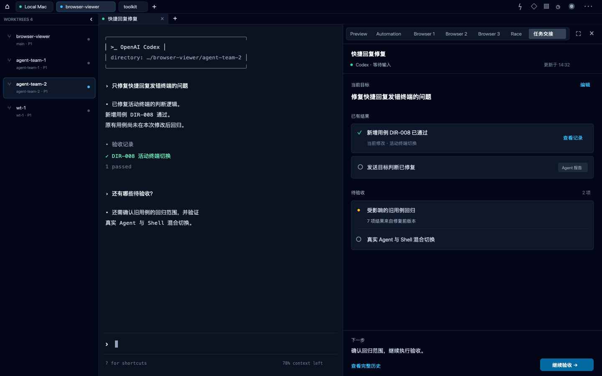

# 普通终端任务交接卡

日期：2026-09-27。历史设计原型，供讨论与后续实现参考，不代表当前产品能力或已冻结的实施合同。

## 原型

[打开可缩放 SVG](./prototype.svg)。第一版浅色独立导航方案已被否决，保留为 [历史图片](./superseded-v1.png)，不得作为实施依据。

此文件夹保存本轮讨论生成的静态图片，可直接打开查看，无需启动服务。图片内的任务、时间、命令和验收结果均为示例，不是执行证据；本原型没有可点击交互。

## 用户目标与流程

让普通终端里的多轮任务持续保留当前目标、交付依据和剩余事项，减少反复询问进度与重新理解历史的成本。

用户在终端工作；拟在现有右侧 Sidecar 工具栏新增“任务交接”标签，每轮结束后更新该面板。用户可以纠正目标、查看证据，并主动点击“继续验收”，将当前目标、证据引用和待办交给 Agent 接续执行。

| 拟议产品功能     | 行为意图                                           |
| ---------------- | -------------------------------------------------- |
| 当前目标／编辑   | 显示本次要求，允许用户纠正；需求调整后同步更新范围 |
| 已有结果         | 分别表达 Agent 自述与有验证记录支持的结果          |
| 查看记录         | 打开对应证据，保留其版本与适用范围                 |
| 待验收           | 列出剩余事项，标明旧版本结果需要重新确认的部分     |
| 下一步／继续验收 | 用户主动触发接续执行，传递目标、证据引用与待办     |
| 查看完整历史     | 回到完整工作记录核对上下文                         |

图中没有原型辅助控件。当前采用现有 Sidecar 内的任务交接标签，沿用其关闭、展开和拖动调宽结构。图中展示调宽至 620px 的状态，不修改现有默认宽度；窄屏布局、执行中反馈与证据详情页尚未设计。

## 调研形成的设计约束

- 目标可以跨多轮执行，同一会话也可能包含不同目标；不能直接把会话或最后一轮等同于任务。
- 用户缩小范围后，未选方案和建议项不能继续算作必做事项。
- Agent 报告完成不等于已验证；未知或来源不完整也不等于任务失败。
- 验证结果必须保留对应版本，不能把修改前后的不同用例结果拼成当前版本全部通过。
- 环境恢复只解除验收阻塞，不能替代验收结果。
- 两个回放样本中 Activity 回复记录与原生会话历史存在差异，原因尚未确定。实现前需要补全来源并表达覆盖情况。
- 按事项增量保存证据引用，必要时读取原始记录，避免只读最后一轮或反复分析全部历史。

## 实现边界与验证方向

第一版建议先覆盖一种常用终端 Agent，复用 [Work History 聚合入口](../../../backend/src/work-history/work-history-service.ts) 读取历史。卡片生成、目标分组、增量更新、证据关联和接续执行仍需设计与实现，本图片不证明这些能力已经存在。

本轮不涉及 Droidian，不增加自动执行或任务完成率评分。没有修改产品代码，也没有进行真实 UI 验收。

后续应优先用真实任务验证：是否误报完成、是否正确响应需求变更、是否及时消除过期待办，以及下一轮是否正确接续。自动提取准确率与节省时间尚未得到验证。

## 第二版的代码依据

本版按当前工作区代码绘制，非真实产品截图。只提出 Sidecar 新标签及其内容；外壳、导航、终端背景与尺寸来自下列组件：

| 现有结构                                             | 代码来源                                                                                                 |
| ---------------------------------------------------- | -------------------------------------------------------------------------------------------------------- |
| 深色终端工作区、顶部项目导航、Worktree 与终端组合    | [workspace/shell.tsx](../../../frontend/src/components/terminal/workspace/shell.tsx)                     |
| 32px 顶栏、连接切换、项目标签和右上角工具入口        | [workspace/header.tsx](../../../frontend/src/components/terminal/workspace/header.tsx)                   |
| 默认宽度 236px 的 Worktree 列表                      | [workspace/worktree-rail.tsx](../../../frontend/src/components/terminal/workspace/worktree-rail.tsx)     |
| 26px 终端标签栏                                      | [session/session-tab-strip.tsx](../../../frontend/src/components/terminal/session/session-tab-strip.tsx) |
| 终端背景 #0b1220                                     | [surface/surface-layout.tsx](../../../frontend/src/components/terminal/surface/surface-layout.tsx)       |
| 可调宽右侧区域及其挂载                               | [workspace/stage.tsx](../../../frontend/src/components/terminal/workspace/stage.tsx)                     |
| Preview、Automation、Browser 工具标签与关闭/展开入口 | [preview/panel/shell.tsx](../../../frontend/src/components/terminal/preview/panel/shell.tsx)             |

图中不展示条件性 Agent Team 标签，终端文本和任务数据为示例。第一版白底、大字号卡片和独立导航均已废弃。此次仍仅修改原型资源。

### 本轮检查

SVG 已通过本机 Quick Look 渲染并人工查看完整图片，PNG 为其导出预览。Playwright CLI 的独立浏览器导航等待超时，未取得浏览器验收结果；因此不声称浏览器交互验证通过。`pnpm docs:check` 通过。
