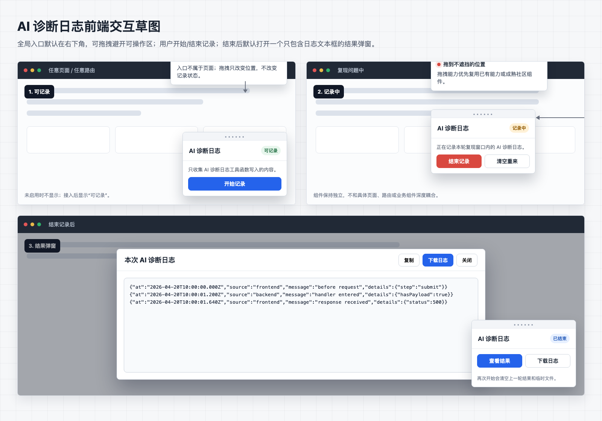

# AI 诊断日志收集系统

本文描述一套很窄的日志收集系统：只收集 AI 为定位问题而通过指定工具函数打印的诊断日志。普通控制台日志、标准输出、标准错误、子进程输出、运行时错误、本地日志文件都不进入这套系统。

系统目标是支持“AI 加诊断日志 -> 开始记录 -> 复现 -> 用户结束记录 -> AI 读取日志 -> 分析问题”的闭环。

如果需要排查后端在复现窗口之前已经发生的问题，先看 [后端滚动日志](backend-rolling-logs.md)。后端滚动日志是持续保留最近三天的低噪声 JSONL 文件；本系统是显式 start/stop 的临时诊断录制，两者不互相接入。

## 目标

- 只收集 AI 诊断日志工具函数打印的日志。
- 前端和后端都可以使用同一套诊断日志语义。
- 记录窗口显式开始和结束；开始可以由 AI 或用户触发，结束由用户通过 Web/App 的日志上报入口触发。
- 记录中状态必须对用户可见。
- 结束记录后默认打开结果弹窗。
- 日志记录期间，同一条 AI 诊断日志同时打印到控制台和写入日志收集器。
- AI 可以直接读取记录结果；用户也可以在日志上报弹窗里查看、复制服务端日志路径、复制正文或下载。
- 开始新一轮记录时，先清空上一轮记录结果和临时文件。

## 非目标

- 不采集普通 `console.*`。
- 不采集 `stdout` / `stderr`。
- 不采集子进程输出。
- 不自动采集浏览器运行时错误。
- 不扫描本地日志文件。
- 不设计具体应用的日志规范。
- 不定义固定事件名称。
- 不定义固定分类枚举。
- 不要求日志调用方传入请求、连接、页面等场景标识。
- 不引入外部日志服务作为第一版前提。

## 日志记录模型

日志记录只保留少量通用字段。除时间外，其余内容都放进自由结构的 `details`。

```ts
interface DiagnosticLogRecord {
  at: string;
  source?: string;
  message: string;
  details?: Record<string, unknown>;
}
```

字段说明：

- `at`：日志进入收集系统的时间。
- `source`：自由字符串，例如 `frontend`、`backend` 或某个脚本名。
- `message`：日志主体。AI 临时打印的定位信息可以直接写在这里。
- `details`：可选结构化补充。系统不规定里面必须有什么字段。

## 诊断日志工具函数

日志入口只有一种：AI 诊断日志工具函数。

前端和后端都提供同语义工具函数：

```ts
aiDiagnosticLog(message, details);
```

或对象形式：

```ts
appendAiDiagnosticLog({
  message,
  details,
});
```

只有这些工具函数写入的内容会进入诊断日志收集器。AI 如果希望某条信息被收集，必须在对应位置显式调用诊断日志工具函数。

## 控制接口

控制接口供 AI 和前端日志上报入口调用。`start()` 可以由 AI 或用户触发；`stop()` 是用户通过日志上报入口点击“结束并上报”触发。

建议提供一组最小控制接口：

```ts
interface DiagnosticLogController {
  start(): Promise<void>;
  stop(): Promise<DiagnosticLogResult>;
  getResult(): Promise<DiagnosticLogResult | null>;
  download(): Promise<void>;
}
```

接口语义：

- `start()`：开始新一轮记录。调用时先清空上一轮内存日志和临时目录；如果记录中重复调用，也执行同样的清空并重新开始。
- `stop()`：结束当前记录，冻结结果，并默认触发结果弹窗。该接口由用户通过日志上报入口触发，不作为 AI 连续自动调用的接口。
- `getResult()`：读取最近一次记录结果，供 AI 直接分析；返回脱敏后的日志。
- `download()`：把最近一次记录写入系统临时目录，并触发本地下载。

建议结果结构：

```ts
interface DiagnosticLogResult {
  startedAt: string;
  stoppedAt: string;
  logs: DiagnosticLogRecord[];
  files?: {
    dir?: string;
    logsJsonl?: string;
    redactionReportJson?: string;
  };
}
```

`files` 只在需要本地导出时出现。AI 正常分析时应优先读取 `logs`。

## 前端实现

前端实现由两部分组成：

- 全局记录控制器。
- AI 诊断日志工具函数。

前端工具函数伪代码：

```ts
function aiDiagnosticLog(message: string, details?: Record<string, unknown>) {
  console.log(message, details);

  if (!diagnosticRecorder.isRecording()) {
    return;
  }

  diagnosticRecorder.append({
    at: new Date().toISOString(),
    source: "frontend",
    message,
    details,
  });
}
```

实现规则：

- 不包装全局 `console.*`。
- 不自动捕获 `window.onerror`。
- 不自动捕获 `unhandledrejection`。
- AI 诊断日志始终打印到控制台。
- 只有记录状态为“记录中”时，才额外写入日志收集器。
- 记录中状态必须对用户可见。
- 用户结束记录后默认打开结果弹窗。

## 后端实现

后端同样只通过 AI 诊断日志工具函数写入日志。

后端工具函数伪代码：

```ts
function aiDiagnosticLog(message: string, details?: Record<string, unknown>) {
  console.log(message, details);

  if (!diagnosticRecorder.isRecording()) {
    return;
  }

  diagnosticRecorder.append({
    at: new Date().toISOString(),
    source: "backend",
    message,
    details,
  });
}
```

实现规则：

- 不包装 `process.stdout`。
- 不包装 `process.stderr`。
- 不监听子进程输出。
- 不扫描已有日志文件。
- AI 诊断日志始终打印到服务端控制台。
- 只有记录状态为“记录中”时，才额外写入日志收集器。

## 前后端汇总

如果应用同时有前端和后端，建议由后端或宿主进程作为汇总点。

传输机制使用 HTTP 接口，不复用已有业务 WebSocket。前端在 `stop()` 时一次性批量上报本轮前端 AI 诊断日志；后端收到后与本轮后端 AI 诊断日志合并，按 `at` 排序生成最终结果。

推荐流程：

1. AI 或用户触发 `start()`。
2. 控制器通知前端和后端进入记录中。
3. AI 或自动化流程复现问题。
4. 前端和后端只收集各自工具函数产生的 AI 诊断日志。
5. 用户通过日志上报入口点击“结束并上报”，触发 `stop()`。
6. 前端通过 HTTP 一次性批量上报本轮前端日志。
7. 后端停止本轮记录，并合并前端日志和后端日志。
8. 后端按 `at` 排序生成最终 `logs` 并返回结果。
9. 前端默认打开结果弹窗。

第一版只做 `stop()` 时批量上报和合并，不做实时同步。

建议 HTTP 接口：

```http
POST /api/diagnostic-logs/start
POST /api/diagnostic-logs/stop
GET  /api/diagnostic-logs/result
POST /api/diagnostic-logs/download
```

`start` 请求：

```json
{}
```

`stop` 请求：

```json
{
  "frontendLogs": [
    {
      "at": "2026-04-20T10:00:00.000Z",
      "source": "frontend",
      "message": "before request",
      "details": {
        "step": "submit"
      }
    }
  ]
}
```

`stop` 响应：

```json
{
  "startedAt": "2026-04-20T09:59:58.000Z",
  "stoppedAt": "2026-04-20T10:00:02.000Z",
  "logs": [
    {
      "at": "2026-04-20T10:00:00.000Z",
      "source": "frontend",
      "message": "before request",
      "details": {
        "step": "submit"
      }
    }
  ]
}
```

接口语义：

- `start`：清空上一轮结果和临时目录，前后端进入记录中；记录中重复调用时也清空当前记录并重新开始。
- `stop`：由用户点击“结束并上报”触发；接收前端批量日志，停止后端记录，合并并返回脱敏后的最终结果，同时默认打开结果弹窗。
- `result`：读取最近一次脱敏后的最终结果。
- `download`：把最近一次最终结果写入系统临时目录并触发下载。

## 前端记录状态

前端记录流程分成四种状态：

- 未启用：没有诊断日志能力，不显示入口。
- 可记录：已接入诊断日志能力，等待 AI 或用户开始记录。
- 记录中：开始记录后，只收集这一段时间窗口内的 AI 诊断日志；记录中状态必须对用户可见。
- 已结束：用户结束记录后停止收集，生成本次记录结果，并默认打开结果弹窗。

系统不应默认长期记录日志。记录窗口必须显式开始和结束；结束动作由用户通过日志上报入口触发。

开始新一轮记录时，先清空上一轮记录结果和临时文件，避免 AI 读到旧日志。

## 用户入口

日志记录入口按客户端形态分开提供，不再维护旧的右下角可拖拽全局浮窗。

Web Terminal 工作区的入口在桌面端右上角工具栏 `More actions` 菜单中，菜单项为「日志上报」。入口打开受控弹窗，弹窗至少提供：

- 当前状态：未启用、可记录、记录中、已结束。
- 开始记录：触发 `start()`。
- 结束并上报：触发 `stop()`，把本轮 Web 前端日志和后端日志合并并持久化到服务端目录。
- 查看结果：展示最近一次结果。
- 复制日志路径：优先复制 `files.logsJsonl`，没有时 fallback 到 `files.dir`。
- 复制日志正文：复制脱敏后的结果文本。
- 下载日志：触发 `download()`。

Web 入口只在 Terminal 工作区内展示，不作为跨页面常驻控件。旧的 `window.runweaveDiagnosticLogs` 控制器和固定浮窗入口已移除。

App 端入口在首页更多菜单和终端页更多菜单中，复用 `SupportLogSheet`。App 上报完成后同样以服务端 `logsJsonl` 路径为主结果，便于用户复制给 AI 或维护者。

## 前端交互草图

下图是早期全局浮窗方案的历史草图，仅用于理解 start/stop/result 的交互闭环；当前实现入口以 Web/App 菜单为准。



草图覆盖的交互：

- 用户可以从入口开始记录。
- 记录中状态对用户可见。
- 用户点击结束并上报后默认展示结果。
- 结果弹窗提供服务端日志路径、日志正文、复制和下载能力。

## 结果弹窗

记录结束后，前端默认打开或保持一个弹窗展示本次记录结果。弹窗不是 AI 分析的必要前提，而是给用户查看、复制或下载的兜底入口。

弹窗需要优先展示服务端日志文件路径。复制路径时使用 `logsJsonl ?? dir`；如果后端没有返回路径，必须禁用复制路径动作并提示“已结束记录，但未返回服务端日志路径”。弹窗仍可提供日志正文文本框，文本格式不做要求，能直接查看和复制即可。

下载到本地可以作为额外按钮提供，但 Web/App 上报的主能力是拿到服务端日志路径。

AI 应优先直接读取本次记录结果；弹窗只是用户辅助查看路径。

## 缓冲策略

每个运行环境维护一份当前记录窗口内的日志缓冲区。

规则：

- 开始记录时清空上一轮日志。
- 记录中再次开始记录时，也清空当前日志并重新开始。
- 记录中只追加当前窗口内的 AI 诊断日志。
- 结束记录后冻结本轮原始结果；对外读取、弹窗展示和下载时使用脱敏后的结果。
- 默认不设置导出包大小上限。

## 查看与导出

AI 最终读取的单位是一组按时间排序的 AI 诊断日志。

本地导出写入系统临时目录。诊断包是一次性数据，不需要长期保存；开始新一轮记录时先删除上一轮临时目录。

建议本地导出结构：

```text
diagnostic-logs-<timestamp>/
  logs.jsonl
  redaction-report.json
```

### `logs.jsonl`

主日志文件。每行一个 `DiagnosticLogRecord`，按 `at` 升序排序。

示例：

```jsonl
{"at":"2026-04-20T10:00:00.000Z","source":"frontend","message":"before request","details":{"step":"submit"}}
{"at":"2026-04-20T10:00:01.200Z","source":"backend","message":"request handler entered","details":{"hasPayload":true}}
```

### `redaction-report.json`

记录脱敏统计，不记录原文：

```json
{
  "tokens": 3,
  "cookies": 2,
  "authorizationHeaders": 1
}
```

## 脱敏规则

脱敏只作用于 AI 诊断日志的 `message` 和 `details`。

执行时机：

- 内存缓冲区保留记录期间写入的原始日志。
- `stop()` 响应返回脱敏后的日志。
- `getResult()` 返回脱敏后的日志。
- 结果弹窗展示脱敏后的日志。
- `logs.jsonl` 写入脱敏后的日志。
- 不在导出包中保存脱敏前的日志。

默认脱敏：

- 认证头。
- cookie。
- 密码、令牌、密钥、票据。
- URL 查询参数里的敏感字段。

允许保留：

- 字段是否存在。
- 字符串长度。
- 哈希后的短指纹。
- 已脱敏 URL。
- 错误类型和必要错误信息，但需要经过敏感信息扫描。

脱敏规则必须在任何对外读取前执行。导出包里不应同时保存“脱敏前”和“脱敏后”两份日志内容。

## AI 使用流程

推荐排障流程：

1. AI 在需要的位置加入诊断日志工具函数调用。
2. AI 或用户开启日志记录。
3. AI 或自动化流程用最小步骤复现问题。
4. 用户通过日志上报入口结束日志记录。
5. AI 读取本次记录结果。
6. AI 按时间线寻找第一个异常点。
7. 如果日志不够，AI 补充新的诊断日志调用，再重复记录和复现。
8. 修复后，用同一路径再次记录，确认异常日志消失或顺序恢复合理。

## 分阶段落地

### 阶段 1：基础能力

- 定义 `DiagnosticLogRecord`。
- 建立当前记录窗口内的内存缓冲区。
- 提供前端和后端 AI 诊断日志工具函数。
- 支持开始记录、用户结束记录、AI 读取记录结果。
- 支持生成 `logs.jsonl`。

验收标准：

- 只有 AI 诊断日志工具函数打印的日志会进入收集器。
- 普通 `console.*`、`stdout`、`stderr`、子进程输出不会进入收集器。
- 调用 `POST /api/diagnostic-logs/start` 后，记录状态进入“记录中”。
- 记录中重复调用 `POST /api/diagnostic-logs/start` 时，会清空当前缓冲区并重新开始记录。
- 调用 `POST /api/diagnostic-logs/stop` 后，记录状态进入“已结束”，新的 AI 诊断日志不再进入本轮缓冲区。
- 无记录结果时，`GET /api/diagnostic-logs/result` 返回 `null`。
- AI 能读取本次记录结果。

### 阶段 2：前端结果与下载

- 支持 Web Terminal 右上角 `More actions` ->「日志上报」入口。
- 支持 App 首页和终端页更多菜单里的「日志上报」入口。
- 支持前端全局记录状态提示。
- 支持从日志上报入口开始记录、结束并上报、查看结果、复制服务端路径和下载日志。
- 支持结束记录后的结果弹窗。
- 支持下载到系统临时目录。
- 支持 `redaction-report.json`。

验收标准：

- Web Terminal 右上角存在 `More actions`，菜单内有「日志上报」。
- App 首页和终端页更多菜单内有「日志上报」。
- 日志上报弹窗能显示未启用、可记录、记录中、已结束状态。
- 通过日志上报入口开始记录后，记录中状态对用户可见。
- 通过日志上报入口结束并上报后，结果弹窗展示本次日志条数和服务端日志文件路径。
- 结果弹窗能复制服务端日志路径；没有路径时禁用复制路径并显示明确提示。
- 结果弹窗保留日志正文查看/复制能力。
- 结果弹窗提供下载入口。
- 开始新一轮记录时清空上一轮结果和临时文件。
- Web 前端交互必须使用 `$playwright-cli` 实际验证。

### 阶段 3：排障工作流

- 增加使用手册。
- 明确“AI 加诊断日志 -> 开始记录 -> 复现 -> 用户结束记录 -> AI 阅读 -> 补日志 -> 再复现”的闭环。
- 为导出格式和脱敏逻辑增加测试。

验收标准：

- 新问题不需要先临时设计日志收集方式。
- AI 能稳定拿到同一种诊断日志结果。
- 导出格式变化可被测试捕获。
- 最终交付前必须用 `$playwright-cli` 验证 Web 日志上报入口、开始记录、结束并上报、结果弹窗、路径复制和下载入口。

## 实现约束

- 只收集 AI 诊断日志工具函数写入的日志。
- 不捕获普通 `console.*`、`stdout`、`stderr`、子进程输出或运行时错误。
- 不把具体应用概念写进基础日志模型。
- 不为 `source`、`message`、`details` 之外的字段设置强约束。
- 不要求日志调用方提供场景标识。
- 不把诊断日志写成无限增长文件。
- 不引入外部日志服务作为第一版前提。
- 不为本地导出包设置默认大小上限。
- Web 日志上报入口应保持在 Terminal 工作区工具栏菜单内，不恢复旧的 `window.runweaveDiagnosticLogs` 全局控制器。
- 涉及 Web 前端交互的实现完成后，必须使用 `$playwright-cli` 验证，不只依赖代码检查。
