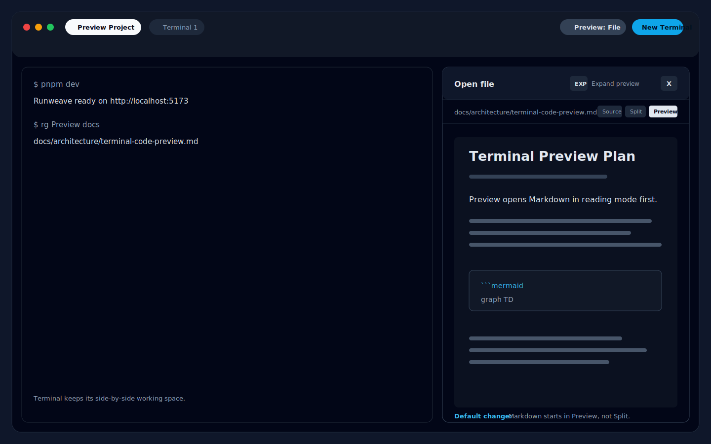
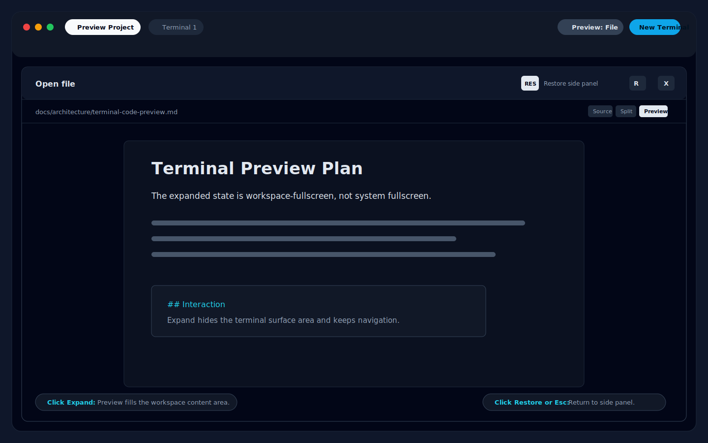
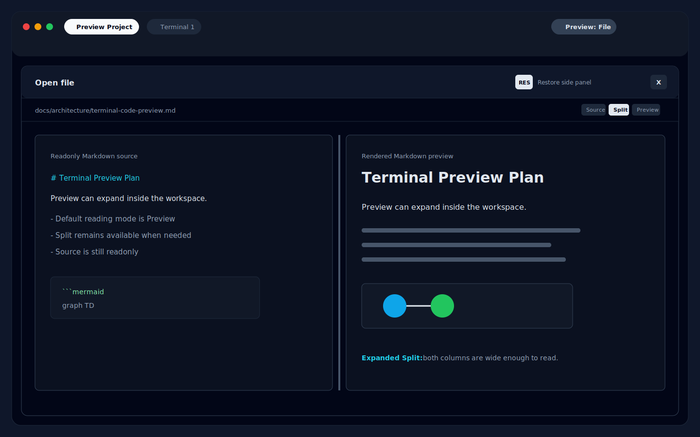

# Preview 工作区全屏实现计划

**目标：** 改善 Terminal Preview 中 Markdown 文件的阅读体验：Markdown 默认以 rendered preview 打开，并为 Preview 面板增加一键工作区全屏能力。

**架构：** Preview 继续保持 project-scoped，并且只存在于当前 Terminal 工作区内。新增一个全局 Preview UI 状态用于表示工作区展开态，同一个 `TerminalPreviewPanel` 可以渲染为右侧面板，也可以渲染为占满工作区内容区域的面板。Markdown 的 `Source` / `Split` / `Preview` 仍然只是 file mode 内部的视图切换，不新增顶层模式。

---

## 交互草图

| 交互                                                                             | 草图                                                                        |
| -------------------------------------------------------------------------------- | --------------------------------------------------------------------------- |
| 打开 Markdown 文件；右侧面板默认显示 rendered `Preview`                          |         |
| 点击 `Expand preview`；Preview 占满工作区内容区域，同时保留 project/session 导航 |  |
| 展开态点击 `Split`；source 和 rendered Markdown 都有足够宽度可读                 |                |

## 产品决策

- "全屏"只表示工作区内全屏。不要调用浏览器 fullscreen API，也不要调用 Electron 原生全屏。
- Preview 展开时，外层 Runweave/project/session 导航保持可见。
- Preview header 增加一个展开/还原图标按钮。可访问 label 使用 `Expand preview` 和 `Restore preview`。
- 展开态按 `Esc` 时，还原为右侧面板布局。`Esc` 不关闭 Preview。
- 关闭 Preview 时把 `expanded` 重置为 `false`；再次打开 Preview 时从右侧面板开始。
- 展开态禁用拖拽调整宽度。已保存的右侧面板宽度保留，并在还原后继续使用。
- Markdown 文件默认使用 rendered `Preview`；`Source` 和 `Split` 仍然可用，并且用户显式选择后继续按 project 保存偏好。

## 核心代码

### Store 新增状态与常量（preview-store.ts）

```ts
export const DEFAULT_MARKDOWN_VIEW_MODE: TerminalMarkdownViewMode = "preview";

interface TerminalPreviewUiState {
  open: boolean;
  widthPx?: number;
  expanded: boolean;
}

// 新增 action
setExpanded: (expanded: boolean) => void;

// closePreview 时重置展开态
closePreview: () => {
  set((state) => ({
    ui: { ...state.ui, open: false, expanded: false },
  }));
},
```

### 面板展开布局（terminal-preview-panel.tsx）

```tsx
// 展开态面板宽度
const panelWidth = expanded
  ? "100%"
  : widthPx
    ? `${widthPx}px`
    : "clamp(320px, 50vw, 60vw)";

// expand/restore 按钮
<Button
  size="sm"
  variant="ghost"
  onClick={() => setExpanded(!expanded)}
  aria-label={expanded ? "Restore preview" : "Expand preview"}
>
  {expanded ? (
    <Minimize2 className="h-4 w-4" />
  ) : (
    <Maximize2 className="h-4 w-4" />
  )}
</Button>;

// Markdown 默认视图
const markdownViewMode =
  projectState?.markdownViewMode ?? DEFAULT_MARKDOWN_VIEW_MODE;
```

### 工作区布局切换（terminal-workspace.tsx）

```tsx
// 展开态隐藏 terminal 内容区域
<div className={[
  "relative min-h-0 flex-1",
  previewOpen && previewExpanded ? "hidden" : "",
].join(" ")}>
```

## 涉及文件

| 文件                                                          | 变更                                                                         |
| ------------------------------------------------------------- | ---------------------------------------------------------------------------- |
| `frontend/src/features/terminal/preview-store.ts`             | 增加 `ui.expanded`、`DEFAULT_MARKDOWN_VIEW_MODE`、`setExpanded` action       |
| `frontend/src/features/terminal/preview-store.test.ts`        | 增加 expansion state 和默认视图常量的 Vitest 覆盖                            |
| `frontend/src/components/terminal/terminal-preview-panel.tsx` | expand/restore 按钮、展开态布局、Escape 还原、禁用 resize、Markdown 默认视图 |
| `frontend/src/components/terminal/terminal-workspace.tsx`     | 读取 `ui.expanded`，展开态隐藏 terminal 内容                                 |
| `frontend/tests/terminal-preview.spec.ts`                     | 扩展 E2E 覆盖                                                                |

## 测试与验证

### 自动化

```bash
# Store 单测
pnpm --filter frontend test -- --run src/features/terminal/preview-store.test.ts

# TypeScript 检查
pnpm --filter frontend typecheck

# Lint
pnpm --filter frontend lint

# Preview E2E
pnpm --filter frontend e2e -- tests/terminal-preview.spec.ts
```

### 手工回归清单

- 打开 Markdown 文件时，默认进入 rendered `Preview`。
- 在 `Source`、`Split`、`Preview` 之间切换时，当前 selected file 不变。
- 点击 `Expand preview` 后，只占满工作区内容区域，顶部 project/session 导航仍然可见。
- 点击 `Restore preview` 后，回到之前的右侧面板宽度。
- 展开态按 `Esc` 时，还原为右侧面板，不关闭 Preview。
- 展开态关闭 Preview 后，再次打开时从右侧面板开始。
- Changes mode 仍然能打开，并显示 staged/working files。
- Mobile client mode 仍然不展示 Preview 入口。

## 验收标准

- Markdown 默认阅读体验改善：新打开 Markdown 文件使用 rendered `Preview`，不是 `Split`。
- Preview 提供一键工作区展开能力，并有明确可见的还原控制。
- 工作区展开不使用浏览器或 Electron 原生 fullscreen。
- 展开态保留顶部 project/session 导航。
- 还原后保留原有右侧面板宽度行为。
- 不新增前端 `*.tsx` 单测。
- 聚焦 store test、frontend typecheck、frontend lint、Preview E2E 均通过。
