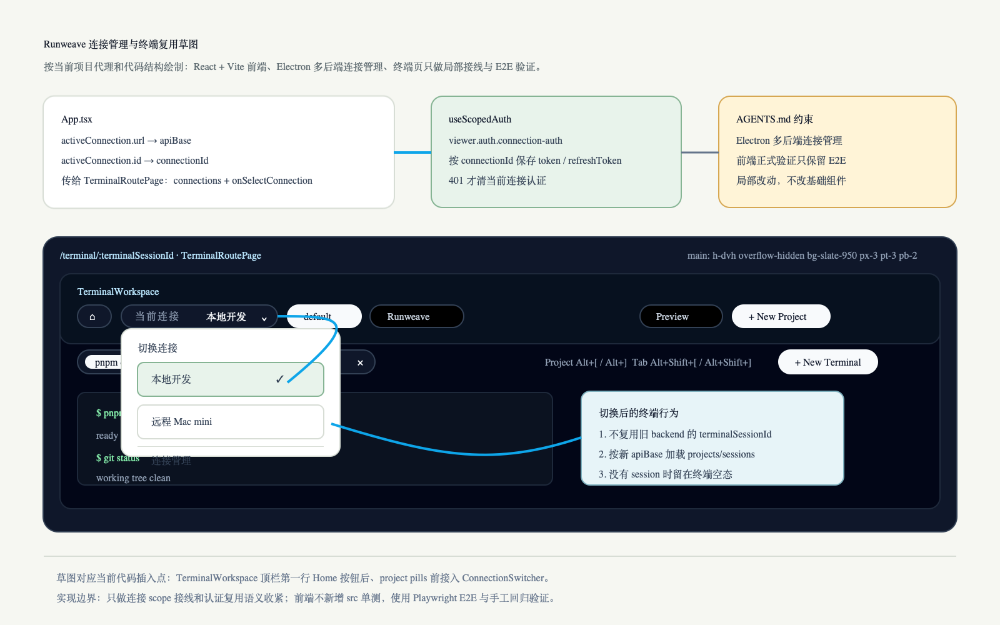

# 连接管理与终端切换增强计划

**目标：** 增强 Electron 客户端的连接管理：切换连接时复用仍有效的认证态，避免每次重新登录；同时在终端页复用连接切换能力，让用户能直接切到远程 backend 的终端工作区。

**架构：** 保持 `App` 顶层 connection scope 作为唯一连接来源。`apiBase`、`connectionId`、认证态、首页和终端页都从 active connection 派生。连接切换不等同于 logout，只切换当前 scope；每个 connection 保留自己的认证 session 和最近终端选择。

---

## 当前项目代理约束

- 项目名是 Runweave；前端是 React + Vite，Electron 客户端负责多后端连接管理。
- 默认只处理当前本地可用的 mac Electron 客户端，不扩展 Windows 打包。
- 前端 `src/` 下不新增 Vitest/单测文件，正式自动化验证只保留 Playwright E2E。
- 实现必须保持局部、直接、少抽象：优先复用现有 `ConnectionSwitcher`，不改基础 UI 组件，不扩大到无关路由。

## 交互草图



源文件：`assets/connection-terminal-switching-flow.svg`

草图依据当前代码结构绘制：

- `/terminal/:terminalSessionId` 外层来自 `TerminalRoutePage`，当前是 `h-dvh overflow-hidden bg-slate-950 px-3 pt-3 pb-2`。
- `TerminalWorkspace` 顶栏当前有两行：第一行 `Home`、project pills、Preview、`New Project`；第二行 session pills、快捷键提示、`New Terminal`。
- 连接切换器的推荐插入点是第一行 `Home` 按钮之后、project pills 之前；这样不改变 project/session 导航，也不改 shared base UI。
- 草图里的下拉菜单复用现有 `ConnectionSwitcher` 语义：当前连接、连接列表、连接管理入口。

## 当前代码事实

- Electron 下 `App` 从 `useConnections(...)` 取得 `activeConnection`，并用 `activeConnection.url` 作为 `apiBase`。
- Electron 下 `App` 把 `activeConnection.id` 传给 `useScopedAuth(...)`，认证态已经具备按连接隔离的基础。
- `useScopedAuth(...)` 通过 `viewer.auth.connection-auth` 保存每个连接的 `accessToken`、`accessExpiresAt`、`refreshToken` 和 `sessionId`。
- 当前 Electron 校验逻辑会在切换到已有 session 时调用 `/api/auth/verify`，验证失败后把当前连接认证态置为未登录。
- `ConnectionSwitcher` 已经是独立 UI 组件，目前接入登录页和首页。
- `/terminal/:terminalSessionId` 当前只接收 `apiBase`、`token`、`clientMode`、`onAuthExpired`，没有接入 `connections`、`activeConnectionId` 和 `onSelectConnection`。
- `TerminalWorkspace` 当前只管理 terminal project/session 切换，不管理 backend connection 切换。
- `TerminalWorkspace.loadSessions(...)` 当前直接 `Promise.all([listTerminalProjects(apiBase, token), listTerminalSessions(apiBase, token)])` 后写入 state，没有 `AbortController`、request id 或 stale check；快速连续切换连接时，旧 `apiBase` 的响应可能晚到并覆盖新连接数据。
- terminal 最近选择通过 `loadRecentTerminalSelection(apiBase)` 按 `apiBase` 隔离，这个行为适合保留。

## 产品决策

- 切换连接只改变当前 active connection，不主动清空任意连接的认证态。
- 未过期 access token 应直接可用；过期后优先用 refresh token 静默刷新。
- 只有当前连接明确返回 `401 Unauthorized` 时，才清理该连接认证态并要求重新登录。
- 网络不可达、backend 临时未启动、`/health` 或 `/verify` 普通失败，不等同于登录失效。
- 终端页显示同一个 `ConnectionSwitcher`，位置放在 terminal workspace 顶栏左侧或 home 按钮附近，保持当前 project/session 导航可见。
- 在终端页切换连接后，继续停留在终端上下文，而不是强制回首页。
- 切到新连接后不复用旧连接 URL 中的 `terminalSessionId`。应重新加载新 `apiBase` 的 terminal projects/sessions。
- 切到新连接后优先恢复该连接最近一次 terminal selection；没有最近项时选第一个可用 session。
- 如果目标连接没有任何 terminal session，v1 显示终端空态和 `New Terminal` 入口，不自动创建远程终端。

## 方案

### 1. 认证复用语义收紧

保持现有 `viewer.auth.connection-auth` 存储结构，不新增 credential store。

调整 Electron 校验策略：

- load 当前 `connectionId` 的 session。
- 如果 access token 未过期，先进入 authenticated 状态，允许页面使用该 token。
- 后台可做轻量 revalidate，但普通网络错误不清 token。
- 如果 access token 已过期且有 refresh token，执行 refresh。
- refresh 返回 401 时清理当前连接认证态。
- refresh 网络失败时保留本地 session，并在 UI 层显示连接不可用或请求错误。

这样符合“token 在过期前都可用”的用户预期，也避免把远程 backend 暂时不可达误判为需要重新登录。

### 2. 终端页接入连接切换器

把连接相关 props 从 `App` 传入 `TerminalRoutePage`：

- `connections`
- `activeConnectionId`
- `connectionName`
- `onSelectConnection`
- `onOpenConnectionManager`

再传入 `TerminalWorkspace` 或新增一个终端页顶栏 wrapper。优先选择局部接线，不改 shared base UI。

终端页切换连接时：

- 调用 `setActive(connectionId)`。
- 当前 `apiBase/token` 由 `App` 顶层重新派生。
- `TerminalWorkspace` 按新 `apiBase` 重新 `listTerminalProjects(...)` 和 `listTerminalSessions(...)`。
- `loadSessions` 必须增加 abort / stale check 之一，推荐 request id + captured `apiBase` 双保险：
  - 每次加载递增 `loadSessionsRequestIdRef`。
  - 请求发起时捕获 `requestApiBase` 和 `requestId`。
  - 响应回来后，只有 `requestId` 仍是最新且 `requestApiBase === 当前 apiBase` 时才允许 `setProjects/setSessions/setActiveProjectId/setRequestError/setLoading`。
  - 如果服务层要支持真正 abort，再给 `listTerminalProjects/listTerminalSessions` 传 `AbortSignal`；否则至少必须做 stale check，避免旧连接响应覆盖新连接状态。
- 重新解析当前连接的最近 terminal selection。
- 如果旧 URL 的 `terminalSessionId` 在新连接不存在，则替换为新连接选中的 session URL。
- 如果新连接没有 session，则显示空态，不把用户送回 `/login` 或 `/`。

### 3. 连接状态与错误表达

连接管理页和切换器应区分三类状态：

- `未登录`：当前连接没有有效 session，或 refresh 明确 401。
- `连接不可用`：backend 不通、health 失败、verify 网络失败。
- `已登录`：本地 session 可用，或 refresh/verify 成功。

v1 不需要新增复杂状态机，可以在现有 `useScopedAuth` 和请求错误处理上收敛语义。

## 涉及文件

| 文件                                                      | 计划变更                                                                                                   |
| --------------------------------------------------------- | ---------------------------------------------------------------------------------------------------------- |
| `frontend/src/App.tsx`                                    | 给 `TerminalRoutePage` 传入连接列表、当前连接、切换和管理入口                                              |
| `frontend/src/pages/terminal-page.tsx`                    | 接收连接 props，并把连接切换能力接到终端工作区                                                             |
| `frontend/src/components/terminal/terminal-workspace.tsx` | 顶栏增加 `ConnectionSwitcher`；切换连接后适配空态和 session 重选；给 `loadSessions` 增加 abort/stale guard |
| `frontend/src/components/connection-switcher.tsx`         | 复用现有组件；必要时补充状态文案，但不改基础组件风格                                                       |
| `frontend/src/features/auth/use-scoped-auth.ts`           | 调整 Electron token 校验、refresh 和错误清理语义                                                           |
| `frontend/src/features/auth/storage.ts`                   | 保持当前按 connectionId 存储结构；仅在需要时补充兼容读取                                                   |
| `frontend/src/features/terminal/recent-selection.ts`      | 保持按 `apiBase` 隔离最近选择，验证切换连接后行为                                                          |
| `frontend/tests/*.spec.ts`                                | 只补 E2E，不新增前端 `src/**/*.test.tsx` 单测                                                              |

## 实施步骤

1. 梳理认证现状并调整 `useScopedAuth` 的 Electron 校验语义。
   - 验证：已有连接 token 未过期时，切回连接不进入登录页。
2. 把连接 props 从 `App` 接到 `TerminalRoutePage` 和 `TerminalWorkspace`。
   - 验证：终端页能看到当前连接，并能打开连接下拉。
3. 实现终端页切换连接后的 session 重选和 URL 替换。
   - 验证：旧连接的 terminal id 不会被带到新连接使用。
4. 给终端 session/project 加载增加竞态保护。
   - 验证：快速从 A 连接切到 B 再切到 C 时，A/B 的晚到响应不能覆盖 C 的 projects/sessions/error/loading 状态。
   - 验证：如果采用 `AbortController`，旧请求 abort 不展示错误、不触发登录失效；如果采用 request id/stale check，旧响应被忽略。
5. 处理目标连接无 terminal session 的空态。
   - 验证：留在终端页，展示创建入口，不自动跳首页或登录页。
6. 补充 E2E 覆盖连接切换和终端重载路径。
   - 验证：只新增 Playwright E2E，不新增前端 src 单测。

## 测试与验证

### 自动化

```bash
pnpm typecheck
pnpm lint
pnpm test
pnpm --filter frontend e2e -- tests/terminal*.spec.ts
```

如只改前端接线，可先跑更窄的：

```bash
pnpm --filter frontend typecheck
pnpm --filter frontend lint
pnpm --filter frontend e2e -- tests/terminal*.spec.ts
```

### 手工回归

- Electron 客户端登录本地连接后，切到远程连接再切回本地，未过期时不重新登录。
- 远程连接 backend 临时不可达时，不清理该连接保存的 token。
- 远程连接明确返回 401 时，只清理远程连接认证态，不影响本地连接。
- 首页连接切换行为保持不变。
- 终端页能直接打开连接下拉并切到远程连接。
- 终端页切到远程连接后，加载远程 backend 的 terminal projects/sessions。
- 快速连续切换多个连接时，最终界面只显示最后一个 active connection 的 terminal projects/sessions。
- 远程连接没有 terminal session 时，显示空态和创建入口。
- 切换连接时，当前 terminal surface 不出现旧连接输出混入新连接的情况。

## 验收标准

- Electron 下连接切换不再默认要求重新登录。
- 每个连接的认证态独立保存和刷新。
- 未过期 token 可以继续使用；只有明确 401 才要求该连接重新登录。
- 终端页复用连接切换器，可直接切换到远程 backend。
- 终端页切换连接后使用目标 backend 的 terminal 数据，不复用旧 backend 的 terminal id。
- 终端页连接切换加载存在 abort 或 stale check，旧连接请求晚到不会覆盖当前 active connection 的状态。
- 没有新增前端 `src/` 下的 Vitest/单测文件。
