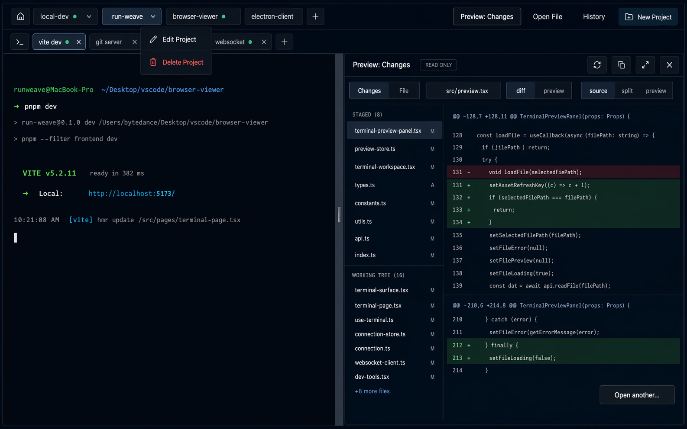
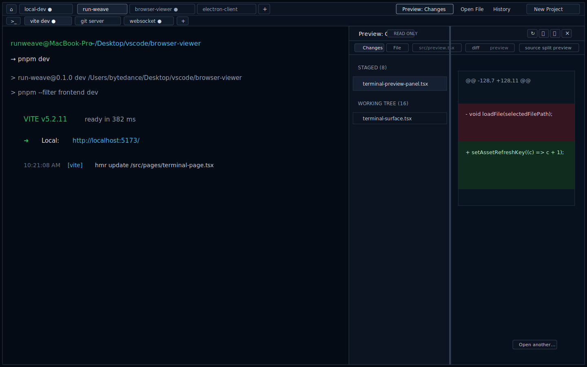

# 终端管理页紧凑 Workbench 重构计划

**目标：** 仅重构 Runweave 终端管理页的信息架构与视觉密度，采用方案 A：密集 IDE / workbench 风格，让主要空间回到 terminal 输出、预览、历史和多会话操作本身。

**范围：** 只覆盖 `/terminal` / `/terminal/:terminalSessionId` 对应的终端页面级布局。不要改首页、连接管理页、基础 `Button`/Dialog/Sheet 组件，不新增前端 `src` 单测。

**推荐方案：** 方案 A。保留现有 `TerminalWorkspace` 的项目 tab、终端 tab、右侧 preview、history drawer 和连接切换能力，只做页面 chrome 压缩、布局重排和局部样式收敛，不引入左侧树、多 pane、inspector 或 command palette。

---

## 设计图

高保真图：



结构稿：



---

## 设计原则

- **内容优先：** terminal surface 和 preview 是主角；页面外边距、大圆角、大按钮都让位。
- **两行顶部 chrome：** 第一行是项目级 command bar，第二行是 session tab strip。两行总高度控制在 56-60px。
- **不保留底部 status bar：** 本次不展示底部状态栏，也不展示快捷键提示；快捷键功能继续保留，后续如需要再单独规划提示方式。
- **矩形而非 pill：** project/session tab 使用 3-4px radius、1px divider、轻背景/底边表达 active，不再使用大白色圆 pill。
- **图标优先：** 新建、预览、历史、刷新、复制、展开、关闭等低文本化；必要时用 `aria-label` / `title` 保证可理解。
- **局部变更：** 样式变化放在终端页面相关组件里，不改 shared base UI。
- **移动端谨慎：** 保持 monitor-first；不破坏 `h-dvh -> min-h-0 -> xterm FitAddon` 高度链。

---

## 当前代码事实

- `/terminal/:terminalSessionId` 外层在 `frontend/src/pages/terminal-page.tsx`，当前 class 为 `h-dvh overflow-hidden bg-slate-950 px-3 pt-3 pb-2`，页面自身有 12px 左右边距和顶部/底部 padding。
- `TerminalWorkspace` 外层在 `frontend/src/components/terminal/terminal-workspace.tsx`，当前是 `rounded-2xl border ... bg-slate-950`，形成“网页卡片”观感。
- 当前顶栏两行：
  - 第一行：Home、ConnectionSwitcher、project pills、TerminalPreviewMenu、New Project。
  - 第二行：session pills、快捷键提示、New Terminal。
- 项目右键菜单已有 Edit / Delete，基于 Radix context menu。
- session tab 已有 close 操作、activity marker、bell marker。
- `TerminalPreviewPanel` 支持 Changes/File/Markdown/SVG、resize、expanded、copy、refresh、close。
- `TerminalHistoryDrawer` 使用右侧 Sheet，当前有较大外边距、header padding 和内容 padding。
- 移动端通过 `clientMode === "mobile"` 限制桌面操作，已有 `terminal-mobile-keybar.tsx`。

---

## 目标页面结构

### 1. Terminal Shell

整体高度结构：

```text
┌────────────────────────────────────────────────────────────┐
│ command bar: 32px                                          │
├────────────────────────────────────────────────────────────┤
│ session tab strip: 26px                                    │
├────────────────────────────────────────────────────────────┤
│ terminal surface flex-1                  │ preview panel   │
│                                          │ optional        │
└────────────────────────────────────────────────────────────┘
```

尺寸目标：

- 页面外层：`h-dvh overflow-hidden bg-slate-950`，无 `px` / `py`。
- workspace 外层：`flex h-full min-h-0 flex-col overflow-hidden bg-slate-950 text-slate-100`。
- workspace 外层不使用 `rounded-2xl`，不做浮动 card。
- 边框只保留内部 chrome 分隔线：`border-b border-slate-800`、`border-l border-slate-800`、`border-t border-slate-800`。
- 不新增底部 status bar，main content 直接铺到 workspace 底部。

### 2. Command Bar

高度：32px。

布局：

```text
[home] [connection] [project tabs scroll area........................] [preview menu] [history] [+project]
```

左侧：

- Home icon button：24-26px。
- ConnectionSwitcher：高度 24-26px，矩形样式。
- Project tabs：高度 24-26px，横向滚动。

右侧 action 区：

- Preview：复用现有 `TerminalPreviewMenu` 作为单一入口，但局部 class 改成紧凑矩形。不要拆成独立 `Preview` / `File` 两个按钮；`Open file...` 和 `Changes` 继续留在 menu 内。
- History：打开当前 active session 的 history drawer。无 active session 时 disabled。
- New Project：icon-only 或短文本 `Project +`，高度 24-26px。
- 不放 New Terminal。新建终端只通过 session tab strip 里的 `+`，避免和 `+` tab 重复。

交互状态：

- active project：背景 `bg-slate-200 text-slate-950` 或 `border-b-2 border-cyan-400`，二选一。推荐轻背景，避免 header 视觉过重。
- inactive project：`text-slate-300 hover:bg-slate-800`。
- project 有 activity：右侧 green dot。
- project 有 bell：右侧 amber dot，优先级高于 activity。
- project 右键：保留 Edit / Delete。
- command bar 的 History 是补充入口，不替代 terminal surface 内部现有 history 入口。
- disabled/loading：按钮 opacity 降低，但不能改变高度。

不做：

- 不新增 project search。
- 不新增左侧树。
- 不新增 split pane。

### 3. Session Tab Strip

高度：26-28px，优先按 26px 实现。

布局：

```text
[>_ active session x] [session x] [session x] [+] ................................
```

尺寸：

- tab 高度 22-24px。
- tab padding：`px-2`，gap 4px。
- close hit area：18-20px。
- tab 最大宽度：180-220px，文字 truncate。

交互状态：

- active session：轻背景或顶部 2px accent，不再使用白色大 pill。
- inactive session：低对比度背景，hover 提升。
- close icon：默认弱显示，hover/focus 加强；移动端不显示 close。
- bell/activity dot 保留在 session name 后。
- session 点击切换仍调用 `setActiveSessionId(...)`。
- close 仍调用 `closeSession(...)`。
- `+` 新建终端仍调用 `createSession()`；`loading` 时 disabled，避免重复创建。

快捷键：

- `Alt+[ / Alt+]` 和 `Alt+Shift+[ / Alt+Shift+]` 功能保留，但本次不在页面上展示提示。
- 原有 keydown 逻辑不改。

### 4. Main Content

目标：

- active terminal surface 从 session strip 下方一直填到 workspace 底部。
- terminal 容器不增加外层 padding。
- 非 active cached surface 仍保持当前 offscreen 方式，避免破坏 cache/scrollback。
- headless connection 逻辑不改。
- `requestError` 不再放在 header 内。紧凑布局下改为 main content 顶部的 inline error banner，位于 terminal/preview 区上沿、session strip 下方，占满内容区宽度；关闭错误后内容区继续正常铺满。

Preview closed：

```text
terminal flex-1
```

Preview open：

```text
terminal flex-1 | 1px divider | preview width
```

Preview expanded：

- 保留当前 expanded overlay 模型。
- overlay 边界与 workspace 对齐，不增加外层 margin，也不为底部 status bar 预留空间。
- expanded 时保留 Escape 退出。

### 5. Preview Panel

压缩目标：

- Header：34px。
- Toolbar icon：28px。
- Changes 左侧列表 row：24-28px。
- Section title：20px。
- Resize handle：4px 可视 hover 区，实际 pointer 区可 8px。
- 面板内部不使用大 padding；代码/预览内容贴近边界但保留 8px 阅读间距。

保留能力：

- Changes 模式加载 git changes。
- File 模式搜索/打开文件。
- Markdown/SVG/Image preview。
- Copy path。
- Refresh。
- Expand / collapse。
- Close。
- Resize。

不做：

- 不改 preview 数据加载和 request id 逻辑。
- 不改 Monaco/Markdown/SVG 渲染逻辑。

### 6. History Drawer

桌面：

- Sheet 贴右边和 terminal workspace 边界。
- 高度使用 full height，不再做 `calc(100vh - 1rem)` 的浮动抽屉。
- Header 压缩到 44-52px。
- Terminal history 容器 padding 从 `p-3` 降到 `p-1` 或 `p-2`。

移动端：

- 维持 monitor-first。
- 如果改动移动端 history，只允许覆盖式，不改 terminal 高度链。
- keybar 默认收起的行为保持。

---

## 涉及文件

| 文件                                                           | 计划变更                                                                                               |
| -------------------------------------------------------------- | ------------------------------------------------------------------------------------------------------ |
| `frontend/src/pages/terminal-page.tsx`                         | 移除页面级 padding，建立全屏 terminal shell。                                                          |
| `frontend/src/components/terminal/terminal-workspace.tsx`      | 重排 command bar、session strip、main content；删除快捷键提示展示；压缩 project/session tab 和操作区。 |
| `frontend/src/components/terminal/terminal-preview-panel.tsx`  | 压缩 preview header、toolbar、file row、diff 区间距；保留现有行为。                                    |
| `frontend/src/components/terminal/terminal-history-drawer.tsx` | 压缩 drawer 外观和 padding；保持 history xterm 初始化逻辑。                                            |
| `frontend/src/components/terminal/terminal-mobile-keybar.tsx`  | 只在移动端出现明显拥挤时做局部压缩；默认不动。                                                         |
| `frontend/tests/terminal*.spec.ts`                             | 必要时只补 Playwright E2E；不新增 `frontend/src` 单测。                                                |

---

## 实施任务

### Task 1：建立全屏 compact shell

改动：

- `TerminalRoutePage` 去掉 `px-3 pt-3 pb-2`。
- `TerminalWorkspace` 去掉 `rounded-2xl` 和外层 card 边框。
- 保留 `h-full min-h-0 flex-col overflow-hidden`。
- 实施上与 Task 2 合并为同一轮 header/shell 重构提交，避免出现“旧 header + 去掉 card 外壳”的中间态。

验收：

- `/terminal` 首屏四边没有网页式留白。
- terminal 内容区没有被 card 外壳挤占。
- 移动端 terminal 仍完整显示。

### Task 2：重排 command bar

改动：

- 把第一行高度压到 32px 左右。
- Home、ConnectionSwitcher、project tabs、右侧 actions 放在同一行。
- command bar 里的 preview 入口只保留一个 `TerminalPreviewMenu`，不拆出独立 `File` 按钮。
- New Project 改为紧凑 action，不再是大号 cyan pill。
- 删除右侧 New Terminal；新建终端只保留 session strip 中的 `+`。
- command bar 的 History 绑定当前 active session；无 active session 时 disabled。
- 保持 project 右键菜单。
- 实施上与 Task 1 同一个 PR/commit 落地。

验收：

- 连接切换可用。
- project 切换可用。
- project Edit/Delete 可用。
- New Project 可用。
- command bar 只有一个 preview dropdown 入口；`Open file...` / `Changes` 仍在 menu 内。
- 右侧不再出现 New Terminal。
- 无 active session 时，command bar 的 History 为 disabled。
- Preview menu 可打开。

### Task 3：重做 session tab strip

改动：

- session row 高度压到 26-28px。
- tab 改成矩形 compact 风格。
- close icon 缩小并弱化常驻视觉。
- 新建终端入口只放到 strip 末尾的 `+`。
- `+` 继承当前新建终端的 `loading` 保护，`loading` 时 disabled。

验收：

- session 切换可用。
- close terminal 可用。
- activity/bell marker 仍可见。
- `loading` 期间 session strip 末尾的 `+` 为 disabled，不能重复触发创建。
- `Alt+Shift+[ / Alt+Shift+]` 切换 session 仍生效。

### Task 4：去掉状态栏和快捷键提示展示

改动：

- 不新增底部 status bar。
- 删除 header 中的大段快捷键提示展示。
- 保留现有快捷键监听和切换功能，不做可视提示。
- main content 直接占满 session strip 下方剩余高度。
- `requestError` 从 header 迁移到 main content 顶部 inline banner，避免压缩 command bar / session strip。

验收：

- 页面底部没有 status bar。
- 页面上不展示 `Alt+[ / Alt+]` 或 `Alt+Shift+[ / Alt+Shift+]` 提示。
- 快捷键切换 project/session 仍生效。
- terminal 可用高度高于带 status bar 的方案。
- 发生 `requestError` 时，错误文案显示在内容区顶部，不挤占两层 header。

### Task 5：压缩 preview panel

改动：

- Preview header 压到 34px。
- Changes list / file rows 压缩。
- Diff 和 file viewer 减少外层 padding。
- Resize handle hover 可见。
- expanded overlay 与 workspace 边界对齐。

验收：

- Changes 可加载、选择文件、展示 diff。
- File / Markdown / SVG / Image preview 不回退。
- Copy / Refresh / Expand / Close 可用。
- 拖动 resize 可用。
- Escape 退出 expanded 可用。

### Task 6：压缩 history drawer

改动：

- 桌面 drawer 贴边铺满 terminal workspace 高度。
- Header、description、错误/加载提示、history terminal 容器 padding 全部压缩。
- 移动端不主动大改，只确保不破坏 terminal 高度。

验收：

- Open History 可展示历史输出。
- 关闭 History 后 active terminal 尺寸恢复。
- 移动端 terminal 不消失、不被 drawer/keybar 挤压到不可用。

### Task 7：视觉与回归收口

改动：

- 扫一遍终端页相关 class，移除本次产生的重复/无效样式。
- 不清理无关旧代码。
- 不改基础 UI 组件。

验收：

- 页面不再是网页卡片式视觉。
- 终端页 chrome 总高度明显下降。
- 所有关键交互保留。

---

## 验证计划

自动化：

```bash
pnpm --filter frontend typecheck
pnpm --filter frontend lint
pnpm --filter frontend e2e -- tests/terminal*.spec.ts
```

手工回归：

- 桌面宽屏：项目多、终端多、预览打开、预览 expanded、历史打开。
- 桌面窄屏：project/session tab 横向溢出时仍能滚动，不遮挡关键操作。
- 移动端：terminal 首屏可见，Keys 默认收起，History 可打开和关闭。
- 快捷键功能：`Alt+[ / Alt+]` 切 project；`Alt+Shift+[ / Alt+Shift+]` 切 session；页面不展示快捷键提示。
- 连接切换：ConnectionSwitcher 在 compact command bar 中可打开和切换。
- 右键菜单：project Edit/Delete 仍可触发。
- 无新增 `frontend/src/**/*.test.tsx`、`*.spec.tsx`、`*.ui.test.tsx`。

---

## 验收标准

- 终端页采用方案 A：密集 workbench，而不是左侧树、多 pane 或 command palette 方案。
- 页面四周不再有网页式外边距。
- project 和 session 不再是大 pill 风格。
- 两层 header 总占用控制在 56-60px。
- 页面不保留底部 status bar，不展示快捷键提示。
- 右侧 action 区不保留 New Terminal；新建终端只通过 session strip 的 `+`。
- 主要空间用于 terminal surface 和 preview/history 内容。
- 当前已有关键交互全部保留：连接切换、项目切换、终端切换、新建项目、新建终端、关闭终端、项目编辑/删除、预览、历史、移动端 keybar。
- 变更只发生在终端页面相关文件，不修改 shared base UI 组件。
- 前端验证遵守本仓库 E2E-only 约束。
