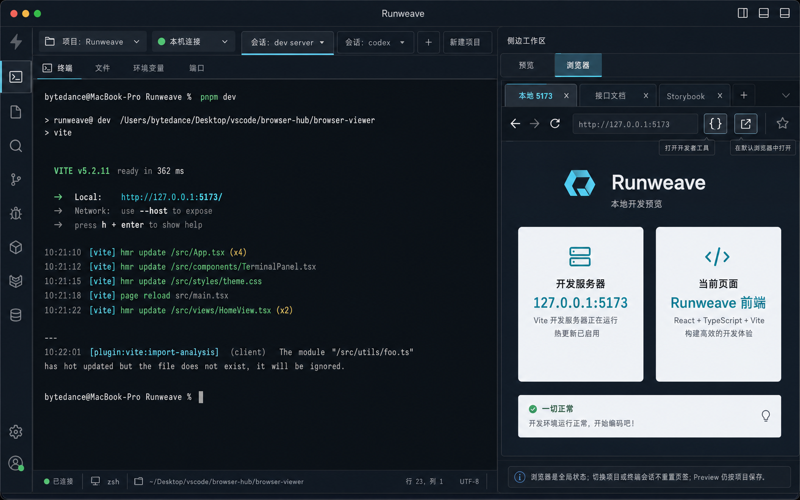

# Terminal Sidecar 本地浏览器方案

**目标：** 把终端右侧 Preview 区升级为可扩展的 Sidecar 工具区，并加入本地浏览器能力。浏览器运行在本机客户端侧，不走后端 Playwright。

**推荐方案：** 方案 A，右侧 Sidecar 顶部工具 Tab。左侧 Terminal、project/session tab 和现有 Preview 数据边界尽量保持稳定；右侧区域可以大改。

---

## 草图



## 核心结构

```text
┌──────────────────────────────────────────────────────────────┬──────────────────────────────┐
│ command bar / project tabs                                                                  │
├──────────────────────────────────────────────────────────────────────────────────────────────┤
│ session tab strip                                                                           │
├──────────────────────────────────────────────────────────────┬──────────────────────────────┤
│                                                              │ Sidecar                      │
│ Terminal surface                                             │ [预览] [浏览器]              │
│                                                              │ 浏览器页签                   │
│                                                              │ [本地 5173] [文档] [+]       │
│                                                              │ 浏览器工具栏                 │
│                                                              │ 后退 前进 刷新 地址 [码] [↗] │
│                                                              │ 本地浏览器 surface           │
└──────────────────────────────────────────────────────────────┴──────────────────────────────┘
```

Sidecar 分两层：

- **工具层 Tab：** 只保留 `预览`、`浏览器`。`变更` 不作为独立工具 Tab。
- **工具内部状态：** 每个工具可以自己维护子状态。浏览器工具内部需要支持多个浏览器页签。

布局位置：

- Sidecar 只出现在 project tab 和 terminal session tab 下方的 main content 区域右侧。
- project tab 行和 terminal session tab 行始终横跨整个工作区，位于 Sidecar 上方。
- 打开 Sidecar 不占用、不覆盖、不压缩这两行导航；只和 Terminal surface 共享下方内容区宽度。
- expanded Sidecar 也只覆盖 main content 区域，不覆盖 project/session 导航。

## 设计原则

- **不大改现有终端结构：** Terminal 左侧布局、project/session 切换、xterm 连接和缓存策略保持原样。
- **右侧可扩展：** Sidecar 是以后承载 Preview、Browser、Changes、Logs、Ports、Artifacts 等能力的容器。
- **本地浏览器不是后端浏览器：** 不复用后端 Playwright，不新增后端 browser automation 路由。
- **作用域分层：** Preview 状态按 terminal project 保存；Browser 是全局工作区能力，不跟随 terminal project 切换。
- **工作区内展开：** 展开 Sidecar 只占满当前 workbench 内容区，不调用浏览器/Electron fullscreen。
- **移动端不进入 v1：** 移动端继续保持 terminal monitor 边界，不展示 Sidecar。

## 方案 A：顶部工具 Tab

右侧顶部固定两个工具 Tab：

- `预览`：复用现有文件预览、Markdown、SVG、Image、Changes diff 能力。
- `浏览器`：本地浏览器工具，支持多个浏览器页签。

`变更` 继续保持现有交互：它是 Preview 菜单里的入口，也是 Preview 内部的 `changes` mode，不在 Sidecar 工具层新增第三个 Tab。

推荐交互：

- command bar 仍保留一个紧凑的 `预览` 入口。
- `Open file...` 打开 Sidecar，并切到 `预览`。
- `Changes` 打开 Sidecar，并切到 `预览` 工具内部的 `changes` mode。
- `Browser` 可以出现在同一个入口菜单里，避免 command bar 再增加一个大按钮。
- Sidecar 已打开后，用户通过右侧工具 Tab 切换能力。

## 浏览器多 Tab

浏览器工具内部需要支持多个页签。它和 Sidecar 顶部工具 Tab 是两层概念：

```text
Sidecar 工具 Tab:  [预览] [浏览器]
浏览器内部 Tab:        [本地 5173] [API 文档] [Storybook] [+]
```

浏览器页签要求：

- Browser tabs 是全局的，同一工作区只有一组 browser tabs。
- 每个 browser tab 保存自己的 URL、标题、加载状态、后退/前进状态。
- 切换 terminal session 或 project，都不重置 browser tabs。
- 如果用户需要按项目打开不同页面，应该通过浏览器内部多个 tab 自己组织，而不是由 project 自动切换 tab 集合。
- 至少支持新建 tab、关闭 tab、切换 tab、地址栏导航、刷新、停止、后退、前进、外部打开、打开 DevTools、用系统默认浏览器打开。
- DevTools 和系统默认浏览器打开使用 icon-only 按钮，按钮本体不展示文字，通过 tooltip / `aria-label` 表达含义。
- 默认新 tab 可以优先填入常见本地地址，例如 `http://127.0.0.1:5173`，但不要自动探测或启动服务。
- URL 输入需要支持开发者常用简写：
  - `5173` -> `http://127.0.0.1:5173`
  - `localhost:5173` -> `http://localhost:5173`
  - `127.0.0.1:3000` -> `http://127.0.0.1:3000`
  - 完整 `http://` / `https://` URL 原样使用

## 状态边界

Sidecar 共享状态：

- 是否打开
- 当前工具：只允许 `preview` 或 `browser`
- 宽度
- 是否展开

Sidecar 显示规则：

- `open = false`：Sidecar 整体不渲染，工具 Tab 条也不显示；Terminal 占满右侧释放出来的空间。
- `open = true`：Sidecar 渲染为右侧面板，顶部显示 `预览` / `浏览器` 工具 Tab。
- `expanded = true`：Sidecar 以工作区 overlay 展开，工具 Tab 仍显示；`Esc` 只还原展开态，不关闭 Sidecar。
- 点击 Sidecar close 时设置 `open = false`、`expanded = false`，但保留 `width`、Preview state 和 Browser tabs，便于下次打开恢复。

入口规则：

- `Preview menu -> Open file...`：打开 Sidecar，`activeTool = preview`，`previewMode = file`。
- `Preview menu -> Changes`：打开 Sidecar，`activeTool = preview`，`previewMode = changes`。
- `Preview menu -> Browser`：打开 Sidecar，`activeTool = browser`。

Preview 状态：

- 当前 mode：file / changes
- 搜索 query
- 选中文件
- 选中变更
- Markdown / SVG / Changes 的 view mode

Browser 状态：

- 全局 browser tabs
- 当前 active browser tab
- 每个 tab 的 URL、title、loading、history 能力、错误状态

不建议第一版持久化到长期存储。先保留在前端运行态即可；如果用户反馈需要跨重启恢复，再单独做 persist 设计。

## 核心实现细节

### Sidecar 外壳

- 保留现有 `TerminalWorkspace` 主体结构，只把右侧 Preview 挂载点替换成 Sidecar 容器。
- Sidecar 只管理通用 UI 状态：打开/关闭、当前工具、宽度、展开态。
- `预览` 工具继续复用现有 Preview 数据边界和 project-scoped state。
- `变更` 不进入 Sidecar `activeTool` 枚举；它只作为 Preview 工具内部的 `changes` mode。
- 展开态继续使用当前 Preview 已验证过的 overlay / reserved-width 思路，避免 terminal 宽度 reflow。

### Browser 状态

- Browser 是全局工作区状态，不挂在 terminal project 下。
- Browser 内部维护一组 tabs：`id`、`url`、`title`、`loading`、`canGoBack`、`canGoForward`、`error`。
- Sidecar 切换 project/session 时不重建 Browser tabs。
- Browser tab 的 active 状态也全局保存；用户通过浏览器内部 tab 管理不同项目或不同本地服务页面。

### Electron 本地浏览器

- Electron 桌面端由主进程持有本地 browser surface，前端只渲染一个占位容器和控制栏。
- 前端通过 preload 暴露的窄 IPC 调用导航、刷新、停止、后退、前进、关闭 tab、打开 DevTools、用系统默认浏览器打开。
- 主进程必须再次校验 URL，只允许 `http:` / `https:`。
- 内嵌 browser surface 不启用 Node integration，不复用 app preload，不暴露任意脚本执行。
- 前端用 `ResizeObserver` 或等价机制上报占位容器 bounds；主进程把 browser surface clamp 到窗口内容区内。
- 从 Browser 切到 Preview 或关闭 Sidecar 时，active browser surface 默认 hide/detach 但继续保活，避免切回 Browser 时重新加载页面。
- 关闭 browser tab 时才销毁该 tab 对应的 browser surface；关闭最后一个 tab 后立即创建默认新 tab，不进入额外空态。
- hide/detach/release 类 IPC 必须幂等；如果当前没有 active browser surface 或 tab 已被销毁，主进程应静默忽略，不向前端抛错。
- Sidecar resize 拖拽过程中，bounds 同步必须节流。推荐前端用 `requestAnimationFrame` 合并同一帧内的 bounds 更新；拖拽结束时再补发一次最终 bounds。
- 不要在每个 pointermove 中直接同步 IPC bounds，否则右侧浏览器和 terminal resize 会互相放大性能抖动。

### Web/PWA 降级

- Web/PWA 不创建内嵌浏览器，也不调用后端 Playwright。
- Web/PWA 保留地址栏和“用系统默认浏览器打开”动作。
- DevTools 按钮在 Web/PWA 中 disabled 或隐藏，避免给出不可用能力。

## Electron 与 Web 行为

Electron 桌面端：

- 右侧 Browser 使用本地客户端浏览器 surface。
- 导航、刷新、后退、前进、关闭页签等动作走客户端侧能力。
- 支持打开当前 browser tab 的 DevTools，优先以内嵌浏览器对应的 DevTools 窗口打开。
- 支持把当前 URL 交给系统默认浏览器打开。
- 不能启用 Node integration。
- 不暴露任意脚本执行能力。
- 关闭 Sidecar 或删除 project 时，应隐藏或释放对应 browser surface。

Web/PWA：

- 不伪装内嵌浏览器。
- 显示“本地浏览器仅桌面客户端可用”的降级态。
- 保留 URL 输入和用系统默认浏览器打开能力；DevTools 能力仅桌面端内嵌浏览器提供。
- 不调用后端 Playwright。

## 实施阶段

### 阶段 1：Sidecar 壳

目标：把右侧从 Preview panel 升级为 Sidecar 容器。

内容：

- 保留现有 Preview 行为。
- 增加 Sidecar 顶部工具 Tab。
- 保留现有 resize / expanded / close 行为。
- 确保展开 Sidecar 不改变 terminal emulator 宽度。

验证：

- 现有 Preview E2E 继续通过。
- 打开/关闭/展开 Sidecar 不影响 terminal 输入与输出。

### 阶段 2：浏览器工具 UI

目标：在 Sidecar 里加入 Browser 工具和多 tab 交互。

内容：

- Browser 工具内部增加浏览器页签条。
- 增加地址栏、后退、前进、刷新/停止、外部打开、打开 DevTools、用系统默认浏览器打开。
- Web/PWA 先显示降级态。
- URL state 和浏览器 tab 集合按全局保存，不跟随 project 切换。

验证：

- Web 模式不崩溃，并能用系统默认浏览器打开 URL。
- 切换 project/session 不清空浏览器 tab 状态。
- 地址栏输入 `5173`、`localhost:5173`、完整 `http://...` 时，能按规则归一化并反映到当前 browser tab。
- 新建、关闭、切换 browser tab 正常；关闭 active tab 后切到邻近 tab，关闭最后一个 tab 后自动创建默认新 tab。
- DevTools 和默认浏览器打开按钮保持 icon-only，hover/aria-label 能说明含义。

### 阶段 3：Electron 本地浏览器接入

目标：让桌面端 Browser tab 真正显示本地浏览器 surface。

内容：

- 接入 Electron 本地浏览器 surface。
- 根据右侧 placeholder 同步 bounds。
- 切换工具、切换 browser tab、展开/还原时保持 surface 对齐。
- 关闭 tab 或 Sidecar 时释放或隐藏对应 surface。

验证：

- `pnpm dev:electron` 下可在右侧打开 `http://127.0.0.1:5173`。
- 多个 browser tab 能独立保存 URL 和标题。
- 切到 Preview 后 browser surface 不遮挡 Preview。
- 关闭 Sidecar 后 browser surface 必须完全不可见，不能停留在原位置或藏在其他 React 内容后面。
- Sidecar 展开/还原后，browser surface bounds 必须跟随占位区域，不出现偏移、残留或遮挡 terminal。
- 切回 Browser 后 active tab 恢复。

## 非目标

- 不做后端 Playwright 浏览器复用。
- 不做浏览器自动化控制。
- 不做 Network/Console/DOM Inspector。
- 不做多 pane split。
- 不做移动端 Sidecar。
- 不新增前端 `src` 单测；前端正式验证继续走 Playwright E2E。
- 不改 shared base UI 组件。

## 验收标准

- 右侧区域明确变成 Sidecar，并包含 `预览` 与 `浏览器`。
- 浏览器工具内部支持多个 tab。
- Browser 状态是全局的，不按 project 或 terminal session 保存。
- 现有 Preview file/changes 行为不回退。
- Electron 桌面端能在右侧显示本地浏览器。
- Electron 桌面端能打开当前 tab 的 DevTools。
- Electron 桌面端能把当前 URL 交给系统默认浏览器打开。
- Web/PWA 能干净降级，不调用后端浏览器。
- Sidecar 展开/还原不造成 terminal 宽度跳动。
