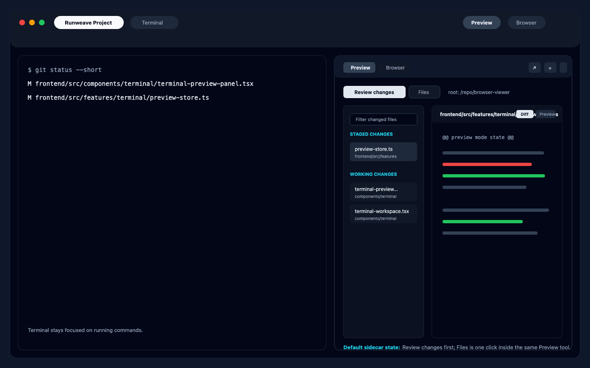
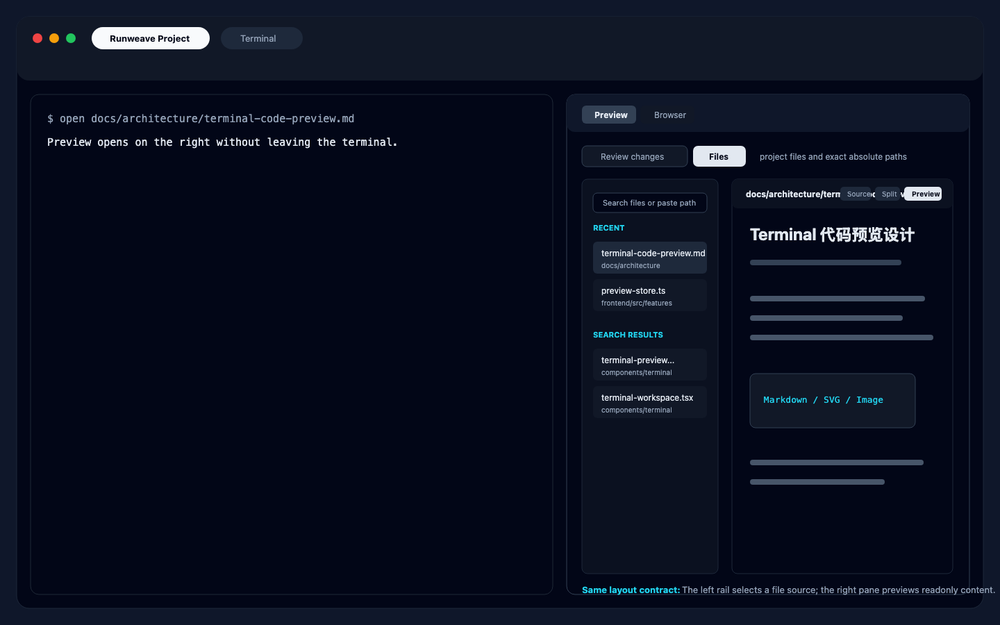

# Preview Review / Files 布局重构方案

## 目标

右侧 Preview 的主任务重新排序：

1. **先支持代码 review。** 默认让用户看到 staged / working changes，并能快速逐文件查看 diff。
2. **再支持文件预览。** 同一个右侧区域内可以搜索当前 project 下的文件，或打开明确输入的文件路径。
3. **切换发生在右侧面板内。** `Open file...` 和 `Changes` 不再主要依赖顶部 `Preview` 下拉菜单切换；顶部入口只负责打开 Sidecar 或切换大工具，例如 `Preview` / `Browser`。

## 当前代码事实

- `TerminalWorkspace` 在顶部 project 行右侧渲染 `TerminalPreviewMenu`，菜单里有 `Open file...`、`Changes`、`Browser`，右侧面板挂载在工作区内容区。
- `TerminalPreviewPanelShell` 已经是 Sidecar 外壳，顶部有 `Preview` / `Browser` 工具 Tab、resize、expand、refresh、copy path、close。
- `useTerminalPreviewStore` 的 Preview project state 当前只有 `mode: "file" | "changes" | null`，并按 project 保存 `openFileQuery`、`selectedFilePath`、`selectedChangePath`、Markdown/SVG/Changes view mode。
- `TerminalPreviewPanelContent` 里，`file` mode 和 `changes` mode 的核心交互很接近：左侧或前置列表选择一个路径，右侧渲染只读 Monaco / Markdown / SVG / Image / Diff。
- `changes` mode 已经有两栏布局：左侧 `Staged Changes` / `Working Changes` 文件列表，右侧 diff 或 preview。
- `file` mode 在未选中文件时显示 `TerminalOpenFileCommand`；选中文件后，文件搜索入口会变成路径栏右侧的 `Open another...`。

结论：当前能力不是缺失，而是信息架构问题。`Open file...` 和 `Changes` 本质都是“选择一个文件源，然后在右侧只读查看”，只是文件来源不同：一个来自 project file search，一个来自 git changes。

## 推荐方案：Preview 内部二级切换

在右侧 Sidecar 的 `Preview` 工具内部增加二级 Tab：

- `Review changes`
- `Files`

顶部 `Preview` 菜单不再作为这两个任务的主要切换方式。用户打开右侧 Sidecar 后，在面板内直接切换 review 和 files。





### 推荐布局

```text
Right Sidecar
┌──────────────────────────────────────────┐
│ [Preview] [Browser]              actions │  <- 工具层，已有
├──────────────────────────────────────────┤
│ [Review changes] [Files]   project root  │  <- Preview 内部任务层
├───────────────┬──────────────────────────┤
│ Source rail   │ Readonly viewer          │
│               │                          │
│ Review:       │ Review: diff by default  │
│ - Staged      │ markdown/svg 可切 preview │
│ - Working     │                          │
│               │ Files: file preview      │
│ Files:        │ markdown/svg/image/text   │
│ - Search      │                          │
│ - Recent      │                          │
└───────────────┴──────────────────────────┘
```

### 行为

- 默认打开 `Preview` 时，优先进入 `Review changes`。
- 如果当前 project 没有 staged / working changes，可以显示空态，并提供一个面板内按钮切到 `Files`。
- `Review changes` 使用现有 `getTerminalProjectPreviewGitChanges` 和 `getTerminalProjectPreviewFileDiff`。
- `Files` 使用现有 `searchTerminalProjectPreviewFiles` 和 `getTerminalProjectPreviewFile`。
- 两个任务共享同一套右侧 viewer 容器和顶部路径栏，但 viewer 的内容类型不同：
  - `Review changes` 默认是 diff。
  - `Review changes` 里 Markdown / SVG 可以继续保留 `Diff / Preview`。
  - `Files` 里 Markdown / SVG / Image / Text 继续使用现有渲染规则。
- `Open another...` 不需要只在 file preview 后出现；它可以合并为 `Files` 左侧 rail 的搜索框。
- `Review changes` 左侧 rail 可以增加轻量 filter，但不做完整文件树。

### 顶部入口调整

顶部 command bar 保留一个紧凑入口即可：

- `Preview`：打开 Sidecar 并切到 `Preview` 工具。
- `Browser`：仍可以留在菜单里，或只在右侧 Sidecar 内切换。
- 不建议继续在顶部菜单暴露 `Open file...` / `Changes` 作为主入口；最多作为快捷入口，点击后只是打开 Sidecar 并定位到内部 Tab。

这样可以避免用户为了在两个相似列表间切换而反复回到右上角。

## 备选方案 A：保留现有 mode，只把切换搬进面板 Header

最小改法是在 `TerminalPreviewPanelShell` 的 `describeMode` 附近增加 segmented control：

```text
Preview
[Open file] [Changes]
```

优点：

- 改动最小，基本沿用 `mode: "file" | "changes"`。
- 不需要重做 `TerminalPreviewPanelContent` 的结构。

缺点：

- `Open file` 仍然像一个动作，不像一个稳定的信息源。
- 文件搜索只在“未选中文件”时是主体，选中文件后又退到 `Open another...`，和 review 的左侧列表不统一。
- 代码 review 不是默认心智，用户仍会感到它只是 Preview 的一个子菜单项。

适合只想先修掉“必须从右上角切换”的问题，但不适合作为最终布局。

## 为什么推荐内部二级切换

- 贴合现有代码：`Preview` / `Browser` 的工具层已经存在，只需要把 `file | changes` 从“顶部菜单入口”提升为 Preview 内部的任务层。
- 贴合用户目标：代码 review 是首要任务，因此默认落在 `Review changes`，而不是让用户先选择 `Changes`。
- 降低改动风险：现有 project-scoped API、diff 加载、防闪烁逻辑、Markdown/SVG/Image 渲染都可以继续复用。
- 保留未来扩展：以后如果加入 `Recent`、`Artifacts`、`Ports`，可以判断它们属于 Sidecar 顶层工具，还是 Preview 内部 source。

## 数据与状态建议

第一步可以尽量少改状态模型：

- 继续保留 `mode: "file" | "changes"`。
- UI 文案上把 `changes` 表达为 `Review changes`，把 `file` 表达为 `Files`。
- `openPreview(projectId)` 默认没有 mode 时，优先设置为 `changes`，除非当前 project state 已有明确 mode。
- 顶部菜单快捷项调用仍可保留，但不再是唯一入口。

如果后续需要把内部任务语义从 UI 文案沉淀为显式状态，再考虑状态重命名：

```ts
previewTask: "review" | "files";
selectedSourcePath?: string;
selectedSourceKind?: "staged" | "working" | "file";
viewerMode?: "diff" | "source" | "split" | "preview";
```

第一步不建议直接重命名，避免把 UI 布局调整扩大成状态迁移。

## 全局文件与当前项目文件

现有能力天然更适合“当前 project path 下的文件”：

- project-scoped search 只能搜索当前 project。
- 文件读取需要继续保留路径安全边界。
- 绝对路径目前更适合作为“用户明确输入完整路径后打开”的高级能力，而不是全局模糊搜索。

建议分层：

- v1：`Files` 搜索当前 project；允许粘贴明确绝对路径，沿用现有安全校验。
- v2：如果确实需要全局文件入口，再新增 `Scope` 切换，例如 `Project / Absolute path / Recent`，不要在 v1 做跨目录全局索引。

## 实施阶段

### Phase 1：把切换放进右侧面板

- 在 `TerminalPreviewPanelShell` 的 Preview 区域增加 `Review changes` / `Files` 二级 Tab。
- 点击二级 Tab 调用现有 `updateProjectPreview(projectId, { mode })`。
- 顶部 `TerminalPreviewMenu` 保留打开 Sidecar 的能力，但弱化 `Open file...` / `Changes` 的主入口地位。
- 默认打开 Preview 时进入 `changes`，已有 project state 时尊重上次 mode。

验证：

- 打开 Preview 后能在右侧面板内切换 `Review changes` / `Files`。
- 从 `Files` 切到 `Review changes` 不清空原来的 file selection；切回后仍能看到上次文件。
- 从 `Review changes` 切到 `Files` 不清空 selected change；切回后仍能看到上次 diff。
- Refresh 在 `Review changes` 下只刷新 changes/diff，在 `Files` 下只刷新当前文件或搜索。

### Phase 2：统一左侧 rail 体验

- `Files` 选中文件后仍保留左侧 search/results rail，而不是只显示单文件 viewer。
- 可先显示 `Recent opened` 和当前 query results，不做完整文件树。
- `Review changes` 和 `Files` 使用相同的 rail 宽度、行高、路径展示规则和 selected state。

验证：

- 小宽度下 rail 不挤压 viewer 到不可用。
- 文件名长路径能 truncate，不撑破布局。
- Markdown/SVG/Image/Text/Diff 的现有 viewer 能力不回退。

### Phase 3：入口收敛

- 评估是否把顶部菜单简化为 `Open Preview` / `Browser` / `Close sidecar`。
- 如果保留 `Open file...` / `Changes`，它们只作为深链接快捷方式，不再是用户理解功能的主导航。

验证：

- 用户不需要回到右上角即可完成“看 diff -> 看某个文件 -> 回到 diff”。
- Browser 工具切换不影响 Preview 内部 task 和 selection。
- expanded / resize / close 行为与现有 Sidecar 一致。

## 不建议做的事

- 不做项目文件树。用户目标是 review 和临时预览，不是把 Terminal 变成 IDE。
- 不把 `Changes` 提升为 Sidecar 顶层工具 Tab。它和 `Files` 都属于 Preview 的文件查看任务，顶层工具应继续保持少量且稳定。
- 不在第一步做跨 project / 全局文件索引。先复用当前 project-scoped API 和绝对路径显式打开。
- 不新增前端单测。这个 repo 的前端 UI 变更按现有约束走 E2E / 手工回归。

## 推荐结论

采用“Preview 内部二级切换”作为第一步：右侧 Sidecar 顶层仍是 `Preview / Browser`，Preview 内部变成 `Review changes / Files`。这能最小化代码迁移，同时把用户的主目标“先看代码变更做 review”放到默认路径上。
