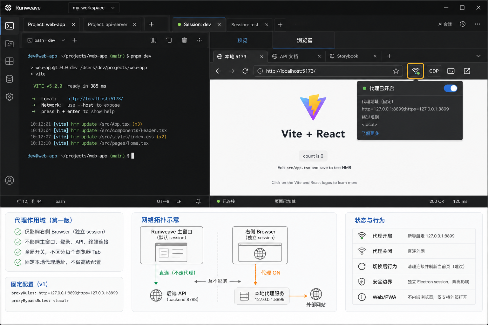

# Terminal Browser 本地代理开关方案

**目标：** 给右侧 Browser 工具增加一个手动代理开关。开启后，右侧 Browser 的网页流量走本机代理；关闭后恢复直连。第一版固定使用本地代理地址，不做高级配置表。

**推荐方案：** 右侧 Browser 全局开关 + 固定本地代理地址 + 独立 Electron session。

---

## 草图



> 草图要求：使用图片生成工具生成，不使用 SVG 线框图。当前草图表达的是目标交互与边界，不要求像素级还原最终 UI。

```text
┌──────────────────────────────────────────────────────────────┬──────────────────────────────┐
│ command bar / project tabs                                                                  │
├──────────────────────────────────────────────────────────────────────────────────────────────┤
│ session tab strip                                                                           │
├──────────────────────────────────────────────────────────────┬──────────────────────────────┤
│ Terminal                                                     │ Sidecar                      │
│                                                              │ [预览] [浏览器]              │
│                                                              │ 浏览器页签                   │
│                                                              │ [本地 5173] [文档] [+]       │
│                                                              │ 浏览器工具栏                 │
│                                                              │ ← → 刷新 地址 [代理开关] [↗] │
│                                                              │                              │
│                                                              │ Electron WebContentsView     │
│                                                              │ 独立 session                 │
│                                                              │ proxy on -> 127.0.0.1:8899   │
└──────────────────────────────────────────────────────────────┴──────────────────────────────┘
```

## 当前现状

右侧 Browser 不是普通网页 iframe，也不是后端 Playwright session。现有链路是：

- 前端 Browser 工具：`frontend/src/components/terminal/terminal-browser-tool.tsx`
- Electron preload IPC：`electron/src/preload.ts`
- Electron 本地浏览器 surface：`electron/src/terminal-browser-view.ts`
- CDP/MCP 控制入口：`electron/src/terminal-browser-cdp-proxy.ts`

已有首页 `proxyEnabled` 能力只作用于后端创建的 Playwright browser session：

- 协议字段：`packages/shared/src/protocol.ts`
- 后端创建逻辑：`backend/src/browser/service.ts`

这条链路和右侧 Electron Browser 不是同一个浏览器实例，所以不能直接复用首页的 `proxyEnabled` 作为右侧 Browser 的代理开关。

## 需求理解

这次要做的是右侧 Browser 的浏览流量代理：

- 用户可以手动开启或关闭代理。
- 开启后，右侧 Browser 走本机代理服务。
- 关闭后，右侧 Browser 直连。
- 第一版固定代理目标，不做截图里那种完整高级配置。
- 代理设置只影响右侧 Browser，不影响 Runweave 主窗口、登录、后端接口或其他 Electron WebContents。

第一版固定配置建议：

```text
proxyRules: http=127.0.0.1:8899;https=127.0.0.1:8899
proxyBypassRules: <local>
```

如果最终本地服务端口不是 `8899`，只替换常量即可；不要先引入用户可编辑配置。

## 设计原则

- **只作用于右侧 Browser：** 不改默认 Electron session，避免污染主窗口网络。
- **全局开关，不做 per-tab：** Electron 代理更适合挂在 session 级别；per-tab 代理需要拆分多个 partition，第一版收益不够。
- **固定配置优先：** 先满足本地 ws2/代理服务接入，不做高级设置表。
- **切换可预期：** 开关切换后清理旧连接，并提示或刷新当前页，避免已建立连接继续走旧代理。
- **不改 CDP proxy 职责：** CDP proxy 继续负责 Playwright/MCP 控制右侧 Browser，不负责网页请求转发。

## 推荐方案

### 1. 为右侧 Browser 使用独立 Electron session

在创建 `WebContentsView` 时指定专用 partition，例如：

```text
persist:runweave-terminal-browser
```

这样代理只会影响右侧 Browser 的页面请求。主窗口、登录态、前端资源加载、后端 API 请求仍留在默认 session。

### 2. 在 Electron 主进程维护代理状态

主进程维护一个简单状态：

```text
enabled: boolean
proxyRules: "http=127.0.0.1:8899;https=127.0.0.1:8899"
proxyBypassRules: "<local>"
```

开启时对右侧 Browser 专用 session 调用 `setProxy`；关闭时恢复直连。

切换后需要关闭专用 session 的现有连接。否则已经建立的 HTTP/WebSocket 连接可能短时间沿用旧代理策略。

### 3. 通过 preload 暴露窄 IPC

建议只暴露两类能力：

- `terminalBrowserGetProxyState`
- `terminalBrowserSetProxyEnabled(enabled)`

第一版不暴露 host/port 编辑能力。后续需要高级设置时，再扩展为 `terminalBrowserSetProxyConfig(config)`。

### 4. 前端工具栏增加图标开关

放在右侧 Browser 工具栏地址栏后、外部打开前：

```text
← → 刷新 地址栏 [代理开关] [CDP] [DevTools] [外部打开]
```

交互要求：

- icon-only 按钮，使用 tooltip / `aria-label` 表达状态。
- 开启态有明确 active 样式。
- 正在切换时 disabled，避免重复点击。
- 切换失败时在当前 Browser 工具错误条展示错误。

## 关键边界

### ws2 的语义

如果 ws2 是本机 HTTP/HTTPS 代理服务，例如 `127.0.0.1:8899`，Electron session proxy 可以直接支持。

如果 ws2 是纯 `ws://...` 隧道端点，Electron 不能直接把网页 HTTP/HTTPS 流量代理到这个 WebSocket 地址；需要本地先提供 HTTP 或 SOCKS 代理网关。

### CDP proxy 与网络 proxy 不混用

`electron/src/terminal-browser-cdp-proxy.ts` 是给 Playwright/MCP 使用的控制入口。它负责让外部工具通过 CDP 控制右侧 Browser，不应承担网页请求代理职责。

网络代理应放在 Electron session 层，由 Electron/Chromium 处理真实请求转发。

### 不影响后端 Playwright session

首页的 session 创建代理仍由 `backend/src/browser/service.ts` 管理。这次方案不改变后端 session 的 `proxyEnabled` 语义。

右侧 Browser 和后端 Playwright browser session 是两条独立链路：

- 首页创建的浏览器 session：后端 Playwright 管。
- 右侧 Browser：Electron 主进程管。

## 实施阶段

### 阶段 1：session 隔离

目标：右侧 Browser 使用独立 Electron session。

内容：

- 在 `WebContentsView` 创建时使用专用 partition。
- 保持现有导航、页签、DevTools、CDP proxy 行为不变。
- 验证主窗口和右侧 Browser 的网络状态互不影响。

验证：

- `pnpm typecheck`
- `pnpm lint`
- `pnpm dev:electron` 下右侧 Browser 可正常打开本地页面。
- 登录、连接管理、终端页面不受影响。

### 阶段 2：代理 IPC 与主进程状态

目标：主进程能对右侧 Browser 专用 session 开关代理。

内容：

- 增加代理状态读取 IPC。
- 增加代理开关 IPC。
- 固定代理配置为本机地址。
- 开关后清理专用 session 的现有连接。

验证：

- 开启代理后，新导航走本机代理。
- 关闭代理后，新导航恢复直连。
- 代理服务未启动时，右侧 Browser 导航失败但主窗口不受影响。

### 阶段 3：前端工具栏开关

目标：用户可以在右侧 Browser 工具栏手动开关代理。

内容：

- 增加代理图标按钮。
- 打开 Browser 工具时读取代理状态。
- 点击切换代理状态。
- 切换失败时展示错误。

验证：

- 开关状态能正确回显。
- 快速重复点击不会造成状态错乱。
- 切换后当前 tab reload 或给出清晰状态反馈。

## 验证矩阵

| 场景                     | 预期                                        |
| ------------------------ | ------------------------------------------- |
| 默认启动                 | 右侧 Browser 直连                           |
| 开启代理且本地代理可用   | 新导航走 `127.0.0.1:8899`                   |
| 开启代理但本地代理不可用 | 右侧 Browser 页面报网络错误，主窗口不受影响 |
| 关闭代理                 | 后续新导航恢复直连                          |
| 打开 CDP/MCP endpoint    | 仍可控制右侧 Browser                        |
| 打开 DevTools            | 未被 CDP proxy attach 时仍可打开            |
| 切换 Preview/Browser     | Browser surface 不遮挡 Preview              |
| 多个 Browser tab         | 共享同一个代理开关状态                      |

## 暂不做

- 不做每个 browser tab 独立代理。
- 不做代理 host/port/bypass 编辑表单。
- 不做代理认证用户名/密码。
- 不把代理状态同步到后端 Playwright session。
- 不通过 CDP proxy 转发网页请求。

## 后续扩展

如果固定本机代理验证有效，再考虑：

- host / port / protocol / bypass 可编辑。
- 配置持久化。
- 代理健康检查。
- 显示当前代理命中状态。
- 支持 SOCKS5。
