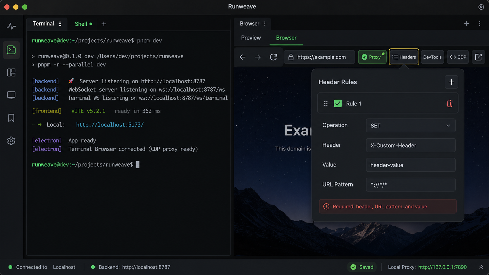
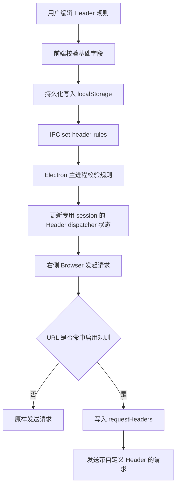

# Terminal Browser 自定义 Header 方案

**目标：** 在右侧 Terminal Browser 已有本地代理开关的基础上，增加自定义请求 Header 规则。用户可以配置多个 `key / value`，并按 URL 匹配规则把 Header 注入到右侧 Browser 发出的网页请求里。

**推荐方案：** 右侧 Browser 全局 Header 规则表 + Electron 专用 session 的 `webRequest.onBeforeSendHeaders` 注入 + 持久化 Header 规则配置。

---

## 调研结论

当前 Runweave 里已经存在两条浏览器链路，Header 能力不能直接复用：

- 首页 `New Browser` 创建的是后端 Playwright persistent context。它已经支持 `headers`，最终通过 `backend/src/browser/service.ts` 的 `extraHTTPHeaders` 应用到 Playwright context。
- 右侧 Terminal Browser 是 Electron 主进程创建的 `WebContentsView`，使用独立 partition `persist:runweave-terminal-browser`，代理开关已经通过这个专用 session 的 `setProxy` 实现。
- 本次截图里的规则式 Header 配置目标是右侧 Terminal Browser，所以应该接在 Electron session 层，而不是后端 Playwright session 层。

Electron 官方 `WebRequest` API 支持在 `Session.webRequest.onBeforeSendHeaders` 阶段修改请求头；同一事件只保留最后注册的 listener，所以实现时必须注册一个统一 dispatcher，不能给每条规则单独注册 listener。

参考：

- Electron WebRequest: https://www.electronjs.org/docs/latest/api/web-request

## 当前代码入口

右侧 Terminal Browser 当前链路：

```text
frontend/src/components/terminal/terminal-browser-tool.tsx
  -> window.electronAPI.*
electron/src/preload.ts
  -> ipcRenderer.invoke("terminal-browser:*")
electron/src/terminal-browser-view.ts
  -> WebContentsView + persist:runweave-terminal-browser session
```

已有代理状态：

```text
packages/shared/src/terminal-browser-proxy.ts
electron/src/terminal-browser-view.ts
frontend/src/components/terminal/terminal-browser-tool.tsx
```

已有后端 Playwright Header 能力：

```text
packages/shared/src/protocol.ts
frontend/src/pages/home/components/new-session-form.tsx
frontend/src/pages/home/hooks/use-home-sessions.ts
backend/src/routes/session.ts
backend/src/session/manager.ts
backend/src/browser/service.ts
```

这套能力只覆盖首页创建的后端 browser session，不覆盖右侧 Electron Browser。

## 需求理解

第一版建议支持：

- 增加多条 Header 规则。
- 每条规则包含：启用状态、操作、Header 名、Header 值、URL 匹配规则。
- 操作第一版只支持 `SET`。
- 默认 URL 匹配规则使用 `*://*/*`。
- 规则只影响右侧 Terminal Browser，不影响首页 Playwright session、主窗口请求、登录、后端 API 或 Electron 更新请求。
- 规则变更后，对后续新请求生效；是否自动刷新当前页由 UI 明确触发或提示。

暂不建议第一版支持：

- `ADD / REMOVE` 操作。
- 响应 Header 修改。
- per-tab 独立规则。
- 代理和 Header 的高级条件组合。
- 把规则同步到后端 Playwright session。

## 草图

草图使用 GPT 图片生成工具生成位图，不使用 SVG。生成目标如下：



截图中的红色校验态可以对应第一版规则：

```text
必须填写头部、URL 模式和值
```

## 数据模型

建议新增共享类型，例如：

```text
TerminalBrowserHeaderRule {
  id: string
  enabled: boolean
  operation: "set"
  name: string
  value: string
  urlPattern: string
}

TerminalBrowserHeaderState {
  rules: TerminalBrowserHeaderRule[]
}
```

字段约束：

| 字段         | 规则                                                     |
| ------------ | -------------------------------------------------------- |
| `id`         | 前端生成稳定 id，便于编辑、删除、排序                    |
| `enabled`    | 单条规则启停                                             |
| `operation`  | 第一版固定为 `set`                                       |
| `name`       | trim 后不能为空；禁止控制字符、冒号和换行                |
| `value`      | 允许空格，但不允许换行和控制字符                         |
| `urlPattern` | trim 后不能为空；默认 `*://*/*`；第一版只匹配 http/https |

建议第一版显式拒绝这些 Header 名：

```text
host
content-length
connection
upgrade
proxy-authorization
cookie
set-cookie
```

原因：这些 Header 往往由 Chromium 网络栈、代理层或站点状态管理，用户手动覆盖容易导致请求失败或安全边界混乱。后续如确实需要 Cookie 或代理认证，单独设计。

## Electron 注入方案

在 `electron/src/terminal-browser-view.ts` 维护右侧 Browser Header 状态，并注册一个统一 listener：

```text
getTerminalBrowserSession()
  .webRequest
  .onBeforeSendHeaders({ urls: ["<all_urls>"] }, dispatcher)
```

dispatcher 负责：

1. 读取当前启用规则。
2. 只处理 `http:` / `https:` 请求。
3. 用规则的 `urlPattern` 匹配 `details.url`。
4. 对命中的规则执行 `SET`：`requestHeaders[name] = value`。
5. `callback({ requestHeaders })` 返回修改后的 Header。

为什么推荐单一 dispatcher：

- Electron 同一个 `webRequest` 事件只保留最后一个 listener。
- Header 规则会动态增删改，统一 dispatcher 可以避免重复注册、覆盖 listener 或遗漏卸载。
- 后续扩展 `REMOVE` 或命中调试日志时也只需要改一个路径。

URL 匹配建议：

- UI 暴露 `*://*/*`、`*://example.com/*`、`https://api.example.com/*` 这类通配模式。
- Electron listener 使用 `<all_urls>` 接住请求，再在 dispatcher 内部做自己的轻量通配匹配。
- 不建议第一版依赖为每条规则重建 Electron filter；规则动态更新时收益不大，复杂度更高。

## IPC 方案

沿用代理开关的窄 IPC 风格：

```text
terminal-browser:get-header-rules
terminal-browser:set-header-rules
```

`set-header-rules` 在主进程做最终校验：

- 入参必须是数组。
- 数量建议限制，例如最多 20 条。
- 每条规则字段必须合法。
- 不合法时抛出明确错误，前端显示在 Browser 工具错误条。

如果后续需要命中可观测性，再增加只读 IPC：

```text
terminal-browser:get-header-rule-stats
```

第一版不做。

## 前端交互方案

在右侧 Browser 工具栏加一个 Header 图标按钮，位置建议放在代理按钮旁边：

```text
← → 刷新 地址栏 [代理] [Headers] [DevTools] [CDP] [外部打开]
```

Popover / Sheet 内支持：

- 新增规则。
- 启用 / 禁用单条规则。
- 编辑 Header 名和值。
- 编辑 URL 匹配规则。
- 删除规则。
- 显示校验错误。

MVP 不做拖拽排序也可以，规则顺序先按列表顺序执行。若同一个 Header 名被多条命中规则设置，后面的规则覆盖前面的规则。这个行为需要在文档和 UI 中保持一致。

持久化要求：

- Header 规则必须保存下来，不能只保存在 React state 或 Electron 主进程内存里。
- 第一版可用前端 `localStorage` 保存规则配置，key 可为 `terminal.browser.headerRules`。
- Terminal Browser Tool mount 时读取本地规则并同步给 Electron 主进程。
- Electron 主进程仍保存运行时状态，并负责真正注入 Header。
- 保存失败必须显示错误，不能让用户以为规则已经生效。
- 规则变更保存后，重启 Electron 应用仍应恢复并继续生效。

这样不需要引入新的 Electron 配置存储，同时可以满足重启应用后用户配置不丢失。后续如果需要跨设备或项目级共享，再把配置迁到后端或 Electron 文件存储。

## 规则流程



## 与代理功能的关系

Header 注入和代理开关可以共存：

- 代理开关决定请求从哪里出去。
- Header 规则决定请求发出去前携带哪些 Header。
- 两者都挂在同一个 `persist:runweave-terminal-browser` session 上，只影响右侧 Browser。

切换代理时现有实现会关闭旧连接并 reload 现有 tab。Header 规则变更不一定需要强制 reload，因为它只影响后续请求。UI 可以提供“规则已保存，刷新当前页后主文档请求会携带新 Header”的轻提示；如果为了简单，也可以保存后自动 reload 当前 tab。

## 实施阶段

### 阶段 1：类型与 Electron 注入

目标：主进程可以保存多条 Header 规则，并在右侧 Browser 请求发出前注入。

内容：

- 新增共享 Header 规则类型。
- 在 preload 暴露 get/set Header 规则 IPC。
- 在 `terminal-browser-view.ts` 增加规则校验、状态保存和统一 `onBeforeSendHeaders` dispatcher。

验证：

- `pnpm typecheck`
- `pnpm lint`
- 用本地 echo 服务或 DevTools Network 验证命中 URL 的请求带上 Header。
- 验证未命中 URL 不带 Header。

### 阶段 2：前端规则 UI

目标：用户可以在右侧 Browser 工具栏配置多条 Header 规则。

内容：

- 工具栏增加 Header 按钮。
- 增加规则编辑 Popover / Sheet。
- 支持新增、编辑、启停、删除。
- 规则持久化写入 localStorage，并同步 Electron。
- Terminal Browser Tool mount 时恢复已保存规则。
- 显示校验错误。
- 保存失败时显示错误，不更新为“已保存”状态。

验证：

- Electron 下规则能保存、回显、同步。
- 重启 Electron 后已保存规则仍存在并生效。
- 非 Electron Web 模式隐藏或禁用 Header 按钮。
- 多条规则同时命中时，列表后面的规则覆盖前面的同名 Header。

### 阶段 3：回归与边界确认

目标：确认 Header 功能不污染其他链路。

内容：

- 确认首页 Playwright session 的 `Request headers` 仍走原逻辑。
- 确认主窗口登录、后端 API、连接管理不受右侧 Browser Header 影响。
- 确认代理开关和 Header 规则可以同时打开。

验证：

- `pnpm typecheck`
- `pnpm lint`
- 必要时补一个 Electron/Playwright E2E；前端 `src/` 不新增 Vitest 单测。
- 手工回归：右侧 Browser 打开目标页面，检查请求 Header；关闭规则后刷新，Header 消失。

## 验证矩阵

| 场景                                                    | 预期                                      |
| ------------------------------------------------------- | ----------------------------------------- |
| 无规则                                                  | 右侧 Browser 请求不注入额外 Header        |
| 新增启用规则 `X-Custom-Header=header-value` + `*://*/*` | 右侧 Browser http/https 请求携带该 Header |
| 禁用规则                                                | 请求不携带该规则 Header                   |
| 删除规则                                                | 后续请求不再携带该规则 Header             |
| 重启 Electron                                           | 已保存规则恢复，且后续请求继续命中        |
| 保存失败                                                | UI 显示错误，不展示为已保存               |
| URL 不匹配                                              | 请求不携带该规则 Header                   |
| 多条规则设置同名 Header                                 | 后面的命中规则覆盖前面的值                |
| Header 名为空                                           | UI 阻止保存并显示错误                     |
| URL 模式为空                                            | UI 阻止保存并显示错误                     |
| 代理开启 + Header 开启                                  | 请求同时走本地代理并携带命中 Header       |
| 主窗口登录 / API 请求                                   | 不携带 Terminal Browser 自定义 Header     |

## 风险与取舍

- **请求头覆盖风险：** 同名 Header 覆盖可能让用户困惑。第一版用列表顺序定义确定行为，后续再做拖拽排序。
- **敏感 Header 风险：** Cookie、Host、Proxy-Authorization 等不适合通用 UI 直接写入。第一版建议禁用。
- **缓存影响：** 已缓存资源可能不会重新发请求。验证 Header 时应刷新页面或禁用缓存。
- **Service Worker 影响：** 站点 Service Worker 可能拦截请求。遇到验证异常时需要清理站点数据或使用无 SW 的 echo 页面。
- **WebSocket 请求：** Electron `resourceType` 包含 `webSocket`，但第一版重点验证 HTTP/HTTPS 页面资源；如果要保证 WebSocket 握手 Header，需单独验证。

## 暂不做

- 不把 Header 规则同步到后端 Playwright session。
- 不做响应 Header 修改。
- 不做按 tab 独立规则。
- 不做 Header 命中日志面板。
- 不支持代理认证 Header。
- 不新增前端 Vitest 单测。

## 后续扩展

- `ADD / REMOVE` 操作。
- 规则拖拽排序。
- 命中计数和最近命中 URL。
- 规则导入 / 导出。
- 项目级规则与全局规则分层。
- 与本地代理工具的规则格式互导。
