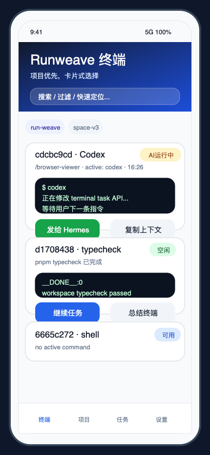
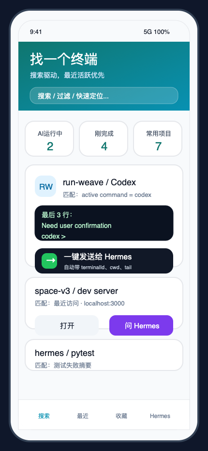
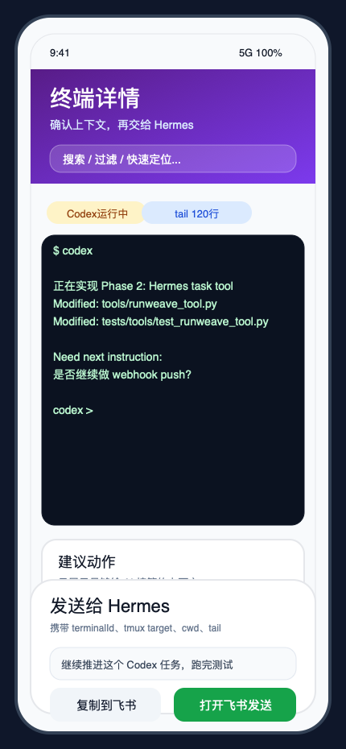
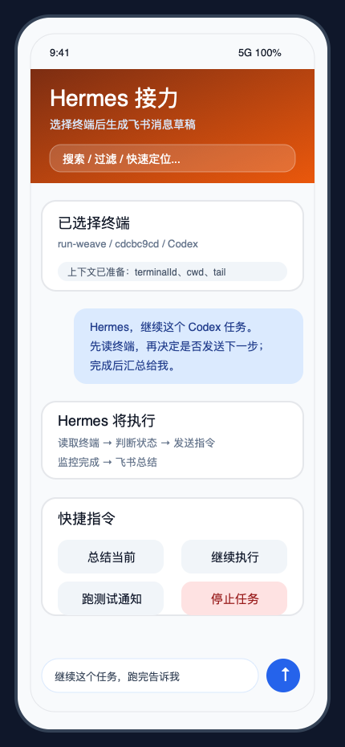

# Runweave 移动端终端接力 Hermes / 飞书方案

> 目标：让用户在手机上快速找到 Runweave 里的目标终端，把终端上下文一键发送或复制到飞书，然后由 Hermes 继续执行、监控和汇总结果。  
> 本文适合作为飞书文档使用，可直接复制到飞书知识库 / 云文档中。

---

## 1. 背景

目前 Runweave 已经可以在本地 Mac 上管理多个项目和多个终端，例如：

- `run-weave` 项目
- `space-v3` 项目
- Codex / Claude / shell / pnpm / test 等不同类型的终端任务

同时，Hermes 已经可以通过飞书与用户交互，并且具备调用本地工具、控制终端、执行任务、监听任务完成并汇总结果的能力。

用户的真实诉求不是“在手机上完整操作终端”，而是：

```text
人在外面 / 手机上
  ↓
打开 Runweave 页面
  ↓
快速找到某个正在运行或等待输入的终端
  ↓
把这个终端上下文交给 Hermes
  ↓
回到飞书，用自然语言继续说下一步
  ↓
Hermes 负责读终端、发指令、跑任务、等待结果、汇总通知
```

也就是说，手机端 Runweave 页面应该主要承担：

```text
看、找、选、交接
```

而不是承担：

```text
大量输入 shell 命令、手动粘贴复杂指令、长时间盯着终端输出
```

---

## 2. 核心问题

### 2.1 不能只看 terminal session 是否 running

Runweave 后端可以告诉我们某个 terminal session 是不是还活着，例如：

```json
{
  "status": "running"
}
```

但 `running` 只代表这个终端会话还存在，不代表里面真的有任务在执行。

一个终端可能是：

| session 状态 | 前台程序   | 真实含义                                              |
| ------------ | ---------- | ----------------------------------------------------- |
| `running`    | `/bin/zsh` | 终端活着，但大概率只是空闲 shell                      |
| `running`    | `pnpm`     | 命令可能正在执行                                      |
| `running`    | `codex`    | Codex 进程存在，但可能正在执行，也可能在等待用户输入  |
| `running`    | `claude`   | Claude 进程存在，但可能正在执行，也可能在等待用户输入 |

所以移动端页面不应该只显示：

```text
running
```

而应该显示更接近用户决策的信息：

```text
终端存活 / AI 等待输入 / AI 正在执行 / 空闲 shell / 可能卡住
```

---

### 2.2 Codex 在前台，不等于 Codex 正在执行

即使 `activeCommand = codex`，也有几种可能：

```text
1. Codex 正在执行
   正在读文件、改代码、跑测试、等待工具返回。

2. Codex 等待用户输入
   已经显示 prompt，等用户输入下一条指令。

3. Codex 卡住或静默
   长时间无输出，也没有明确 prompt。
```

因此页面需要基于多信号判断：

- `activeCommand`
- terminal tail 最近几行输出
- 最近 N 秒输出是否变化
- 是否检测到 Codex / Claude prompt
- 是否存在明确的任务完成 sentinel
- 是否存在子进程，例如 `pnpm test`、`pytest`、`node` 等

---

## 3. 产品目标

### 3.1 用户目标

用户希望在手机上完成：

```text
找到目标终端
  → 判断它是空闲、执行中、等待输入还是卡住
  → 一键交给 Hermes
  → 在飞书里继续自然语言操作
```

典型用户指令：

```text
Hermes，接管这个终端，看看 Codex 现在在等什么。
```

```text
继续这个任务，如果它在等我，就让它继续实现阶段 2。
```

```text
这个终端跑完以后总结一下，然后告诉我有没有报错。
```

```text
看一下这个 Codex 是卡住了还是已经完成了。
```

---

### 3.2 系统目标

系统需要支持：

1. 手机上快速定位终端。
2. 页面能清晰显示终端真实状态。
3. 一键复制或发送结构化上下文给 Hermes。
4. Hermes 收到上下文后可以继续读、写、监控终端。
5. 任务完成后通过飞书通知用户。

---

## 4. 总体架构

```text
手机浏览器
  ↓
Runweave Mobile 页面
  ↓
选择目标 terminal session
  ↓
生成结构化 terminal context
  ↓
复制到飞书 / 打开飞书发送给 Hermes
  ↓
Hermes Agent
  ↓
Runweave HTTP API / WebSocket / tmux
  ↓
本地终端 / Codex / Claude / shell / pnpm / tests
  ↓
Hermes 汇总结果
  ↓
飞书通知用户
```

核心分工：

| 组件                 | 负责什么                                        |
| -------------------- | ----------------------------------------------- |
| Runweave Mobile 页面 | 找终端、看状态、复制上下文                      |
| Hermes               | 理解用户意图、读写终端、执行任务、监控完成      |
| 飞书                 | 用户对话入口、通知入口                          |
| Runweave backend     | terminal session 管理、history、input、task API |
| tmux / pty           | 底层终端执行环境                                |

---

## 5. 四种页面方案

下面四张图是低保真方案图，重点表达信息架构和交互方式。

图片文件也已经放在项目中：

```text
docs/superpowers/assets/runweave-mobile-hermes/
```

---

## 方案 A：项目优先 / 终端卡片



### 适用场景

用户知道自己要找哪个项目，例如：

```text
run-weave
space-v3
browser-viewer
```

然后在项目下找某个终端。

### 页面结构

```text
顶部：Runweave 终端
  ↓
搜索框
  ↓
项目筛选 chip：run-weave / space-v3 / hermes / all
  ↓
终端卡片列表
  ↓
每个终端卡片提供快捷操作
```

### 终端卡片显示字段

每张卡片建议显示：

```json
{
  "projectName": "run-weave",
  "terminalSessionId": "cdcbc9cd-...",
  "cwd": "/Users/bytedance/Desktop/vscode/browser-hub/browser-viewer",
  "foregroundCommand": "codex",
  "inferredState": "waiting_input",
  "lastOutputAt": "12 秒前",
  "tailPreview": "最近 3-5 行输出"
}
```

### 卡片状态展示

建议不要只展示 `running`，而是展示推断状态：

```text
Codex · 等待输入
Codex · 正在执行 · 12 秒前有输出
Shell · 空闲
pnpm · 执行中
未知 · 可能卡住 · 8 分钟无输出
```

### 卡片操作按钮

每个终端卡片提供：

```text
发给 Hermes
复制上下文
继续任务
总结终端
```

### 具体交付方式

前端实现：

1. 新增 mobile terminal 页面，例如：

```text
/frontend/src/pages/mobile-terminal/index.tsx
```

2. 调用后端：

```http
GET /api/terminal/project
GET /api/terminal/session
GET /api/terminal/session/:id/history
```

3. 对每个 session 计算 `inferredState`。
4. 渲染项目筛选和卡片列表。
5. 点击 `发给 Hermes` 时生成 terminal context。

### 优点

- 信息清晰。
- 适合项目不多、终端数量中等的场景。
- 很适合作为第一版 MVP。

### 缺点

- 如果终端非常多，用户仍然需要滚动。
- 需要和搜索能力配合。

---

## 方案 B：搜索驱动 / 最近活跃



### 适用场景

用户不想先选项目，而是直接搜索：

```text
codex
typecheck
pnpm
run-weave
backend
最近失败
等待输入
```

### 页面结构

```text
顶部：搜索框
  ↓
快捷筛选：AI运行中 / 等待输入 / 最近完成 / 空闲 shell
  ↓
最近活跃终端
  ↓
搜索结果列表
```

### 搜索字段

搜索应该覆盖：

```text
projectName
projectPath
terminalSessionId
foregroundCommand
inferredState
cwd
tailPreview
active task name
```

例如用户输入：

```text
codex
```

页面优先展示：

```text
activeCommand = codex
或 tail 中包含 Codex prompt 的终端
```

用户输入：

```text
等待
```

页面优先展示：

```text
inferredState = waiting_input
```

### 状态分组

建议首页默认分组：

```text
需要你处理
  - Codex 等待输入
  - Claude 等待输入
  - 任务失败

正在执行
  - pnpm test 执行中
  - Codex 正在执行

最近完成
  - typecheck 完成
  - build 完成

空闲终端
  - /bin/zsh shell
```

### 具体交付方式

前端：

1. 新增搜索索引函数：

```ts
function buildTerminalSearchText(item: TerminalMobileView): string {
  return [
    item.projectName,
    item.cwd,
    item.terminalSessionId,
    item.foregroundCommand,
    item.inferredState,
    item.tailPreview,
  ]
    .filter(Boolean)
    .join(" ")
    .toLowerCase();
}
```

2. 增加状态快捷筛选：

```ts
type MobileFilter =
  | "all"
  | "needs_attention"
  | "running"
  | "waiting_input"
  | "idle"
  | "failed";
```

3. 搜索结果按优先级排序：

```text
等待输入 > 正在执行 > 最近有输出 > 最近创建 > 空闲
```

### 优点

- 最符合手机使用习惯。
- 终端多的时候效率最高。
- 可以快速找到“那个 Codex 终端”。

### 缺点

- 需要稍微多一点状态推断和排序逻辑。
- 第一版要避免做成复杂搜索系统，先做本地 filter 即可。

---

## 方案 C：终端详情 / 操作抽屉



### 适用场景

用户已经找到一个终端，但想确认一下它的上下文，再交给 Hermes。

### 页面结构

```text
终端标题区
  - 项目名
  - terminal id
  - 当前状态
  - cwd

状态判断区
  - foregroundCommand
  - inferredState
  - lastOutputAt
  - promptDetected

tail 预览区
  - 最近 80-120 行

底部操作抽屉
  - 发给 Hermes
  - 复制上下文
  - 总结当前终端
  - 继续这个任务
```

### tail 预览原则

手机端不需要展示完整终端，只需要展示足够判断的信息：

```text
最近 80-120 行
默认折叠长内容
突出最后 10 行
检测 prompt / error / done / failed
```

### 操作抽屉按钮

建议固定底部：

```text
主按钮：发给 Hermes
次按钮：复制上下文
快捷按钮：总结 / 继续 / 停止
```

### 具体交付方式

1. 用户点击终端卡片。
2. 页面打开详情抽屉或详情页。
3. 前端调用：

```http
GET /api/terminal/session/:id/history
```

4. 前端或后端计算：

```json
{
  "promptDetected": true,
  "lastOutputAt": "2026-05-01T10:12:30Z",
  "tailChangedRecently": false,
  "inferredState": "waiting_input"
}
```

5. 点击 `发给 Hermes`。
6. 生成飞书消息草稿。

### 优点

- 操作前能确认上下文。
- 不容易误操作正在执行的任务。
- 适合“接管终端”场景。

### 缺点

- 比列表页多一步点击。
- 如果用户很明确目标终端，会稍慢。

---

## 方案 D：飞书接力 / 聊天式交接



### 适用场景

这是最贴近最终目标的方案：Runweave 页面只做选择，真正的后续操作发生在飞书里。

### 核心流程

```text
手机打开 Runweave
  ↓
找到目标终端
  ↓
点击「发给 Hermes」
  ↓
打开飞书或复制消息
  ↓
用户补一句自然语言指令
  ↓
Hermes 接管
```

### 飞书消息草稿示例

```text
Hermes，接管这个 Runweave 终端。

项目：run-weave
终端：cdcbc9cd-71fd-4555-9436-146451300d56
状态：Codex · 等待输入
路径：/Users/bytedance/Desktop/vscode/browser-hub/browser-viewer

请先读取终端状态。如果 Codex 在等待输入，就继续推进当前任务；如果还在执行，就继续监控；如果任务已完成，就总结结果。
```

附带结构化上下文：

```json
{
  "type": "runweave_terminal_context",
  "project": "run-weave",
  "projectId": "91e34928-d8ff-43ac-a6da-32f94209b28f",
  "terminalSessionId": "cdcbc9cd-71fd-4555-9436-146451300d56",
  "cwd": "/Users/bytedance/Desktop/vscode/browser-hub/browser-viewer",
  "foregroundCommand": "codex",
  "inferredState": "waiting_input",
  "tmuxTarget": "<session>:0.0",
  "tail": "最近 80-120 行终端输出"
}
```

### 交付方式一：复制到剪贴板

第一版最简单：

```text
点击按钮
  ↓
navigator.clipboard.writeText(message)
  ↓
页面提示：已复制，去飞书粘贴给 Hermes
```

优点：

- 不依赖飞书开放平台能力。
- 实现快。
- 稳定可靠。

缺点：

- 用户要手动切到飞书。

### 交付方式二：飞书 deep link

如果可以构造飞书打开链接，则可以尝试：

```text
点击按钮
  ↓
打开飞书 App
  ↓
带上消息草稿或至少跳转到 Hermes 对话
```

优点：

- 体验更顺。

缺点：

- 飞书 deep link 能力需要验证。
- 不一定支持直接填充消息草稿。

### 交付方式三：Runweave 后端直接发给 Hermes

后续可以让 Runweave 后端调用 Hermes / Feishu gateway：

```http
POST /api/integrations/hermes/handoff
```

body：

```json
{
  "terminalSessionId": "...",
  "prompt": "请接管这个终端并判断状态"
}
```

Runweave 后端再发送到 Hermes：

```text
Runweave backend
  → Hermes webhook / gateway
  → 飞书当前用户或群聊
```

优点：

- 用户点击一次即可发送。
- 最接近自动化。

缺点：

- 需要鉴权、用户绑定、审计。
- 要处理消息投递失败。
- 第一版不建议上来就做。

---

## 6. 推荐最终方案

建议采用组合方案，而不是四选一：

```text
主入口采用方案 B：搜索驱动 / 最近活跃
列表展示采用方案 A：项目卡片 / 终端卡片
详情确认采用方案 C：终端详情 / 操作抽屉
最终交接采用方案 D：飞书接力
```

最终用户路径：

```text
1. 手机打开 Runweave mobile 页面
2. 默认看到“需要处理”的终端
3. 搜索或筛选到目标终端
4. 点开详情确认 tail 和状态
5. 点击「发给 Hermes」
6. 复制消息或打开飞书
7. 在飞书补充一句自然语言要求
8. Hermes 先观察，再执行，再汇总
```

---

## 7. 状态判断方案

### 7.1 状态模型

建议新增一个移动端专用 view model：

```ts
export type TerminalInferredState =
  | "idle_shell"
  | "command_running"
  | "agent_running"
  | "agent_waiting_input"
  | "completed"
  | "failed"
  | "possibly_stuck"
  | "unknown";

export interface TerminalMobileView {
  terminalSessionId: string;
  projectId: string;
  projectName: string;
  cwd: string;
  sessionStatus: "running" | "stopped" | "exited" | "unknown";
  foregroundCommand: string | null;
  inferredState: TerminalInferredState;
  stateLabel: string;
  stateReason: string;
  lastOutputAt: string | null;
  tailPreview: string;
  promptDetected: boolean;
  tailChangedRecently: boolean;
}
```

### 7.2 第一版启发式规则

```text
如果 sessionStatus 不是 running：
  → stopped / exited

如果 foregroundCommand 是 /bin/zsh 或 zsh，并且 tail 末尾是 shell prompt：
  → idle_shell

如果 foregroundCommand 是 codex / claude，并且 tail 末尾出现 prompt：
  → agent_waiting_input

如果 foregroundCommand 是 codex / claude，并且最近 10-30 秒 tail 有变化：
  → agent_running

如果 foregroundCommand 是 codex / claude，长时间无变化，且没有 prompt：
  → possibly_stuck

如果 foregroundCommand 是 pnpm / npm / node / python / pytest / git / cargo：
  → command_running

如果 tail 包含 failed / error / exit code 非 0：
  → failed

如果 tail 包含 done / completed / sentinel exit code 0：
  → completed

其他情况：
  → unknown
```

### 7.3 Codex prompt 检测

根据当前观察，Codex 等待输入时可能出现类似：

```text
› Explain this codebase

gpt-5.5 high fast · ~/Desktop/vscode/browser-hub/browser-viewer
```

或：

```text
› Run /review on my current changes

gpt-5.5 high fast · ~/Desktop/vscode/browser-h…
```

可以先用启发式检测：

```ts
function detectCodexPrompt(tail: string): boolean {
  return /(^|\n)›\s/.test(tail) && /gpt-\d|codex|high fast|~/i.test(tail);
}
```

### 7.4 Shell prompt 检测

```ts
function detectShellPrompt(tail: string): boolean {
  return /➜\s+.*git:\(.+\)\s*[✗✔]?\s*$/.test(tail) || /[$#]\s*$/.test(tail);
}
```

---

## 8. Hermes 接管流程

Hermes 收到 terminal context 后，不应该马上发送下一条命令，而是执行“先观察，再操作”。

标准流程：

```text
1. 读取 terminal history / tail
2. 判断 session 是否还活着
3. 判断 foregroundCommand
4. 判断是否等待输入
5. 判断最近是否有输出变化
6. 如果 agent_waiting_input：发送用户指定的下一步
7. 如果 agent_running：不要插入新 prompt，持续监控
8. 如果 idle_shell：可以直接执行 shell 命令
9. 如果 possibly_stuck：总结状态，询问用户是否继续/中断/发送提醒
10. 完成后通过飞书总结
```

### 8.1 Hermes 行为示例

用户说：

```text
接管这个终端，继续推进阶段 2。
```

Hermes 应该先判断：

```text
这个 Codex 是等待输入还是正在执行？
```

如果是等待输入：

```text
发送：继续推进阶段 2，优先实现 HTTP task API 的 Hermes tool 封装，完成后跑测试。
```

如果是正在执行：

```text
不发送新内容，继续监控 1-3 分钟，等待输出稳定或出现 prompt。
```

如果是卡住：

```text
汇总最后输出，并询问用户是否要发送 Ctrl-C 或补充指令。
```

---

## 9. API 方案

### 9.1 已有 / 可用 API

Runweave 当前已有或已规划的接口：

```http
GET /api/terminal/project
GET /api/terminal/session
GET /api/terminal/session/:id/history
POST /api/terminal/session/:id/input
POST /api/terminal/task
GET /api/terminal/task/:taskId
```

### 9.2 建议新增移动端聚合 API

为了避免手机端对每个终端单独请求 history，建议新增一个聚合接口：

```http
GET /api/terminal/mobile/overview
```

返回：

```json
{
  "projects": [
    {
      "id": "91e34928-d8ff-43ac-a6da-32f94209b28f",
      "name": "run-weave",
      "path": "/Users/bytedance/Desktop/vscode/browser-hub/browser-viewer"
    }
  ],
  "terminals": [
    {
      "terminalSessionId": "cdcbc9cd-71fd-4555-9436-146451300d56",
      "projectId": "91e34928-d8ff-43ac-a6da-32f94209b28f",
      "projectName": "run-weave",
      "cwd": "/Users/bytedance/Desktop/vscode/browser-hub/browser-viewer",
      "sessionStatus": "running",
      "foregroundCommand": "codex",
      "inferredState": "agent_waiting_input",
      "stateLabel": "Codex · 等待输入",
      "stateReason": "检测到 Codex prompt，且最近 60 秒无新增输出",
      "lastOutputAt": "2026-05-01T10:12:30Z",
      "tailPreview": "最近 8 行输出...",
      "promptDetected": true,
      "tailChangedRecently": false
    }
  ]
}
```

### 9.3 建议新增上下文生成 API

```http
POST /api/terminal/session/:id/handoff-context
```

body：

```json
{
  "target": "hermes_feishu",
  "tailLines": 120,
  "suggestedPrompt": "请接管这个终端，判断状态后继续推进"
}
```

response：

```json
{
  "plainText": "Hermes，接管这个 Runweave 终端...",
  "structuredContext": {
    "type": "runweave_terminal_context",
    "project": "run-weave",
    "terminalSessionId": "...",
    "cwd": "...",
    "foregroundCommand": "codex",
    "inferredState": "agent_waiting_input",
    "tail": "..."
  }
}
```

第一版也可以不新增这个接口，直接在前端生成文本。

---

## 10. 前端落地任务

### Task 1：新增移动端路由

目标：创建手机访问入口。

建议路径：

```text
/frontend/src/pages/mobile-terminals/index.tsx
```

或如果当前路由结构不同，则放在现有 terminal 页面下：

```text
/frontend/src/routes/mobile-terminals.tsx
```

页面路径：

```text
/mobile/terminals
```

验收标准：

```text
手机打开 /mobile/terminals 可以看到页面标题和 loading 状态。
```

---

### Task 2：实现 terminal overview 数据获取

第一版可以前端聚合：

```text
GET /api/terminal/project
GET /api/terminal/session
GET /api/terminal/session/:id/history
```

后续再优化成：

```text
GET /api/terminal/mobile/overview
```

验收标准：

```text
页面能显示所有项目和终端数量。
```

---

### Task 3：实现状态推断函数

新增：

```text
/frontend/src/features/terminal/mobile/inferTerminalState.ts
```

包含：

```ts
export function inferTerminalState(input: {
  sessionStatus: string;
  foregroundCommand?: string | null;
  tail: string;
  lastOutputAt?: string | null;
  now?: Date;
}): {
  inferredState: TerminalInferredState;
  stateLabel: string;
  stateReason: string;
  promptDetected: boolean;
};
```

验收标准：

- `/bin/zsh` + shell prompt → `idle_shell`
- `codex` + Codex prompt → `agent_waiting_input`
- `codex` + 最近输出变化 → `agent_running`
- `pnpm` → `command_running`

---

### Task 4：实现搜索和筛选

支持：

```text
全部
需要处理
AI 运行中
等待输入
空闲 shell
最近完成
失败
```

验收标准：

```text
搜索 codex，只显示 Codex 相关终端。
筛选 等待输入，只显示 agent_waiting_input。
```

---

### Task 5：实现终端卡片

每张卡片显示：

```text
项目名
终端短 ID
状态 label
cwd
最近 tail 预览
最近输出时间
```

按钮：

```text
发给 Hermes
复制上下文
详情
```

验收标准：

```text
用户能在列表里区分：Codex 等待输入 / Codex 正在执行 / 空闲 shell。
```

---

### Task 6：实现详情抽屉

点击终端卡片后展示：

```text
terminal id
project
cwd
foregroundCommand
inferredState
tail 最近 80-120 行
```

底部固定操作：

```text
发给 Hermes
复制上下文
总结当前终端
继续任务
```

验收标准：

```text
用户能在手机上确认最后输出，并决定是否交给 Hermes。
```

---

### Task 7：实现复制上下文

生成文本：

````text
Hermes，接管这个 Runweave 终端。

项目：run-weave
终端：cdcbc9cd-71fd-4555-9436-146451300d56
状态：Codex · 等待输入
路径：/Users/bytedance/Desktop/vscode/browser-hub/browser-viewer

请先读取终端状态。如果 Codex 在等待输入，就继续推进当前任务；如果还在执行，就继续监控；如果任务已完成，就总结结果。

```json
{ ...structured context... }
````

````

使用：

```ts
await navigator.clipboard.writeText(handoffText);
````

验收标准：

```text
点击复制后，用户可以直接到飞书粘贴给 Hermes。
```

---

### Task 8：实现“打开飞书”提示

第一版可以复制后提示：

```text
已复制。请打开飞书，粘贴给 Hermes。
```

如果后续验证飞书 deep link 可用，再升级为：

```text
复制 + 打开飞书 App
```

验收标准：

```text
手机端点击后有明确下一步提示。
```

---

## 11. 后端落地任务

### Task 1：补充 terminal history 摘要能力

如果当前 history 数据较大，建议后端支持：

```http
GET /api/terminal/session/:id/history?tailLines=120
```

验收标准：

```text
只返回最近 120 行，移动端加载更快。
```

---

### Task 2：增加 mobile overview API

新增：

```http
GET /api/terminal/mobile/overview
```

职责：

```text
聚合 project + session + tail preview + inferred state
```

第一版也可以只返回 raw 数据，前端推断状态。

验收标准：

```text
一个请求即可渲染移动端首页。
```

---

### Task 3：记录 lastOutputAt

为了判断“正在执行”还是“等待输入”，需要知道最近输出时间。

可以在 terminal runtime 收到 output 时更新：

```ts
session.lastOutputAt = new Date().toISOString();
```

验收标准：

```text
移动端能展示：12 秒前有输出 / 8 分钟无输出。
```

---

### Task 4：输出状态推断 reason

返回不仅要有状态，还要有原因：

```json
{
  "inferredState": "agent_waiting_input",
  "stateReason": "检测到 Codex prompt，且最近 60 秒无新增输出"
}
```

验收标准：

```text
用户能理解为什么系统判断它在等待输入。
```

---

## 12. Hermes 侧落地任务

### Task 1：识别 Runweave terminal context

Hermes 收到消息后，如果包含：

```json
{
  "type": "runweave_terminal_context"
}
```

则进入 Runweave 接管流程。

### Task 2：先观察再操作

Hermes 标准流程：

```text
read terminal history
  → infer state
  → decide action
  → send input only if safe
  → monitor completion
  → summarize to Feishu
```

### Task 3：避免误发 prompt

如果状态是：

```text
agent_running
```

则不要立即发送用户的新指令，而是：

```text
继续观察 / 等待 prompt / 告诉用户当前仍在执行
```

### Task 4：完成后飞书汇总

汇总格式：

```text
任务完成
项目：run-weave
终端：cdcbc9cd...
结果：成功 / 失败
关键输出：...
下一步建议：...
```

---

## 13. MVP 范围建议

第一版只做这些：

```text
1. 手机页面 /mobile/terminals
2. 项目 + 终端列表
3. 搜索和状态筛选
4. 简单状态推断
5. 终端详情抽屉
6. 复制上下文给 Hermes
7. 飞书里由用户手动粘贴
```

第一版先不要做：

```text
1. 自动发送飞书消息
2. 完整 terminal emulator 操作
3. 复杂权限系统
4. webhook 完成通知
5. 多用户协作状态
6. 复杂任务编排 UI
```

原因：

```text
先把“找终端 → 交给 Hermes → 飞书继续说”跑通，价值最大，风险最小。
```

---

## 14. 验收标准

### 用户侧验收

用户能在手机上完成：

```text
1. 打开 Runweave mobile 页面
2. 找到 run-weave 项目下的 Codex 终端
3. 看出它是“等待输入”还是“正在执行”
4. 点击“发给 Hermes”
5. 到飞书粘贴消息
6. Hermes 能正确接管并回复状态
```

### 技术侧验收

```text
1. 页面能在 iPhone / Android 浏览器正常显示
2. 终端列表加载时间小于 2 秒
3. 搜索响应小于 200ms
4. 至少能正确区分：
   - 空闲 shell
   - Codex 等待输入
   - Codex 正在执行
   - 普通命令执行中
5. 复制上下文包含 terminalSessionId、projectId、cwd、tail
6. Hermes 收到上下文后不会误向正在执行的 Codex 发送新 prompt
```

---

## 15. 推荐排期

### Day 1：MVP 页面

```text
- 新增 /mobile/terminals 页面
- 拉取 project/session/history
- 渲染终端卡片
- 实现基础搜索
```

### Day 2：状态推断

```text
- 实现 inferTerminalState
- 支持 Codex prompt 检测
- 支持 shell prompt 检测
- 支持 lastOutputAt / tailChangedRecently
```

### Day 3：详情和复制

```text
- 实现详情抽屉
- 实现复制上下文
- 实现飞书提示文案
- 手机真机测试
```

### Day 4：Hermes 接管流程

```text
- Hermes 识别 context
- Hermes 先读取 terminal 状态
- Hermes 根据状态决定是否发送输入
- 完成后飞书汇总
```

### Day 5：优化和验收

```text
- 加载性能优化
- 状态判断调优
- 异常态处理
- 文档和演示录屏
```

---

## 16. 最终推荐

最终建议采用：

```text
方案 B 作为入口
方案 A 作为列表表达
方案 C 作为确认页
方案 D 作为最终交接方式
```

一句话总结：

```text
Runweave 手机页负责帮用户快速找到正确的终端；Hermes 负责接管和执行；飞书负责自然语言交互和结果通知。
```

这比“在手机上操作终端”更轻、更快、更安全，也更符合实际移动场景。

---

## 17. 附录：推荐飞书交接消息模板

```text
Hermes，接管这个 Runweave 终端。

项目：{{projectName}}
终端：{{terminalSessionId}}
状态：{{stateLabel}}
路径：{{cwd}}
最近输出：
{{tailPreview}}

请按以下规则处理：
1. 先读取终端最新状态，不要立刻发送新指令。
2. 如果 AI agent 正在执行，继续监控。
3. 如果 AI agent 等待输入，根据我的下一句话继续推进。
4. 如果是空闲 shell，可以执行我要求的命令。
5. 如果疑似卡住，先总结状态并询问我是否中断或继续。
```

结构化上下文：

```json
{
  "type": "runweave_terminal_context",
  "project": "{{projectName}}",
  "projectId": "{{projectId}}",
  "terminalSessionId": "{{terminalSessionId}}",
  "cwd": "{{cwd}}",
  "foregroundCommand": "{{foregroundCommand}}",
  "inferredState": "{{inferredState}}",
  "stateLabel": "{{stateLabel}}",
  "lastOutputAt": "{{lastOutputAt}}",
  "tail": "{{tail}}"
}
```
