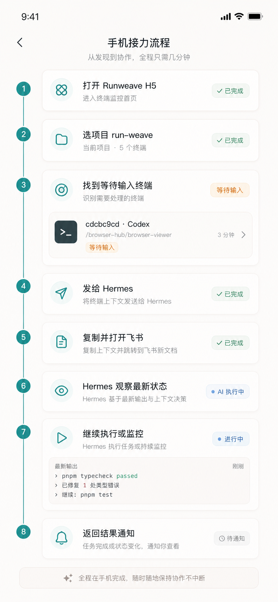
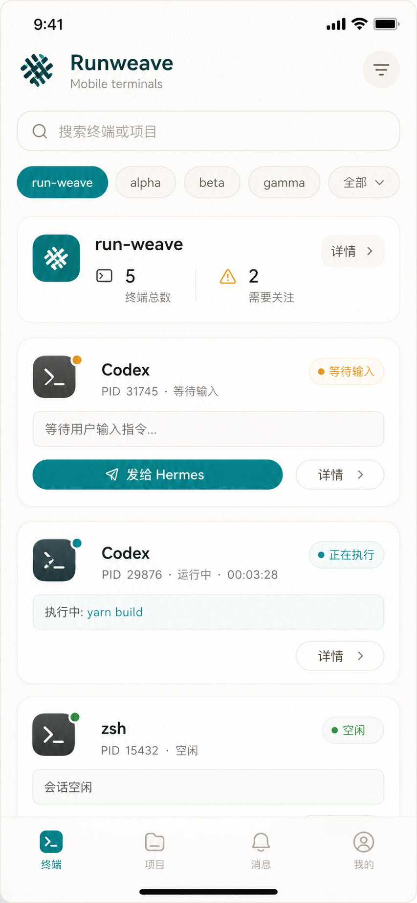
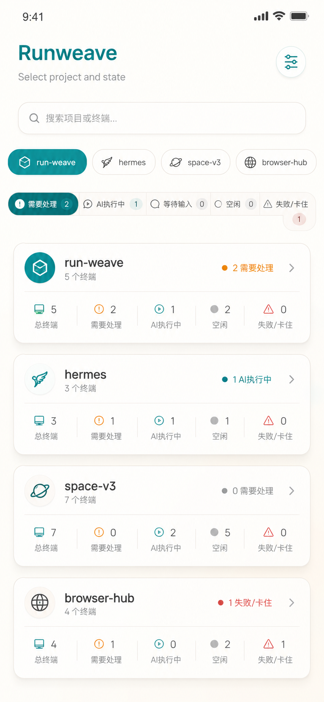
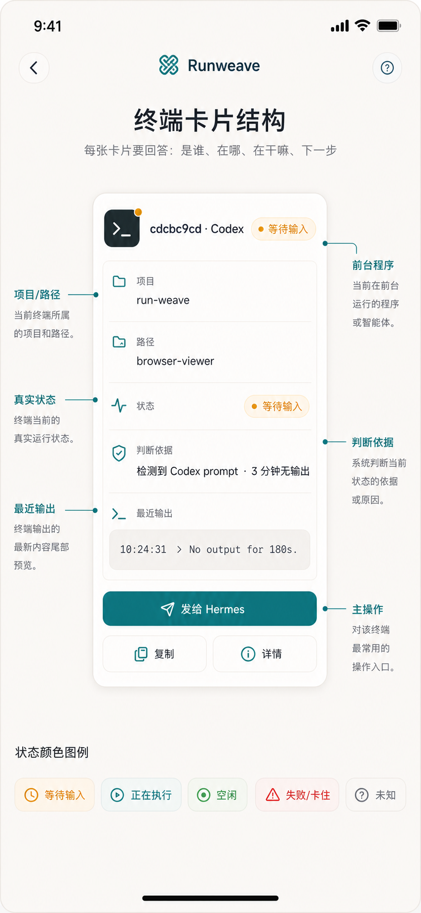
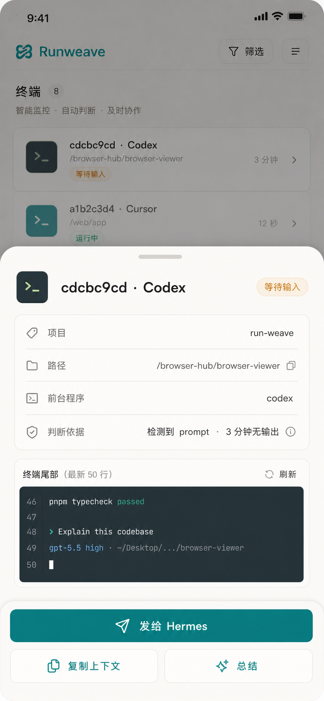
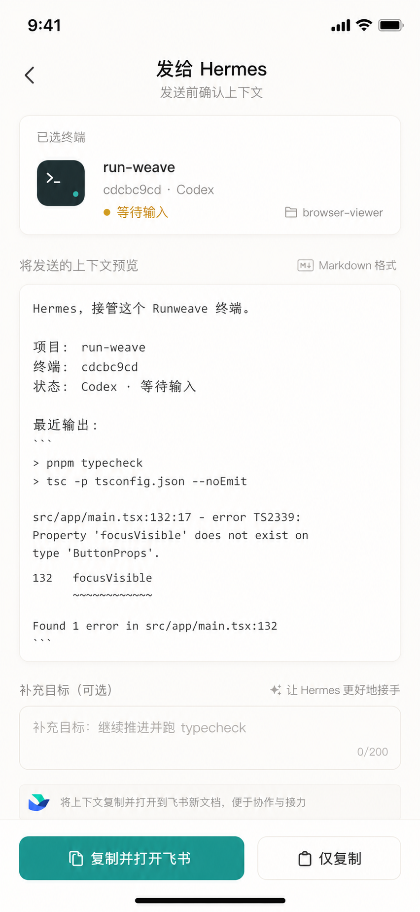
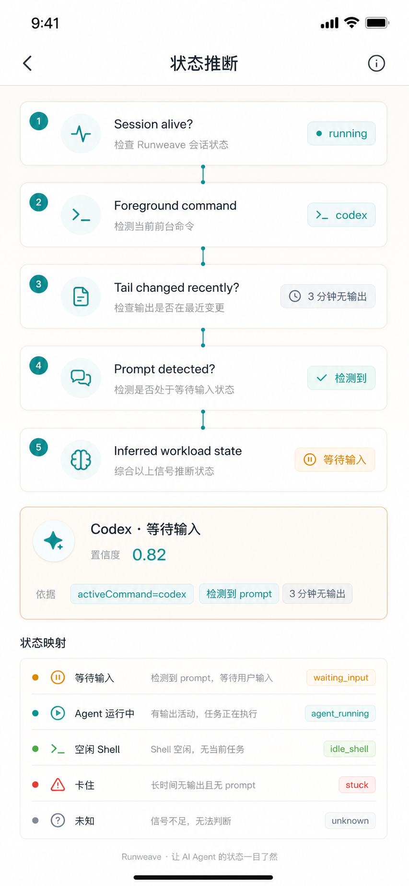
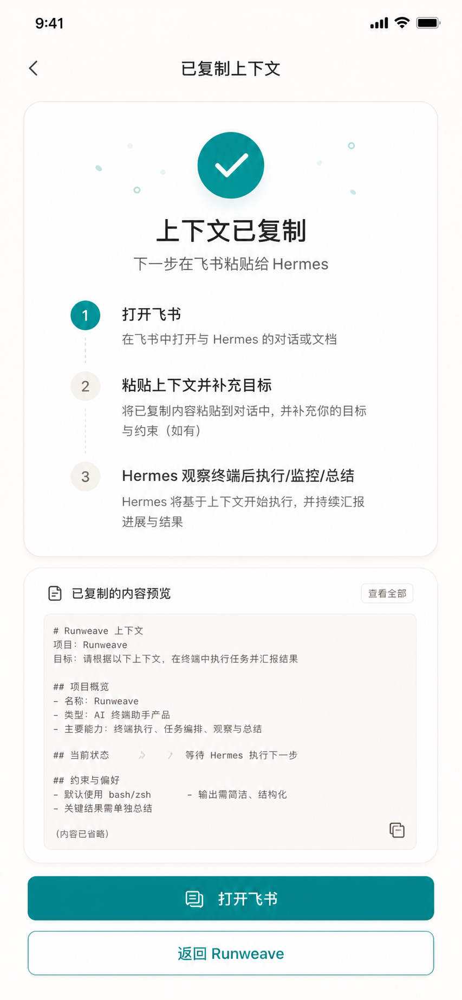

# Runweave 移动端方案一技术方案：项目优先 / 终端卡片

> 本文可直接复制到飞书文档。  
> 目标：在手机上快速找到 Runweave 里的目标终端，判断真实任务状态，一键把上下文交给 Hermes/飞书继续执行、监控和汇总。  
> 范围：仅支持手机浏览器 H5，所有页面和交互只按手机视口设计，不考虑 PC / 桌面端适配。  
> 结论：移动端 H5 不复刻完整终端，而是做“项目优先的终端卡片页”；Runweave 负责看见与选择终端，Hermes 负责理解、执行、监控与总结，飞书负责移动端对话入口。

---

## 1. 背景

现在的核心诉求是：

- 人在手机上，也能操作本地 Mac 上的 Runweave 终端。
- 可以在飞书里告诉 Hermes：继续某个终端里的 Codex / Claude / shell 任务。
- 可以排放长任务，例如跑测试、修 bug、让 Codex 继续推进，然后等结果通知。
- 可以快速知道哪个终端还活着、哪个 Codex 在执行、哪个 Codex 其实只是等待输入。
- 不希望在手机上手打复杂命令，也不希望在一堆 terminal session 里盲找。

因此，移动端页面的第一目标不是“完整终端模拟器”，而是：

```text
快速定位项目
  ↓
快速识别终端状态
  ↓
快速把上下文交给 Hermes
  ↓
Hermes 在飞书里继续执行 / 监控 / 总结
```

---

## 2. 方案一结论

选择 **方案一：项目优先 / 终端卡片**。

### 为什么选它

1. **符合实际使用习惯**  
   用户通常先知道要操作哪个项目，例如 `run-weave`、`space-v3`、`hermes`，而不是先知道 terminal session id。

2. **适合手机屏幕**  
   手机上最重要的是“看”和“选”，不是长时间输入命令。卡片比完整终端更容易浏览。

3. **便于表达真实任务状态**  
   终端 session 的 `running` 只代表终端活着，不代表里面有实际任务在跑。卡片可以同时展示：
   - session 是否活着；
   - 前台程序是什么；
   - 实际工作负载是执行中、等待输入、空闲、卡住还是未知。

4. **天然适合 Hermes 接管**  
   卡片上的「发给 Hermes」可以生成结构化上下文，用户复制到飞书后，Hermes 能准确知道要接管哪个项目、哪个终端、最近输出是什么、当前状态如何。

### 一句话体验

> 手机上打开 Runweave，进入 `run-weave` 项目，看见几张终端卡片：黄色表示 Codex 等待输入，蓝色表示 AI 正在执行，绿色表示 shell 空闲。点黄色卡片的「发给 Hermes」，飞书里补一句“继续推进并跑测试”，Hermes 自动观察、执行、监控并回传结果。

---

## 3. 总体架构

```text
手机浏览器 / Tailscale Serve
  ↓
Runweave 移动端终端卡片页
  ↓ 选择项目 / 终端 / 复制上下文
飞书 Hermes 对话
  ↓ 自然语言补充目标
Hermes Runweave 工具
  ↓ HTTP API / WebSocket / tmux
Runweave 后端
  ↓
tmux / PTY / Codex / Claude / pnpm / git / 本地项目
```

### 各角色分工

| 模块            | 职责                                                          |
| --------------- | ------------------------------------------------------------- |
| Runweave Web UI | 展示项目、终端、状态、tail，提供「发给 Hermes」入口           |
| Runweave 后端   | 管理 terminal session、tmux、scrollback、状态推断、上下文生成 |
| Hermes          | 理解用户目标，观察终端，发送输入，监控完成，汇总结论          |
| 飞书            | 手机端低摩擦对话入口和结果通知入口                            |
| Tailscale       | 让手机安全访问本地 Mac 上的 Runweave 页面                     |

---

## 4. 核心用户路径



标准流程：

```text
1. 手机上打开 Runweave 远程访问地址
2. 登录 Runweave
3. 进入 /mobile/terminals
4. 选择目标项目，例如 run-weave
5. 查看终端卡片，找到“Codex · 等待输入”或“可能卡住”的终端
6. 点卡片进入详情抽屉，确认最近 tail
7. 点击「发给 Hermes」
8. 预览即将发送给 Hermes 的上下文
9. 点击「复制并打开飞书」
10. 在飞书里粘贴，并补充自然语言目标
11. Hermes 先读取最新状态
12. Hermes 根据状态决定：继续输入 / 监控 / 总结 / 询问
13. Hermes 在飞书里返回执行结果和下一步建议
```

---

## 5. 页面设计总览

所有 UI 图均按手机 H5 页面生成，默认以 430px 左右的手机宽度为设计基准。本文不定义 PC、平板横屏或桌面端响应式形态，后续实现也不需要为这些形态扩展额外布局。

本方案包含 8 个核心手机 H5 页面 / 状态：

| 页面                    | 目标                                   | 图片                            |
| ----------------------- | -------------------------------------- | ------------------------------- |
| 首页 / 项目优先终端卡片 | 快速定位项目与需要处理的终端           | `01-home-project-first.png`     |
| 项目切换与状态筛选      | 快速切换项目、按状态过滤终端           | `02-project-switch-filter.png`  |
| 终端卡片字段结构        | 明确每张卡片展示哪些状态字段           | `03-terminal-card-anatomy.png`  |
| 终端详情抽屉            | 查看 tail、状态原因、操作按钮          | `04-terminal-detail-drawer.png` |
| 发给 Hermes 上下文预览  | 发送前确认上下文，避免误操作           | `05-handoff-preview.png`        |
| 状态推断逻辑            | 解释为什么显示等待输入 / 执行中 / 空闲 | `06-state-detection.png`        |
| 飞书接力成功态          | 从 Runweave 跳转到飞书后的接力流程     | `07-copy-success-feishu.png`    |
| 完整用户旅程            | 端到端路径                             | `08-user-journey.png`           |

---

## 6. 页面一：首页 / 项目优先终端卡片



### 页面目标

让用户 10 秒内回答三个问题：

1. 我当前看的是哪个项目？
2. 哪些终端需要处理？
3. 下一步应该点哪个按钮？

### 页面结构

```text
顶部导航
  - 标题：Runweave 终端
  - 搜索：搜索项目 / 终端 / codex / typecheck

项目 Tabs
  - run-weave
  - space-v3
  - hermes
  - AI运行中
  - 等待输入

项目摘要
  - run-weave · 5 个终端 · 2 个需要处理

终端卡片列表
  - Codex · 等待输入
  - Codex · 正在执行
  - zsh · 空闲
  - pnpm · 执行中
```

### 排序规则

终端卡片按“注意力优先级”排序：

1. 需要处理：`agent_waiting_input` / `failed` / `possibly_stuck`
2. 正在执行：`agent_running` / `command_running`
3. 最近活跃
4. 空闲 shell
5. 已退出 / 历史终端

---

## 7. 页面二：项目切换与状态筛选



### 目标

终端数量多时，用户需要用两个维度快速过滤：

- 项目维度：我现在要处理哪个 repo？
- 状态维度：我只想看等待输入 / 正在执行 / 卡住 / 空闲。

### 筛选项建议

```text
全部
需要处理
AI 执行中
等待输入
空闲
失败/卡住
```

### 项目摘要字段

每个项目在列表里可以显示：

```ts
interface ProjectMobileSummary {
  projectId: string;
  name: string;
  path: string | null;
  totalTerminals: number;
  needsAttention: number;
  runningAgents: number;
  idleShells: number;
}
```

---

## 8. 页面三：终端卡片字段结构



### 卡片必须表达三层状态

```text
第一层：Terminal session 是否活着
第二层：前台程序是什么
第三层：真实工作负载在干什么
```

不要只显示 `running`。例如：

| sessionStatus | activeCommand | 推断状态            | 卡片显示         |
| ------------- | ------------- | ------------------- | ---------------- |
| running       | codex         | agent_waiting_input | Codex · 等待输入 |
| running       | codex         | agent_running       | Codex · 正在执行 |
| running       | /bin/zsh      | idle_shell          | zsh · 空闲       |
| running       | pnpm          | command_running     | pnpm · 执行中    |
| running       | codex         | possibly_stuck      | Codex · 可能卡住 |
| exited        | null          | completed/failed    | 已结束           |

### 卡片字段建议

```ts
interface MobileTerminalCardViewModel {
  terminalSessionId: string;
  shortId: string;
  projectId: string;
  projectName: string;
  cwd: string | null;

  sessionStatus: "running" | "stopped" | "exited";
  foregroundCommand: string | null;

  inferredWorkloadState:
    | "idle_shell"
    | "command_running"
    | "agent_running"
    | "agent_waiting_input"
    | "completed"
    | "failed"
    | "possibly_stuck"
    | "unknown";

  statusLabel: string;
  statusColor: "green" | "blue" | "yellow" | "red" | "gray";

  lastOutputAt: string | null;
  tailChangedRecently: boolean;
  promptDetected: boolean;
  confidence: number;
  stateReason: string[];

  tailPreview: string;
  primaryAction: "send_to_hermes" | "observe" | "run_command" | "summarize";
}
```

### 卡片按钮

| 按钮        | 作用                                      |
| ----------- | ----------------------------------------- |
| 发给 Hermes | 生成结构化上下文，复制到飞书              |
| 查看详情    | 打开详情抽屉，查看 tail 和判断依据        |
| 总结终端    | 让 Hermes 只总结，不继续执行              |
| 继续任务    | 在等待输入状态下，把下一步目标交给 Hermes |

---

## 9. 页面四：终端详情抽屉



### 页面目标

点击卡片后打开详情抽屉，让用户确认：

- 这个终端是不是我要操作的终端；
- 最近输出是什么；
- Runweave 为什么判断它是等待输入 / 执行中 / 卡住；
- 是否要把它交给 Hermes。

### 详情抽屉内容

```text
终端 ID：cdcbc9cd-71fd-4555-9436-146451300d56
项目：run-weave
路径：/Users/bytedance/Desktop/vscode/browser-hub/browser-viewer
前台程序：codex
推断状态：Codex · 等待输入
判断依据：
  - activeCommand 是 codex
  - tail 末尾检测到 Codex prompt
  - 最近 3 分钟没有新增输出

最近输出：
  <tail 最近 80 行，默认折叠显示最后 12 行>

操作：
  - 发给 Hermes
  - 总结终端
  - 复制上下文
  - 打开完整终端
```

### 重要交互原则

- 手机上不要把复杂命令输入框放在首屏，避免误操作。
- 详情页也不默认直接输入命令，优先交给 Hermes。
- 对 `possibly_stuck`、`unknown` 状态，不要提供危险的一键强杀作为主按钮。

---

## 10. 页面五：发给 Hermes / 上下文预览



### 页面目标

点击「发给 Hermes」后，不直接执行，而是先生成一段用户可检查的上下文草稿。

### 上下文草稿格式

```text
Hermes，接管这个 Runweave 终端。

项目：run-weave
终端：cdcbc9cd-71fd-4555-9436-146451300d56
状态：Codex · 等待输入
路径：/Users/bytedance/Desktop/vscode/browser-hub/browser-viewer
前台程序：codex
判断依据：检测到 Codex prompt，最近 3 分钟无新增输出

最近输出：
<tail 最近 80 行>

请先读取最新状态。若仍在等待输入，则继续推进；
若正在执行，则继续监控；若状态未知或卡住，先总结并问我。
```

### MVP 发送方式

先做低成本、可靠版本：

1. `复制并打开飞书`
2. `仅复制`
3. 用户在飞书里补充一句目标，例如：
   - “继续推进这个任务，并跑 pnpm typecheck。”
   - “帮我看看它卡在哪里。”
   - “总结这个 Codex 已经做了什么。”

后续增强：

- Runweave 直接调用 Hermes Gateway webhook；
- Runweave 直接发到当前 Feishu 会话；
- 预设动作按钮：`总结终端`、`继续任务`、`跑测试`、`修复失败`。

---

## 11. 页面六：状态推断技术方案



### 关键问题

`activeCommand = codex` 只说明 Codex 在前台，不代表 Codex 正在执行。

Codex 可能处于：

1. 正在执行工具 / 命令；
2. 等待用户输入下一条 prompt；
3. 卡住或长时间无输出；
4. 输出很慢但仍在执行。

所以状态模型必须拆成三层：

```text
sessionStatus: running / exited
foregroundCommand: codex / claude / zsh / pnpm / node
inferredWorkloadState: waiting_input / running / idle / stuck / unknown
```

### MVP 推断算法

```ts
function inferTerminalState(input: {
  sessionStatus: string;
  activeCommand?: string | null;
  tail: string;
  lastOutputAt?: string | null;
  tailChangedRecently: boolean;
  now: Date;
}): InferredWorkloadState {
  if (input.sessionStatus !== "running") return "completed";

  const command = input.activeCommand ?? "";
  const isAgent = /codex|claude|opencode|coco/i.test(command);
  const isShell = /zsh|bash|fish|sh$/i.test(command);
  const hasAgentPrompt =
    /(^|\n)\s*[›>]\s+/.test(input.tail) || /gpt-.*·\s*~\//i.test(input.tail);
  const hasShellPrompt = /[%$#]\s*$/.test(input.tail);

  if (isAgent && hasAgentPrompt && !input.tailChangedRecently) {
    return "agent_waiting_input";
  }

  if (isAgent && input.tailChangedRecently) {
    return "agent_running";
  }

  if (isShell && hasShellPrompt) {
    return "idle_shell";
  }

  if (!isShell && !isAgent && input.tailChangedRecently) {
    return "command_running";
  }

  return "unknown";
}
```

### 状态判断要返回 reason

不要只返回枚举，要返回判断依据，便于用户信任：

```json
{
  "inferredWorkloadState": "agent_waiting_input",
  "confidence": 0.82,
  "reason": [
    "activeCommand 是 codex",
    "tail 末尾检测到 Codex prompt",
    "最近 3 分钟没有新增输出"
  ]
}
```

### 状态颜色建议

| 状态                | 文案             | 颜色  | 主动作      |
| ------------------- | ---------------- | ----- | ----------- |
| agent_waiting_input | Codex · 等待输入 | 黄色  | 发给 Hermes |
| agent_running       | Codex · 正在执行 | 蓝色  | 观察 / 监控 |
| idle_shell          | zsh · 空闲       | 绿色  | 运行命令    |
| command_running     | pnpm · 执行中    | 蓝色  | 观察        |
| possibly_stuck      | 可能卡住         | 红/橙 | 总结并询问  |
| unknown             | 未知             | 灰色  | 查看详情    |

---

## 12. 页面七：飞书接力成功态



### 接力步骤

```text
1. 用户点 Runweave 卡片上的「发给 Hermes」
2. Runweave 生成上下文草稿
3. 用户点「复制并打开飞书」
4. 手机跳到飞书
5. 用户粘贴草稿，并补一句自然语言目标
6. Hermes 收到后先观察终端
7. Hermes 判断等待输入 / 执行中 / 卡住 / 空闲
8. Hermes 决定发送指令、继续监控或先总结询问
9. Hermes 返回任务结果
```

### Hermes 接管原则

```text
先观察，再操作。
```

规则：

- 如果 `agent_waiting_input`：可以发送用户补充的 prompt；
- 如果 `agent_running`：不要插入新指令，先监控；
- 如果 `idle_shell`：可以执行新命令；
- 如果 `unknown`：先总结状态，必要时询问用户；
- 如果 `possibly_stuck`：先提供判断和建议，不直接强杀。

---

## 13. 后端接口建议

### 13.1 移动端 Overview API

```http
GET /api/terminal/mobile/overview?projectId=91e34928-d8ff-43ac-a6da-32f94209b28f
```

返回：

```ts
interface MobileTerminalOverviewResponse {
  projects: Array<{
    projectId: string;
    name: string;
    path: string | null;
    totalTerminals: number;
    needsAttention: number;
    runningAgents: number;
    idleShells: number;
  }>;
  selectedProjectId: string | null;
  terminals: MobileTerminalCardViewModel[];
}
```

### 13.2 Hermes 上下文生成 API

```http
POST /api/terminal/session/:id/hermes-context
```

返回：

```ts
interface HermesContextResponse {
  terminalSessionId: string;
  projectName: string;
  cwd: string | null;
  foregroundCommand: string | null;
  inferredWorkloadState: string;
  confidence: number;
  stateReason: string[];
  tail: string;
  markdown: string;
  copiedText: string;
}
```

### 13.3 复用已有终端能力

现有/已实现能力可以直接复用：

```http
GET  /api/terminal/project
GET  /api/terminal/session
GET  /api/terminal/session/:id
GET  /api/terminal/session/:id/history
POST /api/terminal/session/:id/input
POST /api/terminal/task
GET  /api/terminal/task/:taskId
```

其中：

- `POST /api/terminal/session/:id/input` 用于 Hermes 给已有终端发送输入；
- `POST /api/terminal/task` 用于创建一次性长任务；
- `GET /api/terminal/task/:taskId` 用于轮询任务状态和 tail。

---

## 14. 前端组件拆分建议

建议新增移动端页面和组件：

```text
frontend/src/features/terminal/mobile/
  MobileTerminalPage.tsx
  ProjectSwitcher.tsx
  TerminalStatusFilter.tsx
  TerminalCard.tsx
  TerminalDetailDrawer.tsx
  HermesHandoffPreview.tsx
  terminal-state.ts
  terminal-card-view-model.ts
```

职责：

| 文件                          | 职责                                        |
| ----------------------------- | ------------------------------------------- |
| `MobileTerminalPage.tsx`      | 页面容器，拉取 overview，管理项目与筛选状态 |
| `ProjectSwitcher.tsx`         | 项目 chip / 项目切换                        |
| `TerminalStatusFilter.tsx`    | 状态筛选 chip                               |
| `TerminalCard.tsx`            | 终端卡片展示                                |
| `TerminalDetailDrawer.tsx`    | 终端详情、tail、操作按钮                    |
| `HermesHandoffPreview.tsx`    | 生成并展示飞书上下文                        |
| `terminal-state.ts`           | 状态推断和颜色/文案映射                     |
| `terminal-card-view-model.ts` | API response 到卡片 view model 的转换       |

---

## 15. MVP 实施计划

### 第一阶段：只做移动端查看与复制上下文

目标：手机能看到项目与终端卡片，并能复制上下文给飞书 Hermes。

任务：

1. 新增 `/mobile/terminals` 页面；
2. 复用现有 project/session API 拉数据；
3. 前端本地实现 `inferTerminalState`；
4. 实现项目切换、状态筛选、卡片排序；
5. 实现终端详情抽屉；
6. 实现「复制上下文」和「复制并打开飞书」。

验收：

- 手机能打开页面；
- 能按项目查看终端；
- 能区分 `zsh · 空闲`、`Codex · 等待输入`、`Codex · 正在执行`；
- 能复制包含项目、终端、路径、状态、tail 的文本。

### 第二阶段：后端产品化 API

目标：把移动端状态聚合和 Hermes 上下文生成放到后端，减少前端复杂度。

任务：

1. 新增 `GET /api/terminal/mobile/overview`；
2. 新增 `POST /api/terminal/session/:id/hermes-context`；
3. 后端集中实现状态推断；
4. 给状态推断返回 `confidence` 和 `stateReason`；
5. 补测试和类型定义。

验收：

- API 能一次返回项目摘要和终端卡片数据；
- 上下文 API 能返回可复制给 Hermes 的 Markdown；
- 状态推断有可解释 reason。

### 第三阶段：Hermes 深度接管

目标：用户在飞书里粘贴上下文后，Hermes 能自动接管。

任务：

1. Hermes 读取上下文中的 `terminalSessionId` / `projectId` / `cwd`；
2. Hermes 调用 Runweave API 读取最新 tail；
3. Hermes 根据推断状态决定操作；
4. 若等待输入，发送用户补充 prompt；
5. 若执行中，创建监控任务；
6. 完成后在飞书总结结果。

验收：

- 用户能从 Runweave 卡片跳转到飞书；
- Hermes 能正确识别目标终端；
- Hermes 不会在 Codex 正在执行时乱插入新 prompt；
- Hermes 能在完成后回传摘要。

---

## 16. 安全与权限

移动端操控本地终端是高权限能力，必须有安全边界。

建议：

1. **Runweave 登录仍作为第二层保护**  
   Tailscale 只是网络层，Runweave 自己仍要登录。

2. **未来使用专用 Agent Token**  
   不用网页登录 token 给 Hermes。Agent token 应有 scope：
   - `terminal:read`
   - `terminal:write`
   - `task:create`
   - `project:read`

3. **项目路径 allowlist**  
   只允许 Hermes 操作明确登记的项目路径。

4. **危险命令确认**  
   以下命令需要二次确认：
   - `rm -rf`
   - `sudo`
   - `curl | sh`
   - `git push --force`
   - `kill -9`
   - `chmod -R`
   - `dd`
   - `mkfs`

5. **审计日志**  
   记录：谁、什么时候、对哪个项目/终端、发送了什么动作、结果如何。不要记录 token。

6. **群聊默认只读**  
   如果以后 Hermes 在群里使用 Runweave，默认只能查看和总结，写入终端必须显式确认。

---

## 17. 验收标准

### 产品验收

- [ ] 手机上可以打开 Runweave 移动终端页；
- [ ] 可以按项目找到目标终端；
- [ ] 卡片能清晰显示真实状态，而不是只显示 running；
- [ ] 能看到最近 tail；
- [ ] 能一键复制上下文并打开飞书；
- [ ] Hermes 收到上下文后能先观察再操作；
- [ ] 任务完成后飞书能收到摘要。

### 技术验收

- [ ] `pnpm typecheck` 通过；
- [ ] 后端新增 API 有测试；
- [ ] 状态推断逻辑有单元测试；
- [ ] 移动端页面在 iPhone 尺寸下可用；
- [ ] 不泄漏 token、cookie、密码；
- [ ] 对危险命令有确认机制。

---

## 18. 图片资产清单

所有图片放在：

```text
docs/superpowers/assets/runweave-mobile-hermes-scheme-a-v2/
```

图片：

1. 
2. 
3. 
4. 
5. 
6. 
7. 
8. 

可编辑交互图：

```text
docs/superpowers/assets/runweave-mobile-hermes-scheme-a-v2/scheme-a-flow.excalidraw
```

---

## 19. 最终结论

方案一的核心不是“在手机上操作完整终端”，而是把手机端最难的问题拆开：

```text
Runweave：负责看见项目、终端、状态、tail
Hermes：负责理解任务、发指令、监控、总结
飞书：负责移动端对话和结果通知
Tailscale：负责安全远程访问本地 Runweave
```

第一版 MVP 只要做好三件事，就已经能显著提升移动端可用性：

1. 项目优先的终端卡片页；
2. 真实状态推断：等待输入 / 正在执行 / 空闲 / 卡住；
3. 一键生成 Hermes 上下文并复制到飞书。

后续再逐步增强为：Runweave 直接推送到 Hermes、Hermes 自动订阅任务结果、Feishu 卡片按钮化操作。
