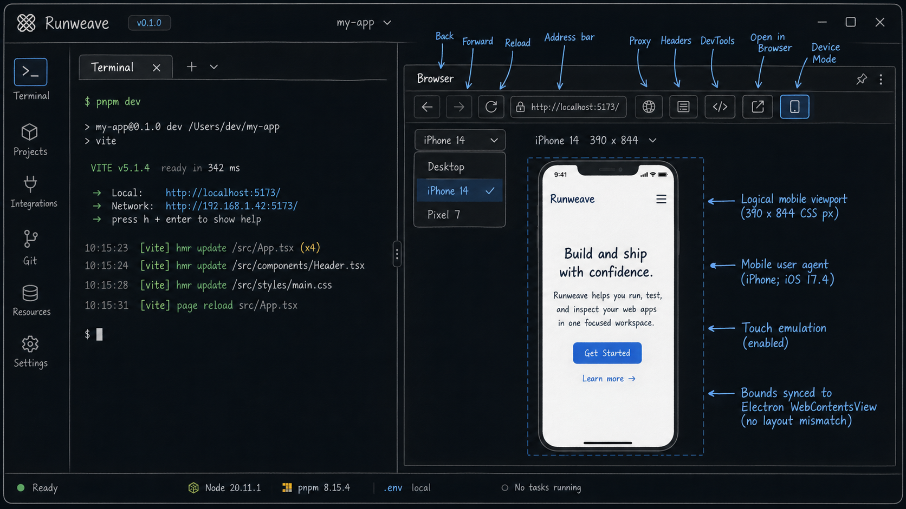

# Terminal Browser 手机模式方案

**目标：** 给右侧 Terminal Browser 增加类似 Chrome DevTools 的手机设备模式，让页面能在移动端 viewport、移动端 UA 和 touch emulation 下运行。

**核心思路：** 右侧 Browser 是 Electron `WebContentsView`，不是 iframe。真实设备模拟必须在 Electron 主进程里做；React 侧只负责工具栏交互、设备画布布局和 bounds 同步。

---

## 草图

草图表达第一版目标：在现有 Browser 工具栏增加设备按钮和预设菜单，Mobile 模式下在右侧 Browser 面板内展示居中的手机画布。

## 相关代码

- `frontend/src/components/terminal/terminal-browser-tool.tsx`
  - 负责 Browser tab 状态、Electron IPC、bounds 同步。
- `frontend/src/components/terminal/terminal-browser-navigation-bar.tsx`
  - 负责 Browser 工具栏，设备模式入口放这里。
- `frontend/src/components/terminal/terminal-browser-surface.tsx`
  - 负责 Electron `WebContentsView` 的 DOM anchor 和显示区域。
- `electron/src/terminal-browser-view.ts`
  - 负责创建和管理右侧 Browser `WebContentsView`，真实 emulation 在这里落地。
- `electron/src/terminal-browser-cdp-proxy-session.ts`
  - 负责 CDP proxy debugger attach，需要和设备模式做互斥。
- `electron/src/preload.ts`、`frontend/src/App.tsx`
  - 负责 Electron IPC 暴露和前端类型声明。
- `packages/shared/src/index.ts`
  - 导出共享设备 preset / state 类型。

## 产品范围

第一版支持：

- Desktop 仍是默认模式，右侧 Browser 默认铺满面板。
- 首次切到 Mobile 时默认使用 iPhone SE 尺寸。
- 固定设备预设：
  - Desktop
  - iPhone SE：`375 x 667`，`deviceScaleFactor: 2`
  - iPhone 14：`390 x 844`，`deviceScaleFactor: 3`
  - Pixel 7：`412 x 915`，`deviceScaleFactor: 2.625`
- 设备模式只作用于当前 active Browser tab。
- 新建、恢复、proxy-created tabs 一律从 Desktop 开始。
- Mobile 模式下右侧 Browser 展示居中的手机画布。
- 面板空间不足时，使用明确的缩放模型，而不是只靠 CSS max-width。

不做：

- 设备预设持久化和复杂继承策略。
- 自定义 UA、旋转按钮、DPR 编辑、网络 throttling。
- 完整 Chrome DevTools 设备列表。
- Mobile mode 下继续允许 Playwright/MCP/CDP proxy attach 并协调外部 `Emulation.*`。
- 后端 Playwright session 的 `browserProfile` 改造。
- 前端 `src/` 下新增单元测试。

## 关键决策

### 1. Electron 真实 emulation

Mobile 模式不是改 React wrapper 尺寸，而是要让 Electron `WebContentsView` 里的页面真实获得移动端环境：

- 移动端 viewport。
- 移动端 user agent。
- touch emulation。
- 对应 `deviceScaleFactor`。

共享设备 preset 放在 `packages/shared`，前端和 Electron 复用同一套 preset id / label / viewport 定义。

### 2. 当前 tab 生效，新 tab 默认 Desktop

设备模式只影响当前 active Browser tab。

这样做是为了避免新建、恢复、proxy-created tab 在 `loadURL()` 前异步应用 emulation 的竞态。第一版不做“新 tab 自动继承当前 mobile 模式”。

切换 active Browser tab 时，前端需要重新读取该 tab 的设备状态：

- 新建/恢复/proxy-created tab 读到 Desktop。
- 用户手动切过 mobile 的 tab 读到自己的 mobile preset。

### 3. Debugger 使用方双向互斥

`webContents.debugger` 是同一个 `WebContents` 上的单 owner 资源。设备模式、CDP proxy 和 detached DevTools 都会竞争它，所以第一版采用互斥模型：

- 当前 tab 已经 `cdpProxyAttached` 时，Electron 主进程拒绝切到非 Desktop 设备模式。
- 目标 tab 当前是非 Desktop 设备模式时，Electron 主进程拒绝 CDP proxy attach。
- 当前 tab 已经 `devtoolsOpen` 时，Electron 主进程拒绝切到非 Desktop 设备模式。
- 当前 tab 是非 Desktop 设备模式时，Electron 主进程拒绝 open DevTools，并返回明确错误。
- 前端按钮 disabled 只是 UX，不能作为边界。
- emulation 命令失败时，IPC 必须返回失败，不能让 UI 显示假成功。

如果未来要支持 Mobile 模式下 Playwright/MCP 继续接管，就需要把设备 emulation 合并进 CDP proxy/session manager，由单一 debugger owner 串行处理内部和外部 CDP 命令。

### 4. 缩放模型必须显式

`WebContentsView` 是 native view，不会因为 React wrapper 的 CSS transform 自动缩放。面板空间不足时必须明确三件事：

- `logicalViewport`：设备逻辑尺寸，例如 iPhone SE 的 `375 x 667`。
- `displayBounds`：右侧面板里按比例 fit 后的 native view 展示尺寸。
- `emulationScale`：`displayBounds.width / logicalViewport.width`。

Electron `setBounds()` 使用 `displayBounds`，CDP emulation 使用 `logicalViewport` 和对应 `emulationScale`。不能只靠 CSS `maxWidth/maxHeight` 承诺缩放。

## 实施拆分

### Phase 1：共享设备模型

- 增加共享设备 preset 和状态类型。
- 预设包含 Desktop、iPhone SE、iPhone 14、Pixel 7。
- 增加默认 mobile preset：iPhone SE。
- 覆盖 preset normalize 的基础测试。

### Phase 2：Electron 设备状态和 emulation

- 在 Terminal Browser entry 上保存当前 tab 的设备状态和 `emulationScale`。
- 新建、恢复、proxy-created entry 初始化为 Desktop。
- 增加读取/设置设备状态的 IPC，并显式传入 `tabId`：`getDeviceState(tabId)` / `setDeviceState(tabId, presetId)`。
- Electron 校验 `tabId` 属于当前 sender window；不通过 inferred active tab 决定目标。
- 设置设备状态时只作用于传入的目标 tab。
- 失败时返回错误，不吞掉 emulation 失败。
- 与 CDP proxy attach、open DevTools 做主进程级互斥。

### Phase 3：前端设备菜单和布局

- 在 Browser 工具栏增加设备按钮和 preset 菜单。
- Desktop 切到 Mobile 的默认 preset 是 iPhone SE。
- active tab 切换时用当前 `activeTab.id` 重新读取该 tab 的设备状态。
- Mobile 模式下计算 `logicalViewport / displayBounds / emulationScale`。
- bounds 同步时把 native bounds 和 `emulationScale` 一起传给 Electron。
- Mobile active 时禁用 DevTools 按钮并说明原因；DevTools 已打开时禁用 Mobile 切换。
- 错误复用现有 Browser error banner。

### Phase 4：验证

自动化验证：

- `pnpm typecheck`
- `pnpm lint`
- `pnpm --filter @browser-viewer/shared test`
- 前端只补 E2E 或手工验收，不在 `frontend/src` 下新增单测。

手工 Electron 验证：

- Desktop 默认铺满右侧 Browser。
- 切到 Mobile 默认是 iPhone SE。
- iPhone SE 下页面内 `window.innerWidth` 接近 `375`，`window.innerHeight` 接近 `667`。
- UA 包含 `Mobile`，`navigator.maxTouchPoints > 0`。
- 切换 iPhone 14 / Pixel 7 后 viewport 跟随变化。
- 缩窄右侧面板时，手机画布按比例缩小，不裁剪、不变形。
- 缩放后点击页面按钮或输入框，落点和视觉位置一致。
- 打开/关闭 headers side panel 后，`displayBounds` 和 `emulationScale` 重新同步。
- CDP proxy attached 时，切 Mobile 返回明确错误。
- Mobile active 时，CDP proxy attach 返回明确错误。
- DevTools 打开时，切 Mobile 返回明确错误。
- Mobile active 时，open DevTools 返回明确错误。
- 新建、恢复、proxy-created tabs 默认 Desktop。

## 验收标准

- Desktop mode 保持默认。
- 首次切到 Mobile 时默认使用 iPhone SE。
- 支持 iPhone SE、iPhone 14、Pixel 7 三个 mobile preset。
- Mobile mode 改变真实 Electron Browser 环境，而不只是改变 React wrapper 尺寸。
- 当前 active tab 的设备模式和 UI 状态一致。
- 新建、恢复、proxy-created tabs 默认 Desktop，不存在 emulation-before-`loadURL()` 竞态。
- `logicalViewport / displayBounds / emulationScale` 三者关系明确且可验证。
- Device IPC 显式传 `tabId`，Electron 校验该 tab 属于 sender window。
- CDP proxy、DevTools、device emulation 的 debugger 所有权有主进程级互斥闭环。
- Proxy、request headers、DevTools、CDP endpoint、external-open、tabs、navigation 不回归。
