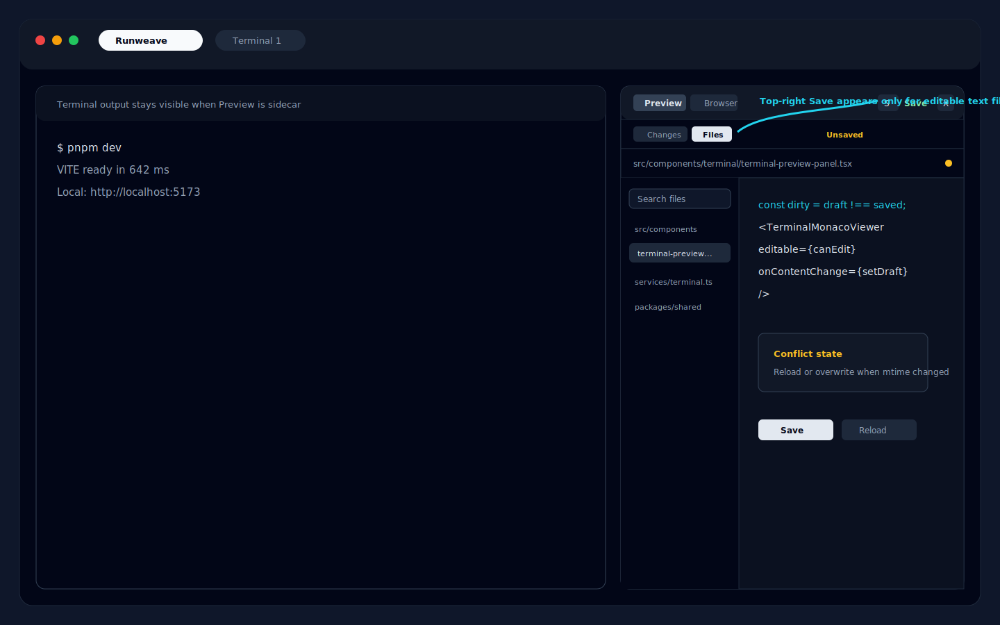

# Preview 文件编辑能力检查与实现计划

> **For agentic workers:** 如果执行本计划，按任务逐项推进；前端 `src/` 下不新增单测，正式自动化验收使用 Playwright E2E。

**目标：** 检查并补齐 Terminal Preview 右上角 `Files` 视图的文件编辑能力，让用户可以在 Preview 中打开文本/代码文件、编辑、显式保存，并能验证内容确实写回项目文件。

**架构：** 保持 Preview 的写入 project-scoped 边界。相对路径读取、文件保存都基于当前 Terminal Project path，不回退到 terminal session cwd；绝对路径可以打开项目外文件，但返回 `base: "filesystem"` 且只能只读预览。编辑能力只开放给 project 内已有文本类文件；Changes、Diff、图片、二进制、大文件和无 project path 的项目继续只读。

**交互草图：**



---

## 当前代码事实

- `packages/shared/src/terminal-protocol.ts` 中 `TerminalPreviewFileResponse.readonly` 仍是 `true`，没有 save request/response 类型。
- `backend/src/terminal/preview.ts` 已有 `readPreviewFile(...)`，并通过 `ensureProjectPath(...)`、`resolvePreviewPath(...)`、binary/size 检查保护读取路径。
- `backend/src/routes/terminal-preview-routes.ts` 只有 `GET /api/terminal/project/:id/preview/file`，没有写回文件的 `PUT/PATCH` route。
- `frontend/src/services/terminal.ts` 只有 `getTerminalProjectPreviewFile(...)`，没有 save wrapper。
- `frontend/src/components/terminal/terminal-monaco-viewer.tsx` 的 `EDITOR_OPTIONS.readOnly` 固定为 `true`。
- `frontend/src/components/terminal/terminal-preview-panel-shell.tsx` 顶部固定展示 `Read only` badge，右上工具栏没有 Save/dirty 状态。
- 旧计划 `docs/superpowers/plans/2026-04-19-preview-code-save.md` 已描述过保存能力，但需要按当前仓库测试策略更新：不要新增前端 `src`/UI unit tests。

## 产品决策

- v1 只支持保存已存在的文本/代码文件，不支持新建、删除、重命名、移动、格式化、git stage 或 commit。
- Save 必须是显式动作：用户编辑后出现 dirty 状态，点击右上角 Save 或按 `Cmd/Ctrl+S` 才写盘。
- Markdown `Source` 与 `Split` 的 source pane 可以编辑；Markdown rendered preview 只展示当前 draft，不直接编辑。
- SVG `Source` 可以编辑；SVG `Preview` 只展示当前 draft，不直接编辑。
- 用户输入绝对路径时可以打开项目外文本/图片文件；项目外文件必须保持 `Read only`，不展示 Save 控制，也不允许写回。
- Changes mode、Diff editor、图片和二进制文件全部保持只读。
- 关闭 Preview、Refresh、切换文件、切换到 Changes 时，如果存在 unsaved draft，必须先确认是否丢弃。
- 保存冲突使用 mtime v1 方案：打开文件时记录 `mtimeMs`，保存时发现磁盘文件已变化则返回 conflict，UI 给出 Reload 和 Overwrite 两个动作。

## API 合同

### Shared types

```ts
export interface TerminalPreviewFileResponse {
  kind: "file";
  projectId: string;
  path: string;
  absolutePath: string;
  base: "project" | "filesystem";
  projectPath: string;
  language: string;
  content: string;
  sizeBytes: number;
  mtimeMs: number;
  readonly: boolean;
}

export interface TerminalPreviewSaveFileRequest {
  path: string;
  content: string;
  expectedMtimeMs: number;
  overwrite?: boolean;
}

export interface TerminalPreviewSaveFileResponse extends TerminalPreviewFileResponse {
  readonly: false;
}
```

### Route

```text
PUT /api/terminal/project/:id/preview/file
Content-Type: application/json

{
  "path": "src/App.tsx",
  "content": "...",
  "expectedMtimeMs": 1713520000000.123,
  "overwrite": false
}
```

状态码：

| 状态  | 场景                                                              |
| ----- | ----------------------------------------------------------------- |
| `200` | 保存成功，返回最新 file payload                                   |
| `400` | body/path 无效、目录、非普通文件、home path                       |
| `403` | 保存路径逃逸 project path，或相对路径经 symlink 逃逸 project path |
| `404` | 文件不存在                                                        |
| `409` | `mtimeMs` 冲突                                                    |
| `413` | 保存内容超过 Preview 文件大小限制                                 |
| `415` | 目标或内容不适合作为 UTF-8 文本保存                               |

## 实施任务

### Task 1: 后端保存能力

涉及文件：

- `packages/shared/src/terminal-protocol.ts`
- `backend/src/terminal/preview.ts`
- `backend/src/routes/terminal-preview-routes.ts`
- `backend/src/routes/terminal.test.ts` 或新建 `backend/src/terminal/preview-save.test.ts`

步骤：

- [ ] 给 `TerminalPreviewFileResponse` 增加 `mtimeMs`，新增 save request/response 类型。
- [ ] 在 `readPreviewFile(...)` 返回当前文件 `mtimeMs`。
- [ ] `readPreviewFile(...)` / `readPreviewAsset(...)` 支持绝对项目外路径，返回 `base: "filesystem"` 与 `readonly: true`。
- [ ] 增加 `savePreviewFile(...)`，复用 `resolvePreviewPath(...)` 和现有文本/大小判断。
- [ ] 保存前检查当前文件存在、是普通文件、不是目录、不是 binary。
- [ ] 使用 `Buffer.from(content, "utf8")` 计算保存大小，超过 `FILE_PREVIEW_MAX_BYTES` 返回 `413`。
- [ ] `expectedMtimeMs` 必填；当 `overwrite !== true` 且当前 `stat.mtimeMs` 不匹配时返回 `409`。
- [ ] 写入成功后重新 `stat` 并返回最新 payload。
- [ ] 保存成功后调用 `clearPreviewFileSearchCache(project.id)`。
- [ ] 增加 project-scoped `PUT /project/:id/preview/file` route 和 zod body 校验。

验证：

- [ ] 后端用例覆盖成功保存、绝对项目外路径只读打开、相对 symlink 逃逸拒绝、保存路径逃逸拒绝、目录拒绝、binary 拒绝、mtime 冲突、overwrite 成功。
- [ ] `pnpm --filter ./backend test -- preview-save`

### Task 2: 前端可编辑 viewer 与保存状态

涉及文件：

- `frontend/src/services/terminal.ts`
- `frontend/src/components/terminal/terminal-monaco-viewer.tsx`
- `frontend/src/components/terminal/terminal-preview-panel.tsx`
- `frontend/src/components/terminal/terminal-preview-panel-content.tsx`
- `frontend/src/components/terminal/terminal-preview-panel-shell.tsx`

步骤：

- [ ] 新增 `saveTerminalProjectPreviewFile(...)` service wrapper。
- [ ] `TerminalMonacoViewer` 增加 `editable`、`onContentChange` props；非 diff editor 根据 `editable` 控制 `readOnly`。
- [ ] `TerminalPreviewPanel` 维护本地 draft：`editorContent`、`loadedContent`、`loadedMtimeMs`、`saveLoading`、`saveError`、`saveConflict`。
- [ ] `loadFile(...)` 成功时同步 draft 与 loaded state。
- [ ] 保存成功后更新 `filePreview`、`loadedContent`、`loadedMtimeMs`，清除 dirty/conflict。
- [ ] 保存失败时保留 draft，不覆盖用户编辑内容。
- [ ] `Cmd/Ctrl+S` 仅在 project 内 editable file mode 下触发保存。
- [ ] `TerminalPreviewPanelShell` 把固定 `Read only` 改成动态状态：`Read only`、`Unsaved`、`Saving...`、`Saved`、`Conflict`。
- [ ] 右上工具栏增加 Save 图标按钮，仅在 file mode 且当前文件可编辑时可用；dirty 时高亮。

验证：

- [ ] `pnpm --filter ./frontend typecheck`
- [ ] `pnpm --filter ./frontend lint`

### Task 3: UI 交互保护

涉及文件：

- `frontend/src/components/terminal/terminal-preview-panel.tsx`
- `frontend/src/components/terminal/terminal-preview-panel-actions.ts`
- `frontend/src/components/terminal/terminal-preview-panel-shell.tsx`

步骤：

- [ ] 抽出 `confirmDiscardUnsavedDraft(...)` 或等价局部 helper，只作用于 Preview 当前文件 draft。
- [ ] 切换文件、Refresh、关闭 Preview、切换到 Changes 前调用确认。
- [ ] conflict 状态展示 Reload 与 Overwrite：Reload 丢弃 draft 并重新读文件；Overwrite 以 `overwrite: true` 保存当前 draft。
- [ ] Markdown Split 中 source 修改后，右侧 rendered preview 用 draft 内容实时渲染。
- [ ] SVG Source 修改后，切到 Preview 时展示 draft 内容。
- [ ] 图片、Diff 和 Changes mode 不出现 Save，也不响应 `Cmd/Ctrl+S` 保存。

验证：

- [ ] 手工检查 dirty 状态不会因为搜索文件、展开 Preview、切换 Browser tool 丢失。
- [ ] 手工检查确认弹窗只在有 unsaved draft 时出现。

### Task 4: E2E 验收

涉及文件：

- `frontend/tests/terminal-preview.spec.ts`

用例：

- [ ] 创建临时项目文件，打开 Preview `Files`，选择文本文件。
- [ ] 在 Monaco 中修改内容，断言右上状态从 `Saved/Read only` 变为 `Unsaved`。
- [ ] 点击 Save，断言状态回到 `Saved`，再通过后端 read 或 terminal 命令确认磁盘内容已变更。
- [ ] 修改内容后切换到另一个文件，断言出现丢弃确认。
- [ ] 模拟磁盘外部修改后保存，断言出现 conflict 状态，Reload/Overwrite 可用。
- [ ] 打开 Changes mode 的 diff，断言没有 Save 控制，编辑器仍只读。
- [ ] 打开图片文件，断言没有 Save 控制。
- [ ] 输入绝对项目外路径，断言文件可打开、状态为 `Read only`，且没有 Save 控制。

命令：

```bash
pnpm --filter ./frontend e2e -- tests/terminal-preview.spec.ts
```

## 验收标准

- Preview `Files` 中打开普通文本/代码文件后可以编辑。
- 用户必须显式 Save 才会写回磁盘。
- 保存后再次读取同一文件能看到更新后的内容。
- Dirty、Saving、Saved、Conflict、Read only 状态在右上角清晰可见。
- Unsaved draft 在切换文件、刷新、关闭、切到 Changes 时不会静默丢失。
- Changes、Diff、图片、二进制、大文件仍保持只读。
- 绝对项目外路径可打开但保持只读，不能触发 Save。
- 文件写入不能逃逸当前 Terminal Project path。
- 不新增前端 `src/**/*.test.ts`、`src/**/*.test.tsx`、UI hooks 单测。
- 后端保存用例、frontend typecheck、frontend lint、Preview E2E 通过。
